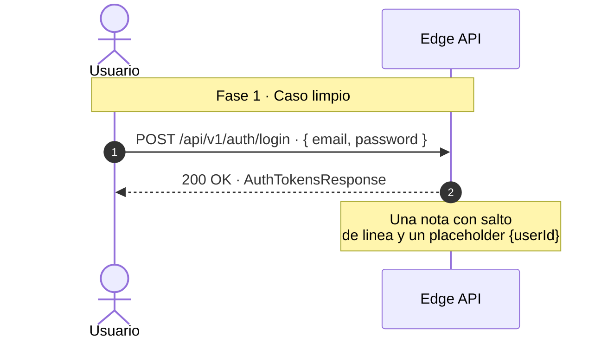

# Fixture limpia

```mermaid
sequenceDiagram
    autonumber
    actor U as Usuario
    participant API as Edge API

    note over U, API: Fase 1 · Caso limpio
    U->>API: POST /api/v1/auth/login · { email, password }
    API-->>U: 200 OK · AuthTokensResponse
    note over API: Una nota con salto<br/>de linea y un placeholder {userId}
```
