# Identidad y acceso — Diagramas de secuencia y flujo de protocolo

**Serie:** [Diagramas de secuencia](./README.md) · **Dominio 1 del DER** — *Identity, Access & Legal* (§4.1 de `PROJECT_SPECS.md`)

> **Alcance.** Trece procesos del dominio *Identidad y acceso*, agrupados en cinco bloques y
> representados con **16 diagramas de secuencia Mermaid** en formato *protocol data flow*: cada flecha
> lleva su método, ruta, código de estado y forma del payload; cada fase del pipeline va marcada con un
> banner. Los diagramas reflejan el código real de `apps/api` (NestJS, hexagonal) y `apps/web`
> (Next.js 16 + Auth.js v5), no un diseño ideal: donde el flujo está a medio implementar se marca el
> estado y, si corresponde, se propone el `TO-BE` sobre las piezas que ya existen en el repo.
>
> Fecha de levantamiento: 2026-07-28 · Rama `feat/rebrand-ravenue`.

---

## 1. Índice

| # | Diagrama | Procesos cubiertos |
|---|---|---|
| SD-A | [Emisión del par de tokens](#sd-a--emisión-del-par-de-tokens-tokenissuerissuefor) | sub-flujo compartido |
| SD-B | [Establecimiento de sesión web (handoff)](#sd-b--establecimiento-de-sesión-web-handoff-credentials) | sub-flujo compartido |
| SD-01 | [Registro con email y contraseña](#sd-01--registro-con-email-y-contraseña) | Registro |
| SD-02 | [Verificación de email](#sd-02--verificación-de-email) | Verificación de email |
| SD-03 | [Inicio de sesión con email y contraseña](#sd-03--inicio-de-sesión-con-email-y-contraseña) | Inicio de sesión |
| SD-04 | [Inicio de sesión con Google](#sd-04--inicio-de-sesión-con-google-oidc) | Inicio de sesión con Google |
| SD-05a | [Recuperación de cuenta — AS-IS](#sd-05a--estado-actual-as-is) | Recuperación de cuenta |
| SD-05b | [Recuperación de cuenta — TO-BE](#sd-05b--diseño-propuesto-to-be) | Recuperación de cuenta |
| SD-06 | [Renovación con rotación de refresh](#sd-06--ciclo-de-vida-de-la-sesión--renovación-con-rotación) | Ciclo de vida de la sesión |
| SD-07 | [Expiración y cierre de sesión](#sd-07--ciclo-de-vida-de-la-sesión--expiración-y-cierre) | Ciclo de vida de la sesión |
| SD-08 | [Onboarding](#sd-08--onboarding) | Onboarding |
| SD-09 | [Configuración de perfil](#sd-09--configuración-de-perfil) | Configuración de perfil |
| SD-10 | [Preferencias](#sd-10--preferencias) | Preferencias |
| SD-11 | [Roles: otorgar y revocar](#sd-11--roles-otorgar-y-revocar) | Roles |
| SD-12 | [Invitaciones de promotor](#sd-12--invitaciones-de-promotor) | Invitaciones |
| SD-14 | [Enrolamiento de MFA](#sd-14--enrolamiento-de-mfa) | MFA |
| SD-13 | [Acceso a paneles](#sd-13--acceso-a-paneles) | Acceso a paneles |

---

## 2. Agrupación de los procesos

Los trece procesos solicitados no son independientes: comparten dos sub-flujos (emisión de tokens y
establecimiento de la sesión web) y se encadenan en un ciclo de vida único. La agrupación evita
repetir el mismo tramo en cinco diagramas.

| Bloque | Procesos | Razón de la agrupación |
|---|---|---|
| **0 · Sub-flujos compartidos** | — | `TokenIssuer.issueFor` y el *handoff* de Auth.js aparecen idénticos en registro, login y Google. Se extraen una vez (SD-A, SD-B) y el resto los referencia con una nota. |
| **1 · Alta y credenciales** | Registro · Verificación de email · Inicio de sesión · Inicio de sesión con Google · Recuperación de cuenta | Todos terminan (o deberían terminar) con un par de tokens emitido y una sesión establecida. |
| **2 · Ciclo de vida de la sesión** | Ciclo de vida de la sesión | Se parte en dos diagramas porque son dos máquinas distintas: renovación con rotación (camino feliz + detección de reuso) y terminación (expiración, 401, logout). |
| **3 · Post-login: cuenta del usuario** | Onboarding · Configuración de perfil · Preferencias | Comparten el mismo *gate* (`requireSession`) y el mismo recurso (`/api/v1/me`). |
| **4 · RBAC y acceso** | Roles · Invitaciones · Acceso a paneles | Los tres giran sobre `role_assignment`: quién lo crea (roles, invitaciones) y quién lo consume (paneles). |

---

## 3. Convenciones de notación

Estándar de la serie. La fuente canónica es `.claude/skills/sincronizar-diagramas-secuencia/references/notacion.md`.

### 3.1 Estructura

1. **`autonumber` siempre.** Permite referenciar un paso concreto en revisiones ("falla en el paso 7").
2. **Un diagrama = un caso de uso.** Si un flujo supera ~40 mensajes o los 8 participantes, se parte y
   se referencia con una nota (`note over X: ver SD-A`).
3. **Máximo 8 participantes.** Por encima, el diagrama deja de leerse en pantalla.
4. **Declaración explícita de participantes al inicio**, en orden de aparición izquierda → derecha
   (usuario → cliente → borde → aplicación → dominio → infraestructura). Nunca declarar por primera
   vez a mitad del diagrama: el orden visual se desordena.
5. **`actor` para personas, `participant` para sistemas.** Alias corto en mayúsculas (`UC`, `DB`),
   etiqueta legible con `as`.

### 3.2 Flujo de protocolo

Regla central de este documento: **el diagrama debe poder contrastarse contra el tráfico real.**

6. **Toda petición lleva su respuesta.** Ninguna flecha `->>` de red se queda sin su `-->>` con código
   de estado y forma del payload. Si no hay respuesta, es un `-)` (asíncrono) y se dice por qué.
7. **Anotación de protocolo en la ida:** `MÉTODO /ruta · cabecera o cuerpo relevante`.
   Ejemplo: `GET /api/v1/{recurso}/{id} · Authorization Bearer {accessToken}`.
8. **Anotación de resultado en la vuelta:** `código · payload`.
   Ejemplo: `409 · problem+json { code: {contexto}/{error} }`.
9. **Infraestructura con su comando real**, no con una paráfrasis: `SELECT * FROM "user" WHERE email = ?`,
   `SET identity:refresh:{userId}:{jti} 1 EX {ttl}`, `SMEMBERS`, `INCR`. Hace el diagrama auditable
   contra los adapters Drizzle y Redis.
10. **Placeholders entre llaves**, nunca entre `<` `>` (Mermaid los interpreta como HTML): `{userId}`.

### 3.3 Fases

11. **Banners de fase** con `note over A, B: Fase N · Nombre (componente real)`, abarcando los
    participantes implicados en ese tramo. Convierten un muro de flechas en un flujo legible por
    etapas y hacen explícito qué componente gobierna cada una.
12. **Notas de invariante** (`note over X:`) reservadas para reglas de seguridad, decisiones de diseño
    y brechas conocidas. Nunca para narrar lo que la flecha ya dice.
13. Saltos de línea en notas con `<br/>` para no ensanchar el diagrama.

### 3.4 Arrows y bloques de control

| Notación | Significado |
|---|---|
| `->>` | Llamada síncrona: el emisor espera respuesta |
| `-->>` | Respuesta o retorno, con código de estado |
| `-)` | Asíncrono fire-and-forget: publicación de evento, encolado |
| `X->>X` | Cómputo interno que cambia estado o toma una decisión (hash, firma, validación) |

| Bloque | Uso |
|---|---|
| `alt` / `else` | Caminos mutuamente excluyentes (éxito vs. error de negocio) |
| `opt` | Tramo que puede no ejecutarse y no tiene alternativa |
| `critical` | Transacción atómica (`UnitOfWork`): si algo falla, nada se persiste |
| `par` / `and` | Señales concurrentes e independientes |
| `loop` | Repetición acotada (reintentos, generación de código único) |

### 3.5 Cierre

14. **Cada diagrama termina en el efecto observable**: lo que ve el usuario, la cookie fijada o el
    documento devuelto. Un diagrama que acaba en una llamada interna está incompleto.

### 3.6 Higiene sintáctica

15. **Nada de `;` dentro de un mensaje o una nota.** Mermaid corta la sentencia ahí y el diagrama deja
    de compilar. Usar coma o punto.
16. Nada de `<` `>` sin escapar, incluidas las flechas de función de JavaScript (ver regla 10).
17. Los nombres de casos de uso, guards, endpoints y claves de Redis se copian **tal cual del código**:
    un `grep` del nombre debe encontrar el fuente.
18. **Los diagramas TO-BE nombran componentes que no existen todavía** y lo señalan en el propio participante o en una nota. Los AS-IS nombran archivos reales.

### 3.7 Validación

```bash
npx -y @mermaid-js/mermaid-cli@11 \
  -i docs/diagramas-secuencia/01-identidad-acceso.md \
  -o /tmp/01-identidad-acceso.md
```

También sirven mermaid.live y la extensión *Markdown Preview Mermaid Support* de VS Code. GitHub
renderiza estos bloques de forma nativa.

---

## 4. Catálogo de participantes

Alias reutilizados entre diagramas para que se lean como un mismo sistema.

| Alias | Componente real | Archivo |
|---|---|---|
| `U` | Persona usuaria | — |
| `W` | Componente cliente de Next.js | `apps/web/components/**` |
| `SA` | Server Action de autenticación | `apps/web/lib/auth-actions.ts` |
| `NA` | Auth.js v5 (NextAuth): callbacks `jwt` y `session` | `apps/web/lib/auth.ts` |
| `PX` | Gate de cookie en el edge | `apps/web/proxy.ts` |
| `EDGE` | Pipeline global del API: `RateLimit → Auth → Roles` + `ZodValidationPipe` | `apps/api/src/edge/**` |
| `RL` | `RateLimitGuard` aislado, cuando el cupo es el protagonista | `apps/api/src/edge/guards/rate-limit.guard.ts` |
| `UC` | Caso de uso (capa aplicación) | `apps/api/src/modules/identity/application/use-cases/**` |
| `TI` | `TokenIssuer` | `.../application/services/token-issuer.service.ts` |
| `RR` | `RoleResolver` | `.../application/services/role-resolver.service.ts` |
| `PROV` | `UserProvisioningService` | `.../application/services/user-provisioning.service.ts` |
| `JWT` | `JwtTokenService` (adapter del puerto `TokenService`) | `.../infrastructure/auth/jwt-token.service.ts` |
| `RS` | Redis · `RedisRefreshTokenStore` y buckets de rate-limit | `.../infrastructure/auth/redis-refresh-token-store.ts` |
| `DB` | PostgreSQL vía adapters Drizzle | `.../infrastructure/persistence/**` |
| `OBX` | `OutboxPort` → cola `notifications` | `apps/api/src/shared/outbox/**` |

---

## 5. Bloque 0 · Sub-flujos compartidos

### SD-A · Emisión del par de tokens (`TokenIssuer.issueFor`)

Invocado idénticamente por registro, login, login con Google y renovación. Único punto donde se firman
tokens y donde se materializa el *scope* multi-tenant dentro del JWT.

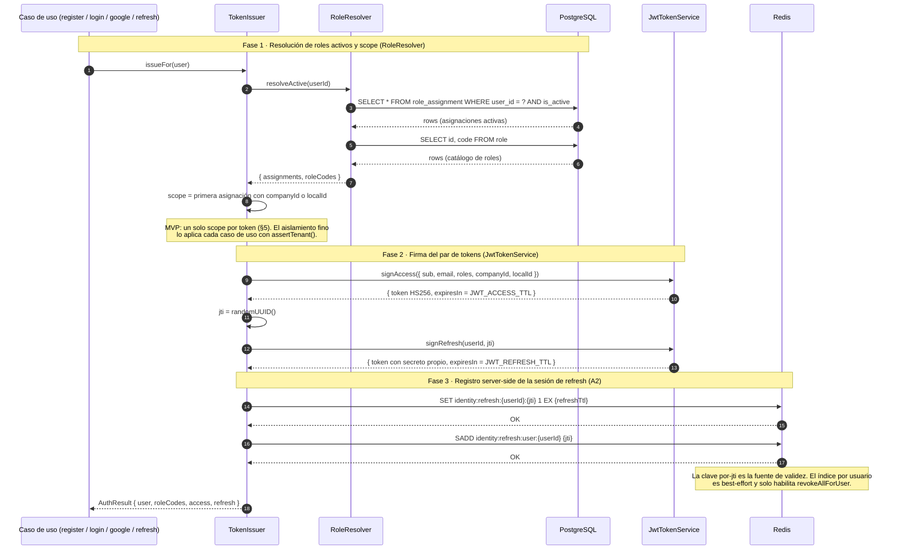
```mermaid
sequenceDiagram
    autonumber
    participant UC as Caso de uso (register / login / google / refresh)
    participant TI as TokenIssuer
    participant RR as RoleResolver
    participant DB as PostgreSQL
    participant JWT as JwtTokenService
    participant RS as Redis

    note over UC, DB: Fase 1 · Resolución de roles activos y scope (RoleResolver)
    UC->>TI: issueFor(user)
    TI->>RR: resolveActive(userId)
    RR->>DB: SELECT * FROM role_assignment WHERE user_id = ? AND is_active
    DB-->>RR: rows (asignaciones activas)
    RR->>DB: SELECT id, code FROM role
    DB-->>RR: rows (catálogo de roles)
    RR-->>TI: { assignments, roleCodes }
    TI->>TI: scope = primera asignación con companyId o localId
    note over TI: MVP: un solo scope por token (§5). El aislamiento fino<br/>lo aplica cada caso de uso con assertTenant().

    note over TI, JWT: Fase 2 · Firma del par de tokens (JwtTokenService)
    TI->>JWT: signAccess({ sub, email, roles, companyId, localId })
    JWT-->>TI: { token HS256, expiresIn = JWT_ACCESS_TTL }
    TI->>TI: jti = randomUUID()
    TI->>JWT: signRefresh(userId, jti)
    JWT-->>TI: { token con secreto propio, expiresIn = JWT_REFRESH_TTL }

    note over TI, RS: Fase 3 · Registro server-side de la sesión de refresh (A2)
    TI->>RS: SET identity:refresh:{userId}:{jti} 1 EX {refreshTtl}
    RS-->>TI: OK
    TI->>RS: SADD identity:refresh:user:{userId} {jti}
    RS-->>TI: OK
    note over RS: La clave por-jti es la fuente de validez. El índice por usuario<br/>es best-effort y solo habilita revokeAllForUser.
    TI-->>UC: AuthResult { user, roleCodes, access, refresh }
```

### SD-B · Establecimiento de sesión web (*handoff* Credentials)

Cierre común de SD-01 y SD-03. Punto clave: **los tokens del backend nunca tocan el navegador durante
el login**; viajan servidor → servidor desde el Server Action al provider `Credentials`.

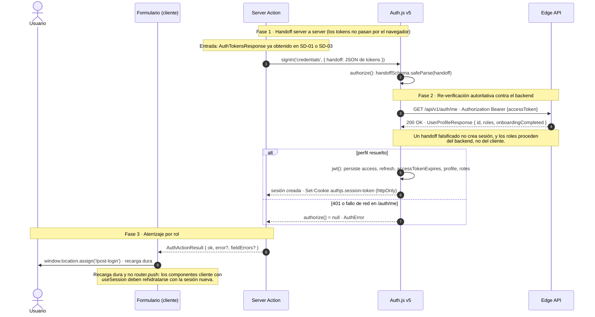
```mermaid
sequenceDiagram
    autonumber
    actor U as Usuario
    participant W as Formulario (cliente)
    participant SA as Server Action
    participant NA as Auth.js v5
    participant EDGE as Edge API

    note over SA, NA: Fase 1 · Handoff server a server (los tokens no pasan por el navegador)
    note over SA: Entrada: AuthTokensResponse ya obtenido en SD-01 o SD-03
    SA->>NA: signIn('credentials', { handoff: JSON de tokens })
    NA->>NA: authorize(): handoffSchema.safeParse(handoff)

    note over NA, EDGE: Fase 2 · Re-verificación autoritativa contra el backend
    NA->>EDGE: GET /api/v1/auth/me · Authorization Bearer {accessToken}
    EDGE-->>NA: 200 OK · UserProfileResponse { id, roles, onboardingCompleted }
    note over NA, EDGE: Un handoff falsificado no crea sesión, y los roles proceden<br/>del backend, no del cliente.
    alt perfil resuelto
        NA->>NA: jwt(): persiste access, refresh, accessTokenExpires, profile, roles
        NA-->>SA: sesión creada · Set-Cookie authjs.session-token (httpOnly)
    else 401 o fallo de red en /auth/me
        NA-->>SA: authorize() = null · AuthError
    end

    note over SA, U: Fase 3 · Aterrizaje por rol
    SA-->>W: AuthActionResult { ok, error?, fieldErrors? }
    W->>U: window.location.assign('/post-login') · recarga dura
    note over W: Recarga dura y no router.push: los componentes cliente con<br/>useSession deben rehidratarse con la sesión nueva.
```

---

## 6. Bloque 1 · Alta y credenciales

### SD-01 · Registro con email y contraseña

`POST /api/v1/auth/register` · público · `RegisterUseCase`

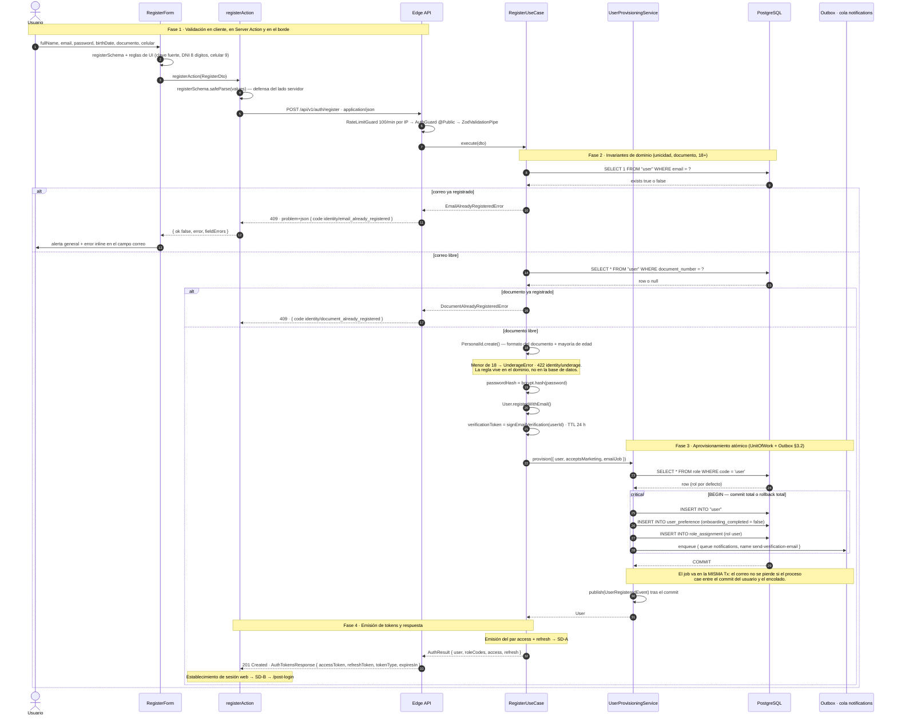
```mermaid
sequenceDiagram
    autonumber
    actor U as Usuario
    participant W as RegisterForm
    participant SA as registerAction
    participant EDGE as Edge API
    participant UC as RegisterUseCase
    participant PROV as UserProvisioningService
    participant DB as PostgreSQL
    participant OBX as Outbox · cola notifications

    note over U, EDGE: Fase 1 · Validación en cliente, en Server Action y en el borde
    U->>W: fullName, email, password, birthDate, documento, celular
    W->>W: registerSchema + reglas de UI (clave fuerte, DNI 8 dígitos, celular 9)
    W->>SA: registerAction(RegisterDto)
    SA->>SA: registerSchema.safeParse(values) — defensa del lado servidor
    SA->>EDGE: POST /api/v1/auth/register · application/json
    EDGE->>EDGE: RateLimitGuard 100/min por IP → AuthGuard @Public → ZodValidationPipe
    EDGE->>UC: execute(dto)

    note over UC, DB: Fase 2 · Invariantes de dominio (unicidad, documento, 18+)
    UC->>DB: SELECT 1 FROM "user" WHERE email = ?
    DB-->>UC: exists true o false
    alt correo ya registrado
        UC-->>EDGE: EmailAlreadyRegisteredError
        EDGE-->>SA: 409 · problem+json { code identity/email_already_registered }
        SA-->>W: { ok false, error, fieldErrors }
        W->>U: alerta general + error inline en el campo correo
    else correo libre
        UC->>DB: SELECT * FROM "user" WHERE document_number = ?
        DB-->>UC: row o null
        alt documento ya registrado
            UC-->>EDGE: DocumentAlreadyRegisteredError
            EDGE-->>SA: 409 · { code identity/document_already_registered }
        else documento libre
            UC->>UC: PersonalId.create() — formato del documento + mayoría de edad
            note over UC: Menor de 18 → UnderageError · 422 identity/underage.<br/>La regla vive en el dominio, no en la base de datos.
            UC->>UC: passwordHash = bcrypt.hash(password)
            UC->>UC: User.registerWithEmail()
            UC->>UC: verificationToken = signEmailVerification(userId) · TTL 24 h

            note over PROV, OBX: Fase 3 · Aprovisionamiento atómico (UnitOfWork + Outbox §3.2)
            UC->>PROV: provision({ user, acceptsMarketing, emailJob })
            PROV->>DB: SELECT * FROM role WHERE code = 'user'
            DB-->>PROV: row (rol por defecto)
            critical BEGIN — commit total o rollback total
                PROV->>DB: INSERT INTO "user"
                PROV->>DB: INSERT INTO user_preference (onboarding_completed = false)
                PROV->>DB: INSERT INTO role_assignment (rol user)
                PROV->>OBX: enqueue { queue notifications, name send-verification-email }
            end
            DB-->>PROV: COMMIT
            note over PROV, OBX: El job va en la MISMA Tx: el correo no se pierde si el proceso<br/>cae entre el commit del usuario y el encolado.
            PROV->>PROV: publish(UserRegisteredEvent) tras el commit
            PROV-->>UC: User

            note over UC, SA: Fase 4 · Emisión de tokens y respuesta
            note over UC: Emisión del par access + refresh → SD-A
            UC-->>EDGE: AuthResult { user, roleCodes, access, refresh }
            EDGE-->>SA: 201 Created · AuthTokensResponse { accessToken, refreshToken, tokenType, expiresIn }
            note over SA: Establecimiento de sesión web → SD-B → /post-login
        end
    end
```

### SD-02 · Verificación de email

`POST /api/v1/auth/verify-email` · público · `VerifyEmailUseCase`

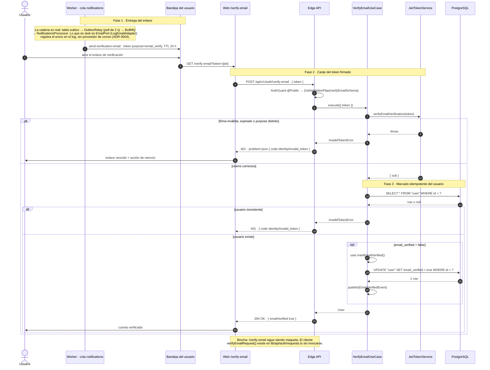
```mermaid
sequenceDiagram
    autonumber
    actor U as Usuario
    participant WK as Worker · cola notifications
    participant MAIL as Bandeja del usuario
    participant W as Web /verify-email
    participant EDGE as Edge API
    participant UC as VerifyEmailUseCase
    participant JWT as JwtTokenService
    participant DB as PostgreSQL

    note over WK, MAIL: Fase 1 · Entrega del enlace
    note over WK: La cadena es real: tabla outbox → OutboxRelay (poll de 2 s) → BullMQ<br/>→ NotificationsProcessor. Lo que es stub es EmailPort (LogEmailAdapter):<br/>registra el envío en el log, sin proveedor de correo (ADR 0004).
    WK->>MAIL: send-verification-email · token purpose=email_verify, TTL 24 h
    U->>MAIL: abre el enlace de verificación
    MAIL->>W: GET /verify-email?token={jwt}

    note over W, JWT: Fase 2 · Canje del token firmado
    W->>EDGE: POST /api/v1/auth/verify-email · { token }
    EDGE->>EDGE: AuthGuard @Public → ZodValidationPipe(verifyEmailSchema)
    EDGE->>UC: execute({ token })
    UC->>JWT: verifyEmailVerification(token)
    alt firma inválida, expirado o purpose distinto
        JWT-->>UC: throw
        UC-->>EDGE: InvalidTokenError
        EDGE-->>W: 401 · problem+json { code identity/invalid_token }
        W->>U: enlace vencido + acción de reenvío
    else claims correctos
        JWT-->>UC: { sub }

        note over UC, DB: Fase 3 · Marcado idempotente del usuario
        UC->>DB: SELECT * FROM "user" WHERE id = ?
        DB-->>UC: row o null
        alt usuario inexistente
            UC-->>EDGE: InvalidTokenError
            EDGE-->>W: 401 · { code identity/invalid_token }
        else usuario existe
            opt email_verified = false
                UC->>UC: user.markEmailVerified()
                UC->>DB: UPDATE "user" SET email_verified = true WHERE id = ?
                DB-->>UC: 1 row
                UC->>UC: publish(EmailVerifiedEvent)
            end
            UC-->>EDGE: User
            EDGE-->>W: 200 OK · { emailVerified true }
            W->>U: cuenta verificada
        end
    end
    note over W, EDGE: Brecha: /verify-email sigue siendo maqueta. El cliente<br/>verifyEmailRequest() existe en lib/api/auth/requests.ts sin invocarse.
```

### SD-03 · Inicio de sesión con email y contraseña

`POST /api/v1/auth/login` · público · **ruta sensible** para el rate limiter.

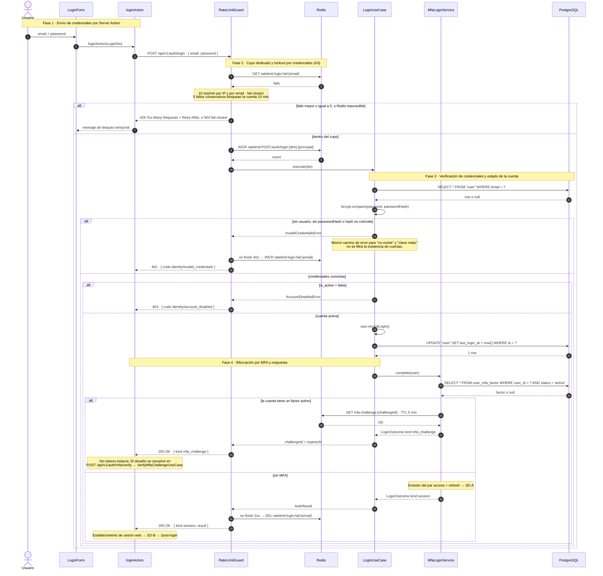
```mermaid
sequenceDiagram
    autonumber
    actor U as Usuario
    participant W as LoginForm
    participant SA as loginAction
    participant RL as RateLimitGuard
    participant RS as Redis
    participant UC as LoginUseCase
    participant MS as MfaLoginService
    participant DB as PostgreSQL

    note over U, SA: Fase 1 · Envío de credenciales por Server Action
    U->>W: email + password
    W->>SA: loginAction(LoginDto)
    SA->>RL: POST /api/v1/auth/login · { email, password }

    note over RL, RS: Fase 2 · Cupo dedicado y lockout por credenciales (A3)
    RL->>RS: GET ratelimit:login-fail:{email}
    RS-->>RL: fails
    note over RL: 10 req/min por IP y por email · fail-closed.<br/>5 fallos consecutivos bloquean la cuenta 15 min.
    alt fails mayor o igual a 5, o Redis inaccesible
        RL-->>SA: 429 Too Many Requests + Retry-After, o 503 fail-closed
        SA-->>W: mensaje de bloqueo temporal
    else dentro del cupo
        RL->>RS: INCR ratelimit:POST:/auth/login:{dim}:{principal}
        RS-->>RL: count
        RL->>UC: execute(dto)

        note over UC, DB: Fase 3 · Verificación de credenciales y estado de la cuenta
        UC->>DB: SELECT * FROM "user" WHERE email = ?
        DB-->>UC: row o null
        UC->>UC: bcrypt.compare(password, passwordHash)
        alt sin usuario, sin passwordHash o hash no coincide
            UC-->>RL: InvalidCredentialsError
            note over UC: Mismo camino de error para "no existe" y "clave mala":<br/>no se filtra la existencia de cuentas.
            RL->>RS: on finish 401 → INCR ratelimit:login-fail:{email}
            RL-->>SA: 401 · { code identity/invalid_credentials }
        else credenciales correctas
            alt is_active = false
                UC-->>RL: AccountDisabledError
                RL-->>SA: 403 · { code identity/account_disabled }
            else cuenta activa
                UC->>UC: user.recordLogin()
                UC->>DB: UPDATE "user" SET last_login_at = now() WHERE id = ?
                DB-->>UC: 1 row

                note over UC, SA: Fase 4 · Bifurcación por MFA y respuesta
                UC->>MS: complete(user)
                MS->>DB: SELECT * FROM user_mfa_factor WHERE user_id = ? AND status = 'active'
                DB-->>MS: factor o null
                alt la cuenta tiene un factor activo
                    MS->>RS: SET mfa:challenge:{challengeId} · TTL 5 min
                    RS-->>MS: OK
                    MS-->>UC: LoginOutcome kind mfa_challenge
                    UC-->>RL: challengeId + expiresAt
                    RL-->>SA: 200 OK · { kind mfa_challenge }
                    note over SA: Sin tokens todavía. El desafío se resuelve en<br/>POST /api/v1/auth/mfa/verify → VerifyMfaChallengeUseCase.
                else sin MFA
                    note over MS: Emisión del par access + refresh → SD-A
                    MS-->>UC: LoginOutcome kind session
                    UC-->>RL: AuthResult
                    RL->>RS: on finish 2xx → DEL ratelimit:login-fail:{email}
                    RL-->>SA: 200 OK · { kind session, result }
                    note over SA: Establecimiento de sesión web → SD-B → /post-login
                end
            end
        end
    end
```

### SD-04 · Inicio de sesión con Google (OIDC)

`POST /api/v1/auth/google` · público · `GoogleLoginUseCase`. El canje del `id_token` ocurre **dentro
del callback `jwt()` de Auth.js**, no en un Server Action.

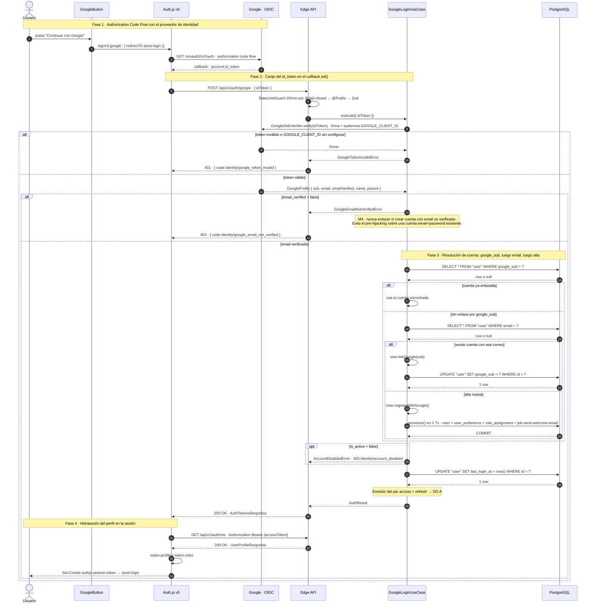
```mermaid
sequenceDiagram
    autonumber
    actor U as Usuario
    participant W as GoogleButton
    participant NA as Auth.js v5
    participant G as Google · OIDC
    participant EDGE as Edge API
    participant UC as GoogleLoginUseCase
    participant DB as PostgreSQL

    note over U, G: Fase 1 · Authorization Code Flow con el proveedor de identidad
    U->>W: pulsa "Continuar con Google"
    W->>NA: signIn('google', { redirectTo /post-login })
    NA->>G: GET /o/oauth2/v2/auth · authorization code flow
    G-->>NA: callback · account.id_token

    note over NA, UC: Fase 2 · Canje del id_token en el callback jwt()
    NA->>EDGE: POST /api/v1/auth/google · { idToken }
    EDGE->>EDGE: RateLimitGuard 10/min por IP fail-closed → @Public → Zod
    EDGE->>UC: execute({ idToken })
    UC->>G: GoogleOidcVerifier.verify(idToken) · firma + audiencia GOOGLE_CLIENT_ID
    alt token inválido o GOOGLE_CLIENT_ID sin configurar
        G-->>UC: throw
        UC-->>EDGE: GoogleTokenInvalidError
        EDGE-->>NA: 401 · { code identity/google_token_invalid }
    else token válido
        G-->>UC: GoogleProfile { sub, email, emailVerified, name, picture }
        alt email_verified = false
            UC-->>EDGE: GoogleEmailNotVerifiedError
            note over UC: M4 · nunca enlazar ni crear cuenta con email no verificado.<br/>Evita el pre-hijacking sobre una cuenta email+password existente.
            EDGE-->>NA: 403 · { code identity/google_email_not_verified }
        else email verificado

            note over UC, DB: Fase 3 · Resolución de cuenta: google_sub, luego email, luego alta
            UC->>DB: SELECT * FROM "user" WHERE google_sub = ?
            DB-->>UC: row o null
            alt cuenta ya enlazada
                UC->>UC: usa la cuenta encontrada
            else sin enlace por google_sub
                UC->>DB: SELECT * FROM "user" WHERE email = ?
                DB-->>UC: row o null
                alt existe cuenta con ese correo
                    UC->>UC: user.linkGoogle(sub)
                    UC->>DB: UPDATE "user" SET google_sub = ? WHERE id = ?
                    DB-->>UC: 1 row
                else alta nueva
                    UC->>UC: User.registerWithGoogle()
                    UC->>DB: provision() en 1 Tx · user + user_preference + role_assignment + job send-welcome-email
                    DB-->>UC: COMMIT
                end
            end
            opt is_active = false
                UC-->>EDGE: AccountDisabledError · 403 identity/account_disabled
            end
            UC->>DB: UPDATE "user" SET last_login_at = now() WHERE id = ?
            DB-->>UC: 1 row
            note over UC: Emisión del par access + refresh → SD-A
            UC-->>EDGE: AuthResult
            EDGE-->>NA: 200 OK · AuthTokensResponse

            note over NA, U: Fase 4 · Hidratación del perfil en la sesión
            NA->>EDGE: GET /api/v1/auth/me · Authorization Bearer {accessToken}
            EDGE-->>NA: 200 OK · UserProfileResponse
            NA->>NA: token.profile y token.roles
            NA-->>U: Set-Cookie authjs.session-token → /post-login
        end
    end
```

> El provider de Google **solo se registra si existen `AUTH_GOOGLE_ID` y `AUTH_GOOGLE_SECRET`**; sin
> ellos el botón no se renderiza en `/login` ni `/register`.

### SD-05 · Recuperación de cuenta

#### SD-05a · Estado actual (AS-IS)

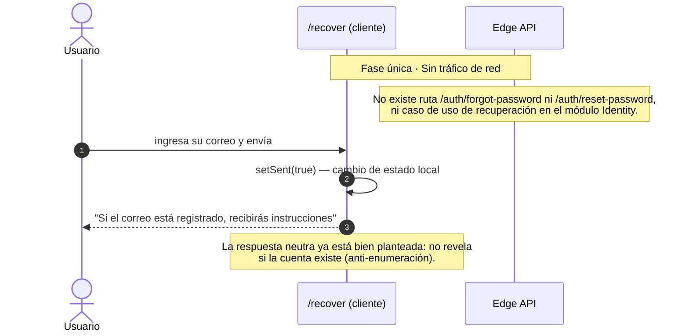
```mermaid
sequenceDiagram
    autonumber
    actor U as Usuario
    participant W as /recover (cliente)
    participant EDGE as Edge API

    note over W, EDGE: Fase única · Sin tráfico de red
    note over EDGE: No existe ruta /auth/forgot-password ni /auth/reset-password,<br/>ni caso de uso de recuperación en el módulo Identity.
    U->>W: ingresa su correo y envía
    W->>W: setSent(true) — cambio de estado local
    W-->>U: "Si el correo está registrado, recibirás instrucciones"
    note over W: La respuesta neutra ya está bien planteada: no revela<br/>si la cuenta existe (anti-enumeración).
```

> El mismo estado aplica a `/2fa`: pantalla de prototipo sin backend de segundo factor.

#### SD-05b · Diseño propuesto (TO-BE)

Propuesta apoyada en piezas que **ya existen** en el repo: `TokenService` (firma con `purpose`),
`OutboxPort` (encolado transaccional) y `RefreshTokenStore.revokeAllForUser` (corte de sesiones).

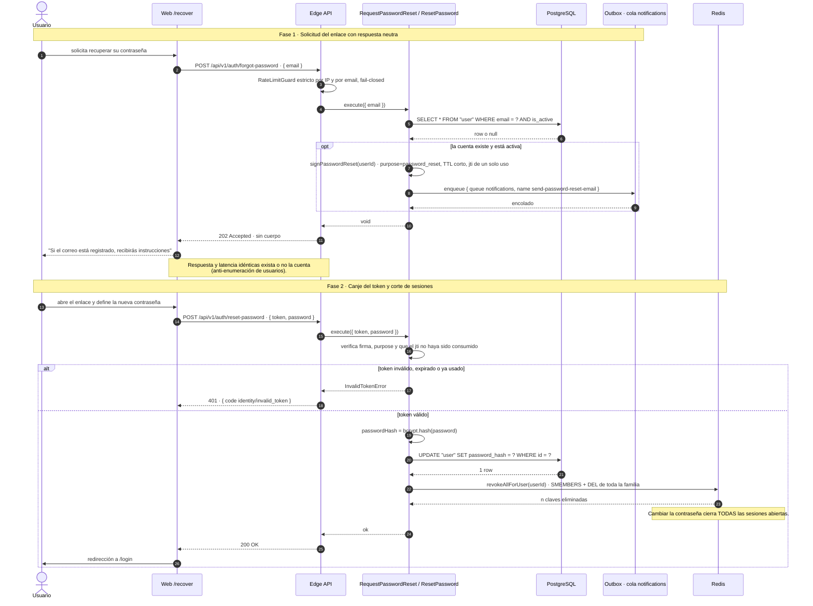
```mermaid
sequenceDiagram
    autonumber
    actor U as Usuario
    participant W as Web /recover
    participant EDGE as Edge API
    participant UC as RequestPasswordReset / ResetPassword
    participant DB as PostgreSQL
    participant OBX as Outbox · cola notifications
    participant RS as Redis

    note over U, OBX: Fase 1 · Solicitud del enlace con respuesta neutra
    U->>W: solicita recuperar su contraseña
    W->>EDGE: POST /api/v1/auth/forgot-password · { email }
    EDGE->>EDGE: RateLimitGuard estricto por IP y por email, fail-closed
    EDGE->>UC: execute({ email })
    UC->>DB: SELECT * FROM "user" WHERE email = ? AND is_active
    DB-->>UC: row o null
    opt la cuenta existe y está activa
        UC->>UC: signPasswordReset(userId) · purpose=password_reset, TTL corto, jti de un solo uso
        UC->>OBX: enqueue { queue notifications, name send-password-reset-email }
        OBX-->>UC: encolado
    end
    UC-->>EDGE: void
    EDGE-->>W: 202 Accepted · sin cuerpo
    W-->>U: "Si el correo está registrado, recibirás instrucciones"
    note over EDGE, W: Respuesta y latencia idénticas exista o no la cuenta<br/>(anti-enumeración de usuarios).

    note over U, RS: Fase 2 · Canje del token y corte de sesiones
    U->>W: abre el enlace y define la nueva contraseña
    W->>EDGE: POST /api/v1/auth/reset-password · { token, password }
    EDGE->>UC: execute({ token, password })
    UC->>UC: verifica firma, purpose y que el jti no haya sido consumido
    alt token inválido, expirado o ya usado
        UC-->>EDGE: InvalidTokenError
        EDGE-->>W: 401 · { code identity/invalid_token }
    else token válido
        UC->>UC: passwordHash = bcrypt.hash(password)
        UC->>DB: UPDATE "user" SET password_hash = ? WHERE id = ?
        DB-->>UC: 1 row
        UC->>RS: revokeAllForUser(userId) · SMEMBERS + DEL de toda la familia
        RS-->>UC: n claves eliminadas
        note over RS: Cambiar la contraseña cierra TODAS las sesiones abiertas.
        UC-->>EDGE: ok
        EDGE-->>W: 200 OK
        W->>U: redirección a /login
    end
```

---

## 7. Bloque 2 · Ciclo de vida de la sesión

Tres capas de token conviven y no deben confundirse al leer los diagramas:

| Capa | Portador | Duración | Dónde vive |
|---|---|---|---|
| Sesión web | Cookie `authjs.session-token` (JWT de Auth.js) | Sesión del navegador | Cookie `httpOnly` |
| Acceso al API | `accessToken` del backend (HS256) | `JWT_ACCESS_TTL` (corto) | Dentro del JWT de Auth.js; expuesto al cliente en `session.accessToken` (ADR 0006) |
| Renovación | `refreshToken` con `jti` | `JWT_REFRESH_TTL` | Dentro del JWT de Auth.js + clave en Redis |

### SD-06 · Ciclo de vida de la sesión — renovación con rotación

`POST /api/v1/auth/refresh` · público · `RefreshTokenUseCase`

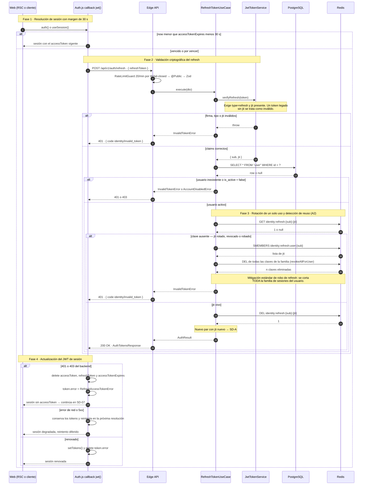
```mermaid
sequenceDiagram
    autonumber
    participant W as Web (RSC o cliente)
    participant NA as Auth.js callback jwt()
    participant EDGE as Edge API
    participant UC as RefreshTokenUseCase
    participant JWT as JwtTokenService
    participant DB as PostgreSQL
    participant RS as Redis

    note over W, NA: Fase 1 · Resolución de sesión con margen de 30 s
    W->>NA: auth() o useSession()
    alt now menor que accessTokenExpires menos 30 s
        NA-->>W: sesión con el accessToken vigente
    else vencido o por vencer
        note over NA, JWT: Fase 2 · Validación criptográfica del refresh
        NA->>EDGE: POST /api/v1/auth/refresh · { refreshToken }
        EDGE->>EDGE: RateLimitGuard 20/min por IP fail-closed → @Public → Zod
        EDGE->>UC: execute(dto)
        UC->>JWT: verifyRefresh(token)
        note over JWT: Exige type=refresh y jti presente. Un token legado<br/>sin jti se trata como inválido.
        alt firma, tipo o jti inválidos
            JWT-->>UC: throw
            UC-->>EDGE: InvalidTokenError
            EDGE-->>NA: 401 · { code identity/invalid_token }
        else claims correctos
            JWT-->>UC: { sub, jti }
            UC->>DB: SELECT * FROM "user" WHERE id = ?
            DB-->>UC: row o null
            alt usuario inexistente o is_active = false
                UC-->>EDGE: InvalidTokenError o AccountDisabledError
                EDGE-->>NA: 401 o 403
            else usuario activo

                note over UC, RS: Fase 3 · Rotación de un solo uso y detección de reuso (A2)
                UC->>RS: GET identity:refresh:{sub}:{jti}
                RS-->>UC: 1 o null
                alt clave ausente — jti rotado, revocado o robado
                    UC->>RS: SMEMBERS identity:refresh:user:{sub}
                    RS-->>UC: lista de jti
                    UC->>RS: DEL de todas las claves de la familia (revokeAllForUser)
                    RS-->>UC: n claves eliminadas
                    note over UC, RS: Mitigación estándar de robo de refresh: se corta<br/>TODA la familia de sesiones del usuario.
                    UC-->>EDGE: InvalidTokenError
                    EDGE-->>NA: 401 · { code identity/invalid_token }
                else jti vivo
                    UC->>RS: DEL identity:refresh:{sub}:{jti}
                    RS-->>UC: 1
                    note over UC: Nuevo par con jti nuevo → SD-A
                    UC-->>EDGE: AuthResult
                    EDGE-->>NA: 200 OK · AuthTokensResponse
                end
            end
        end

        note over NA, W: Fase 4 · Actualización del JWT de sesión
        alt 401 o 403 del backend
            NA->>NA: delete accessToken, refreshToken y accessTokenExpires
            NA->>NA: token.error = RefreshAccessTokenError
            NA-->>W: sesión sin accessToken → continúa en SD-07
        else error de red o 5xx
            NA->>NA: conserva los tokens y reintenta en la próxima resolución
            NA-->>W: sesión degradada, reintento diferido
        else renovado
            NA->>NA: setTokens() y delete token.error
            NA-->>W: sesión renovada
        end
    end
```

### SD-07 · Ciclo de vida de la sesión — expiración y cierre

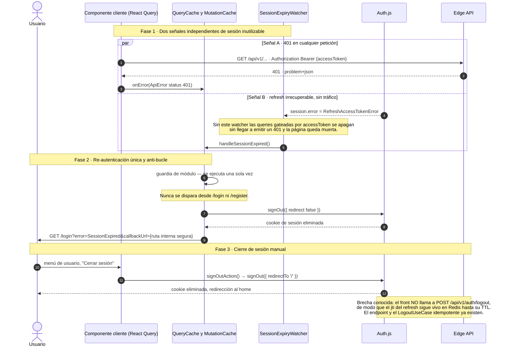
```mermaid
sequenceDiagram
    autonumber
    actor U as Usuario
    participant CMP as Componente cliente (React Query)
    participant PRV as QueryCache y MutationCache
    participant SEW as SessionExpiryWatcher
    participant NA as Auth.js
    participant EDGE as Edge API

    note over CMP, SEW: Fase 1 · Dos señales independientes de sesión inutilizable
    par Señal A · 401 en cualquier petición
        CMP->>EDGE: GET /api/v1/... · Authorization Bearer {accessToken}
        EDGE-->>CMP: 401 · problem+json
        CMP->>PRV: onError(ApiError status 401)
    and Señal B · refresh irrecuperable, sin tráfico
        NA-->>SEW: session.error = RefreshAccessTokenError
        note over SEW: Sin este watcher las queries gateadas por accessToken se apagan<br/>sin llegar a emitir un 401 y la página queda muerta.
        SEW->>PRV: handleSessionExpired()
    end

    note over PRV, U: Fase 2 · Re-autenticación única y anti-bucle
    PRV->>PRV: guardia de módulo — se ejecuta una sola vez
    note over PRV: Nunca se dispara desde /login ni /register.
    PRV->>NA: signOut({ redirect false })
    NA-->>PRV: cookie de sesión eliminada
    PRV->>U: GET /login?error=SessionExpired&callbackUrl={ruta interna segura}

    note over U, EDGE: Fase 3 · Cierre de sesión manual
    U->>CMP: menú de usuario, "Cerrar sesión"
    CMP->>NA: signOutAction() → signOut({ redirectTo '/' })
    NA-->>U: cookie eliminada, redirección al home
    note over NA, EDGE: Brecha conocida: el front NO llama a POST /api/v1/auth/logout,<br/>de modo que el jti del refresh sigue vivo en Redis hasta su TTL.<br/>El endpoint y el LogoutUseCase idempotente ya existen.
```

---

## 8. Bloque 3 · Post-login: cuenta del usuario

### SD-08 · Onboarding

`PATCH /api/v1/me/preferences` + `POST /api/v1/me/onboarding`

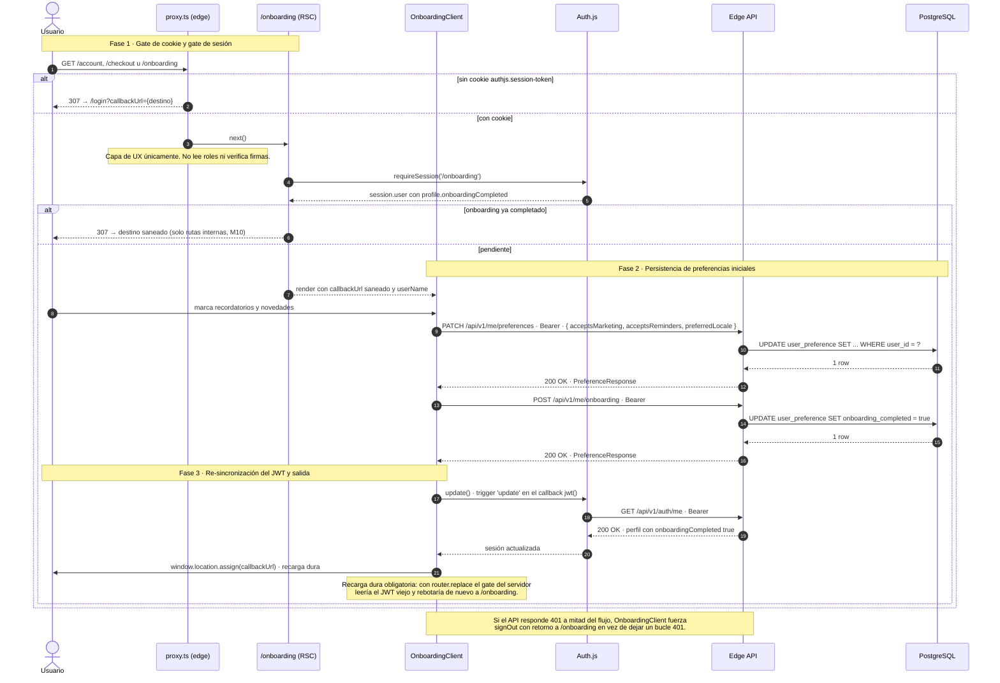
```mermaid
sequenceDiagram
    autonumber
    actor U as Usuario
    participant PX as proxy.ts (edge)
    participant PG as /onboarding (RSC)
    participant OC as OnboardingClient
    participant NA as Auth.js
    participant EDGE as Edge API
    participant DB as PostgreSQL

    note over U, PG: Fase 1 · Gate de cookie y gate de sesión
    U->>PX: GET /account, /checkout u /onboarding
    alt sin cookie authjs.session-token
        PX-->>U: 307 → /login?callbackUrl={destino}
    else con cookie
        PX->>PG: next()
        note over PX: Capa de UX únicamente. No lee roles ni verifica firmas.
        PG->>NA: requireSession('/onboarding')
        NA-->>PG: session.user con profile.onboardingCompleted
        alt onboarding ya completado
            PG-->>U: 307 → destino saneado (solo rutas internas, M10)
        else pendiente

            note over OC, DB: Fase 2 · Persistencia de preferencias iniciales
            PG-->>OC: render con callbackUrl saneado y userName
            U->>OC: marca recordatorios y novedades
            OC->>EDGE: PATCH /api/v1/me/preferences · Bearer · { acceptsMarketing, acceptsReminders, preferredLocale }
            EDGE->>DB: UPDATE user_preference SET ... WHERE user_id = ?
            DB-->>EDGE: 1 row
            EDGE-->>OC: 200 OK · PreferenceResponse
            OC->>EDGE: POST /api/v1/me/onboarding · Bearer
            EDGE->>DB: UPDATE user_preference SET onboarding_completed = true
            DB-->>EDGE: 1 row
            EDGE-->>OC: 200 OK · PreferenceResponse

            note over OC, U: Fase 3 · Re-sincronización del JWT y salida
            OC->>NA: update() · trigger 'update' en el callback jwt()
            NA->>EDGE: GET /api/v1/auth/me · Bearer
            EDGE-->>NA: 200 OK · perfil con onboardingCompleted true
            NA-->>OC: sesión actualizada
            OC->>U: window.location.assign(callbackUrl) · recarga dura
            note over OC: Recarga dura obligatoria: con router.replace el gate del servidor<br/>leería el JWT viejo y rebotaría de nuevo a /onboarding.
        end
    end
    note over OC, EDGE: Si el API responde 401 a mitad del flujo, OnboardingClient fuerza<br/>signOut con retorno a /onboarding en vez de dejar un bucle 401.
```

**Gates que exigen onboarding completo:** `app/(consumer)/account/layout.tsx` y `app/checkout/page.tsx`.

### SD-09 · Configuración de perfil

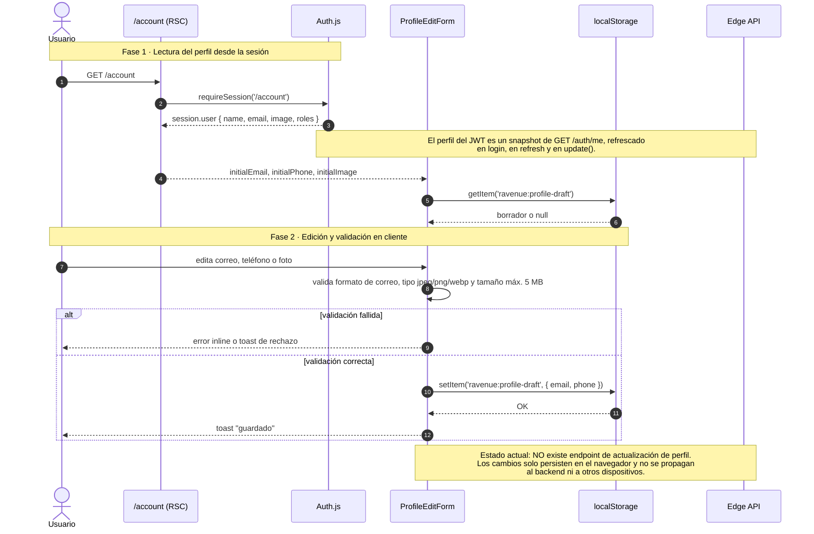
```mermaid
sequenceDiagram
    autonumber
    actor U as Usuario
    participant AC as /account (RSC)
    participant NA as Auth.js
    participant PF as ProfileEditForm
    participant LS as localStorage
    participant EDGE as Edge API

    note over U, NA: Fase 1 · Lectura del perfil desde la sesión
    U->>AC: GET /account
    AC->>NA: requireSession('/account')
    NA-->>AC: session.user { name, email, image, roles }
    note over NA, EDGE: El perfil del JWT es un snapshot de GET /auth/me, refrescado<br/>en login, en refresh y en update().
    AC-->>PF: initialEmail, initialPhone, initialImage
    PF->>LS: getItem('ravenue:profile-draft')
    LS-->>PF: borrador o null

    note over U, LS: Fase 2 · Edición y validación en cliente
    U->>PF: edita correo, teléfono o foto
    PF->>PF: valida formato de correo, tipo jpeg/png/webp y tamaño máx. 5 MB
    alt validación fallida
        PF-->>U: error inline o toast de rechazo
    else validación correcta
        PF->>LS: setItem('ravenue:profile-draft', { email, phone })
        LS-->>PF: OK
        PF-->>U: toast "guardado"
    end
    note over PF, EDGE: Estado actual: NO existe endpoint de actualización de perfil.<br/>Los cambios solo persisten en el navegador y no se propagan<br/>al backend ni a otros dispositivos.
```

**TO-BE mínimo para cerrarlo**, con piezas ya presentes en el repo:

1. `PATCH /api/v1/me/profile` (`UpdateProfileUseCase`) para `fullName`, `phone` y `avatarKey`.
2. Avatar por **URL presignada** vía `StoragePort` (mismo patrón que `lib/api/uploads.ts`), guardando
   la *key* de S3 en la base — nunca la URL (§ almacenamiento de objetos).
3. Tras el `PATCH`, `useSession().update()` para re-sincronizar el snapshot del JWT.
4. El documento de identidad permanece inmutable una vez usado en una compra
   (`DocumentLockedError`, 409).

### SD-10 · Preferencias

`PATCH /api/v1/me/preferences` · `UpdatePreferencesUseCase`

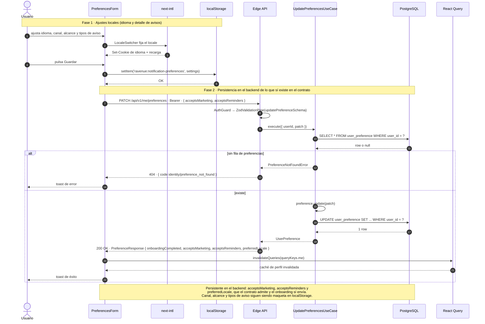
```mermaid
sequenceDiagram
    autonumber
    actor U as Usuario
    participant PF as PreferencesForm
    participant I18N as next-intl
    participant LS as localStorage
    participant EDGE as Edge API
    participant UC as UpdatePreferencesUseCase
    participant DB as PostgreSQL
    participant RQ as React Query

    note over U, LS: Fase 1 · Ajustes locales (idioma y detalle de avisos)
    U->>PF: ajusta idioma, canal, alcance y tipos de aviso
    PF->>I18N: LocaleSwitcher fija el locale
    I18N-->>PF: Set-Cookie de idioma + recarga
    U->>PF: pulsa Guardar
    PF->>LS: setItem('ravenue:notification-preferences', settings)
    LS-->>PF: OK

    note over PF, DB: Fase 2 · Persistencia en el backend de lo que sí existe en el contrato
    PF->>EDGE: PATCH /api/v1/me/preferences · Bearer · { acceptsMarketing, acceptsReminders }
    EDGE->>EDGE: AuthGuard → ZodValidationPipe(updatePreferenceSchema)
    EDGE->>UC: execute({ userId, patch })
    UC->>DB: SELECT * FROM user_preference WHERE user_id = ?
    DB-->>UC: row o null
    alt sin fila de preferencias
        UC-->>EDGE: PreferenceNotFoundError
        EDGE-->>PF: 404 · { code identity/preference_not_found }
        PF-->>U: toast de error
    else existe
        UC->>UC: preference.update(patch)
        UC->>DB: UPDATE user_preference SET ... WHERE user_id = ?
        DB-->>UC: 1 row
        UC-->>EDGE: UserPreference
        EDGE-->>PF: 200 OK · PreferenceResponse { onboardingCompleted, acceptsMarketing, acceptsReminders, preferredLocale }
        PF->>RQ: invalidateQueries(queryKeys.me)
        RQ-->>PF: caché de perfil invalidada
        PF-->>U: toast de éxito
    end
    note over PF, DB: Persistente en el backend: acceptsMarketing, acceptsReminders y<br/>preferredLocale, que el contrato admite y el onboarding sí envía.<br/>Canal, alcance y tipos de aviso siguen siendo maqueta en localStorage.
```

---

## 9. Bloque 4 · RBAC y acceso

Roles del sistema: `super_admin`, `admin_local`, `promoter`, `validator`, `user`.
`super_admin` atraviesa el `RolesGuard` sin restricción; el aislamiento fino por empresa lo aplica
cada caso de uso con `assertTenant(scope, resourceCompanyId)`.

### SD-11 · Roles: otorgar y revocar

`POST /api/v1/users/{userId}/roles` · `DELETE /api/v1/users/{userId}/roles/{assignmentId}` · solo `super_admin`

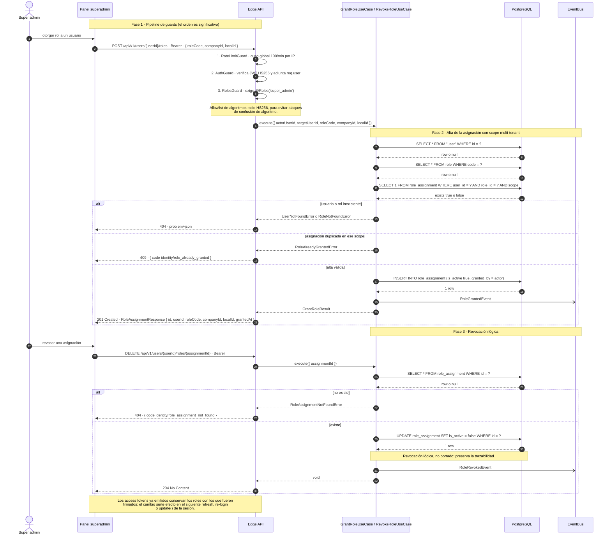
```mermaid
sequenceDiagram
    autonumber
    actor SA as Super admin
    participant PNL as Panel superadmin
    participant EDGE as Edge API
    participant UC as GrantRoleUseCase / RevokeRoleUseCase
    participant DB as PostgreSQL
    participant BUS as EventBus

    note over PNL, EDGE: Fase 1 · Pipeline de guards (el orden es significativo)
    SA->>PNL: otorgar rol a un usuario
    PNL->>EDGE: POST /api/v1/users/{userId}/roles · Bearer · { roleCode, companyId, localId }
    EDGE->>EDGE: 1. RateLimitGuard · cupo global 100/min por IP
    EDGE->>EDGE: 2. AuthGuard · verifica JWT HS256 y adjunta req.user
    EDGE->>EDGE: 3. RolesGuard · exige @Roles('super_admin')
    note over EDGE: Allowlist de algoritmos: solo HS256, para evitar ataques<br/>de confusión de algoritmo.
    EDGE->>UC: execute({ actorUserId, targetUserId, roleCode, companyId, localId })

    note over UC, BUS: Fase 2 · Alta de la asignación con scope multi-tenant
    UC->>DB: SELECT * FROM "user" WHERE id = ?
    DB-->>UC: row o null
    UC->>DB: SELECT * FROM role WHERE code = ?
    DB-->>UC: row o null
    UC->>DB: SELECT 1 FROM role_assignment WHERE user_id = ? AND role_id = ? AND scope
    DB-->>UC: exists true o false
    alt usuario o rol inexistente
        UC-->>EDGE: UserNotFoundError o RoleNotFoundError
        EDGE-->>PNL: 404 · problem+json
    else asignación duplicada en ese scope
        UC-->>EDGE: RoleAlreadyGrantedError
        EDGE-->>PNL: 409 · { code identity/role_already_granted }
    else alta válida
        UC->>DB: INSERT INTO role_assignment (is_active true, granted_by = actor)
        DB-->>UC: 1 row
        UC-)BUS: RoleGrantedEvent
        UC-->>EDGE: GrantRoleResult
        EDGE-->>PNL: 201 Created · RoleAssignmentResponse { id, userId, roleCode, companyId, localId, grantedAt }
    end

    note over UC, BUS: Fase 3 · Revocación lógica
    SA->>PNL: revocar una asignación
    PNL->>EDGE: DELETE /api/v1/users/{userId}/roles/{assignmentId} · Bearer
    EDGE->>UC: execute({ assignmentId })
    UC->>DB: SELECT * FROM role_assignment WHERE id = ?
    DB-->>UC: row o null
    alt no existe
        UC-->>EDGE: RoleAssignmentNotFoundError
        EDGE-->>PNL: 404 · { code identity/role_assignment_not_found }
    else existe
        UC->>DB: UPDATE role_assignment SET is_active = false WHERE id = ?
        DB-->>UC: 1 row
        note over UC, DB: Revocación lógica, no borrado: preserva la trazabilidad.
        UC-)BUS: RoleRevokedEvent
        UC-->>EDGE: void
        EDGE-->>PNL: 204 No Content
    end
    note over EDGE, PNL: Los access tokens ya emitidos conservan los roles con los que fueron<br/>firmados: el cambio surte efecto en el siguiente refresh, re-login<br/>o update() de la sesión.
```

### SD-12 · Invitaciones de promotor

Consentimiento explícito de la persona invitada **antes** de quedar ligada a la empresa. Al confirmar,
un evento de dominio desencadena la concesión automática del rol `promoter` desde el módulo Identity.

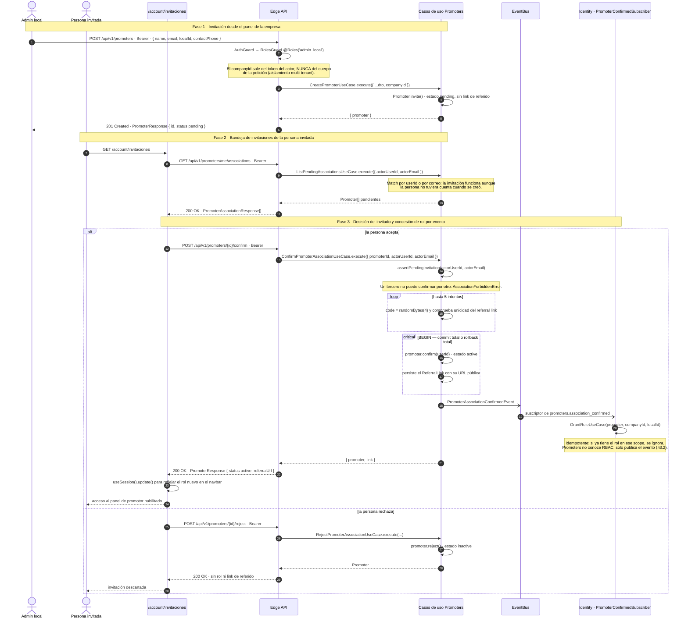
```mermaid
sequenceDiagram
    autonumber
    actor AD as Admin local
    actor PR as Persona invitada
    participant ACC as /account/invitaciones
    participant EDGE as Edge API
    participant UCP as Casos de uso Promoters
    participant BUS as EventBus
    participant IDN as Identity · PromoterConfirmedSubscriber

    note over AD, UCP: Fase 1 · Invitación desde el panel de la empresa
    AD->>EDGE: POST /api/v1/promoters · Bearer · { name, email, localId, contactPhone }
    EDGE->>EDGE: AuthGuard → RolesGuard @Roles('admin_local')
    note over EDGE: El companyId sale del token del actor, NUNCA del cuerpo<br/>de la petición (aislamiento multi-tenant).
    EDGE->>UCP: CreatePromoterUseCase.execute({ ...dto, companyId })
    UCP->>UCP: Promoter.invite() · estado pending, sin link de referido
    UCP-->>EDGE: { promoter }
    EDGE-->>AD: 201 Created · PromoterResponse { id, status pending }

    note over PR, UCP: Fase 2 · Bandeja de invitaciones de la persona invitada
    PR->>ACC: GET /account/invitaciones
    ACC->>EDGE: GET /api/v1/promoters/me/associations · Bearer
    EDGE->>UCP: ListPendingAssociationsUseCase.execute({ actorUserId, actorEmail })
    note over UCP: Match por userId o por correo: la invitación funciona aunque<br/>la persona no tuviera cuenta cuando se creó.
    UCP-->>EDGE: Promoter[] pendientes
    EDGE-->>ACC: 200 OK · PromoterAssociationResponse[]

    note over ACC, IDN: Fase 3 · Decisión del invitado y concesión de rol por evento
    alt la persona acepta
        ACC->>EDGE: POST /api/v1/promoters/{id}/confirm · Bearer
        EDGE->>UCP: ConfirmPromoterAssociationUseCase.execute({ promoterId, actorUserId, actorEmail })
        UCP->>UCP: assertPendingInvitation(actorUserId, actorEmail)
        note over UCP: Un tercero no puede confirmar por otro: AssociationForbiddenError.
        loop hasta 5 intentos
            UCP->>UCP: code = randomBytes(4) y comprueba unicidad del referral link
        end
        critical BEGIN — commit total o rollback total
            UCP->>UCP: promoter.confirm(userId) · estado active
            UCP->>UCP: persiste el ReferralLink con su URL pública
        end
        UCP-)BUS: PromoterAssociationConfirmedEvent
        BUS-)IDN: suscriptor de promoters.association_confirmed
        IDN->>IDN: GrantRoleUseCase(promoter, companyId, localId)
        note over IDN: Idempotente: si ya tiene el rol en ese scope, se ignora.<br/>Promoters no conoce RBAC, solo publica el evento (§3.2).
        UCP-->>EDGE: { promoter, link }
        EDGE-->>ACC: 200 OK · PromoterResponse { status active, referralUrl }
        ACC->>ACC: useSession().update() para reflejar el rol nuevo en el navbar
        ACC-->>PR: acceso al panel de promotor habilitado
    else la persona rechaza
        ACC->>EDGE: POST /api/v1/promoters/{id}/reject · Bearer
        EDGE->>UCP: RejectPromoterAssociationUseCase.execute(...)
        UCP->>UCP: promoter.reject() · estado inactive
        UCP-->>EDGE: Promoter
        EDGE-->>ACC: 200 OK · sin rol ni link de referido
        ACC-->>PR: invitación descartada
    end
```

### SD-13 · Acceso a paneles

Tres capas de control, cada una con una responsabilidad distinta. Ninguna sustituye a las otras.

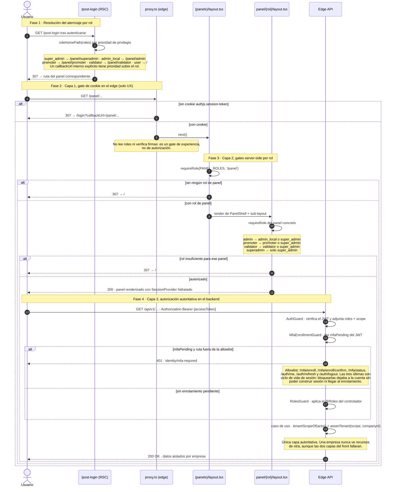
```mermaid
sequenceDiagram
    autonumber
    actor U as Usuario
    participant PL as /post-login (RSC)
    participant PX as proxy.ts (edge)
    participant PLY as (panels)/layout.tsx
    participant SLY as panel/{rol}/layout.tsx
    participant EDGE as Edge API

    note over U, PL: Fase 1 · Resolución del aterrizaje por rol
    U->>PL: GET /post-login tras autenticarse
    PL->>PL: roleHomePath(roles) por prioridad de privilegio
    note over PL: super_admin → /panel/superadmin · admin_local → /panel/admin<br/>promoter → /panel/promoter · validator → /panel/validator · user → /<br/>Un callbackUrl interno explícito tiene prioridad sobre el rol.
    PL-->>U: 307 → ruta del panel correspondiente

    note over U, PX: Fase 2 · Capa 1, gate de cookie en el edge (solo UX)
    U->>PX: GET /panel/...
    alt sin cookie authjs.session-token
        PX-->>U: 307 → /login?callbackUrl=/panel/...
    else con cookie
        PX->>PLY: next()
        note over PX: No lee roles ni verifica firmas: es un gate de experiencia,<br/>no de autorización.

        note over PLY, SLY: Fase 3 · Capa 2, gates server-side por rol
        PLY->>PLY: requireRole(PANEL_ROLES, '/panel')
        alt sin ningún rol de panel
            PLY-->>U: 307 → /
        else con rol de panel
            PLY->>SLY: render de PanelShell + sub-layout
            SLY->>SLY: requireRole del panel concreto
            note over SLY: admin → admin_local o super_admin<br/>promoter → promoter o super_admin<br/>validator → validator o super_admin<br/>superadmin → solo super_admin
            alt rol insuficiente para ese panel
                SLY-->>U: 307 → /
            else autorizado
                SLY-->>U: 200 · panel renderizado con SessionProvider hidratado

                note over U, EDGE: Fase 4 · Capa 3, autorización autoritativa en el backend
                U->>EDGE: GET /api/v1/... · Authorization Bearer {accessToken}
                EDGE->>EDGE: AuthGuard · verifica el JWT y adjunta roles + scope
                EDGE->>EDGE: MfaEnrollmentGuard · lee mfaPending del JWT
                alt mfaPending y ruta fuera de la allowlist
                    EDGE-->>U: 401 · identity/mfa-required
                    note over EDGE: Allowlist: /mfa/enroll, /mfa/enroll/confirm, /mfa/status,<br/>/auth/me, /auth/refresh y /auth/logout. Las tres últimas son<br/>ciclo de vida de sesión: bloquearlas dejaba a la cuenta sin<br/>poder construir sesión ni llegar al enrolamiento.
                else sin enrolamiento pendiente
                    EDGE->>EDGE: RolesGuard · aplica el @Roles del controlador
                end
                EDGE->>EDGE: caso de uso · tenantScopeOf(actor) + assertTenant(scope, companyId)
                note over EDGE: Única capa autoritativa. Una empresa nunca ve recursos<br/>de otra, aunque las dos capas del front fallaran.
                EDGE-->>U: 200 OK · datos aislados por empresa
            end
        end
    end
```

> `/panel` sin sufijo lista los paneles disponibles del usuario; si solo tiene uno, redirige
> directamente a él (`app/(panels)/panel/page.tsx`).

### SD-14 · Enrolamiento de MFA

Cierra el bucle que abre SD-13: cómo sale una cuenta del estado `mfaPending`. El secreto se
devuelve una sola vez y los códigos de recuperación también.

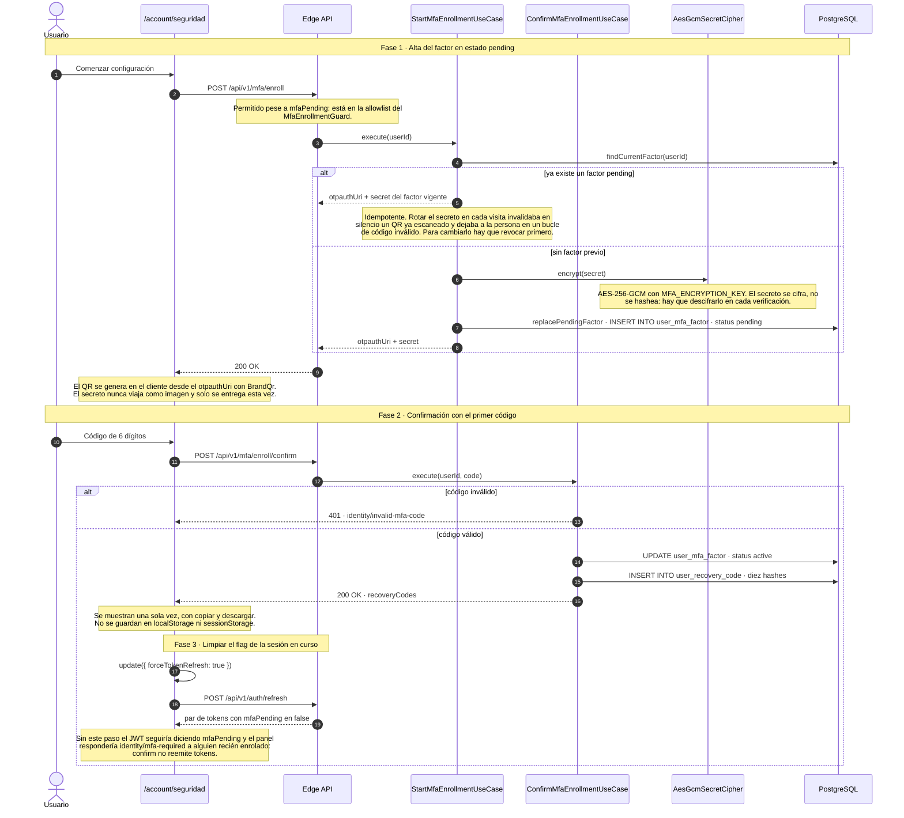
```mermaid
sequenceDiagram
    autonumber
    actor U as Usuario
    participant SEC as /account/seguridad
    participant EDGE as Edge API
    participant SU as StartMfaEnrollmentUseCase
    participant CU as ConfirmMfaEnrollmentUseCase
    participant CI as AesGcmSecretCipher
    participant DB as PostgreSQL

    note over U, DB: Fase 1 · Alta del factor en estado pending
    U->>SEC: Comenzar configuración
    SEC->>EDGE: POST /api/v1/mfa/enroll
    note over EDGE: Permitido pese a mfaPending: está en la allowlist del<br/>MfaEnrollmentGuard.
    EDGE->>SU: execute(userId)
    SU->>DB: findCurrentFactor(userId)
    alt ya existe un factor pending
        SU-->>EDGE: otpauthUri + secret del factor vigente
        note over SU: Idempotente. Rotar el secreto en cada visita invalidaba en<br/>silencio un QR ya escaneado y dejaba a la persona en un bucle<br/>de código inválido. Para cambiarlo hay que revocar primero.
    else sin factor previo
        SU->>CI: encrypt(secret)
        note over CI: AES-256-GCM con MFA_ENCRYPTION_KEY. El secreto se cifra, no<br/>se hashea: hay que descifrarlo en cada verificación.
        SU->>DB: replacePendingFactor · INSERT INTO user_mfa_factor · status pending
        SU-->>EDGE: otpauthUri + secret
    end
    EDGE-->>SEC: 200 OK
    note over SEC: El QR se genera en el cliente desde el otpauthUri con BrandQr.<br/>El secreto nunca viaja como imagen y solo se entrega esta vez.

    note over U, DB: Fase 2 · Confirmación con el primer código
    U->>SEC: Código de 6 dígitos
    SEC->>EDGE: POST /api/v1/mfa/enroll/confirm
    EDGE->>CU: execute(userId, code)
    alt código inválido
        CU-->>SEC: 401 · identity/invalid-mfa-code
    else código válido
        CU->>DB: UPDATE user_mfa_factor · status active
        CU->>DB: INSERT INTO user_recovery_code · diez hashes
        CU-->>SEC: 200 OK · recoveryCodes
        note over SEC: Se muestran una sola vez, con copiar y descargar.<br/>No se guardan en localStorage ni sessionStorage.

        note over SEC, EDGE: Fase 3 · Limpiar el flag de la sesión en curso
        SEC->>SEC: update({ forceTokenRefresh: true })
        SEC->>EDGE: POST /api/v1/auth/refresh
        EDGE-->>SEC: par de tokens con mfaPending en false
        note over SEC: Sin este paso el JWT seguiría diciendo mfaPending y el panel<br/>respondería identity/mfa-required a alguien recién enrolado:<br/>confirm no reemite tokens.
    end
```

---

## 10. Trazabilidad: proceso → endpoint → código → estado

| Proceso | Endpoint(s) | Caso de uso / componente | Estado |
|---|---|---|---|
| Registro | `POST /auth/register` | `RegisterUseCase`, `UserProvisioningService` | ✅ Implementado |
| Verificación de email | `POST /auth/verify-email` | `VerifyEmailUseCase`, `JwtTokenService`, `OutboxRelay` + `NotificationsProcessor` | ⚠️ API y cadena outbox→worker listos; el envío es stub (`LogEmailAdapter`, ADR 0004) y la página `/verify-email` sigue sin cablear |
| Inicio de sesión | `POST /auth/login` | `LoginUseCase`, `MfaLoginService`, `RateLimitGuard` | ✅ Implementado · devuelve `LoginOutcome`: sesión, o desafío si la cuenta tiene MFA activo |
| Ciclo de vida de la sesión | `POST /auth/refresh`, `POST /auth/logout` | `RefreshTokenUseCase`, `LogoutUseCase`, `RedisRefreshTokenStore` | ⚠️ Refresh completo con rotación; el front no invoca `/auth/logout` |
| Inicio de sesión con Google | `POST /auth/google` | `GoogleLoginUseCase`, `GoogleOidcVerifier` | ✅ Implementado (requiere credenciales OAuth configuradas) |
| Recuperación de cuenta | — | `app/(auth)/recover/page.tsx` | ❌ Maqueta; sin backend (ver SD-05b) |
| Onboarding | `PATCH /me/preferences`, `POST /me/onboarding` | `CompleteOnboardingUseCase`, `OnboardingClient` | ✅ Implementado |
| Configuración de perfil | — (lectura vía `GET /auth/me`) | `ProfileEditForm` | ❌ Solo `localStorage`; falta `PATCH /me/profile` |
| Preferencias | `PATCH /me/preferences` | `UpdatePreferencesUseCase`, `PreferencesForm` | ⚠️ Marketing/recordatorios/locale persisten; el resto es maqueta |
| Roles | `POST` / `DELETE /users/{userId}/roles` | `GrantRoleUseCase`, `RevokeRoleUseCase` | ✅ Implementado |
| Invitaciones | `POST /promoters`, `GET /promoters/me/associations`, `POST /promoters/{id}/confirm`, `POST /promoters/{id}/reject` | `ConfirmPromoterAssociationUseCase`, `PromoterConfirmedSubscriber` | ✅ Implementado |
| Acceso a paneles | Todo `/api/v1` protegido | `proxy.ts`, `requireRole`, `AuthGuard`, `MfaEnrollmentGuard`, `RolesGuard` | ✅ Implementado |
| MFA | `POST /mfa/enroll`, `POST /mfa/enroll/confirm`, `GET /mfa/status`, `POST /auth/mfa/verify`, `POST /auth/mfa/recovery`, `POST /mfa/revoke`, `POST /mfa/recovery-codes`, `POST /mfa/unlock` | `StartMfaEnrollmentUseCase`, `ConfirmMfaEnrollmentUseCase`, `VerifyMfaChallengeUseCase`, `UseRecoveryCodeUseCase`, `UnlockMfaUseCase`, `AesGcmSecretCipher` | ✅ Implementado · obligatorio para `super_admin` y `admin_local` (ADR 0012) |
| 2FA | — | `app/(auth)/2fa/page.tsx` | ❌ Maqueta; fuera del alcance solicitado, se documenta por cercanía |

---

## 11. Brechas y riesgos detectados al levantar los flujos

Hallazgos derivados de la lectura del código, ordenados por impacto. No forman parte del pedido, pero
condicionan la fidelidad de los diagramas y conviene decidirlos antes de dar la documentación por
cerrada.

1. **Logout no revoca del lado del servidor.** `signOutAction()` solo borra la cookie de Auth.js.
   `POST /auth/logout` y `LogoutUseCase` existen y son idempotentes, pero nadie los llama: el `jti`
   del refresh sobrevive en Redis hasta su TTL. *Arreglo:* invocar el endpoint antes de `signOut`.
2. **No hay recuperación de cuenta.** Un usuario que olvide su contraseña no tiene camino de vuelta.
   Es el hueco funcional más grande del bloque.
3. **La verificación de email no se completa de punta a punta.** El token se firma, el endpoint
   funciona y la cadena outbox → relay → worker está operativa, pero `EmailPort` es
   `LogEmailAdapter` (solo escribe en el log) y la página `/verify-email` es una maqueta: en la
   práctica ninguna cuenta llega a `email_verified = true` por el flujo normal.
4. **El perfil no se persiste.** Editar correo o teléfono en `/account` no viaja al backend.
5. **Revocar un rol no invalida los tokens vigentes.** Un `admin_local` degradado conserva su acceso
   hasta el siguiente refresh. Mitigación posible: `revokeAllForUser` en `RevokeRoleUseCase`, al mismo
   estilo que la detección de reuso.

---

## 12. Mantenimiento

- **Fuente de verdad funcional:** `../der_class/PROJECT_SPECS.md` (§N). Toda desviación se registra
  como ADR en `docs/adr/`.
- Al cambiar un caso de uso de `apps/api/src/modules/identity/` o el pipeline de `apps/api/src/edge/`,
  actualizar el diagrama correspondiente **en el mismo PR** y revisar la tabla del apartado 10.
- Antes de mergear, ejecutar el comando de validación de §3.7: los 16 diagramas deben renderizar.
- Los diagramas nombran clases, endpoints y claves de Redis reales a propósito: un `grep` del nombre en
  el repo debe encontrar el código. Si no lo encuentra, el diagrama está desactualizado.
