# Descubrimiento y confianza — Diagramas de secuencia y flujo de protocolo

**Serie:** [Diagramas de secuencia](./README.md) · **Dominios 2 y 7 del DER** — *Taxonomy & Catalogs* + *Trust* (§4.1 de `PROJECT_SPECS.md`)

> **Alcance.** Cinco procesos del dominio *Descubrimiento y confianza*, agrupados en cuatro bloques y
> representados con **12 diagramas de secuencia Mermaid** en formato *protocol data flow*: cada flecha
> lleva su método, ruta, código de estado y forma del payload; cada fase del pipeline va marcada con un
> banner. Reflejan el código real de `apps/api` (módulos `events`, `companies`, `catalog`, `trust`,
> `identity/favorites`) y `apps/web` (rutas de consumidor). Donde un bloque es maqueta se marca el
> estado y se indica qué falta.
>
> Mismo estándar de notación que `docs/diagramas-secuencia/01-identidad-acceso.md`.
> Fecha de levantamiento: 2026-07-28 · Rama `feat/rebrand-ravenue`.

---

## 1. Índice

| # | Diagrama | Proceso cubierto |
|---|---|---|
| SD-A | [Lectura pública con ISR](#sd-a--lectura-pública-con-isr) | sub-flujo compartido |
| SD-B | [Acción autenticada desde el cliente](#sd-b--acción-autenticada-desde-el-cliente) | sub-flujo compartido |
| SD-01 | [Listado de eventos con filtros](#sd-01--listado-de-eventos-con-filtros-y-paginación) | Descubrir, buscar y filtrar eventos |
| SD-02 | [Búsqueda global y sugerencias](#sd-02--búsqueda-global-y-sugerencias-en-vivo) | Descubrir, buscar y filtrar eventos |
| SD-03 | [Listado de locales por zona](#sd-03--listado-de-locales-y-filtro-por-zona) | Descubrir, buscar y filtrar |
| SD-04 | [Detalle de evento](#sd-04--detalle-de-evento) | Detalle de evento |
| SD-05 | [Detalle de local y contenido](#sd-05--detalle-de-local-galería-y-contenido) | Detalle de local y contenido |
| SD-06 | [Favoritos: marcar y quitar](#sd-06--favoritos-marcar-y-quitar) | Favoritos |
| SD-07 | [Guardados: lista enriquecida](#sd-07--guardados-lista-enriquecida) | Favoritos |
| SD-08 | [Reseñar una experiencia](#sd-08--reseñar-una-experiencia) | Reseñar una experiencia |
| SD-09 | [Reportar contenido o incidente](#sd-09--reportar-contenido-o-incidente) | Reportar contenido o incidente |
| SD-10 | [Resolución del reporte](#sd-10--resolución-del-reporte) | Reportar contenido o incidente |

---

## 2. Agrupación de los procesos

Los cinco procesos comparten dos caminos técnicos: **lectura pública cacheada** (todo el
descubrimiento) y **mutación autenticada desde el cliente** (favoritos, reseñas, reportes). Extraerlos
evita repetir el mismo tramo en diez diagramas.

| Bloque | Procesos | Razón de la agrupación |
|---|---|---|
| **0 · Sub-flujos compartidos** | — | Toda la exploración pasa por `apiFetch` con ISR y degradación controlada (SD-A). Toda acción de confianza pasa por token de sesión + React Query o `useTokenAction` (SD-B). |
| **1 · Descubrimiento** | Descubrir, buscar y filtrar eventos · (listado de locales) | Mismo patrón: filtros en la query string, Server Component con ISR, degradación a `EmptyState`. Se separan listado, búsqueda y locales porque cada uno tiene su propio contrato de filtros. |
| **2 · Fichas de detalle** | Detalle de evento · Detalle de local, favoritos y contenido | Ambas fichas hacen fan-out en paralelo sobre datos secundarios y montan las mismas acciones de cliente (favorito, reporte). Favoritos se separa en dos diagramas: el toggle en la ficha y la vista Guardados, que tienen backends distintos. |
| **3 · Confianza** | Reseñar una experiencia · Reportar contenido o incidente | Módulo `trust`. Reseñar exige elegibilidad verificada por entrada usada; reportar no. Se añade SD-10 porque un reporte sin resolución no cierra el proceso. |

---

## 3. Convenciones de notación

Estándar de la serie. La fuente canónica es `.claude/skills/sincronizar-diagramas-secuencia/references/notacion.md`.

### 3.1 Estructura

1. **`autonumber` siempre.** Permite referenciar un paso concreto en revisiones ("falla en el paso 7").
2. **Un diagrama = un caso de uso.** Si un flujo supera ~40 mensajes o los 8 participantes, se parte y
   se referencia con una nota (`note over X: ver SD-A`).
3. **Máximo 8 participantes.** Por encima, el diagrama deja de leerse en pantalla.
4. **Declaración explícita de participantes al inicio**, en orden de aparición izquierda → derecha
   (usuario → cliente → borde → aplicación → dominio → infraestructura). Nunca declarar por primera
   vez a mitad del diagrama: el orden visual se desordena.
5. **`actor` para personas, `participant` para sistemas.** Alias corto en mayúsculas (`UC`, `DB`),
   etiqueta legible con `as`.

### 3.2 Flujo de protocolo

Regla central de este documento: **el diagrama debe poder contrastarse contra el tráfico real.**

6. **Toda petición lleva su respuesta.** Ninguna flecha `->>` de red se queda sin su `-->>` con código
   de estado y forma del payload. Si no hay respuesta, es un `-)` (asíncrono) y se dice por qué.
7. **Anotación de protocolo en la ida:** `MÉTODO /ruta · cabecera o cuerpo relevante`.
   Ejemplo: `GET /api/v1/{recurso}/{id} · Authorization Bearer {accessToken}`.
8. **Anotación de resultado en la vuelta:** `código · payload`.
   Ejemplo: `409 · problem+json { code: {contexto}/{error} }`.
9. **Infraestructura con su comando real**, no con una paráfrasis: `SELECT ... WHERE status = 'published'`,
   `DELETE FROM ...`. Hace el diagrama auditable
   contra los adapters Drizzle y Redis.
10. **Placeholders entre llaves**, nunca entre `<` `>` (Mermaid los interpreta como HTML): `{slug}`.

### 3.3 Fases

11. **Banners de fase** con `note over A, B: Fase N · Nombre (componente real)`, abarcando los
    participantes implicados en ese tramo. Convierten un muro de flechas en un flujo legible por
    etapas y hacen explícito qué componente gobierna cada una.
12. **Notas de invariante** (`note over X:`) reservadas para reglas de seguridad, decisiones de diseño
    y brechas conocidas. Nunca para narrar lo que la flecha ya dice.
13. Saltos de línea en notas con `<br/>` para no ensanchar el diagrama.

### 3.4 Arrows y bloques de control

| Notación | Significado |
|---|---|
| `->>` | Llamada síncrona: el emisor espera respuesta |
| `-->>` | Respuesta o retorno, con código de estado |
| `-)` | Asíncrono fire-and-forget: publicación de evento, encolado |
| `X->>X` | Cómputo interno que cambia estado o toma una decisión (hash, firma, validación) |

| Bloque | Uso |
|---|---|
| `alt` / `else` | Caminos mutuamente excluyentes (éxito vs. error de negocio) |
| `opt` | Tramo que puede no ejecutarse y no tiene alternativa |
| `critical` | Transacción atómica (`UnitOfWork`): si algo falla, nada se persiste |
| `par` / `and` | Señales concurrentes e independientes |
| `loop` | Repetición acotada (reintentos, generación de código único) |

### 3.5 Cierre

14. **Cada diagrama termina en el efecto observable**: lo que ve el usuario, la cookie fijada o el
    documento devuelto. Un diagrama que acaba en una llamada interna está incompleto.

### 3.6 Higiene sintáctica

15. **Nada de `;` dentro de un mensaje o una nota.** Mermaid corta la sentencia ahí y el diagrama deja
    de compilar. Usar coma o punto.
16. Nada de `<` `>` sin escapar, incluidas las flechas de función de JavaScript (ver regla 10).
17. Los nombres de casos de uso, guards, endpoints y claves de Redis se copian **tal cual del código**:
    un `grep` del nombre debe encontrar el fuente.
18. **Los diagramas TO-BE nombran componentes que no existen todavía** y lo señalan en el propio participante o en una nota. Los AS-IS nombran archivos reales.

### 3.7 Validación

```bash
npx -y @mermaid-js/mermaid-cli@11 \
  -i docs/diagramas-secuencia/02-descubrimiento-confianza.md \
  -o /tmp/02-descubrimiento-confianza.md
```

También sirven mermaid.live y la extensión *Markdown Preview Mermaid Support* de VS Code. GitHub
renderiza estos bloques de forma nativa.

---

## 4. Catálogo de participantes

| Alias | Componente real | Archivo |
|---|---|---|
| `U` | Persona usuaria (visitante o autenticada) | — |
| `PG` | Server Component de una ruta de consumidor | `apps/web/app/(consumer)/**` |
| `FET` | Fetchers públicos tipados | `apps/web/lib/api/catalog.ts`, `trust.ts`, `favorites.ts` |
| `CACHE` | Data Cache de Next (ISR por `next.revalidate`) | — |
| `RQ` | React Query (`queryKeys.favorites`) | `apps/web/lib/api/query-keys.ts` |
| `ACT` | `useTokenAction` — token de sesión + toasts + manejo de 401 | `apps/web/lib/hooks/use-token-action.tsx` |
| `EDGE` | Pipeline global del API: `RateLimit → Auth → Roles` + `ZodValidationPipe` | `apps/api/src/edge/**` |
| `UC` | Caso de uso (capa aplicación) | `apps/api/src/modules/**/application/use-cases/**` |
| `REPO` | Adapter Drizzle del repositorio | `apps/api/src/modules/**/infrastructure/persistence/**` |
| `ATT` | `AttendancePort` — elegibilidad por entrada usada | `.../trust/infrastructure/persistence/drizzle-attendance.adapter.ts` |
| `TR` | `ResourceTenantResolver` — empresa dueña de un recurso | `apps/api/src/shared/tenant/resource-tenant.port.ts` |
| `ST` | `StoragePort` — resuelve keys de S3 a URL pública | `apps/api/src/shared/adapters/storage/**` |
| `DB` | PostgreSQL vía Drizzle | `packages/db/src/schema/**` |

### TTL de caché por recurso

| Recurso | `revalidate` | Motivo |
|---|---|---|
| `/zones`, `/music-genres`, `/tags` | 300 s | Taxonomía casi inmutable |
| `/locals`, `/events`, fichas | 60 s | Catálogo, cambia con publicaciones |
| `/events/{id}/ticket-types`, `/reviews` | 30 s | Inventario y contenido social, sensibles a frescura |
| Página `/events/{slug}` | 30 s | Alineada con el TTL de su dato más volátil |

---

## 5. Bloque 0 · Sub-flujos compartidos

### SD-A · Lectura pública con ISR

Camino común de todo el descubrimiento: los Server Components no hablan con la base, hablan con
`apiFetch`, y el Data Cache de Next absorbe la mayoría de las visitas.

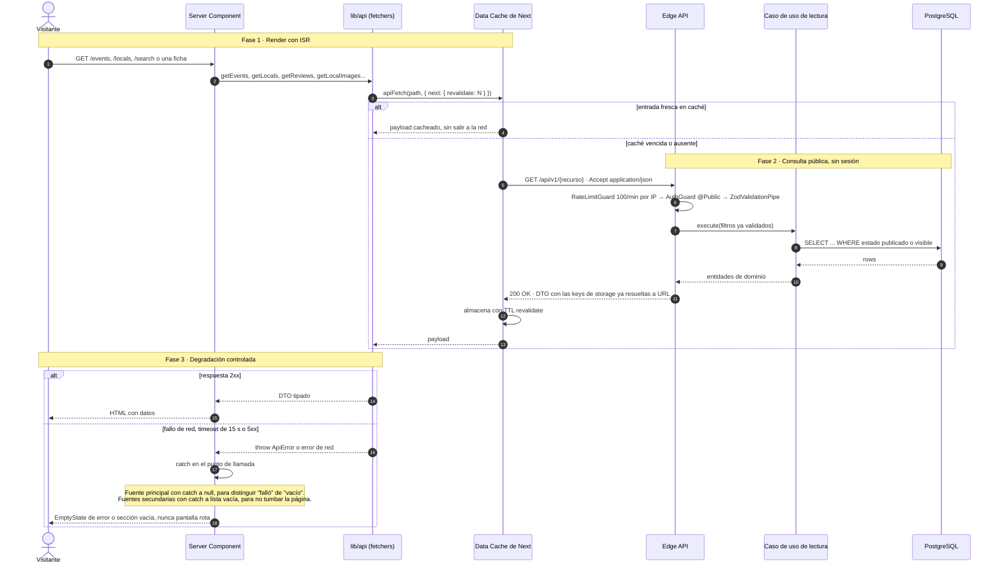

### SD-B · Acción autenticada desde el cliente

Camino común de favoritos, reseñas y reportes: componente cliente, token de la sesión, mutación,
invalidación de caché y traducción del error.

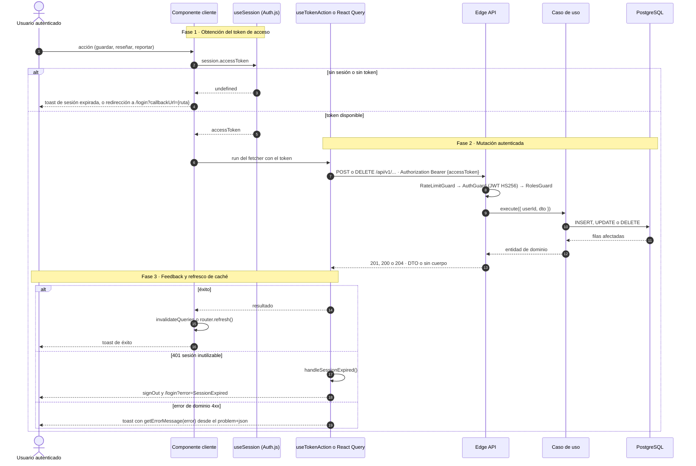

---

## 6. Bloque 1 · Descubrimiento

### SD-01 · Listado de eventos con filtros y paginación

`GET /api/v1/events` · público · `ListEventsUseCase`

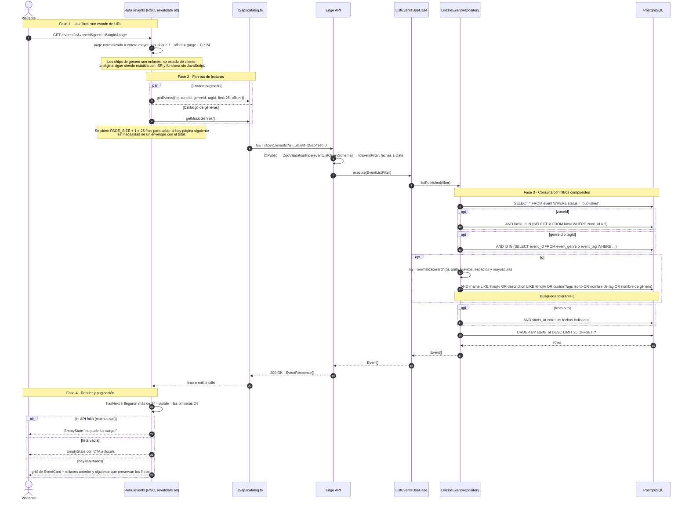

### SD-02 · Búsqueda global y sugerencias en vivo

`SearchSuggest` en el header (cliente) + ruta `/search` (Server Component).

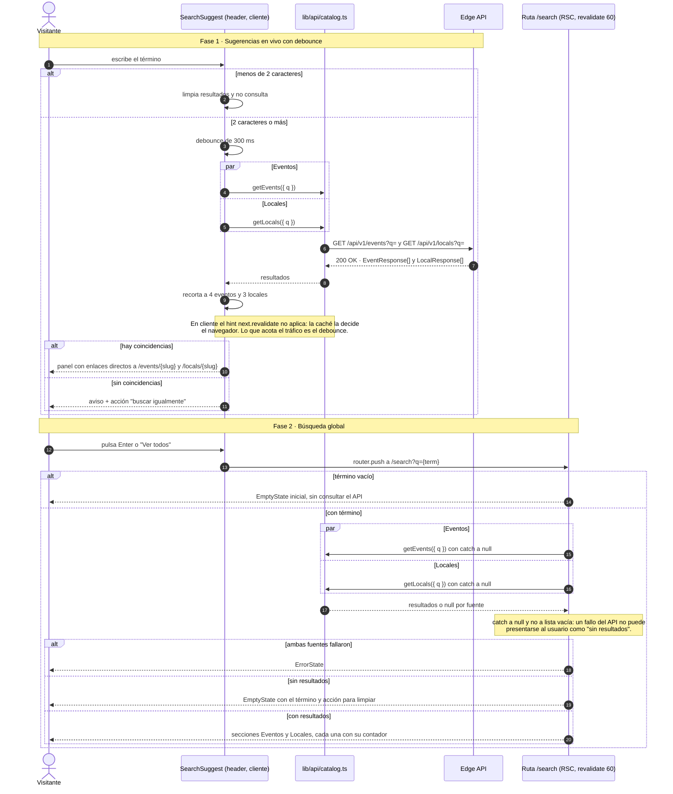

### SD-03 · Listado de locales y filtro por zona

`GET /api/v1/locals` · público · `ListLocalsUseCase`

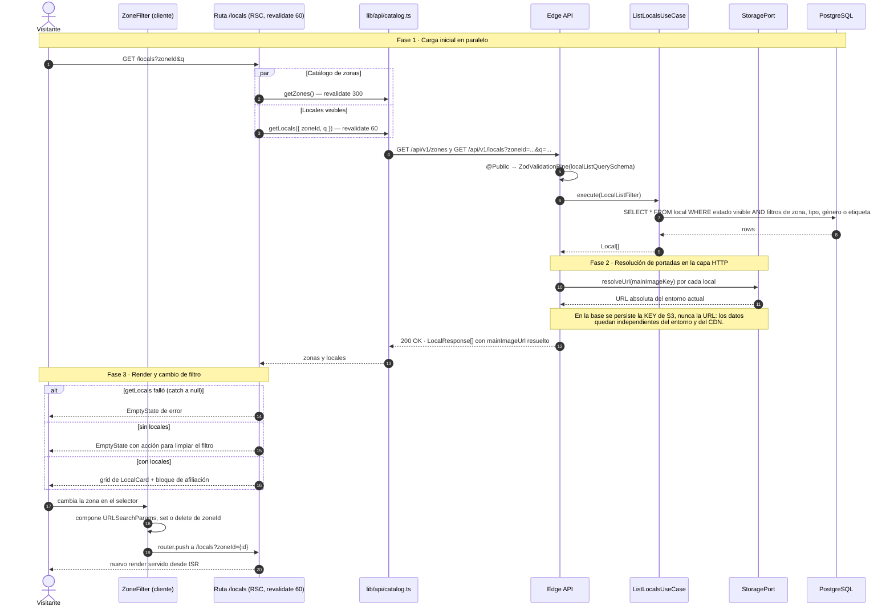

---

## 7. Bloque 2 · Fichas de detalle

### SD-04 · Detalle de evento

`GET /api/v1/events/{slug}` · público · `GetEventUseCase`

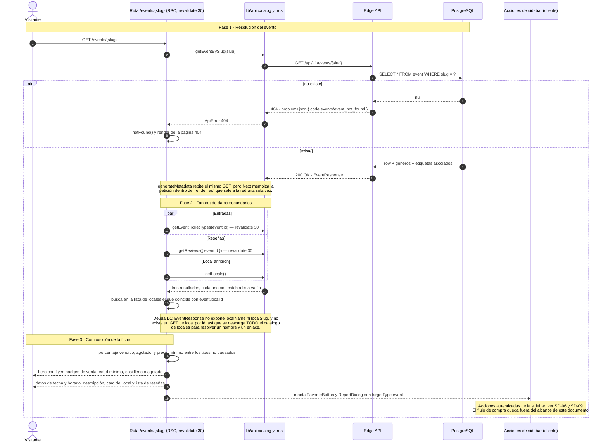

### SD-05 · Detalle de local, galería y contenido

`GET /api/v1/locals/{slug}` + `GET /api/v1/locals/{id}/images` · públicos

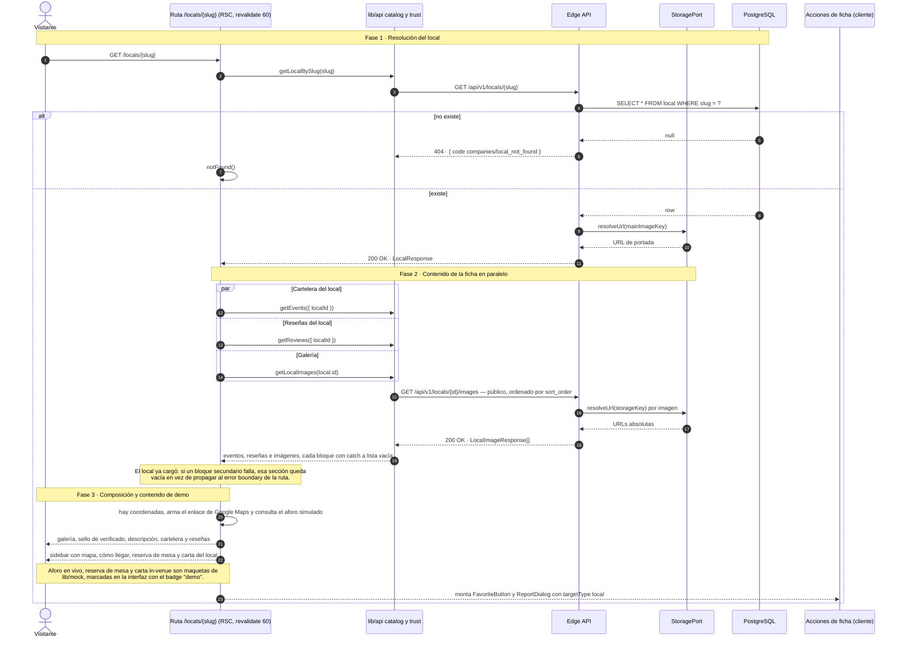

### SD-06 · Favoritos: marcar y quitar

`GET`, `POST /api/v1/me/favorites` · `DELETE /api/v1/me/favorites/{targetType}/{targetId}` · autenticado

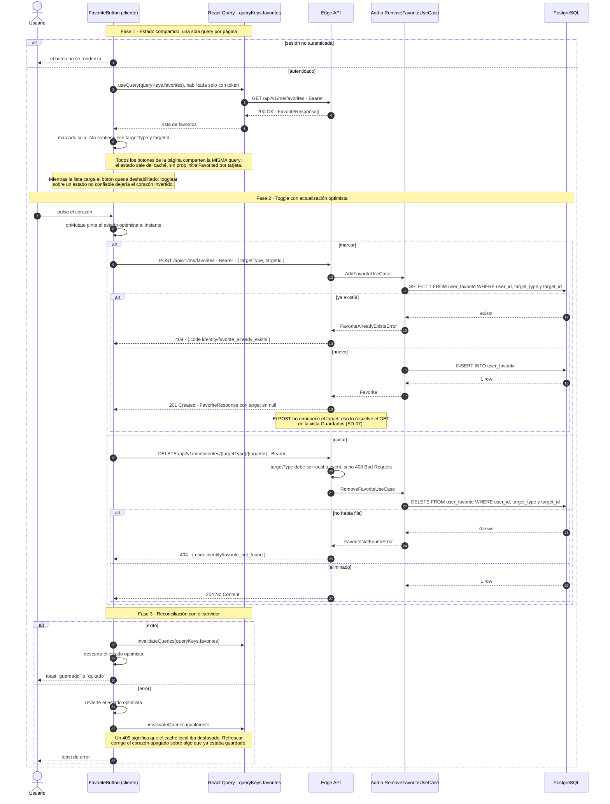

### SD-07 · Guardados: lista enriquecida

`GET /api/v1/me/favorites` · `ListEnrichedFavoritesUseCase`

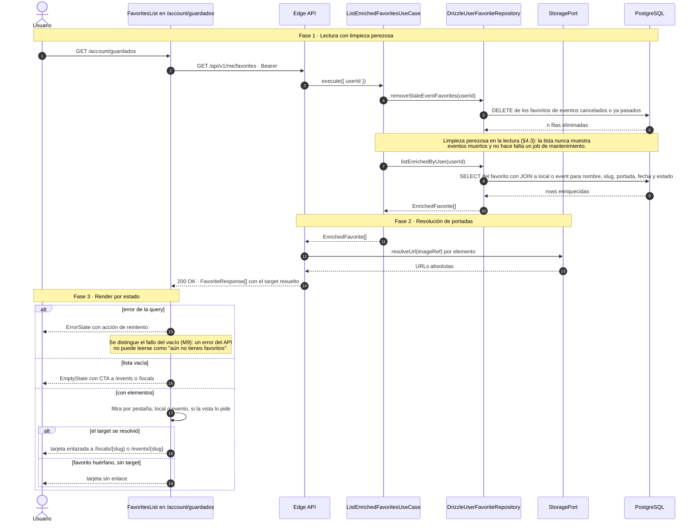

---

## 8. Bloque 3 · Confianza

### SD-08 · Reseñar una experiencia

`POST /api/v1/reviews` · **autenticado** · `CreateReviewUseCase`.
Invariante del dominio: solo reseña quien compró y **asistió** — entrada en estado `used`.

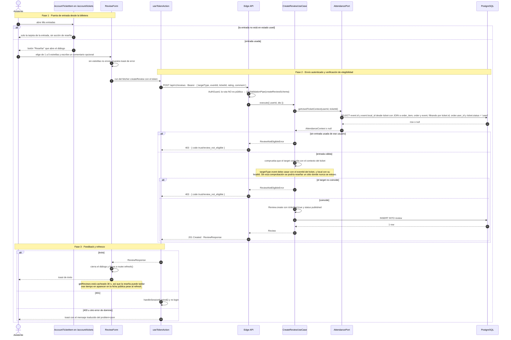

**Dónde se lee la reseña.** `ReviewList` recibe el array ya resuelto en servidor (SD-04 y SD-05),
calcula el promedio en cliente y marca con sello las reseñas `isVerified`. La lectura es pública:
`GET /api/v1/reviews?localId=` o `?eventId=`.

### SD-09 · Reportar contenido o incidente

`POST /api/v1/reports` · **autenticado** · `CreateReportUseCase`

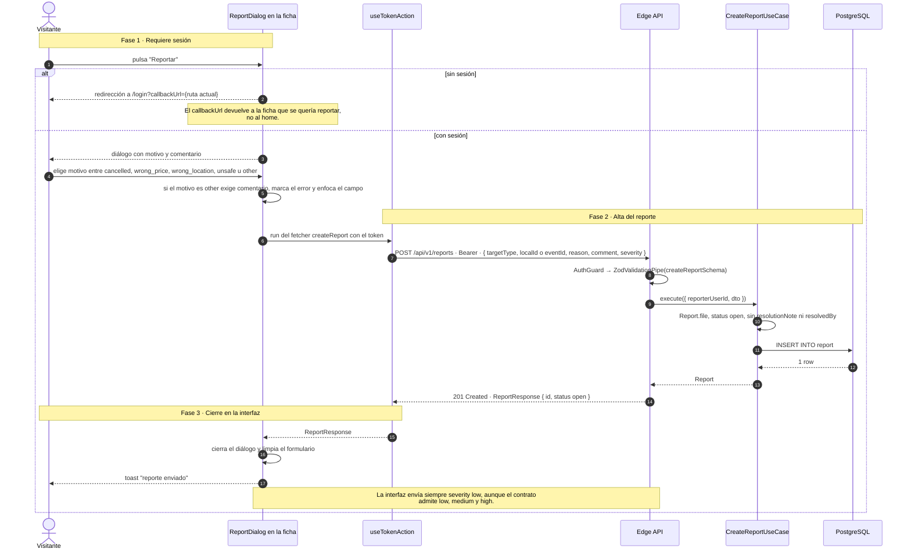

### SD-10 · Resolución del reporte

`POST /api/v1/reports/{id}/resolve` · `@Roles('admin_local')` · `ResolveReportUseCase`

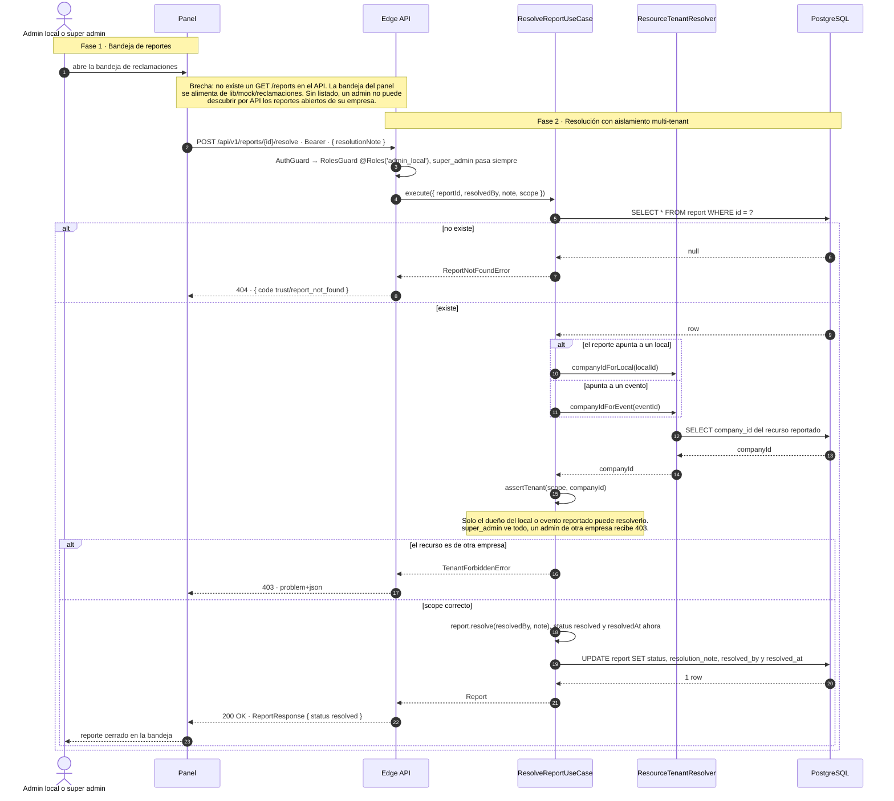

---

## 9. Trazabilidad: proceso → endpoint → código → estado

| Proceso | Endpoint(s) | Caso de uso / componente | Estado |
|---|---|---|---|
| Descubrir y filtrar eventos | `GET /events`, `GET /events/trending`, `GET /events/upcoming` | `ListEventsUseCase`, `ListTrendingEventsUseCase`, `ListUpcomingEventsUseCase` | ✅ Implementado (paginación por `limit`/`offset`) |
| Buscar | `GET /events?q=`, `GET /locals?q=` | `SearchSuggest`, ruta `/search`, `normalizeSearch` en el repositorio | ✅ Implementado |
| Taxonomía y filtros | `GET /zones`, `/music-genres`, `/tags`, `/local-types` | `ListZonesUseCase`, `ListTaxonomyUseCase` | ✅ Implementado |
| Listado de locales | `GET /locals` | `ListLocalsUseCase` | ⚠️ Sin paginación en el contrato |
| Detalle de evento | `GET /events/{slug}`, `GET /events/{id}/ticket-types` | `GetEventUseCase`, `ListTicketTypesUseCase` | ⚠️ Resuelve el local listando todo el catálogo (deuda D1) |
| Detalle de local y contenido | `GET /locals/{slug}`, `GET /locals/{id}/images` | `GetLocalUseCase`, `ListLocalImagesUseCase` | ✅ Implementado · aforo, reserva y carta son demo |
| Favoritos | `GET`/`POST /me/favorites`, `DELETE /me/favorites/{type}/{id}` | `AddFavoriteUseCase`, `RemoveFavoriteUseCase`, `ListEnrichedFavoritesUseCase` | ✅ Implementado |
| Reseñar | `POST /reviews`, `GET /reviews` | `CreateReviewUseCase`, `ListReviewsUseCase`, `AttendancePort` | ⚠️ Backend admite reseñar locales, la UI solo eventos |
| Reportar | `POST /reports` | `CreateReportUseCase` | ✅ Implementado · `severity` fijo desde la UI |
| Resolver reporte | `POST /reports/{id}/resolve` | `ResolveReportUseCase`, `ResourceTenantResolver` | ⚠️ Sin endpoint de listado, la bandeja del panel es mock |

---

## 10. Brechas y riesgos detectados al levantar los flujos

Hallazgos de la lectura del código, ordenados por impacto. No forman parte del pedido, pero
condicionan la fidelidad de los diagramas.

1. **La ficha de evento descarga todo el catálogo de locales** para mostrar un nombre y un enlace
   (deuda D1, anotada en el propio código). El coste crece linealmente con el catálogo y afecta a cada
   render ISR. *Arreglo:* embeber `localName` y `localSlug` en `EventResponse`, o exponer un `GET` de
   local por id.
2. **No existe `GET /reports`.** Un reporte se puede crear y resolver, pero no listar: la bandeja del
   panel se alimenta de `lib/mock/reclamaciones`. El ciclo de moderación no cierra por API.
3. **El listado de locales no tiene paginación.** `localListQuerySchema` no admite `limit` ni
   `offset`, a diferencia de eventos. La búsqueda global y la ficha de evento traen la lista completa.
4. **La UI solo permite reseñar eventos.** `CreateReviewUseCase` y el contrato soportan
   `targetType: 'local'`, pero `ReviewForm` fija `'event'`. Las reseñas de local existen en el modelo
   y nunca se crean desde el producto.
5. **Una reseña recién creada puede tardar hasta 30 s en verse.** `router.refresh()` re-ejecuta el
   Server Component, pero `getReviews` sigue sirviendo la entrada cacheada. *Arreglo:* `revalidateTag`
   sobre las reseñas del target al crear.
6. **`severity` siempre viaja como `low`** desde `ReportDialog`, aunque el contrato acepta
   `medium` y `high`. Un incidente de seguridad entra con la misma prioridad que un precio erróneo.
7. **El listado público ordena por `starts_at DESC`**, de modo que los eventos más lejanos aparecen
   primero. Conviene confirmar si es lo esperado para una cartelera o si debería ser ascendente por
   proximidad.
8. **Contenido de demo dentro de fichas reales**: aforo en vivo, reserva de mesa y carta in-venue son
   `lib/mock`. Van marcados con badge, pero conviene rastrearlos para no confundirlos con producto.

---

## 11. Mantenimiento

- **Fuente de verdad funcional:** `../der_class/PROJECT_SPECS.md` (§N). Toda desviación se registra
  como ADR en `docs/adr/`.
- Al cambiar un caso de uso de `events`, `companies`, `catalog`, `trust` o los favoritos de
  `identity`, actualizar el diagrama correspondiente **en el mismo PR** y revisar la tabla del §9.
- Antes de mergear, ejecutar el comando de validación de §3.6: los 12 diagramas deben renderizar.
- Los diagramas nombran casos de uso, endpoints y columnas reales a propósito: un `grep` del nombre en
  el repo debe encontrar el código. Si no lo encuentra, el diagrama está desactualizado.
