# Empresas y locales — Diagramas de secuencia y flujo de protocolo

**Serie:** [Diagramas de secuencia](./README.md) · **Dominio 3 del DER** — *Companies & Locals* (§4.1 de `PROJECT_SPECS.md`)

> **Alcance.** Seis procesos del dominio *Empresas y locales*, agrupados en seis bloques y
> representados con **14 diagramas de secuencia Mermaid** (SD-07 se desdobla en AS-IS y TO-BE) en
> formato *protocol data flow*: cada flecha
> lleva su método, ruta, código de estado y forma del payload; cada fase del pipeline va marcada con un
> banner. Reflejan el código real de `apps/api` (módulos `companies` y `uploads`) y `apps/web`
> (formulario público de afiliación, panel de local y panel de plataforma).
>
> Mismo estándar de notación que `docs/diagramas-secuencia/01-identidad-acceso.md`.
> Fecha de levantamiento: 2026-07-28 · Rama `feat/rebrand-ravenue`.

---

## 1. Índice

| # | Diagrama | Proceso cubierto |
|---|---|---|
| SD-A | [Aislamiento multi-tenant en Companies](#sd-a--aislamiento-multi-tenant-en-companies) | sub-flujo compartido |
| SD-B | [Subida de imágenes en dos pasos](#sd-b--subida-de-imágenes-en-dos-pasos) | sub-flujo compartido |
| SD-01 | [Solicitud pública de afiliación](#sd-01--solicitud-pública-de-afiliación) | Solicitud de afiliación |
| SD-02 | [Revisión y alta de empresa más local](#sd-02--revisión-y-alta-de-empresa-más-local) | Revisión de afiliación |
| SD-03 | [Administrar la propia empresa](#sd-03--administrar-la-propia-empresa) | Administrar empresa |
| SD-04 | [Gobierno de empresas por plataforma](#sd-04--gobierno-de-empresas-por-plataforma) | Administrar empresa |
| SD-05 | [Crear un local con portada](#sd-05--crear-un-local-con-portada) | Crear local |
| SD-06 | [Publicar y suspender un local](#sd-06--publicar-y-suspender-un-local) | Publicar local |
| SD-07 | [Editar un local](#sd-07--editar-un-local) — AS-IS y TO-BE | Editar local |
| SD-08 | [Subir y confirmar imágenes de la galería](#sd-08--subir-y-confirmar-imágenes-de-la-galería) | Subir imágenes |
| SD-09 | [Ordenar, marcar portada y eliminar](#sd-09--ordenar-marcar-portada-y-eliminar) | Ordenar y publicar imágenes |
| SD-10 | [Solicitar verificación de local](#sd-10--solicitar-verificación-de-local) | Solicitar verificación |
| SD-11 | [Revisar verificación y derivar isVerified](#sd-11--revisar-verificación-y-derivar-isverified) | Revisar verificación |

---

## 2. Agrupación de los procesos

Los seis procesos forman el ciclo de vida de un tenant: nace como solicitud pública, la plataforma lo
aprueba creando empresa y local, la empresa se administra a sí misma, publica locales, los ilustra y
pide el sello de verificación. Dos mecanismos transversales aparecen en casi todos los diagramas y se
extraen primero.

| Bloque | Procesos | Razón de la agrupación |
|---|---|---|
| **0 · Sub-flujos compartidos** | — | El chequeo `isSuperAdmin` más `actorCompanyId` (SD-A) gobierna todas las escrituras del módulo. La subida en dos pasos (SD-B) es la misma para portadas, galería y flyers de evento. |
| **1 · Afiliación** | Solicitud pública · Revisión y alta | Son las dos mitades del mismo trámite: una pública y sin sesión, otra de plataforma y transaccional. |
| **2 · Empresa** | Administrar empresa | Se parte en dos porque son dos actores y dos superficies: el `admin_local` sobre `/companies/me` y el `super_admin` sobre el gobierno global. |
| **3 · Local** | Crear, editar y publicar un local | Crear y publicar están implementados. Editar no existe, y merece su propio diagrama con el estado real y la propuesta. |
| **4 · Galería** | Subir, ordenar y publicar imágenes | Subir es un flujo de dos saltos con verificación server-side. Ordenar, marcar portada y eliminar comparten repositorio y sincronización con `main_image_key`. |
| **5 · Verificación** | Solicitar y revisar verificación | La solicitud la hace el tenant, la revisión la plataforma, y el desenlace deriva un campo del local. |

---

## 3. Convenciones de notación

Estándar de la serie. La fuente canónica es `.claude/skills/sincronizar-diagramas-secuencia/references/notacion.md`.

### 3.1 Estructura

1. **`autonumber` siempre.** Permite referenciar un paso concreto en revisiones ("falla en el paso 7").
2. **Un diagrama = un caso de uso.** Si un flujo supera ~40 mensajes o los 8 participantes, se parte y
   se referencia con una nota (`note over X: ver SD-A`).
3. **Máximo 8 participantes.** Por encima, el diagrama deja de leerse en pantalla.
4. **Declaración explícita de participantes al inicio**, en orden de aparición izquierda → derecha
   (usuario → cliente → borde → aplicación → dominio → infraestructura). Nunca declarar por primera
   vez a mitad del diagrama: el orden visual se desordena.
5. **`actor` para personas, `participant` para sistemas.** Alias corto en mayúsculas (`UC`, `DB`),
   etiqueta legible con `as`.

### 3.2 Flujo de protocolo

Regla central de este documento: **el diagrama debe poder contrastarse contra el tráfico real.**

6. **Toda petición lleva su respuesta.** Ninguna flecha `->>` de red se queda sin su `-->>` con código
   de estado y forma del payload. Si no hay respuesta, es un `-)` (asíncrono) y se dice por qué.
7. **Anotación de protocolo en la ida:** `MÉTODO /ruta · cabecera o cuerpo relevante`.
   Ejemplo: `GET /api/v1/{recurso}/{id} · Authorization Bearer {accessToken}`.
8. **Anotación de resultado en la vuelta:** `código · payload`.
   Ejemplo: `409 · problem+json { code: {contexto}/{error} }`.
9. **Infraestructura con su comando real**, no con una paráfrasis: `INSERT INTO local`, `HEAD del objeto`,
   `copyObject`. Hace el diagrama auditable
   contra los adapters Drizzle y Redis.
10. **Placeholders entre llaves**, nunca entre `<` `>` (Mermaid los interpreta como HTML): `{localId}`.

### 3.3 Fases

11. **Banners de fase** con `note over A, B: Fase N · Nombre (componente real)`, abarcando los
    participantes implicados en ese tramo. Convierten un muro de flechas en un flujo legible por
    etapas y hacen explícito qué componente gobierna cada una.
12. **Notas de invariante** (`note over X:`) reservadas para reglas de seguridad, decisiones de diseño
    y brechas conocidas. Nunca para narrar lo que la flecha ya dice.
13. Saltos de línea en notas con `<br/>` para no ensanchar el diagrama.

### 3.4 Arrows y bloques de control

| Notación | Significado |
|---|---|
| `->>` | Llamada síncrona: el emisor espera respuesta |
| `-->>` | Respuesta o retorno, con código de estado |
| `-)` | Asíncrono fire-and-forget: publicación de evento, encolado |
| `X->>X` | Cómputo interno que cambia estado o toma una decisión (hash, firma, validación) |

| Bloque | Uso |
|---|---|
| `alt` / `else` | Caminos mutuamente excluyentes (éxito vs. error de negocio) |
| `opt` | Tramo que puede no ejecutarse y no tiene alternativa |
| `critical` | Transacción atómica (`UnitOfWork`): si algo falla, nada se persiste |
| `par` / `and` | Señales concurrentes e independientes |
| `loop` | Repetición acotada (reintentos, generación de código único) |

### 3.5 Cierre

14. **Cada diagrama termina en el efecto observable**: lo que ve el usuario, la cookie fijada o el
    documento devuelto. Un diagrama que acaba en una llamada interna está incompleto.

### 3.6 Higiene sintáctica

15. **Nada de `;` dentro de un mensaje o una nota.** Mermaid corta la sentencia ahí y el diagrama deja
    de compilar. Usar coma o punto.
16. Nada de `<` `>` sin escapar, incluidas las flechas de función de JavaScript (ver regla 10).
17. Los nombres de casos de uso, guards, endpoints y claves de Redis se copian **tal cual del código**:
    un `grep` del nombre debe encontrar el fuente.
18. **Los diagramas TO-BE nombran componentes que no existen todavía** y lo señalan en el propio participante o en una nota. Los AS-IS nombran archivos reales.

### 3.7 Validación

```bash
npx -y @mermaid-js/mermaid-cli@11 \
  -i docs/diagramas-secuencia/03-empresas-locales.md \
  -o /tmp/03-empresas-locales.md
```

También sirven mermaid.live y la extensión *Markdown Preview Mermaid Support* de VS Code. GitHub
renderiza estos bloques de forma nativa.

---

## 4. Catálogo de participantes

| Alias | Componente real | Archivo |
|---|---|---|
| `U` | Persona solicitante, administradora de local o de plataforma | — |
| `W` | Componente cliente de Next.js | `apps/web/components/**` |
| `EDGE` | Pipeline global del API: `RateLimit → Auth → Roles` + `ZodValidationPipe` | `apps/api/src/edge/**` |
| `UC` | Caso de uso (capa aplicación) | `apps/api/src/modules/companies/application/use-cases/**` |
| `CREP` | `CompanyRepository` (adapter Drizzle) | `.../companies/infrastructure/persistence/drizzle-company.repository.ts` |
| `LREP` | `LocalRepository` | `.../drizzle-local.repository.ts` |
| `IREP` | `LocalImageRepository` | `.../drizzle-local-image.repository.ts` |
| `VREP` | `LocalVerificationRepository` | `.../drizzle-local-verification.repository.ts` |
| `ST` | `StoragePort` sobre S3 compatible | `apps/api/src/shared/adapters/storage/**` |
| `S3` | Bucket de objetos (LocalStack en desarrollo) | — |
| `BUS` | `EventBus` in-process | `apps/api/src/shared/event-bus/event-bus.ts` |
| `DB` | PostgreSQL vía Drizzle | `packages/db/src/schema/companies.ts` |

### Estados del dominio

| Aggregate | Estados | Transición |
|---|---|---|
| `AffiliationRequest` | `pending` → `approved` \| `rejected` | Una sola vez: revisar dos veces devuelve 409 |
| `Company` | `active` ⇄ `suspended` | `super_admin` suspende y activa |
| `Local` | `draft` → `active` → `suspended` | `publish()` y `suspend(reason)` |
| `LocalVerification` | `pending` → `approved` \| `observed` \| `expired` | Solo `approved` marca el local como verificado |

---

## 5. Bloque 0 · Sub-flujos compartidos

### SD-A · Aislamiento multi-tenant en Companies

Toda escritura del módulo comprueba lo mismo: quien no es `super_admin` solo opera sobre recursos de
su propia empresa.

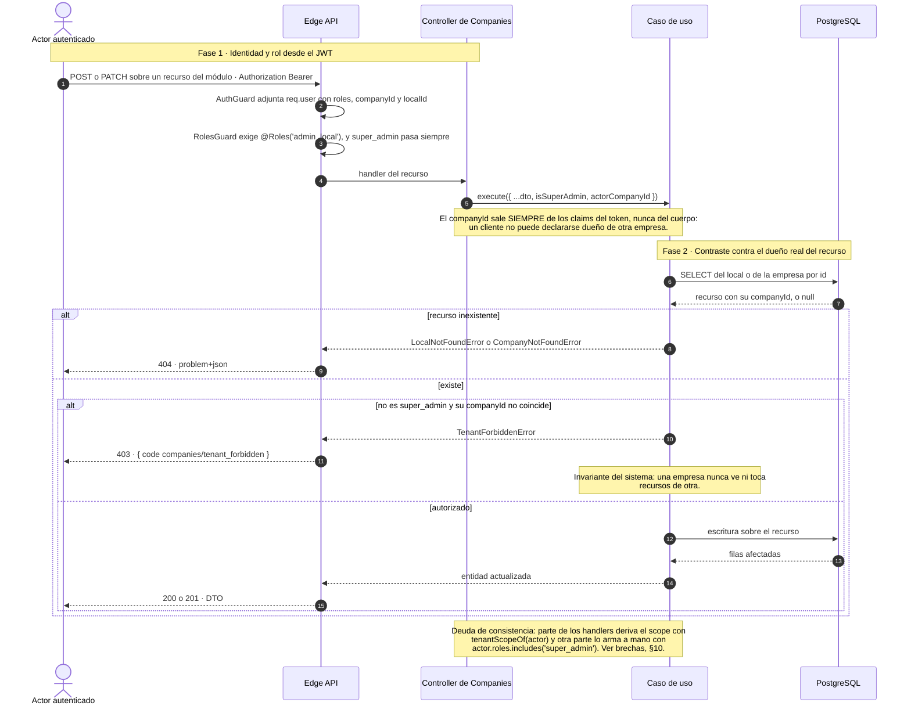
```mermaid
sequenceDiagram
    autonumber
    actor U as Actor autenticado
    participant EDGE as Edge API
    participant CTL as Controller de Companies
    participant UC as Caso de uso
    participant DB as PostgreSQL

    note over U, CTL: Fase 1 · Identidad y rol desde el JWT
    U->>EDGE: POST o PATCH sobre un recurso del módulo · Authorization Bearer
    EDGE->>EDGE: AuthGuard adjunta req.user con roles, companyId y localId
    EDGE->>EDGE: RolesGuard exige @Roles('admin_local'), y super_admin pasa siempre
    EDGE->>CTL: handler del recurso
    CTL->>UC: execute({ ...dto, isSuperAdmin, actorCompanyId })
    note over CTL, UC: El companyId sale SIEMPRE de los claims del token, nunca del cuerpo:<br/>un cliente no puede declararse dueño de otra empresa.

    note over UC, DB: Fase 2 · Contraste contra el dueño real del recurso
    UC->>DB: SELECT del local o de la empresa por id
    DB-->>UC: recurso con su companyId, o null
    alt recurso inexistente
        UC-->>EDGE: LocalNotFoundError o CompanyNotFoundError
        EDGE-->>U: 404 · problem+json
    else existe
        alt no es super_admin y su companyId no coincide
            UC-->>EDGE: TenantForbiddenError
            EDGE-->>U: 403 · { code companies/tenant_forbidden }
            note over UC: Invariante del sistema: una empresa nunca ve ni toca<br/>recursos de otra.
        else autorizado
            UC->>DB: escritura sobre el recurso
            DB-->>UC: filas afectadas
            UC-->>EDGE: entidad actualizada
            EDGE-->>U: 200 o 201 · DTO
        end
    end
    note over CTL, UC: Deuda de consistencia: parte de los handlers deriva el scope con<br/>tenantScopeOf(actor) y otra parte lo arma a mano con<br/>actor.roles.includes('super_admin'). Ver brechas, §10.
```

### SD-B · Subida de imágenes en dos pasos

`POST /api/v1/uploads/presign` firma sobre staging. El módulo dueño confirma, verifica y promueve.
Mismo mecanismo para portada de local, galería y flyer de evento.

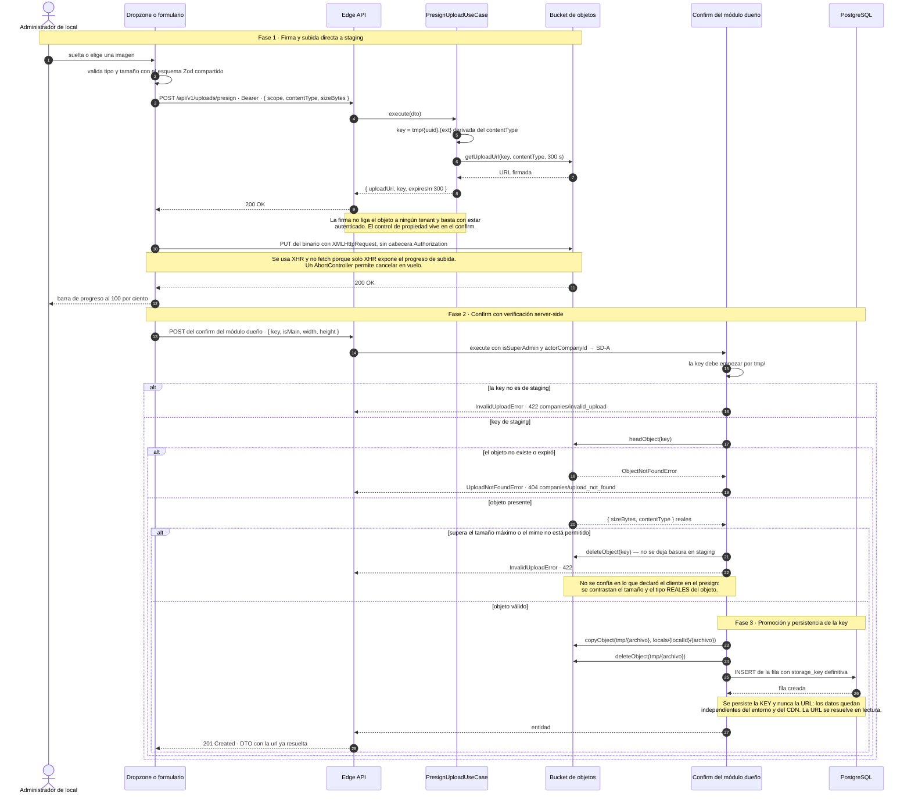
```mermaid
sequenceDiagram
    autonumber
    actor U as Administrador de local
    participant W as Dropzone o formulario
    participant EDGE as Edge API
    participant PU as PresignUploadUseCase
    participant S3 as Bucket de objetos
    participant UC as Confirm del módulo dueño
    participant DB as PostgreSQL

    note over U, S3: Fase 1 · Firma y subida directa a staging
    U->>W: suelta o elige una imagen
    W->>W: valida tipo y tamaño con el esquema Zod compartido
    W->>EDGE: POST /api/v1/uploads/presign · Bearer · { scope, contentType, sizeBytes }
    EDGE->>PU: execute(dto)
    PU->>PU: key = tmp/{uuid}.{ext} derivada del contentType
    PU->>S3: getUploadUrl(key, contentType, 300 s)
    S3-->>PU: URL firmada
    PU-->>EDGE: { uploadUrl, key, expiresIn 300 }
    EDGE-->>W: 200 OK
    note over EDGE, PU: La firma no liga el objeto a ningún tenant y basta con estar<br/>autenticado. El control de propiedad vive en el confirm.
    W->>S3: PUT del binario con XMLHttpRequest, sin cabecera Authorization
    note over W, S3: Se usa XHR y no fetch porque solo XHR expone el progreso de subida.<br/>Un AbortController permite cancelar en vuelo.
    S3-->>W: 200 OK
    W-->>U: barra de progreso al 100 por ciento

    note over W, DB: Fase 2 · Confirm con verificación server-side
    W->>EDGE: POST del confirm del módulo dueño · { key, isMain, width, height }
    EDGE->>UC: execute con isSuperAdmin y actorCompanyId → SD-A
    UC->>UC: la key debe empezar por tmp/
    alt la key no es de staging
        UC-->>EDGE: InvalidUploadError · 422 companies/invalid_upload
    else key de staging
        UC->>S3: headObject(key)
        alt el objeto no existe o expiró
            S3-->>UC: ObjectNotFoundError
            UC-->>EDGE: UploadNotFoundError · 404 companies/upload_not_found
        else objeto presente
            S3-->>UC: { sizeBytes, contentType } reales
            alt supera el tamaño máximo o el mime no está permitido
                UC->>S3: deleteObject(key) — no se deja basura en staging
                UC-->>EDGE: InvalidUploadError · 422
                note over UC, S3: No se confía en lo que declaró el cliente en el presign:<br/>se contrastan el tamaño y el tipo REALES del objeto.
            else objeto válido

                note over UC, DB: Fase 3 · Promoción y persistencia de la key
                UC->>S3: copyObject(tmp/{archivo}, locals/{localId}/{archivo})
                UC->>S3: deleteObject(tmp/{archivo})
                UC->>DB: INSERT de la fila con storage_key definitiva
                DB-->>UC: fila creada
                note over UC, DB: Se persiste la KEY y nunca la URL: los datos quedan<br/>independientes del entorno y del CDN. La URL se resuelve en lectura.
                UC-->>EDGE: entidad
                EDGE-->>W: 201 Created · DTO con la url ya resuelta
            end
        end
    end
```

---

## 6. Bloque 1 · Afiliación

### SD-01 · Solicitud pública de afiliación

`POST /api/v1/affiliation-requests` · `@Public()` · `SubmitAffiliationUseCase`

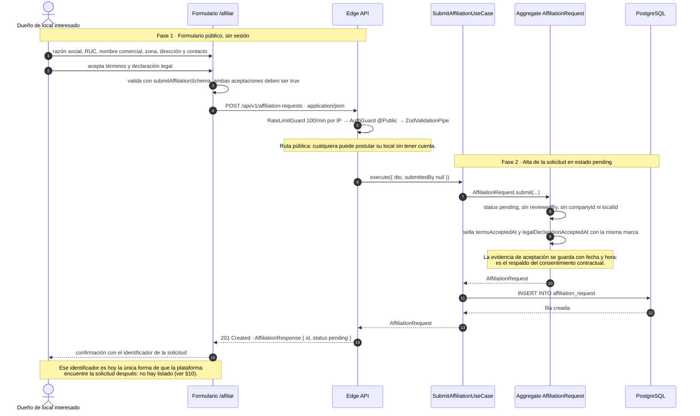
```mermaid
sequenceDiagram
    autonumber
    actor U as Dueño de local interesado
    participant W as Formulario /afiliar
    participant EDGE as Edge API
    participant UC as SubmitAffiliationUseCase
    participant DOM as Aggregate AffiliationRequest
    participant DB as PostgreSQL

    note over U, EDGE: Fase 1 · Formulario público, sin sesión
    U->>W: razón social, RUC, nombre comercial, zona, dirección y contacto
    U->>W: acepta términos y declaración legal
    W->>W: valida con submitAffiliationSchema, ambas aceptaciones deben ser true
    W->>EDGE: POST /api/v1/affiliation-requests · application/json
    EDGE->>EDGE: RateLimitGuard 100/min por IP → AuthGuard @Public → ZodValidationPipe
    note over EDGE: Ruta pública: cualquiera puede postular su local sin tener cuenta.

    note over UC, DB: Fase 2 · Alta de la solicitud en estado pending
    EDGE->>UC: execute({ dto, submittedBy null })
    UC->>DOM: AffiliationRequest.submit(...)
    DOM->>DOM: status pending, sin reviewedBy, sin companyId ni localId
    DOM->>DOM: sella termsAcceptedAt y legalDeclarationAcceptedAt con la misma marca
    note over DOM: La evidencia de aceptación se guarda con fecha y hora:<br/>es el respaldo del consentimiento contractual.
    DOM-->>UC: AffiliationRequest
    UC->>DB: INSERT INTO affiliation_request
    DB-->>UC: fila creada
    UC-->>EDGE: AffiliationRequest
    EDGE-->>W: 201 Created · AffiliationResponse { id, status pending }
    W-->>U: confirmación con el identificador de la solicitud
    note over W, U: Ese identificador es hoy la única forma de que la plataforma<br/>encuentre la solicitud después: no hay listado (ver §10).
```

### SD-02 · Revisión y alta de empresa más local

`POST /api/v1/affiliation-requests/{id}/review` · `@Roles('super_admin')` · `ReviewAffiliationUseCase`

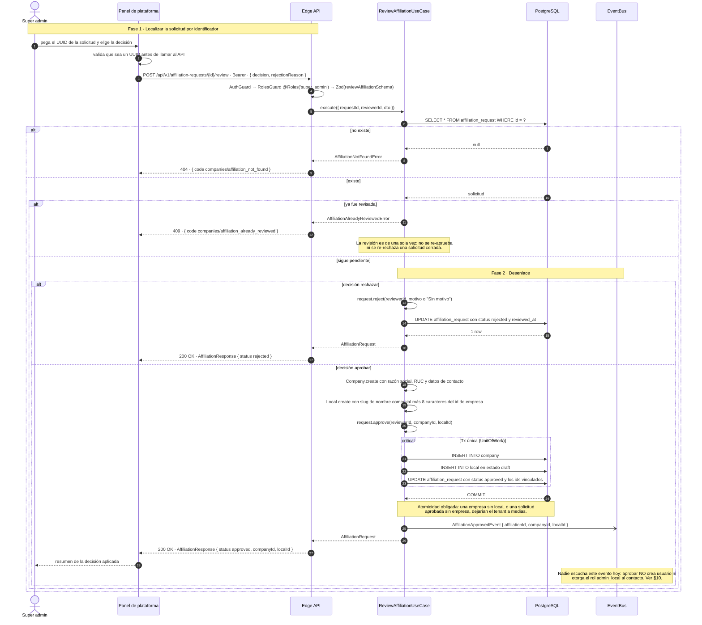
```mermaid
sequenceDiagram
    autonumber
    actor SA as Super admin
    participant W as Panel de plataforma
    participant EDGE as Edge API
    participant UC as ReviewAffiliationUseCase
    participant DB as PostgreSQL
    participant BUS as EventBus

    note over SA, EDGE: Fase 1 · Localizar la solicitud por identificador
    SA->>W: pega el UUID de la solicitud y elige la decisión
    W->>W: valida que sea un UUID antes de llamar al API
    W->>EDGE: POST /api/v1/affiliation-requests/{id}/review · Bearer · { decision, rejectionReason }
    EDGE->>EDGE: AuthGuard → RolesGuard @Roles('super_admin') → Zod(reviewAffiliationSchema)
    EDGE->>UC: execute({ requestId, reviewerId, dto })
    UC->>DB: SELECT * FROM affiliation_request WHERE id = ?
    alt no existe
        DB-->>UC: null
        UC-->>EDGE: AffiliationNotFoundError
        EDGE-->>W: 404 · { code companies/affiliation_not_found }
    else existe
        DB-->>UC: solicitud
        alt ya fue revisada
            UC-->>EDGE: AffiliationAlreadyReviewedError
            EDGE-->>W: 409 · { code companies/affiliation_already_reviewed }
            note over UC: La revisión es de una sola vez: no se re-aprueba<br/>ni se re-rechaza una solicitud cerrada.
        else sigue pendiente

            note over UC, BUS: Fase 2 · Desenlace
            alt decisión rechazar
                UC->>UC: request.reject(reviewerId, motivo o "Sin motivo")
                UC->>DB: UPDATE affiliation_request con status rejected y reviewed_at
                DB-->>UC: 1 row
                UC-->>EDGE: AffiliationRequest
                EDGE-->>W: 200 OK · AffiliationResponse { status rejected }
            else decisión aprobar
                UC->>UC: Company.create con razón social, RUC y datos de contacto
                UC->>UC: Local.create con slug de nombre comercial más 8 caracteres del id de empresa
                UC->>UC: request.approve(reviewerId, companyId, localId)
                critical Tx única (UnitOfWork)
                    UC->>DB: INSERT INTO company
                    UC->>DB: INSERT INTO local en estado draft
                    UC->>DB: UPDATE affiliation_request con status approved y los ids vinculados
                end
                DB-->>UC: COMMIT
                note over UC, DB: Atomicidad obligada: una empresa sin local, o una solicitud<br/>aprobada sin empresa, dejarían el tenant a medias.
                UC-)BUS: AffiliationApprovedEvent { affiliationId, companyId, localId }
                UC-->>EDGE: AffiliationRequest
                EDGE-->>W: 200 OK · AffiliationResponse { status approved, companyId, localId }
                W-->>SA: resumen de la decisión aplicada
                note over BUS: Nadie escucha este evento hoy: aprobar NO crea usuario ni<br/>otorga el rol admin_local al contacto. Ver §10.
            end
        end
    end
```

---

## 7. Bloque 2 · Administrar empresa

### SD-03 · Administrar la propia empresa

`GET` y `PUT /api/v1/companies/me` · `@Roles('admin_local')`

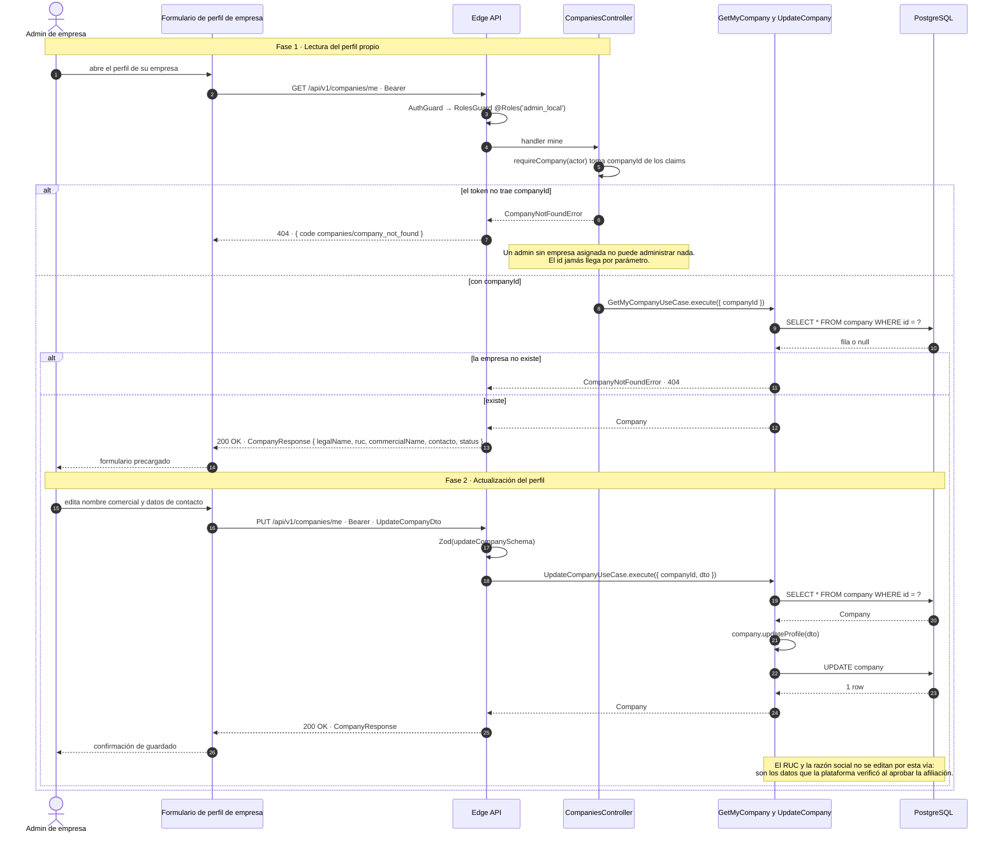
```mermaid
sequenceDiagram
    autonumber
    actor AD as Admin de empresa
    participant W as Formulario de perfil de empresa
    participant EDGE as Edge API
    participant CTL as CompaniesController
    participant UC as GetMyCompany y UpdateCompany
    participant DB as PostgreSQL

    note over AD, CTL: Fase 1 · Lectura del perfil propio
    AD->>W: abre el perfil de su empresa
    W->>EDGE: GET /api/v1/companies/me · Bearer
    EDGE->>EDGE: AuthGuard → RolesGuard @Roles('admin_local')
    EDGE->>CTL: handler mine
    CTL->>CTL: requireCompany(actor) toma companyId de los claims
    alt el token no trae companyId
        CTL-->>EDGE: CompanyNotFoundError
        EDGE-->>W: 404 · { code companies/company_not_found }
        note over CTL: Un admin sin empresa asignada no puede administrar nada.<br/>El id jamás llega por parámetro.
    else con companyId
        CTL->>UC: GetMyCompanyUseCase.execute({ companyId })
        UC->>DB: SELECT * FROM company WHERE id = ?
        DB-->>UC: fila o null
        alt la empresa no existe
            UC-->>EDGE: CompanyNotFoundError · 404
        else existe
            UC-->>EDGE: Company
            EDGE-->>W: 200 OK · CompanyResponse { legalName, ruc, commercialName, contacto, status }
            W-->>AD: formulario precargado

            note over AD, DB: Fase 2 · Actualización del perfil
            AD->>W: edita nombre comercial y datos de contacto
            W->>EDGE: PUT /api/v1/companies/me · Bearer · UpdateCompanyDto
            EDGE->>EDGE: Zod(updateCompanySchema)
            EDGE->>UC: UpdateCompanyUseCase.execute({ companyId, dto })
            UC->>DB: SELECT * FROM company WHERE id = ?
            DB-->>UC: Company
            UC->>UC: company.updateProfile(dto)
            UC->>DB: UPDATE company
            DB-->>UC: 1 row
            UC-->>EDGE: Company
            EDGE-->>W: 200 OK · CompanyResponse
            W-->>AD: confirmación de guardado
            note over UC, DB: El RUC y la razón social no se editan por esta vía:<br/>son los datos que la plataforma verificó al aprobar la afiliación.
        end
    end
```

### SD-04 · Gobierno de empresas por plataforma

`GET /api/v1/companies`, `POST /{id}/suspend`, `POST /{id}/activate` · `@Roles('super_admin')`

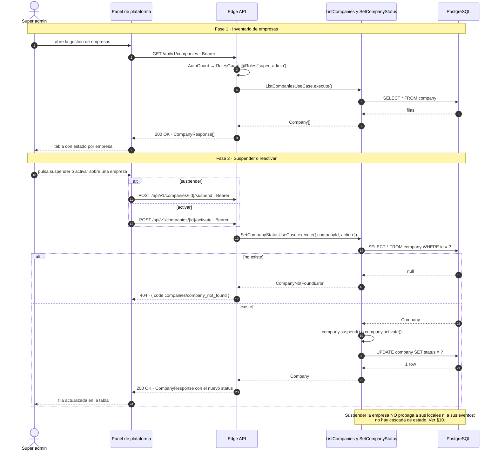
```mermaid
sequenceDiagram
    autonumber
    actor SA as Super admin
    participant W as Panel de plataforma
    participant EDGE as Edge API
    participant UC as ListCompanies y SetCompanyStatus
    participant DB as PostgreSQL

    note over SA, DB: Fase 1 · Inventario de empresas
    SA->>W: abre la gestión de empresas
    W->>EDGE: GET /api/v1/companies · Bearer
    EDGE->>EDGE: AuthGuard → RolesGuard @Roles('super_admin')
    EDGE->>UC: ListCompaniesUseCase.execute()
    UC->>DB: SELECT * FROM company
    DB-->>UC: filas
    UC-->>EDGE: Company[]
    EDGE-->>W: 200 OK · CompanyResponse[]
    W-->>SA: tabla con estado por empresa

    note over SA, DB: Fase 2 · Suspender o reactivar
    SA->>W: pulsa suspender o activar sobre una empresa
    alt suspender
        W->>EDGE: POST /api/v1/companies/{id}/suspend · Bearer
    else activar
        W->>EDGE: POST /api/v1/companies/{id}/activate · Bearer
    end
    EDGE->>UC: SetCompanyStatusUseCase.execute({ companyId, action })
    UC->>DB: SELECT * FROM company WHERE id = ?
    alt no existe
        DB-->>UC: null
        UC-->>EDGE: CompanyNotFoundError
        EDGE-->>W: 404 · { code companies/company_not_found }
    else existe
        DB-->>UC: Company
        UC->>UC: company.suspend() o company.activate()
        UC->>DB: UPDATE company SET status = ?
        DB-->>UC: 1 row
        UC-->>EDGE: Company
        EDGE-->>W: 200 OK · CompanyResponse con el nuevo status
        W-->>SA: fila actualizada en la tabla
    end
    note over UC, DB: Suspender la empresa NO propaga a sus locales ni a sus eventos:<br/>no hay cascada de estado. Ver §10.
```

---

## 8. Bloque 3 · Ciclo de vida del local

### SD-05 · Crear un local con portada

`POST /api/v1/locals` · `@Roles('admin_local')` · `CreateLocalUseCase`

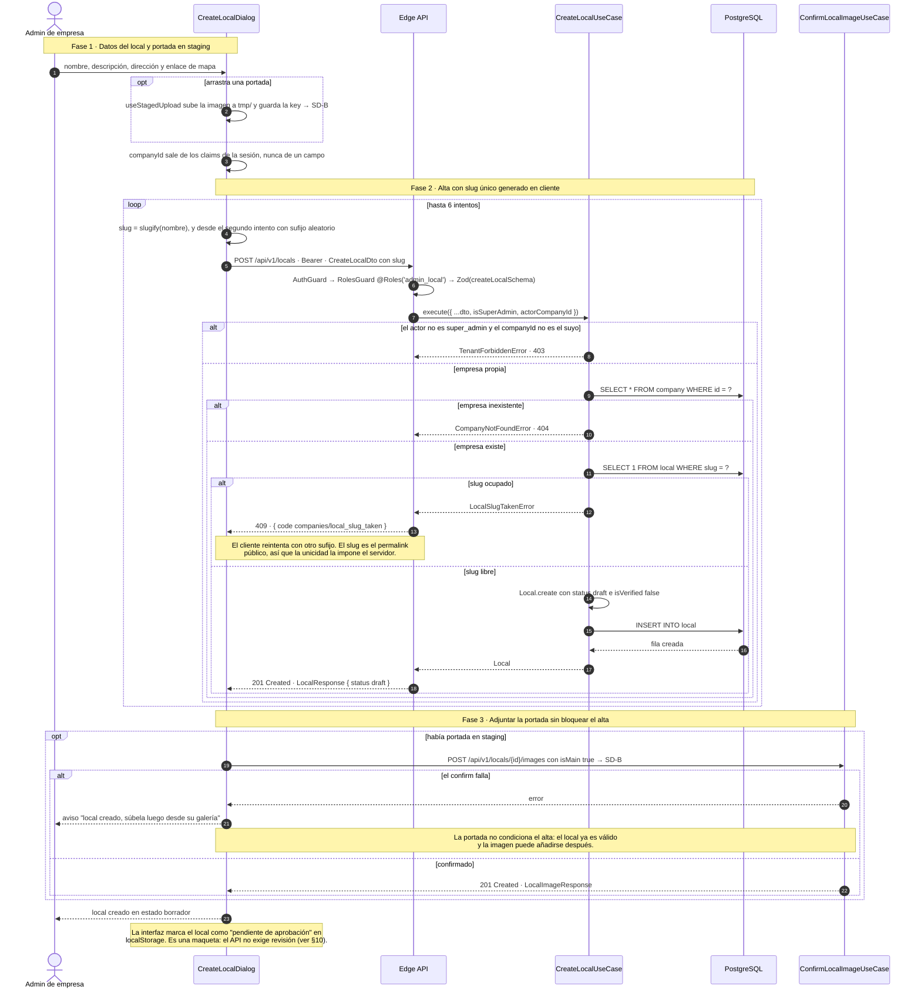
```mermaid
sequenceDiagram
    autonumber
    actor AD as Admin de empresa
    participant W as CreateLocalDialog
    participant EDGE as Edge API
    participant UC as CreateLocalUseCase
    participant DB as PostgreSQL
    participant CONF as ConfirmLocalImageUseCase

    note over AD, W: Fase 1 · Datos del local y portada en staging
    AD->>W: nombre, descripción, dirección y enlace de mapa
    opt arrastra una portada
        W->>W: useStagedUpload sube la imagen a tmp/ y guarda la key → SD-B
    end
    W->>W: companyId sale de los claims de la sesión, nunca de un campo

    note over W, DB: Fase 2 · Alta con slug único generado en cliente
    loop hasta 6 intentos
        W->>W: slug = slugify(nombre), y desde el segundo intento con sufijo aleatorio
        W->>EDGE: POST /api/v1/locals · Bearer · CreateLocalDto con slug
        EDGE->>EDGE: AuthGuard → RolesGuard @Roles('admin_local') → Zod(createLocalSchema)
        EDGE->>UC: execute({ ...dto, isSuperAdmin, actorCompanyId })
        alt el actor no es super_admin y el companyId no es el suyo
            UC-->>EDGE: TenantForbiddenError · 403
        else empresa propia
            UC->>DB: SELECT * FROM company WHERE id = ?
            alt empresa inexistente
                UC-->>EDGE: CompanyNotFoundError · 404
            else empresa existe
                UC->>DB: SELECT 1 FROM local WHERE slug = ?
                alt slug ocupado
                    UC-->>EDGE: LocalSlugTakenError
                    EDGE-->>W: 409 · { code companies/local_slug_taken }
                    note over W, EDGE: El cliente reintenta con otro sufijo. El slug es el permalink<br/>público, así que la unicidad la impone el servidor.
                else slug libre
                    UC->>UC: Local.create con status draft e isVerified false
                    UC->>DB: INSERT INTO local
                    DB-->>UC: fila creada
                    UC-->>EDGE: Local
                    EDGE-->>W: 201 Created · LocalResponse { status draft }
                end
            end
        end
    end

    note over W, CONF: Fase 3 · Adjuntar la portada sin bloquear el alta
    opt había portada en staging
        W->>CONF: POST /api/v1/locals/{id}/images con isMain true → SD-B
        alt el confirm falla
            CONF-->>W: error
            W-->>AD: aviso "local creado, súbela luego desde su galería"
            note over W, CONF: La portada no condiciona el alta: el local ya es válido<br/>y la imagen puede añadirse después.
        else confirmado
            CONF-->>W: 201 Created · LocalImageResponse
        end
    end
    W-->>AD: local creado en estado borrador
    note over W: La interfaz marca el local como "pendiente de aprobación" en<br/>localStorage. Es una maqueta: el API no exige revisión (ver §10).
```

### SD-06 · Publicar y suspender un local

`POST /api/v1/locals/{id}/publish` y `POST /api/v1/locals/{id}/suspend`

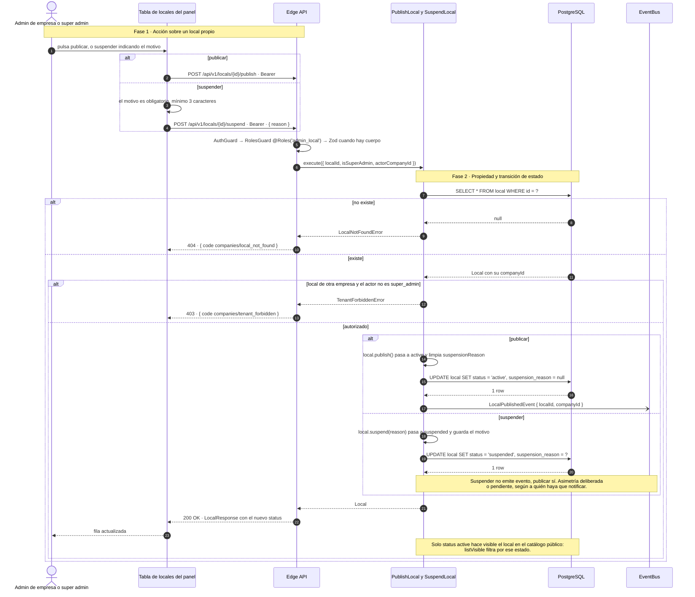
```mermaid
sequenceDiagram
    autonumber
    actor AD as Admin de empresa o super admin
    participant W as Tabla de locales del panel
    participant EDGE as Edge API
    participant UC as PublishLocal y SuspendLocal
    participant DB as PostgreSQL
    participant BUS as EventBus

    note over AD, EDGE: Fase 1 · Acción sobre un local propio
    AD->>W: pulsa publicar, o suspender indicando el motivo
    alt publicar
        W->>EDGE: POST /api/v1/locals/{id}/publish · Bearer
    else suspender
        W->>W: el motivo es obligatorio, mínimo 3 caracteres
        W->>EDGE: POST /api/v1/locals/{id}/suspend · Bearer · { reason }
    end
    EDGE->>EDGE: AuthGuard → RolesGuard @Roles('admin_local') → Zod cuando hay cuerpo
    EDGE->>UC: execute({ localId, isSuperAdmin, actorCompanyId })

    note over UC, DB: Fase 2 · Propiedad y transición de estado
    UC->>DB: SELECT * FROM local WHERE id = ?
    alt no existe
        DB-->>UC: null
        UC-->>EDGE: LocalNotFoundError
        EDGE-->>W: 404 · { code companies/local_not_found }
    else existe
        DB-->>UC: Local con su companyId
        alt local de otra empresa y el actor no es super_admin
            UC-->>EDGE: TenantForbiddenError
            EDGE-->>W: 403 · { code companies/tenant_forbidden }
        else autorizado
            alt publicar
                UC->>UC: local.publish() pasa a active y limpia suspensionReason
                UC->>DB: UPDATE local SET status = 'active', suspension_reason = null
                DB-->>UC: 1 row
                UC-)BUS: LocalPublishedEvent { localId, companyId }
            else suspender
                UC->>UC: local.suspend(reason) pasa a suspended y guarda el motivo
                UC->>DB: UPDATE local SET status = 'suspended', suspension_reason = ?
                DB-->>UC: 1 row
                note over UC, BUS: Suspender no emite evento, publicar sí. Asimetría deliberada<br/>o pendiente, según a quién haya que notificar.
            end
            UC-->>EDGE: Local
            EDGE-->>W: 200 OK · LocalResponse con el nuevo status
            W-->>AD: fila actualizada
            note over UC, DB: Solo status active hace visible el local en el catálogo público:<br/>listVisible filtra por ese estado.
        end
    end
```

### SD-07 · Editar un local

#### SD-07a · Estado actual (AS-IS)

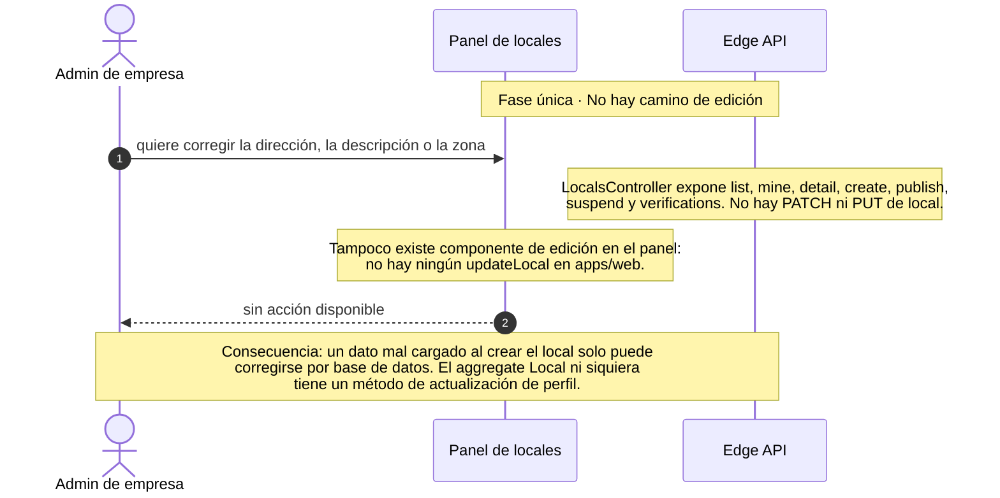
```mermaid
sequenceDiagram
    autonumber
    actor AD as Admin de empresa
    participant W as Panel de locales
    participant EDGE as Edge API

    note over W, EDGE: Fase única · No hay camino de edición
    AD->>W: quiere corregir la dirección, la descripción o la zona
    note over EDGE: LocalsController expone list, mine, detail, create, publish,<br/>suspend y verifications. No hay PATCH ni PUT de local.
    note over W: Tampoco existe componente de edición en el panel:<br/>no hay ningún updateLocal en apps/web.
    W-->>AD: sin acción disponible
    note over AD, EDGE: Consecuencia: un dato mal cargado al crear el local solo puede<br/>corregirse por base de datos. El aggregate Local ni siquiera<br/>tiene un método de actualización de perfil.
```

#### SD-07b · Diseño propuesto (TO-BE)

Propuesta calcada del flujo que ya funciona para eventos (`PATCH /events/{id}` con `flyerKey`).

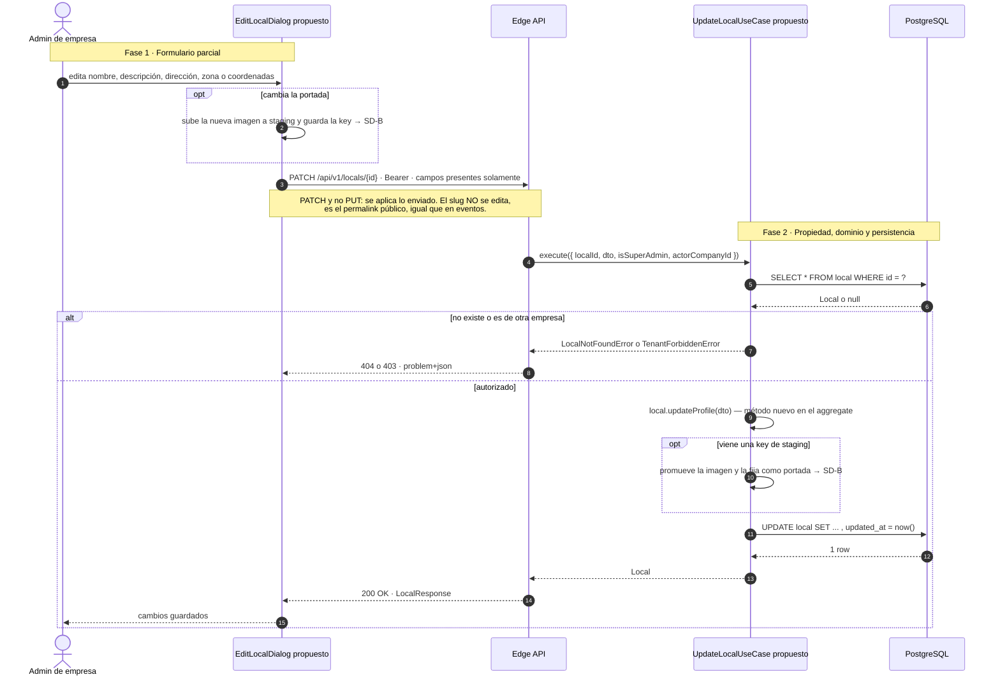
```mermaid
sequenceDiagram
    autonumber
    actor AD as Admin de empresa
    participant W as EditLocalDialog propuesto
    participant EDGE as Edge API
    participant UC as UpdateLocalUseCase propuesto
    participant DB as PostgreSQL

    note over AD, W: Fase 1 · Formulario parcial
    AD->>W: edita nombre, descripción, dirección, zona o coordenadas
    opt cambia la portada
        W->>W: sube la nueva imagen a staging y guarda la key → SD-B
    end
    W->>EDGE: PATCH /api/v1/locals/{id} · Bearer · campos presentes solamente
    note over W, EDGE: PATCH y no PUT: se aplica lo enviado. El slug NO se edita,<br/>es el permalink público, igual que en eventos.

    note over UC, DB: Fase 2 · Propiedad, dominio y persistencia
    EDGE->>UC: execute({ localId, dto, isSuperAdmin, actorCompanyId })
    UC->>DB: SELECT * FROM local WHERE id = ?
    DB-->>UC: Local o null
    alt no existe o es de otra empresa
        UC-->>EDGE: LocalNotFoundError o TenantForbiddenError
        EDGE-->>W: 404 o 403 · problem+json
    else autorizado
        UC->>UC: local.updateProfile(dto) — método nuevo en el aggregate
        opt viene una key de staging
            UC->>UC: promueve la imagen y la fija como portada → SD-B
        end
        UC->>DB: UPDATE local SET ... , updated_at = now()
        DB-->>UC: 1 row
        UC-->>EDGE: Local
        EDGE-->>W: 200 OK · LocalResponse
        W-->>AD: cambios guardados
    end
```

---

## 9. Bloque 4 · Galería del local

### SD-08 · Subir y confirmar imágenes de la galería

`POST /api/v1/locals/{id}/images` · `@Roles('admin_local')` · `ConfirmLocalImageUseCase`

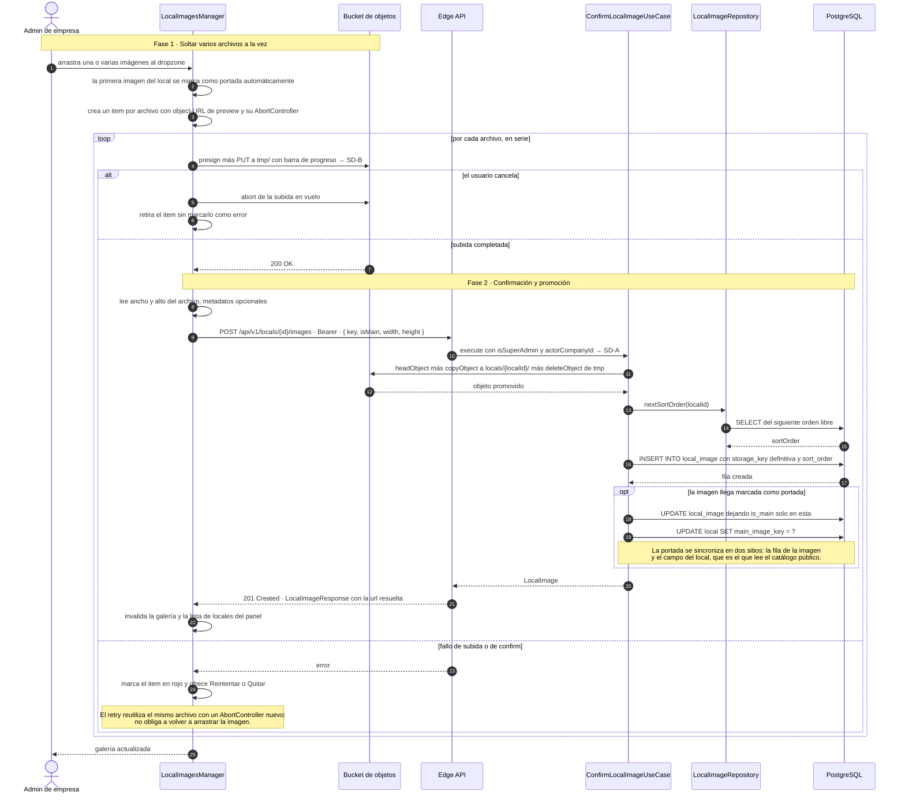
```mermaid
sequenceDiagram
    autonumber
    actor AD as Admin de empresa
    participant W as LocalImagesManager
    participant S3 as Bucket de objetos
    participant EDGE as Edge API
    participant UC as ConfirmLocalImageUseCase
    participant IREP as LocalImageRepository
    participant DB as PostgreSQL

    note over AD, S3: Fase 1 · Soltar varios archivos a la vez
    AD->>W: arrastra una o varias imágenes al dropzone
    W->>W: la primera imagen del local se marca como portada automáticamente
    W->>W: crea un item por archivo con object-URL de preview y su AbortController
    loop por cada archivo, en serie
        W->>S3: presign más PUT a tmp/ con barra de progreso → SD-B
        alt el usuario cancela
            W->>S3: abort de la subida en vuelo
            W->>W: retira el item sin marcarlo como error
        else subida completada
            S3-->>W: 200 OK

            note over W, DB: Fase 2 · Confirmación y promoción
            W->>W: lee ancho y alto del archivo, metadatos opcionales
            W->>EDGE: POST /api/v1/locals/{id}/images · Bearer · { key, isMain, width, height }
            EDGE->>UC: execute con isSuperAdmin y actorCompanyId → SD-A
            UC->>S3: headObject más copyObject a locals/{localId}/ más deleteObject de tmp
            S3-->>UC: objeto promovido
            UC->>IREP: nextSortOrder(localId)
            IREP->>DB: SELECT del siguiente orden libre
            DB-->>IREP: sortOrder
            UC->>DB: INSERT INTO local_image con storage_key definitiva y sort_order
            DB-->>UC: fila creada
            opt la imagen llega marcada como portada
                UC->>DB: UPDATE local_image dejando is_main solo en esta
                UC->>DB: UPDATE local SET main_image_key = ?
                note over UC, DB: La portada se sincroniza en dos sitios: la fila de la imagen<br/>y el campo del local, que es el que lee el catálogo público.
            end
            UC-->>EDGE: LocalImage
            EDGE-->>W: 201 Created · LocalImageResponse con la url resuelta
            W->>W: invalida la galería y la lista de locales del panel
        else fallo de subida o de confirm
            EDGE-->>W: error
            W->>W: marca el item en rojo y ofrece Reintentar o Quitar
            note over W: El retry reutiliza el mismo archivo con un AbortController nuevo:<br/>no obliga a volver a arrastrar la imagen.
        end
    end
    W-->>AD: galería actualizada
```

### SD-09 · Ordenar, marcar portada y eliminar

`PATCH /images/reorder`, `PATCH /images/{imageId}/main`, `DELETE /images/{imageId}`

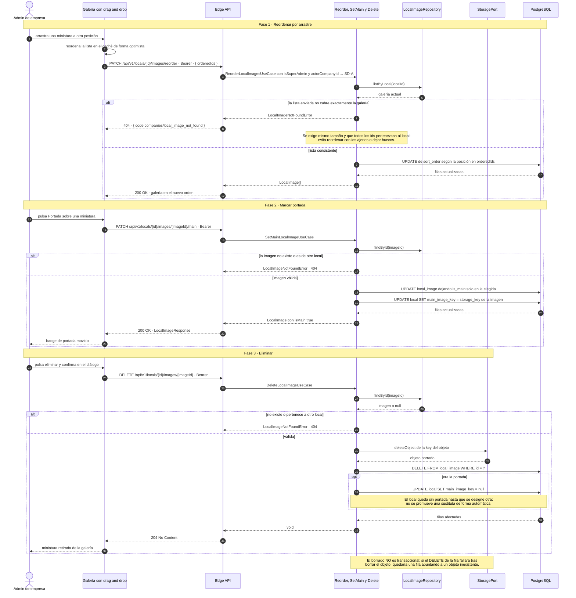
```mermaid
sequenceDiagram
    autonumber
    actor AD as Admin de empresa
    participant W as Galería con drag and drop
    participant EDGE as Edge API
    participant UC as Reorder, SetMain y Delete
    participant IREP as LocalImageRepository
    participant ST as StoragePort
    participant DB as PostgreSQL

    note over AD, DB: Fase 1 · Reordenar por arrastre
    AD->>W: arrastra una miniatura a otra posición
    W->>W: reordena la lista en el caché de forma optimista
    W->>EDGE: PATCH /api/v1/locals/{id}/images/reorder · Bearer · { orderedIds }
    EDGE->>UC: ReorderLocalImagesUseCase con isSuperAdmin y actorCompanyId → SD-A
    UC->>IREP: listByLocal(localId)
    IREP-->>UC: galería actual
    alt la lista enviada no cubre exactamente la galería
        UC-->>EDGE: LocalImageNotFoundError
        EDGE-->>W: 404 · { code companies/local_image_not_found }
        note over UC: Se exige mismo tamaño y que todos los ids pertenezcan al local:<br/>evita reordenar con ids ajenos o dejar huecos.
    else lista consistente
        UC->>DB: UPDATE de sort_order según la posición en orderedIds
        DB-->>UC: filas actualizadas
        UC-->>EDGE: LocalImage[]
        EDGE-->>W: 200 OK · galería en el nuevo orden
    end

    note over AD, DB: Fase 2 · Marcar portada
    AD->>W: pulsa Portada sobre una miniatura
    W->>EDGE: PATCH /api/v1/locals/{id}/images/{imageId}/main · Bearer
    EDGE->>UC: SetMainLocalImageUseCase
    UC->>IREP: findById(imageId)
    alt la imagen no existe o es de otro local
        UC-->>EDGE: LocalImageNotFoundError · 404
    else imagen válida
        UC->>DB: UPDATE local_image dejando is_main solo en la elegida
        UC->>DB: UPDATE local SET main_image_key = storage_key de la imagen
        DB-->>UC: filas actualizadas
        UC-->>EDGE: LocalImage con isMain true
        EDGE-->>W: 200 OK · LocalImageResponse
        W-->>AD: badge de portada movido
    end

    note over AD, ST: Fase 3 · Eliminar
    AD->>W: pulsa eliminar y confirma en el diálogo
    W->>EDGE: DELETE /api/v1/locals/{id}/images/{imageId} · Bearer
    EDGE->>UC: DeleteLocalImageUseCase
    UC->>IREP: findById(imageId)
    IREP-->>UC: imagen o null
    alt no existe o pertenece a otro local
        UC-->>EDGE: LocalImageNotFoundError · 404
    else válida
        UC->>ST: deleteObject de la key del objeto
        ST-->>UC: objeto borrado
        UC->>DB: DELETE FROM local_image WHERE id = ?
        opt era la portada
            UC->>DB: UPDATE local SET main_image_key = null
            note over UC, DB: El local queda sin portada hasta que se designe otra:<br/>no se promueve una sustituta de forma automática.
        end
        DB-->>UC: filas afectadas
        UC-->>EDGE: void
        EDGE-->>W: 204 No Content
        W-->>AD: miniatura retirada de la galería
    end
    note over UC, ST: El borrado NO es transaccional: si el DELETE de la fila fallara tras<br/>borrar el objeto, quedaría una fila apuntando a un objeto inexistente.
```

---

## 10. Bloque 5 · Verificación del local

### SD-10 · Solicitar verificación de local

`POST /api/v1/locals/{id}/verifications` · `@Roles('admin_local')` · `RequestVerificationUseCase`

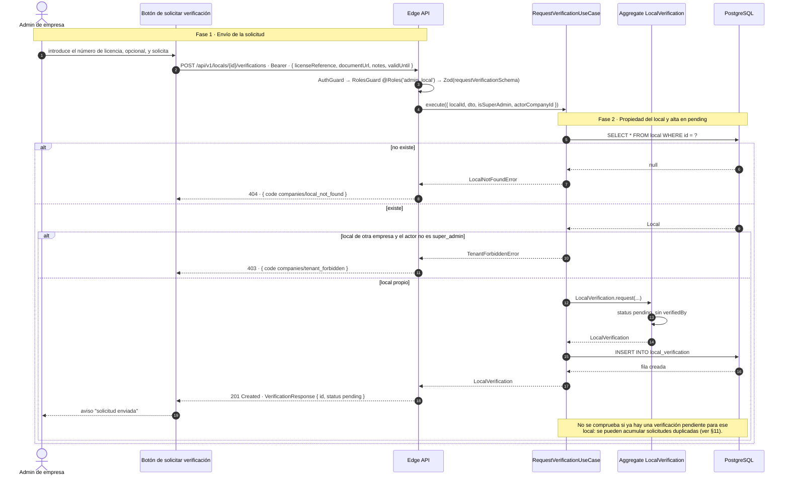
```mermaid
sequenceDiagram
    autonumber
    actor AD as Admin de empresa
    participant W as Botón de solicitar verificación
    participant EDGE as Edge API
    participant UC as RequestVerificationUseCase
    participant DOM as Aggregate LocalVerification
    participant DB as PostgreSQL

    note over AD, EDGE: Fase 1 · Envío de la solicitud
    AD->>W: introduce el número de licencia, opcional, y solicita
    W->>EDGE: POST /api/v1/locals/{id}/verifications · Bearer · { licenseReference, documentUrl, notes, validUntil }
    EDGE->>EDGE: AuthGuard → RolesGuard @Roles('admin_local') → Zod(requestVerificationSchema)
    EDGE->>UC: execute({ localId, dto, isSuperAdmin, actorCompanyId })

    note over UC, DB: Fase 2 · Propiedad del local y alta en pending
    UC->>DB: SELECT * FROM local WHERE id = ?
    alt no existe
        DB-->>UC: null
        UC-->>EDGE: LocalNotFoundError
        EDGE-->>W: 404 · { code companies/local_not_found }
    else existe
        DB-->>UC: Local
        alt local de otra empresa y el actor no es super_admin
            UC-->>EDGE: TenantForbiddenError
            EDGE-->>W: 403 · { code companies/tenant_forbidden }
        else local propio
            UC->>DOM: LocalVerification.request(...)
            DOM->>DOM: status pending, sin verifiedBy
            DOM-->>UC: LocalVerification
            UC->>DB: INSERT INTO local_verification
            DB-->>UC: fila creada
            UC-->>EDGE: LocalVerification
            EDGE-->>W: 201 Created · VerificationResponse { id, status pending }
            W-->>AD: aviso "solicitud enviada"
            note over UC, DB: No se comprueba si ya hay una verificación pendiente para ese<br/>local: se pueden acumular solicitudes duplicadas (ver §11).
        end
    end
```

### SD-11 · Revisar verificación y derivar isVerified

`POST /api/v1/local-verifications/{id}/review` · `@Roles('super_admin')` · `ReviewVerificationUseCase`

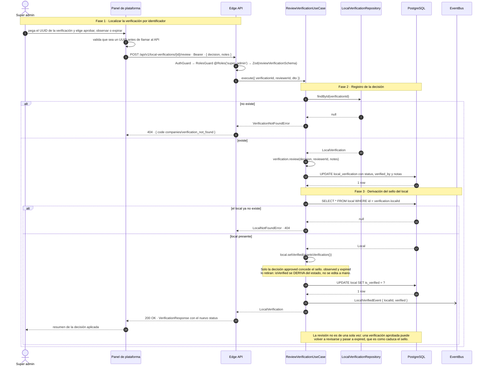
```mermaid
sequenceDiagram
    autonumber
    actor SA as Super admin
    participant W as Panel de plataforma
    participant EDGE as Edge API
    participant UC as ReviewVerificationUseCase
    participant VREP as LocalVerificationRepository
    participant DB as PostgreSQL
    participant BUS as EventBus

    note over SA, EDGE: Fase 1 · Localizar la verificación por identificador
    SA->>W: pega el UUID de la verificación y elige aprobar, observar o expirar
    W->>W: valida que sea un UUID antes de llamar al API
    W->>EDGE: POST /api/v1/local-verifications/{id}/review · Bearer · { decision, notes }
    EDGE->>EDGE: AuthGuard → RolesGuard @Roles('super_admin') → Zod(reviewVerificationSchema)
    EDGE->>UC: execute({ verificationId, reviewerId, dto })

    note over UC, DB: Fase 2 · Registro de la decisión
    UC->>VREP: findById(verificationId)
    alt no existe
        VREP-->>UC: null
        UC-->>EDGE: VerificationNotFoundError
        EDGE-->>W: 404 · { code companies/verification_not_found }
    else existe
        VREP-->>UC: LocalVerification
        UC->>UC: verification.review(decision, reviewerId, notes)
        UC->>DB: UPDATE local_verification con status, verified_by y notas
        DB-->>UC: 1 row

        note over UC, BUS: Fase 3 · Derivación del sello del local
        UC->>DB: SELECT * FROM local WHERE id = verification.localId
        alt el local ya no existe
            DB-->>UC: null
            UC-->>EDGE: LocalNotFoundError · 404
        else local presente
            DB-->>UC: Local
            UC->>UC: local.setVerified(grantsVerification())
            note over UC: Solo la decisión approved concede el sello. observed y expired<br/>lo retiran: isVerified se DERIVA del estado, no se edita a mano.
            UC->>DB: UPDATE local SET is_verified = ?
            DB-->>UC: 1 row
            UC-)BUS: LocalVerifiedEvent { localId, verified }
            UC-->>EDGE: LocalVerification
            EDGE-->>W: 200 OK · VerificationResponse con el nuevo status
            W-->>SA: resumen de la decisión aplicada
            note over UC, DB: La revisión no es de una sola vez: una verificación aprobada puede<br/>volver a revisarse y pasar a expired, que es como caduca el sello.
        end
    end
```

---

## 11. Trazabilidad: proceso → endpoint → código → estado

| Proceso | Endpoint(s) | Caso de uso / componente | Estado |
|---|---|---|---|
| Solicitud pública de afiliación | `POST /affiliation-requests` | `SubmitAffiliationUseCase` | ✅ Implementado |
| Revisión de afiliación y alta | `POST /affiliation-requests/{id}/review` | `ReviewAffiliationUseCase` | ⚠️ Alta atómica correcta, pero sin listado de pendientes y sin alta de usuario |
| Administrar empresa (tenant) | `GET` y `PUT /companies/me` | `GetMyCompanyUseCase`, `UpdateCompanyUseCase` | ✅ Implementado |
| Gobierno de empresas | `GET /companies`, `POST /{id}/suspend`, `POST /{id}/activate` | `ListCompaniesUseCase`, `SetCompanyStatusUseCase` | ⚠️ Sin cascada a locales ni eventos |
| Crear local | `POST /locals` | `CreateLocalUseCase` | ✅ Implementado, con reintento de slug en cliente |
| Editar local | — | — | ❌ No existe ni en el API ni en el panel (ver SD-07b) |
| Publicar y suspender local | `POST /locals/{id}/publish`, `POST /locals/{id}/suspend` | `PublishLocalUseCase`, `SuspendLocalUseCase` | ✅ Implementado |
| Subir imágenes | `POST /uploads/presign`, `POST /locals/{id}/images` | `PresignUploadUseCase`, `ConfirmLocalImageUseCase` | ✅ Implementado con verificación server-side |
| Ordenar y marcar portada | `PATCH /locals/{id}/images/reorder`, `PATCH /images/{imageId}/main` | `ReorderLocalImagesUseCase`, `SetMainLocalImageUseCase` | ✅ Implementado |
| Eliminar imagen | `DELETE /locals/{id}/images/{imageId}` | `DeleteLocalImageUseCase` | ⚠️ Borrado de objeto y fila sin transacción |
| Solicitar verificación | `POST /locals/{id}/verifications` | `RequestVerificationUseCase` | ⚠️ Sin control de solicitudes duplicadas |
| Revisar verificación | `POST /local-verifications/{id}/review` | `ReviewVerificationUseCase` | ⚠️ Correcto, pero sin listado de pendientes |

---

## 12. Brechas y riesgos detectados al levantar los flujos

Hallazgos de la lectura del código, ordenados por impacto. No forman parte del pedido, pero
condicionan la fidelidad de los diagramas.

1. **Aprobar una afiliación no da acceso a nadie.** `AffiliationApprovedEvent` no tiene suscriptores:
   se crean empresa y local, pero no se crea usuario ni se otorga el rol `admin_local` al contacto.
   El tenant queda existiendo sin nadie que pueda administrarlo hasta que un `super_admin` conceda el
   rol a mano por `POST /users/{userId}/roles`.
2. **No hay listados para revisar.** Ni `GET /affiliation-requests` ni `GET /local-verifications`
   existen. El panel de plataforma pide pegar un UUID a mano, y los propios componentes lo documentan
   ("No existe listado de pendientes, así que se opera por ID directo"). En la práctica no hay bandeja
   de trámites.
3. **`ReviewAffiliationUseCase` no valida la unicidad del RUC.** `CreateCompanyUseCase` sí lanza
   `RucAlreadyRegisteredError`, pero la aprobación construye `Company.create` y persiste directamente.
   Aprobar dos solicitudes con el mismo RUC choca contra la restricción de la base en vez de devolver
   un 409 de dominio.
4. **Editar un local no existe.** Un dato mal cargado al crear solo se corrige por base de datos. El
   aggregate `Local` ni siquiera tiene un método de actualización de perfil, a diferencia de `Company`
   (`updateProfile`) y de `Event` (`PATCH /events/{id}`).
5. **La aprobación de locales que muestra el panel es una maqueta.** `local-approval-mock.ts` marca el
   local como "pendiente" en `localStorage`, mientras el API permite al propio `admin_local` publicar
   su local sin revisión de plataforma. La interfaz sugiere un control que no existe.
6. **Suspender una empresa no propaga.** Sus locales siguen `active` y sus eventos siguen publicados:
   `SetCompanyStatusUseCase` solo toca la fila `company`. Una empresa suspendida sigue vendiendo.
7. **El patrón multi-tenant está duplicado en dos estilos.** Parte de los handlers deriva el scope con
   `tenantScopeOf(actor)` y otra parte lo arma inline con `actor.roles.includes('super_admin')` más
   `actor.companyId`. La regla del proyecto es que esa derivación viva en un solo sitio.
8. **El borrado de imagen no es transaccional.** Se elimina primero el objeto en S3 y después la fila.
   Un fallo intermedio deja una fila apuntando a un objeto inexistente, que la galería renderizaría
   como imagen rota.
9. **Verificaciones duplicadas.** `RequestVerificationUseCase` no comprueba si ya hay una solicitud
   `pending` para ese local: se pueden acumular indefinidamente, y ninguna invalida a la anterior.

---

## 13. Mantenimiento

- **Fuente de verdad funcional:** `../der_class/PROJECT_SPECS.md` (§N). Toda desviación se registra
  como ADR en `docs/adr/`.
- Al cambiar un caso de uso de `apps/api/src/modules/companies/`, el módulo `uploads` o los
  componentes del panel de local, actualizar el diagrama correspondiente **en el mismo PR** y revisar
  la tabla del §11.
- Antes de mergear, ejecutar el comando de validación de §3.6: los 14 diagramas deben renderizar.
- Los diagramas nombran casos de uso, endpoints, claves de storage y columnas reales a propósito: un
  `grep` del nombre en el repo debe encontrar el código. Si no lo encuentra, el diagrama está
  desactualizado.
