# Eventos e inventario — Diagramas de secuencia y flujo de protocolo

**Serie:** [Diagramas de secuencia](./README.md) · **Dominio 4 del DER** — *Events & Ticket Types* (§4.1 de `PROJECT_SPECS.md`)

> **Alcance.** Tres procesos del dominio *Eventos e inventario*, agrupados en cinco bloques y
> representados con **13 diagramas de secuencia Mermaid** más **1 diagrama de estados** complementario,
> en formato *protocol data flow*: cada flecha lleva su método, ruta, código de estado y forma del
> payload; cada fase del pipeline va marcada con un banner. Reflejan el código real de `apps/api`
> (módulo `events`, con el consumo de inventario desde `ticketing`) y `apps/web` (panel de local y
> superficies públicas de agenda).
>
> Mismo estándar de notación que `docs/diagramas-secuencia/01-identidad-acceso.md`.
> Fecha de levantamiento: 2026-07-28 · Rama `feat/rebrand-ravenue`.

---

## 1. Índice

| # | Diagrama | Proceso cubierto |
|---|---|---|
| SD-A | [Aislamiento por tenant en Events](#sd-a--aislamiento-por-tenant-en-events) | sub-flujo compartido |
| SD-B | [Flyer en staging: validar y promover](#sd-b--flyer-en-staging-validar-y-promover) | sub-flujo compartido |
| SD-01 | [Crear un evento con flyer](#sd-01--crear-un-evento-con-flyer) | Crear evento |
| SD-02 | [Editar un evento](#sd-02--editar-un-evento) | Editar evento |
| SD-03 | [Publicar un evento](#sd-03--publicar-un-evento) | Publicar evento |
| SD-04 | [Cancelar un evento](#sd-04--cancelar-un-evento) | Cancelar evento |
| SD-05 | [Configurar tipos de entrada](#sd-05--configurar-tipos-de-entrada) | Tipos de entrada y stock |
| SD-06 | [Consumo del stock desde checkout](#sd-06--consumo-del-stock-desde-checkout) | Stock |
| SD-07 | [Ajustar stock y pausar la venta](#sd-07--ajustar-stock-y-pausar-la-venta) — AS-IS y TO-BE | Stock |
| SD-08 | [Agenda pública](#sd-08--agenda-pública) | Consultar agenda |
| SD-09 | [Agenda de administración](#sd-09--agenda-de-administración) | Consultar agenda y estados |
| SD-10 | [Métricas del local](#sd-10--métricas-del-local) | Métricas |
| ED-1 | [Máquina de estados del evento](#ed-1--máquina-de-estados-del-evento) | Estados de evento |

---

## 2. Agrupación de los procesos

Los tres procesos comparten un mismo eje: el evento es el aggregate y el tipo de entrada es su
inventario, pero **quien escribe el stock no es este módulo**, sino el checkout a través de un puerto.
Esa separación explica por qué el bloque de inventario tiene tres diagramas y no uno.

| Bloque | Procesos | Razón de la agrupación |
|---|---|---|
| **0 · Sub-flujos compartidos** | — | `assertTenant` sobre `companyIdForLocal` (SD-A) gobierna las cinco escrituras del módulo. La validación y promoción del flyer (SD-B) es idéntica en crear y editar. |
| **1 · Ciclo de vida del evento** | Crear, editar, publicar y cancelar | Cuatro comandos sobre el mismo aggregate, con la misma comprobación de tenant y distinta transición de estado. Se separan porque cada uno tiene invariantes y eventos de dominio propios. |
| **2 · Inventario** | Configurar tipos de entrada y stock | Crear el tipo (SD-05) y consumirlo (SD-06) están en módulos distintos. Ajustarlo después (SD-07) no existe, y merece su propio diagrama con el estado real y la propuesta. |
| **3 · Consulta** | Consultar agenda, métricas y estados | Tres audiencias con tres superficies: catálogo público con ISR, panel del tenant con lecturas aisladas, y KPIs agregados. |
| **4 · Estados** | Estados de evento | El ciclo completo se lee mejor como máquina de estados que como secuencia. Va como complemento, no como sustituto. |

---

## 3. Convenciones de notación

Estándar de la serie. La fuente canónica es `.claude/skills/sincronizar-diagramas-secuencia/references/notacion.md`.

### 3.1 Estructura

1. **`autonumber` siempre.** Permite referenciar un paso concreto en revisiones ("falla en el paso 7").
2. **Un diagrama = un caso de uso.** Si un flujo supera ~40 mensajes o los 8 participantes, se parte y
   se referencia con una nota (`note over X: ver SD-A`).
3. **Máximo 8 participantes.** Por encima, el diagrama deja de leerse en pantalla.
4. **Declaración explícita de participantes al inicio**, en orden de aparición izquierda → derecha
   (usuario → cliente → borde → aplicación → dominio → infraestructura). Nunca declarar por primera
   vez a mitad del diagrama: el orden visual se desordena.
5. **`actor` para personas, `participant` para sistemas.** Alias corto en mayúsculas (`UC`, `DB`),
   etiqueta legible con `as`.

### 3.2 Flujo de protocolo

Regla central de este documento: **el diagrama debe poder contrastarse contra el tráfico real.**

6. **Toda petición lleva su respuesta.** Ninguna flecha `->>` de red se queda sin su `-->>` con código
   de estado y forma del payload. Si no hay respuesta, es un `-)` (asíncrono) y se dice por qué.
7. **Anotación de protocolo en la ida:** `MÉTODO /ruta · cabecera o cuerpo relevante`.
   Ejemplo: `GET /api/v1/{recurso}/{id} · Authorization Bearer {accessToken}`.
8. **Anotación de resultado en la vuelta:** `código · payload`.
   Ejemplo: `409 · problem+json { code: {contexto}/{error} }`.
9. **Infraestructura con su comando real**, no con una paráfrasis: `SELECT * FROM event WHERE slug = ?`,
   `copyObject`. Hace el diagrama auditable
   contra los adapters Drizzle y Redis.
10. **Placeholders entre llaves**, nunca entre `<` `>` (Mermaid los interpreta como HTML): `{eventId}`.

### 3.3 Fases

11. **Banners de fase** con `note over A, B: Fase N · Nombre (componente real)`, abarcando los
    participantes implicados en ese tramo. Convierten un muro de flechas en un flujo legible por
    etapas y hacen explícito qué componente gobierna cada una.
12. **Notas de invariante** (`note over X:`) reservadas para reglas de seguridad, decisiones de diseño
    y brechas conocidas. Nunca para narrar lo que la flecha ya dice.
13. Saltos de línea en notas con `<br/>` para no ensanchar el diagrama.

### 3.4 Arrows y bloques de control

| Notación | Significado |
|---|---|
| `->>` | Llamada síncrona: el emisor espera respuesta |
| `-->>` | Respuesta o retorno, con código de estado |
| `-)` | Asíncrono fire-and-forget: publicación de evento, encolado |
| `X->>X` | Cómputo interno que cambia estado o toma una decisión (hash, firma, validación) |

| Bloque | Uso |
|---|---|
| `alt` / `else` | Caminos mutuamente excluyentes (éxito vs. error de negocio) |
| `opt` | Tramo que puede no ejecutarse y no tiene alternativa |
| `critical` | Transacción atómica (`UnitOfWork`): si algo falla, nada se persiste |
| `par` / `and` | Señales concurrentes e independientes |
| `loop` | Repetición acotada (reintentos, generación de código único) |

### 3.5 Cierre

14. **Cada diagrama termina en el efecto observable**: lo que ve el usuario, la cookie fijada o el
    documento devuelto. Un diagrama que acaba en una llamada interna está incompleto.

### 3.6 Higiene sintáctica

15. **Nada de `;` dentro de un mensaje o una nota.** Mermaid corta la sentencia ahí y el diagrama deja
    de compilar. Usar coma o punto.
16. Nada de `<` `>` sin escapar, incluidas las flechas de función de JavaScript (ver regla 10).
17. Los nombres de casos de uso, guards, endpoints y claves de Redis se copian **tal cual del código**:
    un `grep` del nombre debe encontrar el fuente.
18. **Los diagramas TO-BE nombran componentes que no existen todavía** y lo señalan en el propio participante o en una nota. Los AS-IS nombran archivos reales.

### 3.7 Validación

```bash
npx -y @mermaid-js/mermaid-cli@11 \
  -i docs/diagramas-secuencia/04-eventos-inventario.md \
  -o /tmp/04-eventos-inventario.md
```

También sirven mermaid.live y la extensión *Markdown Preview Mermaid Support* de VS Code. GitHub
renderiza estos bloques de forma nativa.

---

## 4. Catálogo de participantes

| Alias | Componente real | Archivo |
|---|---|---|
| `U` | Administrador de local, o visitante en las superficies públicas | — |
| `W` | Componente cliente del panel o Server Component del catálogo | `apps/web/**` |
| `EDGE` | Pipeline global del API: `RateLimit → Auth → Roles` + `ZodValidationPipe` | `apps/api/src/edge/**` |
| `UC` | Caso de uso (capa aplicación) | `apps/api/src/modules/events/application/use-cases/**` |
| `TEN` | `EventTenantPort` — resuelve la empresa dueña de un local | `.../events/domain/ports/event-tenant.port.ts` |
| `DOM` | Aggregates `Event` y `TicketType` | `.../events/domain/entities/**` |
| `EREP` | `EventRepository` (adapter Drizzle) | `.../infrastructure/persistence/drizzle-event.repository.ts` |
| `TREP` | `TicketTypeRepository` | `.../drizzle-ticket-type.repository.ts` |
| `FLY` | `flyer-storage` — validación y promoción del flyer | `.../events/application/services/flyer-storage.ts` |
| `ST` | `StoragePort` sobre S3 compatible | `apps/api/src/shared/adapters/storage/**` |
| `INV` | `InventoryPort` — lo consume `ticketing`, escribe sobre `ticket_type` | `.../ticketing/domain/ports/inventory.repository.ts` |
| `BUS` | `EventBus` in-process | `apps/api/src/shared/event-bus/event-bus.ts` |
| `DB` | PostgreSQL vía Drizzle | `packages/db/src/schema/events.ts` |

### Superficie de endpoints

| Método y ruta | Acceso | Caso de uso |
|---|---|---|
| `GET /events` | público | `ListEventsUseCase` |
| `GET /events/trending` · `GET /events/upcoming` | público | `ListTrendingEventsUseCase` · `ListUpcomingEventsUseCase` |
| `GET /events/{slug}` | público | `GetEventUseCase` |
| `GET /events/{id}/ticket-types` | público | `ListTicketTypesUseCase` |
| `GET /events/mine?localId=` | `admin_local` | `ListMyEventsUseCase` |
| `GET /events/manage/{id}` | `admin_local` | `GetMyEventUseCase` |
| `GET /events/stats/{localId}` | `admin_local` | `GetLocalStatsUseCase` |
| `POST /events` · `PATCH /events/{id}` | `admin_local` | `CreateEventUseCase` · `UpdateEventUseCase` |
| `POST /events/{id}/publish` · `POST /events/{id}/cancel` | `admin_local` | `PublishEventUseCase` · `CancelEventUseCase` |
| `POST /ticket-types` | `admin_local` | `CreateTicketTypeUseCase` |

---

## 5. Bloque 0 · Sub-flujos compartidos

### SD-A · Aislamiento por tenant en Events

A diferencia de Companies, aquí el módulo no conoce el `companyId` del recurso: lo resuelve por puerto
a partir del local del evento.

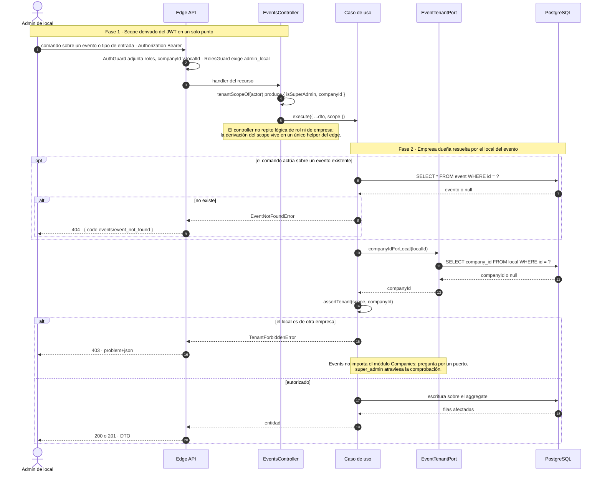

### SD-B · Flyer en staging: validar y promover

`flyer-storage` es el equivalente en Events del confirm de imágenes de local. Lo comparten crear y
editar.

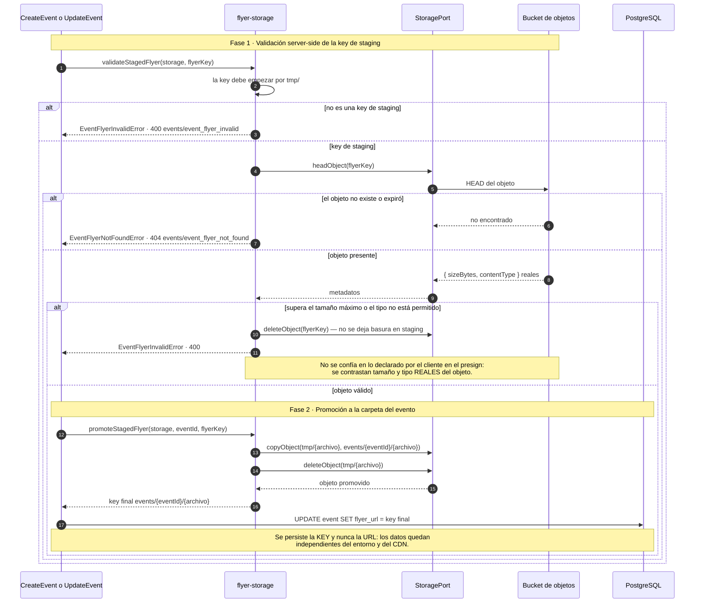

---

## 6. Bloque 1 · Ciclo de vida del evento

### SD-01 · Crear un evento con flyer

`POST /api/v1/events` · `@Roles('admin_local')` · `CreateEventUseCase`

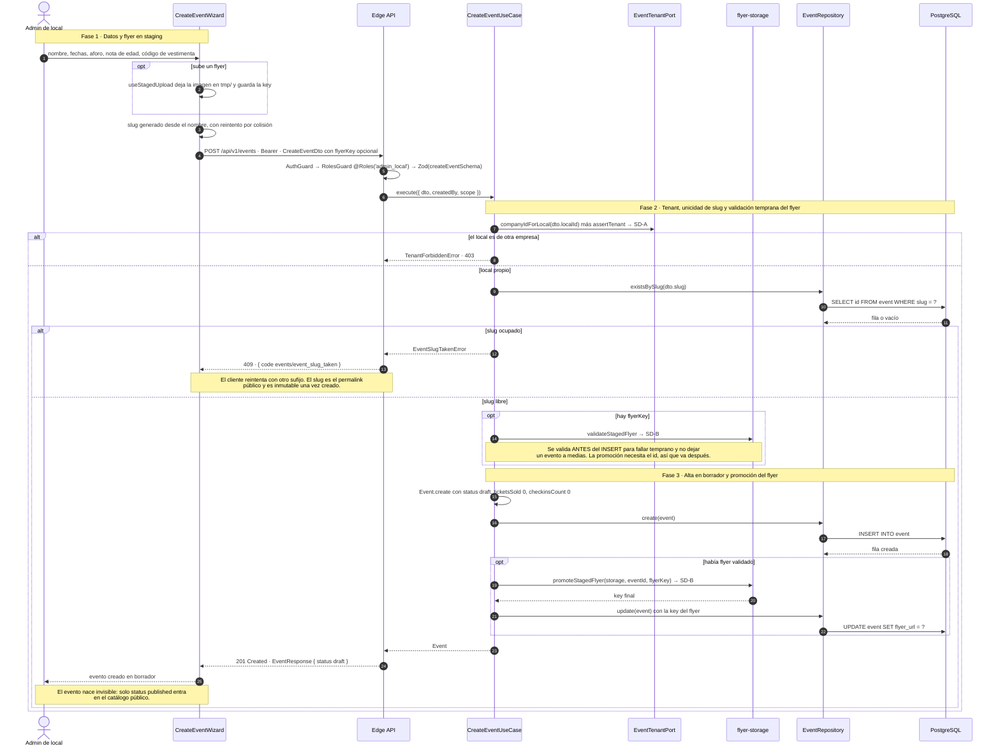

### SD-02 · Editar un evento

`PATCH /api/v1/events/{id}` · `@Roles('admin_local')` · `UpdateEventUseCase`

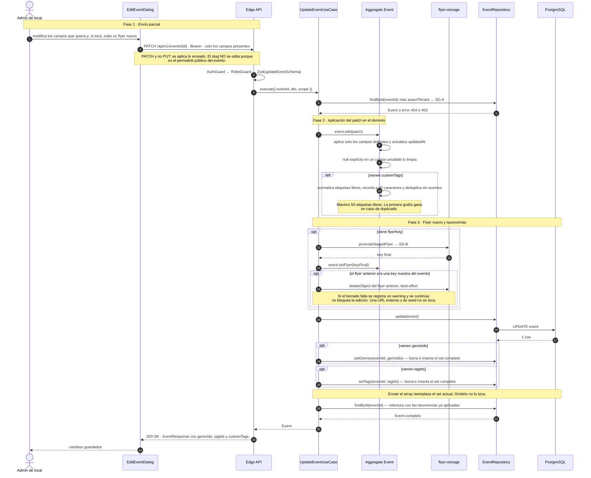

### SD-03 · Publicar un evento

`POST /api/v1/events/{id}/publish` · `@Roles('admin_local')` · `PublishEventUseCase`

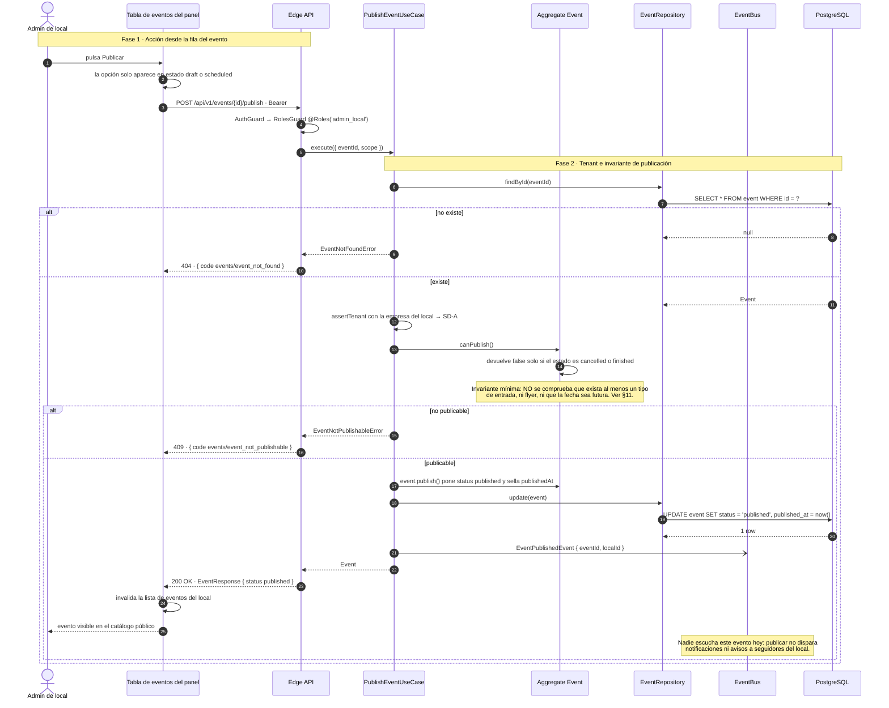

### SD-04 · Cancelar un evento

`POST /api/v1/events/{id}/cancel` · `@Roles('admin_local')` · `CancelEventUseCase`

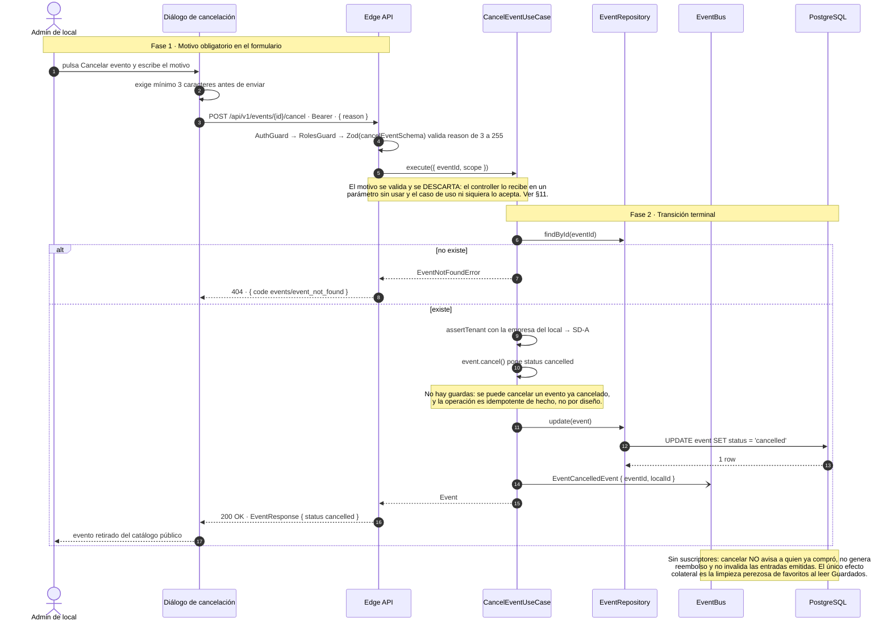

---

## 7. Bloque 2 · Inventario

### SD-05 · Configurar tipos de entrada

`POST /api/v1/ticket-types` · `@Roles('admin_local')` · `CreateTicketTypeUseCase`

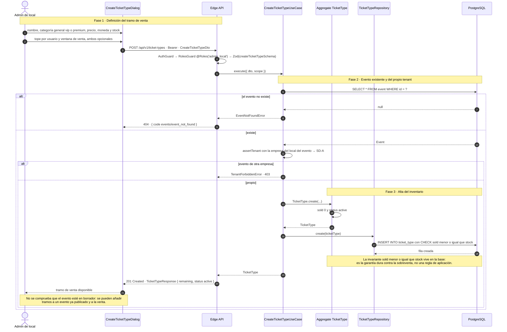

### SD-06 · Consumo del stock desde checkout

Quién escribe el inventario. El módulo Events **define** el stock, el módulo Ticketing lo **consume**
por `InventoryPort`, sin importar el módulo Events.

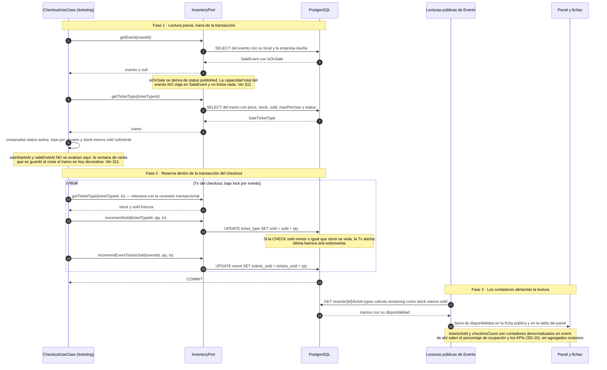

### SD-07 · Ajustar stock y pausar la venta

#### SD-07a · Estado actual (AS-IS)

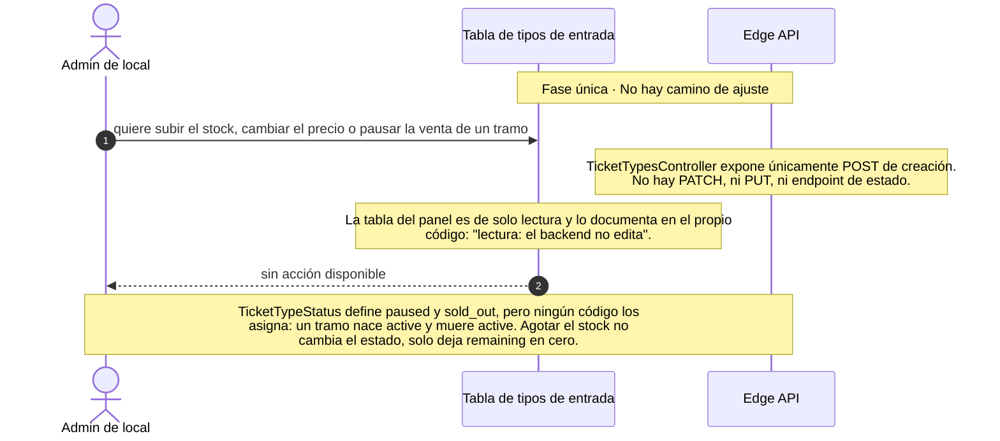

#### SD-07b · Diseño propuesto (TO-BE)

Propuesta calcada del `PATCH /events/{id}` que ya funciona, con la salvedad de que el stock es un
recurso en disputa.

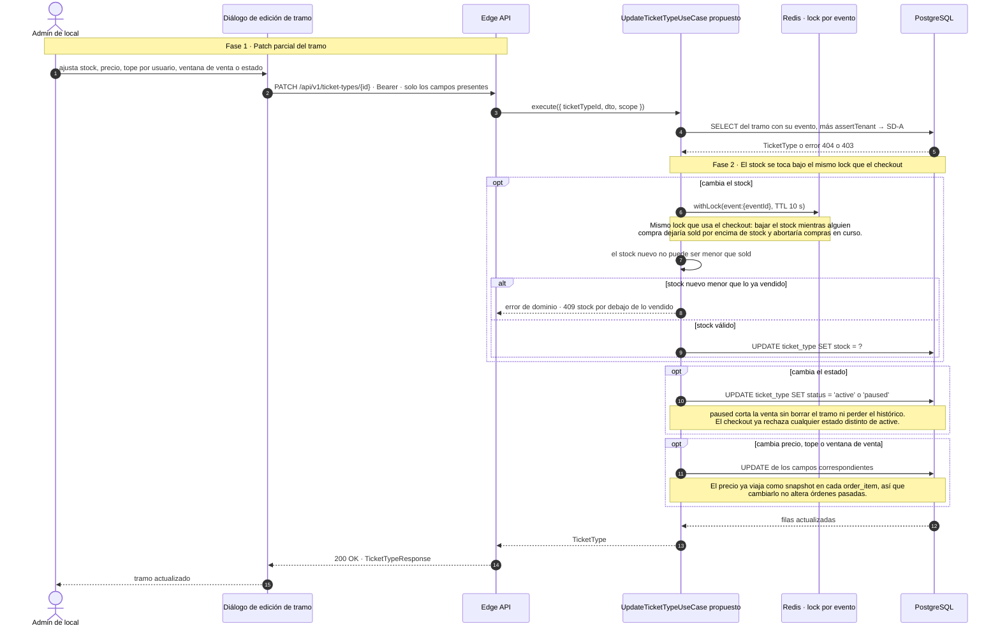

---

## 8. Bloque 3 · Consulta de agenda y métricas

### SD-08 · Agenda pública

`GET /events`, `/events/trending`, `/events/upcoming` · públicos, con ISR en el cliente.

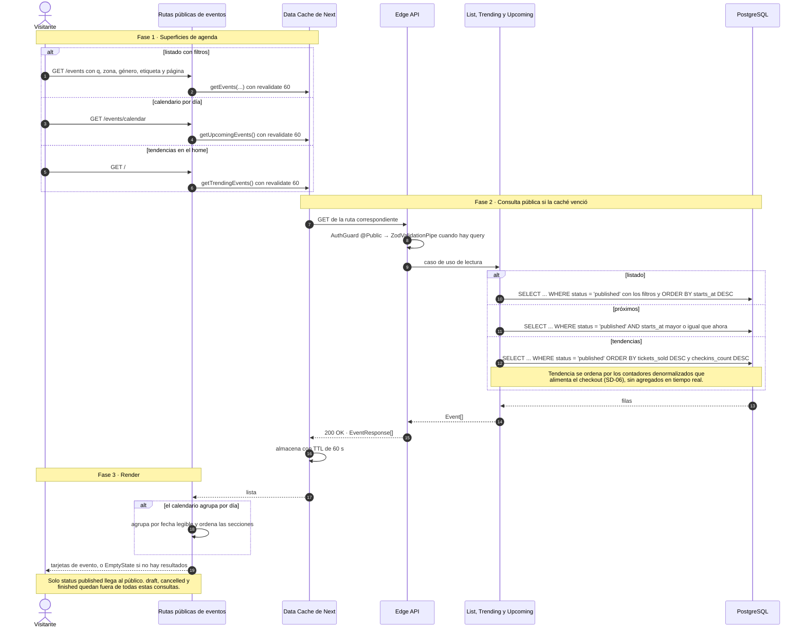

### SD-09 · Agenda de administración

`GET /events/mine?localId=` y `GET /events/manage/{id}` · `@Roles('admin_local')`

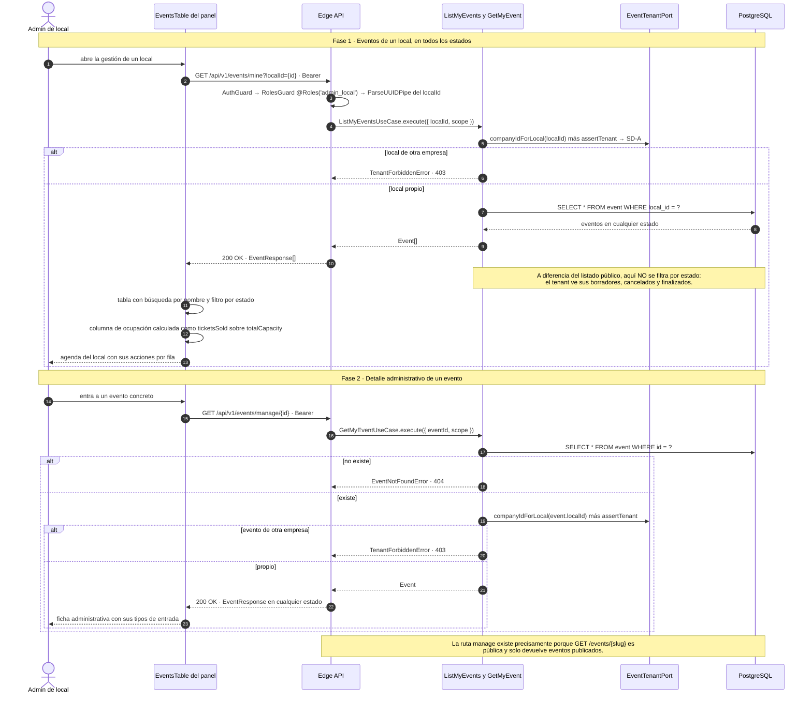

### SD-10 · Métricas del local

`GET /api/v1/events/stats/{localId}` · `@Roles('admin_local')` · `GetLocalStatsUseCase`

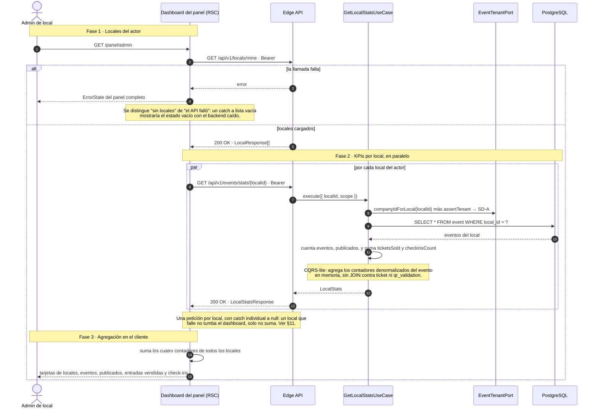

---

## 9. Bloque 4 · Estados del evento

### ED-1 · Máquina de estados del evento

Complemento a los diagramas de secuencia: el ciclo completo se lee mejor como máquina de estados.
Incluye los estados declarados en `EventStatus` que hoy **nada asigna**.

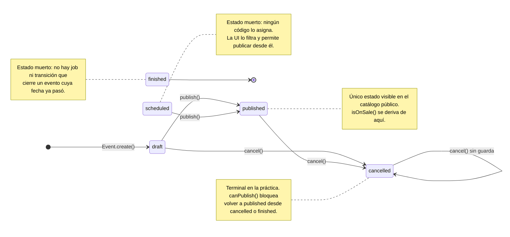

---

## 10. Trazabilidad: proceso → endpoint → código → estado

| Proceso | Endpoint(s) | Caso de uso / componente | Estado |
|---|---|---|---|
| Crear evento | `POST /events` | `CreateEventUseCase`, `flyer-storage` | ✅ Implementado |
| Editar evento | `PATCH /events/{id}` | `UpdateEventUseCase` | ✅ Implementado, incluye flyer y taxonomías |
| Publicar evento | `POST /events/{id}/publish` | `PublishEventUseCase` | ⚠️ `canPublish()` casi no valida |
| Cancelar evento | `POST /events/{id}/cancel` | `CancelEventUseCase` | ⚠️ El motivo se valida y se descarta, y nadie escucha el evento |
| Crear tipo de entrada | `POST /ticket-types` | `CreateTicketTypeUseCase` | ✅ Implementado |
| Editar tipo de entrada y stock | — | — | ❌ No existe ni en el API ni en el panel (ver SD-07b) |
| Pausar la venta de un tramo | — | — | ❌ `paused` y `sold_out` son estados muertos |
| Consumo del stock | — (interno al checkout) | `InventoryPort`, `CHECK sold <= stock` | ✅ Implementado con doble barrera |
| Agenda pública | `GET /events`, `/events/trending`, `/events/upcoming` | `ListEventsUseCase` y hermanos | ✅ Implementado con ISR |
| Agenda de administración | `GET /events/mine?localId=`, `GET /events/manage/{id}` | `ListMyEventsUseCase`, `GetMyEventUseCase` | ⚠️ Exige `localId`, no hay vista por empresa |
| Métricas del local | `GET /events/stats/{localId}` | `GetLocalStatsUseCase` | ⚠️ Una petición por local, agregación en el cliente |
| Estados del evento | — | `EventStatus`, `Event.canPublish()` | ⚠️ `scheduled` y `finished` sin uso |

---

## 11. Brechas y riesgos detectados al levantar los flujos

Hallazgos de la lectura del código, ordenados por impacto. No forman parte del pedido, pero
condicionan la fidelidad de los diagramas.

1. **No se puede tocar un tipo de entrada después de crearlo.** Solo existen `POST /ticket-types` y la
   lectura. No hay forma de corregir un precio mal puesto, ampliar el stock de un tramo que se agotó
   ni cortar la venta. Es el hueco funcional más grande del bloque de inventario, y la propia tabla
   del panel lo documenta en el código.
2. **`paused` y `sold_out` son estados muertos.** `TicketTypeStatus` los define y el checkout ya
   rechaza todo lo que no sea `active`, pero ningún código los asigna nunca. Agotar el stock deja
   `remaining` en cero sin cambiar el estado.
3. **La ventana de venta no se aplica.** `saleStartsAt` y `saleEndsAt` se persisten al crear el tramo,
   pero el checkout solo comprueba `status === 'active'`. Un tramo con venta programada para el
   próximo mes se puede comprar hoy.
4. **El aforo del evento no limita nada.** `Event.hasCapacityFor()` existe en el dominio y no se
   invoca desde ningún sitio, y `SaleEvent` ni siquiera expone `totalCapacity`. Un evento con aforo
   100 vende 500 si sus tramos suman 500. Hoy `totalCapacity` solo alimenta el porcentaje de ocupación
   de la ficha y de la tabla.
5. **El motivo de cancelación se pide, se valida y se tira.** `cancelEventSchema` exige `reason` de 3
   a 255 caracteres, el controller lo recibe en un parámetro sin usar y `CancelEventUseCase` ni
   siquiera lo acepta. No se persiste ni se comunica a nadie.
6. **`EventPublished` y `EventCancelled` no tienen suscriptores.** Cancelar un evento no avisa a quien
   ya compró, no genera reembolso y no invalida las entradas emitidas: quedan `valid` y pasarían el
   control de puerta.
7. **`canPublish()` casi no valida.** Solo bloquea `cancelled` y `finished`. Se puede publicar un
   evento sin ningún tipo de entrada, sin flyer y con fecha pasada, y quedará en el catálogo público.
8. **`scheduled` y `finished` nunca se asignan.** No hay job ni transición que cierre eventos cuya
   fecha ya pasó, así que el catálogo depende de que alguien cancele a mano.
9. **No hay agenda por empresa.** `GET /events/mine` exige `localId`: con varios locales hay que
   consultar uno por uno. El dashboard hace lo mismo con `GET /events/stats/{localId}` y suma en el
   cliente, así que el coste crece linealmente con el número de locales.
10. **Se pueden añadir tramos a un evento ya publicado y a la venta** sin ninguna comprobación de
    estado. Puede ser deliberado, pero conviene decidirlo explícitamente.

---

## 12. Mantenimiento

- **Fuente de verdad funcional:** `../der_class/PROJECT_SPECS.md` (§N). Toda desviación se registra
  como ADR en `docs/adr/`.
- Al cambiar un caso de uso de `apps/api/src/modules/events/`, el `InventoryPort` de `ticketing` o los
  componentes del panel de local, actualizar el diagrama correspondiente **en el mismo PR** y revisar
  la tabla del §10.
- Antes de mergear, ejecutar el comando de validación de §3.6: los 14 diagramas deben renderizar.
- Los diagramas nombran casos de uso, endpoints y columnas reales a propósito: un `grep` del nombre en
  el repo debe encontrar el código. Si no lo encuentra, el diagrama está desactualizado.
