# Entradas y validación — Diagramas de secuencia y flujo de protocolo

**Serie:** [Diagramas de secuencia](./README.md) · **Dominio 5 del DER** — *Checkout, Payments & Tickets* (§4.1 de `PROJECT_SPECS.md`)

> **Alcance.** Cuatro procesos del dominio *Entradas y validación*, agrupados en cinco bloques y
> representados con **13 diagramas de secuencia Mermaid** en formato *protocol data flow*: cada flecha
> lleva su método, ruta, código de estado y forma del payload; cada fase del pipeline va marcada con un
> banner. Reflejan el código real de `apps/api` (módulos `ticketing` y `promoters`), `apps/worker`
> (outbox relay + procesador de notificaciones), `apps/web` (checkout y billetera) y `apps/validator`
> (app de puerta con cola offline).
>
> Mismo estándar de notación que `docs/diagramas-secuencia/01-identidad-acceso.md`.
> Fecha de levantamiento: 2026-07-28 · Rama `feat/rebrand-ravenue`.

---

## 1. Índice

| # | Diagrama | Proceso cubierto |
|---|---|---|
| SD-A | [Barreras anti-sobreventa y anti-doble-cobro](#sd-a--barreras-anti-sobreventa-y-anti-doble-cobro) | sub-flujo compartido |
| SD-B | [Outbox, relay y worker](#sd-b--outbox-relay-y-worker) | sub-flujo compartido |
| SD-01 | [Acceso al checkout y precondiciones](#sd-01--acceso-al-checkout-y-precondiciones) | Compra estándar |
| SD-02 | [Compra estándar: checkout y pago](#sd-02--compra-estándar-checkout-y-pago) | Compra estándar |
| SD-03 | [Idempotencia y reintento seguro](#sd-03--idempotencia-y-reintento-seguro) | Compra estándar |
| SD-04 | [Generación del código single-use](#sd-04--generación-del-código-single-use) | Código promocional |
| SD-05 | [Enlace corto y resolución del código](#sd-05--enlace-corto-y-resolución-del-código) | Canje |
| SD-06 | [Canje: descuento y entrada gratuita](#sd-06--canje-descuento-y-entrada-gratuita) | Entrada gratuita |
| SD-07 | [Emisión del QR y su imagen](#sd-07--emisión-del-qr-y-su-imagen) | Generación de entradas |
| SD-08 | [Entrega asíncrona: PDF y notificaciones](#sd-08--entrega-asíncrona-pdf-y-notificaciones) | Entrega de entradas |
| SD-09 | [Consulta: billetera y detalle de orden](#sd-09--consulta-billetera-y-detalle-de-orden) | Consulta de entradas |
| SD-10 | [Validación QR online en puerta](#sd-10--validación-qr-online-en-puerta) | Validación QR online |
| SD-11 | [Cola offline y sincronización](#sd-11--cola-offline-y-sincronización) | Cola offline |

---

## 2. Agrupación de los procesos

Los cuatro procesos son un solo recorrido: se compra, se emite, se entrega, se consulta y se quema en
puerta. Dos mecanismos transversales aparecen en casi todos los diagramas y se extraen primero: las
**barreras de concurrencia** del checkout y la **cadena de entrega asíncrona** por outbox.

| Bloque | Procesos | Razón de la agrupación |
|---|---|---|
| **0 · Sub-flujos compartidos** | — | Las barreras anti-sobreventa (SD-A) gobiernan compra estándar y canje por igual. La cadena outbox → relay → worker (SD-B) entrega tanto entradas como correos de identidad. |
| **1 · Compra estándar** | Compra estándar de entradas | Se parte en tres: precondiciones de acceso, transacción de compra, y el mecanismo de idempotencia, que tiene su propia máquina de estados. |
| **2 · Códigos promocionales** | Código promocional, canje y entrada gratuita | Recorrido completo del código: lo genera el promotor (SD-04), lo comparte por enlace corto (SD-05) y se canjea en el checkout (SD-06). La entrada gratuita no es un flujo aparte: es un descuento del 100 %. |
| **3 · Generación, entrega y consulta** | Generación, entrega y consulta de entradas | Tres momentos distintos: el token del QR nace síncrono en la Tx, la imagen y el PDF llegan asíncronos, y la billetera los lee después. |
| **4 · Validación** | Validación QR online y cola offline | El veredicto de puerta es una máquina de cuatro estados con marca atómica. La cola offline es la degradación de ese mismo flujo cuando no hay red. |

---

## 3. Convenciones de notación

Estándar de la serie. La fuente canónica es `.claude/skills/sincronizar-diagramas-secuencia/references/notacion.md`.

### 3.1 Estructura

1. **`autonumber` siempre.** Permite referenciar un paso concreto en revisiones ("falla en el paso 7").
2. **Un diagrama = un caso de uso.** Si un flujo supera ~40 mensajes o los 8 participantes, se parte y
   se referencia con una nota (`note over X: ver SD-A`).
3. **Máximo 8 participantes.** Por encima, el diagrama deja de leerse en pantalla.
4. **Declaración explícita de participantes al inicio**, en orden de aparición izquierda → derecha
   (usuario → cliente → borde → aplicación → dominio → infraestructura). Nunca declarar por primera
   vez a mitad del diagrama: el orden visual se desordena.
5. **`actor` para personas, `participant` para sistemas.** Alias corto en mayúsculas (`UC`, `DB`),
   etiqueta legible con `as`.

### 3.2 Flujo de protocolo

Regla central de este documento: **el diagrama debe poder contrastarse contra el tráfico real.**

6. **Toda petición lleva su respuesta.** Ninguna flecha `->>` de red se queda sin su `-->>` con código
   de estado y forma del payload. Si no hay respuesta, es un `-)` (asíncrono) y se dice por qué.
7. **Anotación de protocolo en la ida:** `MÉTODO /ruta · cabecera o cuerpo relevante`.
   Ejemplo: `GET /api/v1/{recurso}/{id} · Authorization Bearer {accessToken}`.
8. **Anotación de resultado en la vuelta:** `código · payload`.
   Ejemplo: `409 · problem+json { code: {contexto}/{error} }`.
9. **Infraestructura con su comando real**, no con una paráfrasis: `UPDATE ticket SET status = 'used' WHERE status = 'valid'`,
   `SET NX EX 86400`, `INSERT OR IGNORE`. Hace el diagrama auditable
   contra los adapters Drizzle y Redis.
10. **Placeholders entre llaves**, nunca entre `<` `>` (Mermaid los interpreta como HTML): `{orderId}`.

### 3.3 Fases

11. **Banners de fase** con `note over A, B: Fase N · Nombre (componente real)`, abarcando los
    participantes implicados en ese tramo. Convierten un muro de flechas en un flujo legible por
    etapas y hacen explícito qué componente gobierna cada una.
12. **Notas de invariante** (`note over X:`) reservadas para reglas de seguridad, decisiones de diseño
    y brechas conocidas. Nunca para narrar lo que la flecha ya dice.
13. Saltos de línea en notas con `<br/>` para no ensanchar el diagrama.

### 3.4 Arrows y bloques de control

| Notación | Significado |
|---|---|
| `->>` | Llamada síncrona: el emisor espera respuesta |
| `-->>` | Respuesta o retorno, con código de estado |
| `-)` | Asíncrono fire-and-forget: publicación de evento, encolado |
| `X->>X` | Cómputo interno que cambia estado o toma una decisión (hash, firma, validación) |

| Bloque | Uso |
|---|---|
| `alt` / `else` | Caminos mutuamente excluyentes (éxito vs. error de negocio) |
| `opt` | Tramo que puede no ejecutarse y no tiene alternativa |
| `critical` | Transacción atómica (`UnitOfWork`): si algo falla, nada se persiste |
| `par` / `and` | Señales concurrentes e independientes |
| `loop` | Repetición acotada (reintentos, generación de código único) |

### 3.5 Cierre

14. **Cada diagrama termina en el efecto observable**: lo que ve el usuario, la cookie fijada o el
    documento devuelto. Un diagrama que acaba en una llamada interna está incompleto.

### 3.6 Higiene sintáctica

15. **Nada de `;` dentro de un mensaje o una nota.** Mermaid corta la sentencia ahí y el diagrama deja
    de compilar. Usar coma o punto.
16. Nada de `<` `>` sin escapar, incluidas las flechas de función de JavaScript (ver regla 10).
17. Los nombres de casos de uso, guards, endpoints y claves de Redis se copian **tal cual del código**:
    un `grep` del nombre debe encontrar el fuente.
18. **Los diagramas TO-BE nombran componentes que no existen todavía** y lo señalan en el propio participante o en una nota. Los AS-IS nombran archivos reales.

### 3.7 Validación

```bash
npx -y @mermaid-js/mermaid-cli@11 \
  -i docs/diagramas-secuencia/05-entradas-validacion.md \
  -o /tmp/05-entradas-validacion.md
```

También sirven mermaid.live y la extensión *Markdown Preview Mermaid Support* de VS Code. GitHub
renderiza estos bloques de forma nativa.

---

## 4. Catálogo de participantes

| Alias | Componente real | Archivo |
|---|---|---|
| `U` | Persona compradora, promotora o validadora | — |
| `CF` | `useCheckoutForm` — estado, reglas y submit del checkout | `apps/web/components/checkout/use-checkout-form.ts` |
| `PG` | Server Component de una ruta | `apps/web/app/**` |
| `EDGE` | Pipeline global del API: `RateLimit → Auth → Roles` + `ZodValidationPipe` | `apps/api/src/edge/**` |
| `UC` | Caso de uso (capa aplicación) | `apps/api/src/modules/**/application/use-cases/**` |
| `LOCK` | `LockPort` sobre Redis (`RedisLockAdapter`) | `apps/api/src/shared/locking/**` |
| `IDEM` | `RedisIdempotencyStore` | `.../ticketing/infrastructure/persistence/redis-idempotency.store.ts` |
| `INV` | `InventoryPort` — stock de tipos de entrada y contadores del evento | `.../ticketing/domain/ports/inventory.repository.ts` |
| `PAY` | `PaymentPort` → `MockPaymentAdapter` | `.../ticketing/infrastructure/payment/mock-payment.adapter.ts` |
| `PROMO` | `PromoRedemptionPort` → `PromoRedemptionService` (implementado por Promoters) | `apps/api/src/shared/ports/promo-redemption.port.ts` |
| `BUS` | `EventBus` in-process | `apps/api/src/shared/event-bus/event-bus.ts` |
| `OBX` | `OutboxPort` → `DrizzleOutboxAdapter` (tabla `outbox`) | `apps/api/src/shared/outbox/drizzle-outbox.adapter.ts` |
| `RELAY` | `OutboxRelay` — drena la tabla y encola en BullMQ | `apps/worker/src/outbox/outbox-relay.service.ts` |
| `WK` | `NotificationsProcessor` — PDF, notificaciones y envío | `apps/worker/src/processors/notifications.processor.ts` |
| `ST` | `StoragePort` — S3 compatible | `apps/api/src/shared/adapters/storage/**` |
| `VAL` | App de puerta (Expo) | `apps/validator/**` |
| `SQL` | SQLite local del validador | `apps/validator/lib/offline-cache.ts` |
| `DB` | PostgreSQL vía Drizzle | `packages/db/src/schema/**` |

---

## 5. Bloque 0 · Sub-flujos compartidos

### SD-A · Barreras anti-sobreventa y anti-doble-cobro

Cinco barreras encadenadas protegen el inventario. Ninguna sustituye a las otras: la primera reduce
la contención, la última es la garantía dura.

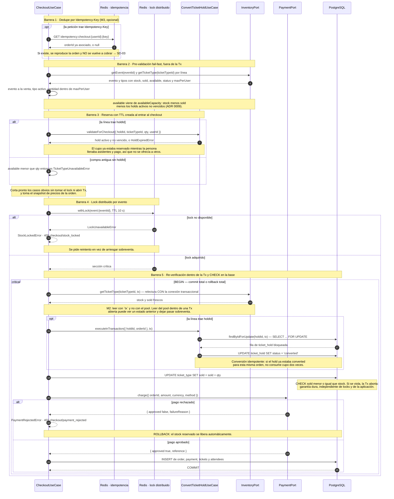

### SD-B · Outbox, relay y worker

Cadena de entrega asíncrona. La usa el checkout (`send-order-tickets`) y también Identidad
(`send-verification-email`, `send-welcome-email`).

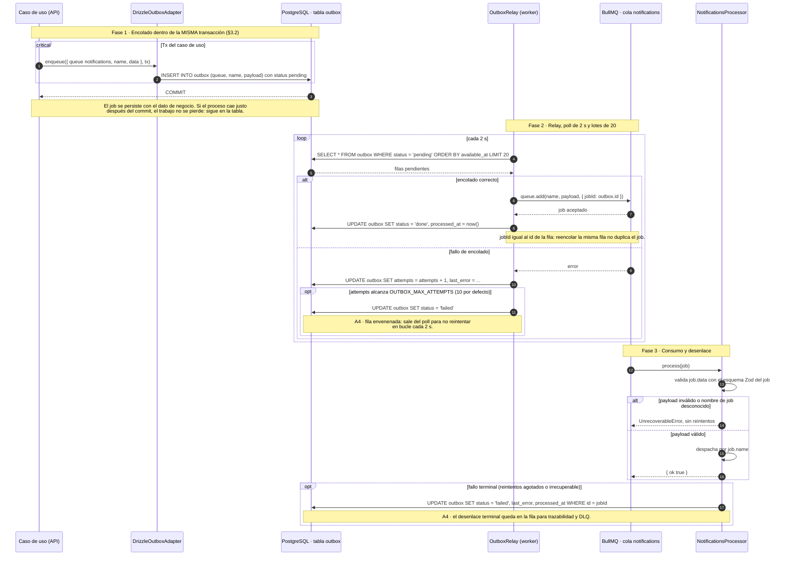

---

## 6. Bloque 1 · Compra estándar

### SD-01 · Acceso al checkout y precondiciones

Ruta `/checkout` (Server Component). Cuatro compuertas antes de mostrar el formulario.

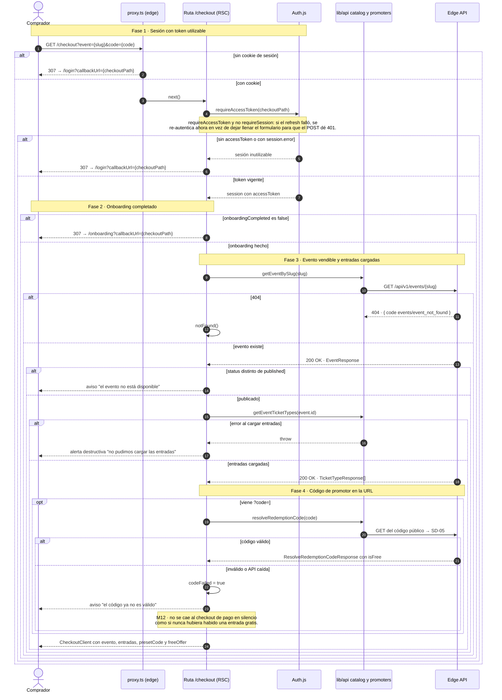

### SD-02 · Compra estándar: checkout y pago

`POST /api/v1/orders/checkout` · autenticado · `CheckoutUseCase`. Crear y pagar ocurren en un solo
paso dentro de una transacción.

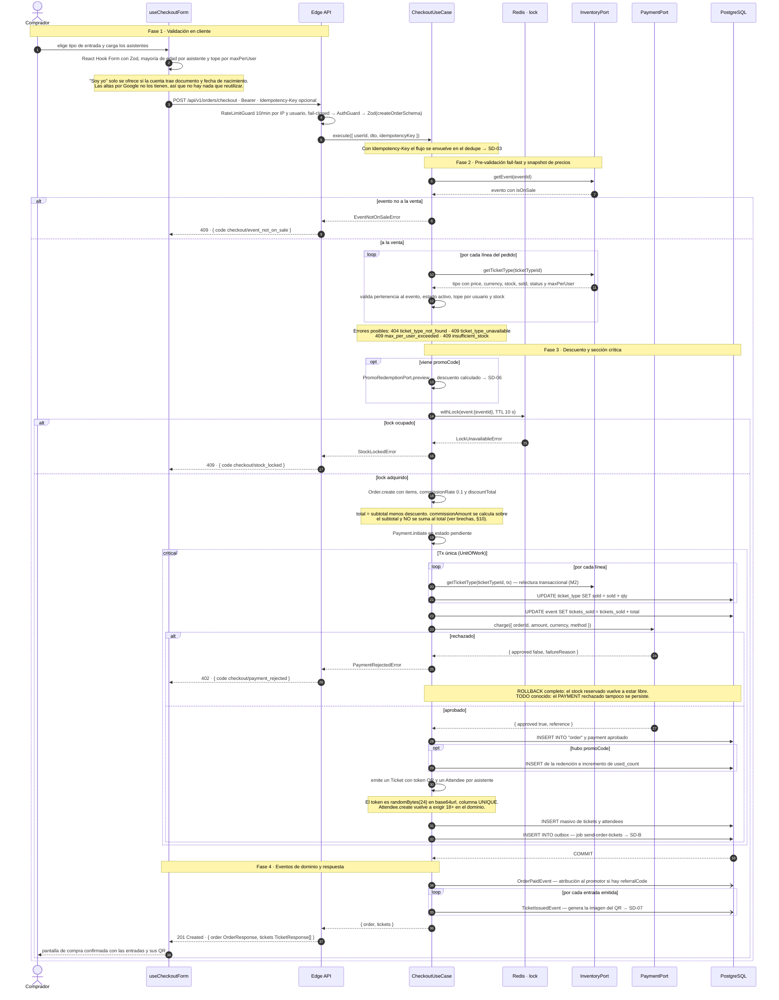

### SD-03 · Idempotencia y reintento seguro

Cabecera `Idempotency-Key` en `POST /orders/checkout`. Evita el doble cobro cuando el cliente
reintenta por timeout o por doble clic.

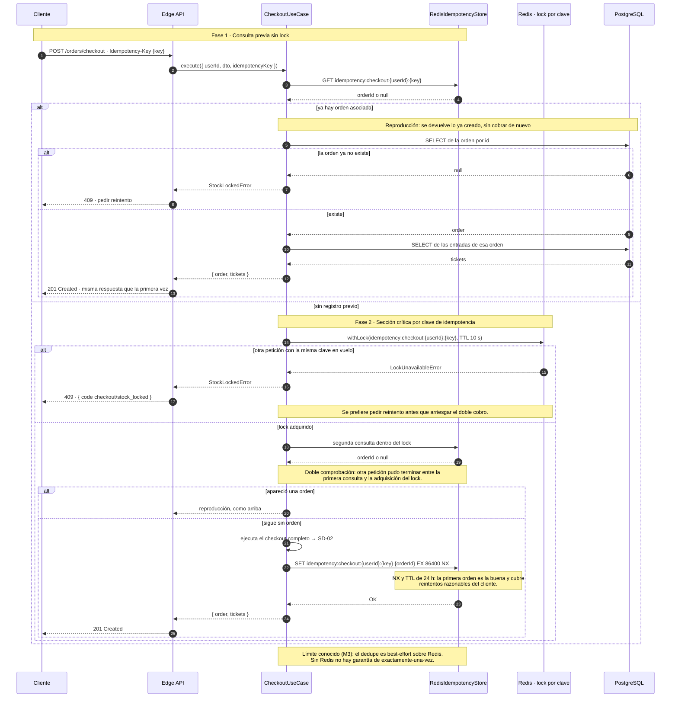

---

## 7. Bloque 2 · Código promocional, canje y entrada gratuita

### SD-04 · Generación del código single-use

`POST /api/v1/promoters/me/redemption-codes` · `@Roles('promoter')` · `GenerateRedemptionCodeUseCase`

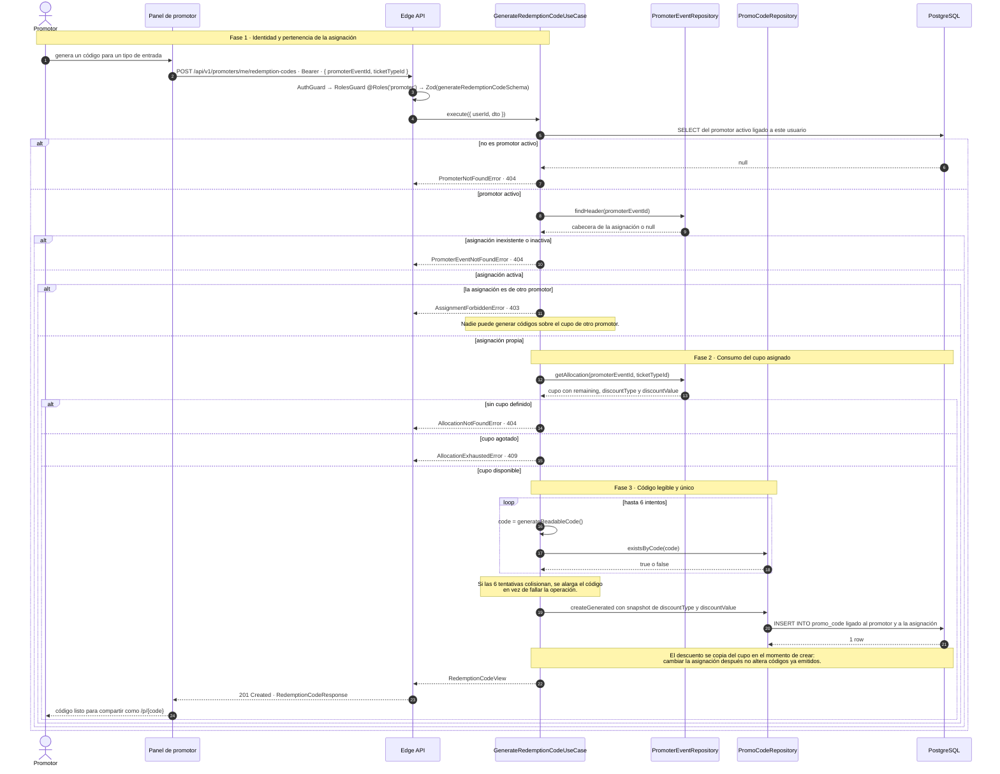

### SD-05 · Enlace corto y resolución del código

`GET /p/{code}` (Route Handler de Next) + `ResolveRedemptionCodeUseCase` (público).

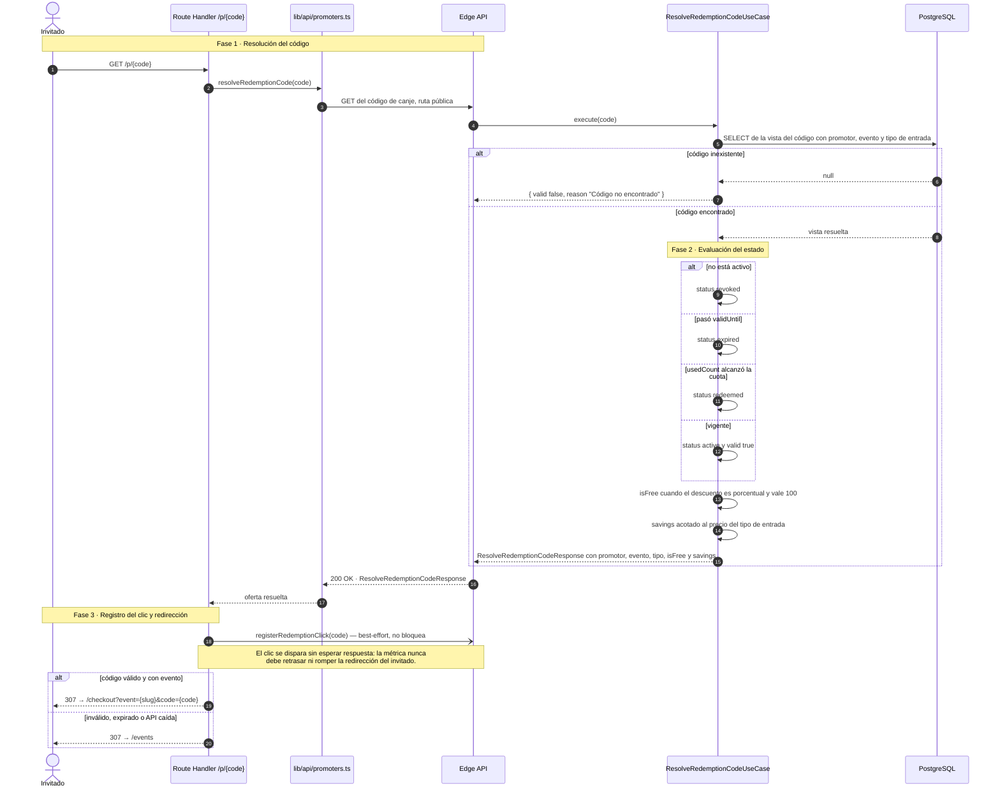

### SD-06 · Canje: descuento y entrada gratuita

`PromoRedemptionPort` — puerto público de Promoters consumido por Ticketing dentro del checkout.

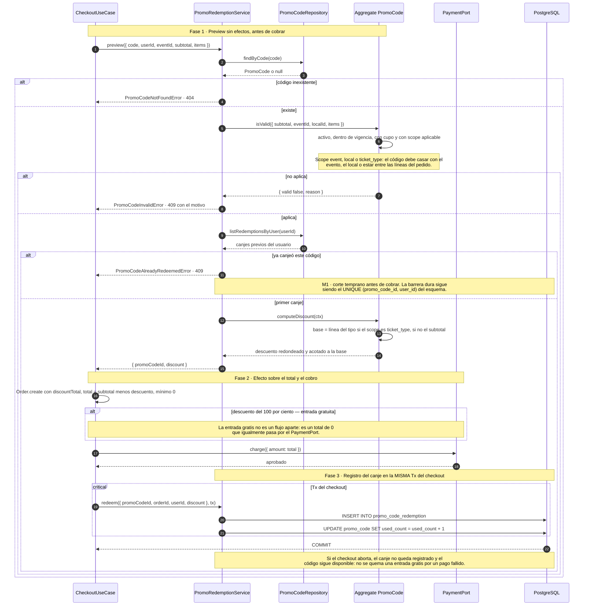

---

## 8. Bloque 3 · Generación, entrega y consulta de entradas

### SD-07 · Emisión del QR y su imagen

El token nace síncrono dentro de la transacción. La imagen se genera después, por evento.

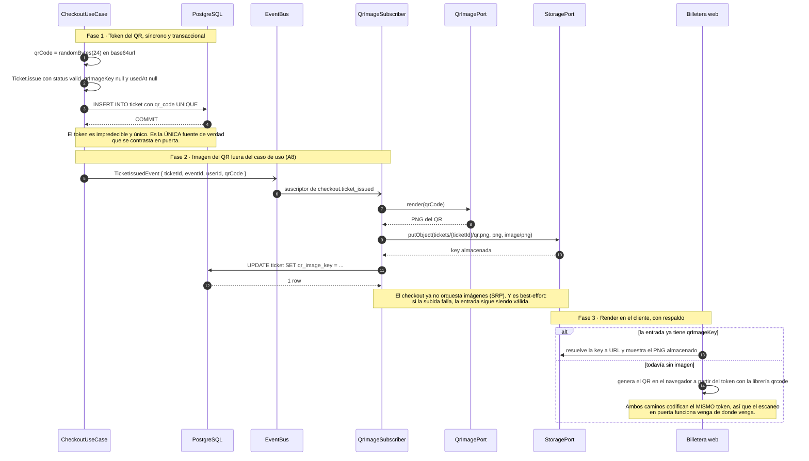

### SD-08 · Entrega asíncrona: PDF y notificaciones

Job `send-order-tickets`, encolado en la Tx del checkout y consumido por el worker.

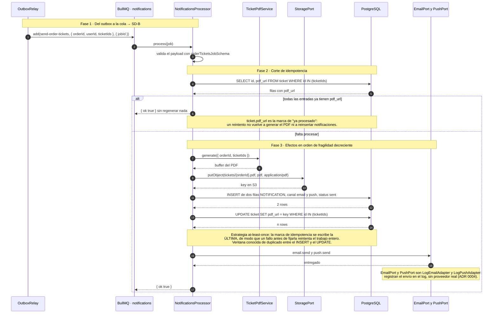

### SD-09 · Consulta: billetera y detalle de orden

`GET /api/v1/tickets/me` y `GET /api/v1/orders/{id}` · ambos autenticados.

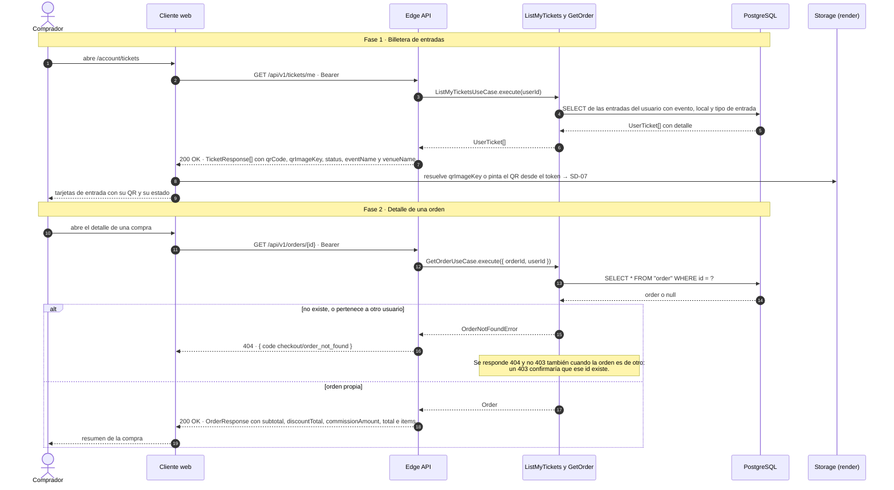

---

## 9. Bloque 4 · Validación en puerta

### SD-10 · Validación QR online en puerta

`POST /api/v1/validations/scan` · `@Roles('validator')` · `ValidateQrUseCase`

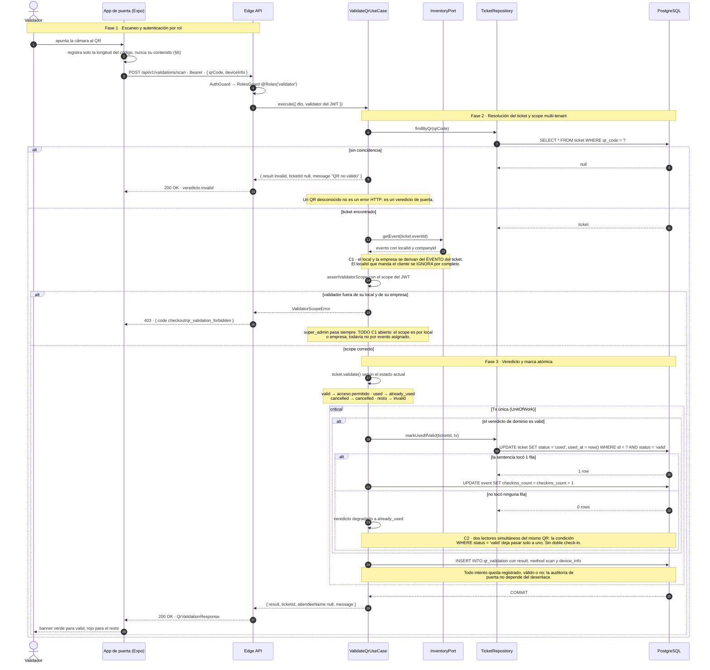

### SD-11 · Cola offline y sincronización

`apps/validator` — online-first con degradación a SQLite local cuando falla la red.

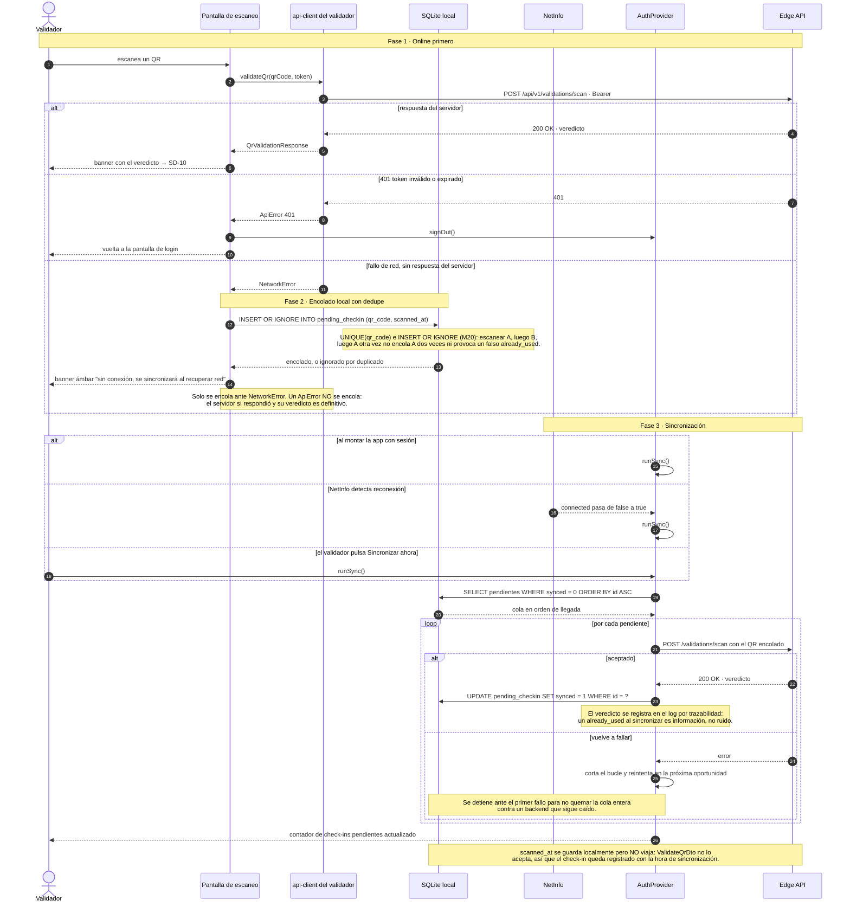

---

## 10. Trazabilidad: proceso → endpoint → código → estado

| Proceso | Endpoint(s) | Caso de uso / componente | Estado |
|---|---|---|---|
| Compra estándar | `POST /orders/checkout` | `CheckoutUseCase`, `LockPort`, `UnitOfWork`, `ConvertTicketHoldUseCase` | ✅ Implementado con cinco barreras anti-sobreventa (ADR 0009) |
| Reserva de cupo con TTL | `POST /ticket-holds` | `CreateTicketHoldUseCase`, `MaintenanceProcessor` (job `expire-ticket-holds`) | ✅ Implementado — TTL configurable por `TICKET_HOLD_TTL_SECONDS` |
| Idempotencia de compra | `POST /orders/checkout` + `Idempotency-Key` | `RedisIdempotencyStore` | ⚠️ Best-effort sobre Redis (M3) |
| Pago | — (interno al checkout) | `PaymentPort` → `MockPaymentAdapter` | ⚠️ Mock que aprueba siempre, sin pasarela real |
| Código promocional | `POST /promoters/me/redemption-codes`, `GET /promoters/me/redemption-codes` | `GenerateRedemptionCodeUseCase` | ✅ Implementado |
| Resolución y enlace corto | `GET /p/{code}` (web), resolución pública del código | `ResolveRedemptionCodeUseCase` | ✅ Implementado |
| Canje y entrada gratuita | — (dentro del checkout) | `PromoRedemptionPort`, `PromoCode.computeDiscount` | ✅ Implementado — gratis es descuento del 100 % |
| Validación de promo en preview | `POST /promo-codes/validate` | `ValidatePromoCodeUseCase` | ✅ Implementado |
| Generación de entradas | — (dentro del checkout) | `Ticket.issue`, `QrImageSubscriber`, `QrcodeImageAdapter` | ✅ Implementado, imagen best-effort |
| Entrega de entradas | job `send-order-tickets` | `OutboxRelay`, `NotificationsProcessor`, `TicketPdfService` | ⚠️ PDF y S3 reales, envío de correo y push en stub (ADR 0004) |
| Consulta de entradas | `GET /tickets/me`, `GET /orders/{id}` | `ListMyTicketsUseCase`, `GetOrderUseCase` | ✅ Implementado |
| Validación QR online | `POST /validations/scan` | `ValidateQrUseCase`, `markUsedIfValid` | ✅ Implementado con marca atómica |
| Cola offline | — (local en el dispositivo) | `offline-cache.ts`, `AuthProvider.runSync` | ⚠️ Funciona, pero pierde la hora real del escaneo |

---

## 11. Brechas y riesgos detectados al levantar los flujos

Hallazgos de la lectura del código, ordenados por impacto. No forman parte del pedido, pero
condicionan la fidelidad de los diagramas.

1. **La comisión se calcula pero no se cobra.** `commissionAmount = subtotal * 0.1` y
   `total = subtotal - discountTotal`: la comisión **no** se suma al total. Hoy es un dato informativo
   en la orden. Conviene confirmar si el modelo es "comisión descontada al local" o si falta sumarla
   al cargo del comprador.
2. **Un pago rechazado no deja rastro.** El `PAYMENT` en estado rechazado se crea dentro de la Tx y el
   rollback lo descarta (TODO M3 anotado en el propio código). Sin trazabilidad de intentos fallidos
   no hay forma de investigar una disputa. Con pasarela real habría que sacar el cobro de la Tx y
   compensar.
3. **`MockPaymentAdapter` aprueba siempre.** La rama de rechazo del diagrama es inalcanzable en
   ejecución: no existe pasarela real, y por tanto tampoco reembolsos ni cancelación de órdenes.
4. **El check-in offline pierde su hora real.** `scannedAt` se persiste en SQLite pero no viaja:
   `ValidateQrDto` no lo acepta. Un lote sincronizado a las 3 a.m. queda registrado con esa hora, no
   con la del escaneo en puerta. Afecta a cualquier informe de aforo por franja.
5. **El validador no ve el nombre del asistente.** `QrValidationResponse.attendeeName` se devuelve
   siempre en `null`, así que en puerta no se puede contrastar el documento contra el titular de la
   entrada, que es justamente la razón de pedir los datos de cada asistente en el checkout.
6. **El scope del validador es por local o empresa, no por evento.** Un validador con scope en un
   local puede validar entradas de cualquier evento de ese local, incluidos los que no le asignaron
   (TODO C1 anotado en el código).
7. **El dedupe de checkout depende de Redis.** Sin Redis no hay idempotencia ni lock por evento: la
   defensa que queda es el `CHECK sold <= stock`, que evita la sobreventa pero no el doble cobro.
8. **La cola offline no tiene techo ni caducidad.** Un dispositivo mucho tiempo sin red acumula filas
   indefinidamente, y al sincronizar dispara tantas peticiones como escaneos tenga guardados.
9. **Ventana de duplicado en la entrega.** En `handleOrderTickets`, un crash entre el `INSERT` de las
   filas `NOTIFICATION` y el `UPDATE` de `ticket.pdf_url` duplica las notificaciones en el reintento.
   Está documentado y asumido para el piloto, porque email y push son stubs sin efecto externo.

---

## 12. Mantenimiento

- **Fuente de verdad funcional:** `../der_class/PROJECT_SPECS.md` (§N). Toda desviación se registra
  como ADR en `docs/adr/`.
- Al cambiar `CheckoutUseCase`, `ValidateQrUseCase`, el `PromoRedemptionPort`, el relay del outbox o
  la app de validación, actualizar el diagrama correspondiente **en el mismo PR** y revisar la tabla
  del §10.
- Antes de mergear, ejecutar el comando de validación de §3.6: los 13 diagramas deben renderizar.
- Los diagramas nombran casos de uso, endpoints, claves de Redis y columnas reales a propósito: un
  `grep` del nombre en el repo debe encontrar el código. Si no lo encuentra, el diagrama está
  desactualizado.
