# Promotores y atribución — Diagramas de secuencia y flujo de protocolo

**Serie:** [Diagramas de secuencia](./README.md) · **Dominio 6 del DER** — *Promoters & Promo Codes* (§4.1 de `PROJECT_SPECS.md`)

> **Alcance.** Cinco procesos del dominio *Promotores y atribución*, agrupados en cinco bloques y
> representados con **13 diagramas de secuencia Mermaid** más **1 diagrama de estados** complementario,
> en formato *protocol data flow*: cada flecha lleva su método, ruta, código de estado y forma del
> payload; cada fase del pipeline va marcada con un banner. Reflejan el código real de `apps/api`
> (módulo `promoters`, con sus puertos hacia `identity` y `ticketing`) y `apps/web` (postulación
> pública, panel de local, panel de promotor y enlace corto de compartir).
>
> Mismo estándar de notación que `docs/diagramas-secuencia/01-identidad-acceso.md`.
> Fecha de levantamiento: 2026-07-28 · Rama `feat/rebrand-ravenue`.

---

## 1. Índice

| # | Diagrama | Proceso cubierto |
|---|---|---|
| SD-A | [Tenant y consentimiento en Promoters](#sd-a--tenant-y-consentimiento-en-promoters) | sub-flujo compartido |
| SD-01 | [Postulación pública y revisión](#sd-01--postulación-pública-y-revisión) | Postulación pública |
| SD-02 | [Invitar a un promotor](#sd-02--invitar-a-un-promotor) | Invitar promotor |
| SD-03 | [Aceptar o rechazar el vínculo](#sd-03--aceptar-o-rechazar-el-vínculo) | Aceptar vínculo |
| SD-04 | [Asignar evento y cuotas](#sd-04--asignar-evento-y-cuotas) | Asignación y cuotas |
| SD-05 | [Desasignar un evento](#sd-05--desasignar-un-evento) | Asignación y cuotas |
| SD-06 | [Generar un código desde el cupo](#sd-06--generar-un-código-desde-el-cupo) | Generar códigos |
| SD-07 | [Compartir y resolver el enlace corto](#sd-07--compartir-y-resolver-el-enlace-corto) | Compartir códigos |
| SD-08 | [Canje y consumo del cupo](#sd-08--canje-y-consumo-del-cupo) | Códigos y cuotas |
| SD-09 | [Clics: dos contadores, dos caminos](#sd-09--clics-dos-contadores-dos-caminos) | Clics |
| SD-10 | [Atribución de ventas](#sd-10--atribución-de-ventas) | Atribución de ventas |
| SD-11 | [Liquidación de comisiones](#sd-11--liquidación-de-comisiones) — AS-IS y TO-BE | Liquidación |
| ED-1 | [Máquina de estados del promotor](#ed-1--máquina-de-estados-del-promotor) | Estados |

---

## 2. Agrupación de los procesos

El recorrido es lineal: una persona entra como promotor, la empresa le asigna un evento con cupo,
ese cupo se convierte en códigos, los códigos se comparten y se canjean, y el canje debería producir
una comisión liquidable. Los tres primeros tramos funcionan; el último está partido en dos, y el
diagrama lo refleja.

| Bloque | Procesos | Razón de la agrupación |
|---|---|---|
| **0 · Sub-flujo compartido** | — | El módulo combina dos controles distintos: aislamiento por empresa (`assertTenant`) y consentimiento de la persona invitada (`assertPendingInvitation`). Se extraen una vez en SD-A. |
| **1 · Alta del promotor** | Postulación pública · Invitar y aceptar vínculo | Son dos vías de entrada al mismo aggregate con resultados distintos: la postulación crea el promotor de una vez, la invitación exige que la persona acepte. |
| **2 · Asignación** | Asignar promotor a evento y cuotas | Asignar es un *upsert* idempotente por promotor y evento. Desasignar tiene su propio diagrama porque decide qué pasa con los códigos ya emitidos. |
| **3 · Códigos** | Generar y compartir códigos | Tres momentos: generar consumiendo cupo, compartir por enlace corto y canjear en el checkout. El canje se cuenta aquí desde la óptica del cupo, no del pago. |
| **4 · Atribución y liquidación** | Clics, atribución de ventas y liquidación | Los clics tienen dos contadores independientes, la atribución está inerte y la liquidación no existe. Cada uno merece su diagrama, con AS-IS y TO-BE donde corresponde. |

> **Cruce con otros documentos.** SD-03 amplía SD-12 de *Identidad y acceso* desde la óptica de
> Promoters. SD-06, SD-07 y SD-08 son la contraparte de SD-04, SD-05 y SD-06 de *Entradas y
> validación*: allí se contaron desde el checkout, aquí desde el cupo del promotor.

---

## 3. Convenciones de notación

Estándar de la serie. La fuente canónica es `.claude/skills/sincronizar-diagramas-secuencia/references/notacion.md`.

### 3.1 Estructura

1. **`autonumber` siempre.** Permite referenciar un paso concreto en revisiones ("falla en el paso 7").
2. **Un diagrama = un caso de uso.** Si un flujo supera ~40 mensajes o los 8 participantes, se parte y
   se referencia con una nota (`note over X: ver SD-A`).
3. **Máximo 8 participantes.** Por encima, el diagrama deja de leerse en pantalla.
4. **Declaración explícita de participantes al inicio**, en orden de aparición izquierda → derecha
   (usuario → cliente → borde → aplicación → dominio → infraestructura). Nunca declarar por primera
   vez a mitad del diagrama: el orden visual se desordena.
5. **`actor` para personas, `participant` para sistemas.** Alias corto en mayúsculas (`UC`, `DB`),
   etiqueta legible con `as`.

### 3.2 Flujo de protocolo

Regla central de este documento: **el diagrama debe poder contrastarse contra el tráfico real.**

6. **Toda petición lleva su respuesta.** Ninguna flecha `->>` de red se queda sin su `-->>` con código
   de estado y forma del payload. Si no hay respuesta, es un `-)` (asíncrono) y se dice por qué.
7. **Anotación de protocolo en la ida:** `MÉTODO /ruta · cabecera o cuerpo relevante`.
   Ejemplo: `GET /api/v1/{recurso}/{id} · Authorization Bearer {accessToken}`.
8. **Anotación de resultado en la vuelta:** `código · payload`.
   Ejemplo: `409 · problem+json { code: {contexto}/{error} }`.
9. **Infraestructura con su comando real**, no con una paráfrasis: `UPDATE promo_code SET used_count = used_count + 1`.
   Hace el diagrama auditable
   contra los adapters Drizzle y Redis.
10. **Placeholders entre llaves**, nunca entre `<` `>` (Mermaid los interpreta como HTML): `{promoterId}`.

### 3.3 Fases

11. **Banners de fase** con `note over A, B: Fase N · Nombre (componente real)`, abarcando los
    participantes implicados en ese tramo. Convierten un muro de flechas en un flujo legible por
    etapas y hacen explícito qué componente gobierna cada una.
12. **Notas de invariante** (`note over X:`) reservadas para reglas de seguridad, decisiones de diseño
    y brechas conocidas. Nunca para narrar lo que la flecha ya dice.
13. Saltos de línea en notas con `<br/>` para no ensanchar el diagrama.

### 3.4 Arrows y bloques de control

| Notación | Significado |
|---|---|
| `->>` | Llamada síncrona: el emisor espera respuesta |
| `-->>` | Respuesta o retorno, con código de estado |
| `-)` | Asíncrono fire-and-forget: publicación de evento, encolado |
| `X->>X` | Cómputo interno que cambia estado o toma una decisión (hash, firma, validación) |

| Bloque | Uso |
|---|---|
| `alt` / `else` | Caminos mutuamente excluyentes (éxito vs. error de negocio) |
| `opt` | Tramo que puede no ejecutarse y no tiene alternativa |
| `critical` | Transacción atómica (`UnitOfWork`): si algo falla, nada se persiste |
| `par` / `and` | Señales concurrentes e independientes |
| `loop` | Repetición acotada (reintentos, generación de código único) |

### 3.5 Cierre

14. **Cada diagrama termina en el efecto observable**: lo que ve el usuario, la cookie fijada o el
    documento devuelto. Un diagrama que acaba en una llamada interna está incompleto.

### 3.6 Higiene sintáctica

15. **Nada de `;` dentro de un mensaje o una nota.** Mermaid corta la sentencia ahí y el diagrama deja
    de compilar. Usar coma o punto.
16. Nada de `<` `>` sin escapar, incluidas las flechas de función de JavaScript (ver regla 10).
17. Los nombres de casos de uso, guards, endpoints y claves de Redis se copian **tal cual del código**:
    un `grep` del nombre debe encontrar el fuente.
18. **Los diagramas TO-BE nombran componentes que no existen todavía** y lo señalan en el propio participante o en una nota. Los AS-IS nombran archivos reales.

### 3.7 Validación

```bash
npx -y @mermaid-js/mermaid-cli@11 \
  -i docs/diagramas-secuencia/06-promotores-atribucion.md \
  -o /tmp/06-promotores-atribucion.md
```

También sirven mermaid.live y la extensión *Markdown Preview Mermaid Support* de VS Code. GitHub
renderiza estos bloques de forma nativa.

---

## 4. Catálogo de participantes

| Alias | Componente real | Archivo |
|---|---|---|
| `U` | Persona postulante, invitada, promotora o administradora | — |
| `W` | Componente cliente del panel, o Route Handler del enlace corto | `apps/web/**` |
| `EDGE` | Pipeline global del API: `RateLimit → Auth → Roles` + `ZodValidationPipe` | `apps/api/src/edge/**` |
| `UC` | Caso de uso (capa aplicación) | `apps/api/src/modules/promoters/application/use-cases/**` |
| `DOM` | Aggregates `Promoter`, `PromoCode`, `SaleAttribution` | `.../promoters/domain/entities/**` |
| `PREP` | `PromoterRepository` | `.../infrastructure/persistence/drizzle-promoter.repository.ts` |
| `PEREP` | `PromoterEventRepository` — asignaciones y cupos | `.../drizzle-promoter-event.repository.ts` |
| `PCREP` | `PromoCodeRepository` — códigos, canjes y clics | `.../drizzle-promo-code.repository.ts` |
| `SAREP` | `SaleAttributionRepository` | `.../drizzle-sale-attribution.repository.ts` |
| `TR` | `ResourceTenantResolver` — empresa dueña de un evento, local o tipo de entrada | `apps/api/src/shared/tenant/resource-tenant.port.ts` |
| `BUS` | `EventBus` in-process | `apps/api/src/shared/event-bus/event-bus.ts` |
| `IDN` | `PromoterConfirmedSubscriber` de Identity | `.../identity/application/subscribers/promoter-confirmed.subscriber.ts` |
| `CO` | `CheckoutUseCase` de Ticketing | `.../ticketing/application/use-cases/checkout.use-case.ts` |
| `DB` | PostgreSQL vía Drizzle | `packages/db/src/schema/promoters.ts` |

### Superficie de endpoints

| Método y ruta | Acceso | Caso de uso |
|---|---|---|
| `POST /promoter-applications` | público | `ApplyPromoterUseCase` |
| `POST /promoter-applications/{id}/review` | `admin_local` | `ReviewPromoterApplicationUseCase` |
| `POST /promoters` | `admin_local` | `CreatePromoterUseCase` (invitación) |
| `GET /promoters/mine` | `admin_local` | `ListMyPromotersUseCase` |
| `GET /promoters/me` · `GET /promoters/me/associations` | autenticado | `GetMyPromoterUseCase` · `ListPendingAssociationsUseCase` |
| `POST /promoters/{id}/confirm` · `POST /promoters/{id}/reject` | autenticado | `ConfirmPromoterAssociationUseCase` · `RejectPromoterAssociationUseCase` |
| `POST /promoters/{id}/assignments` · `DELETE /{id}/assignments/{promoterEventId}` | `admin_local` | `AssignEventToPromoterUseCase` · `UnassignEventUseCase` |
| `GET /promoters/{id}/assignments` · `GET /promoters/me/assignments` | `admin_local` · `promoter` | `ListPromoterAssignmentsUseCase` · `ListMyAssignmentsUseCase` |
| `POST /promoters/me/redemption-codes` · `GET /promoters/me/redemption-codes` | `promoter` | `GenerateRedemptionCodeUseCase` · `ListMyRedemptionCodesUseCase` |
| `POST /promoters/referrals/{code}/click` | público | `RegisterReferralClickUseCase` |
| `GET /promoters/{id}/sales` | `promoter` | `ListPromoterSalesUseCase` |
| `POST /promo-codes` · `POST /promo-codes/validate` · `GET /promo-codes/{id}/redemptions` | `admin_local` · público · `admin_local` | `CreatePromoCodeUseCase` · `ValidatePromoCodeUseCase` · `ListPromoCodeRedemptionsUseCase` |

---

## 5. Bloque 0 · Sub-flujo compartido

### SD-A · Tenant y consentimiento en Promoters

El módulo combina dos controles que no son intercambiables: uno protege a la **empresa**, el otro a la
**persona**.

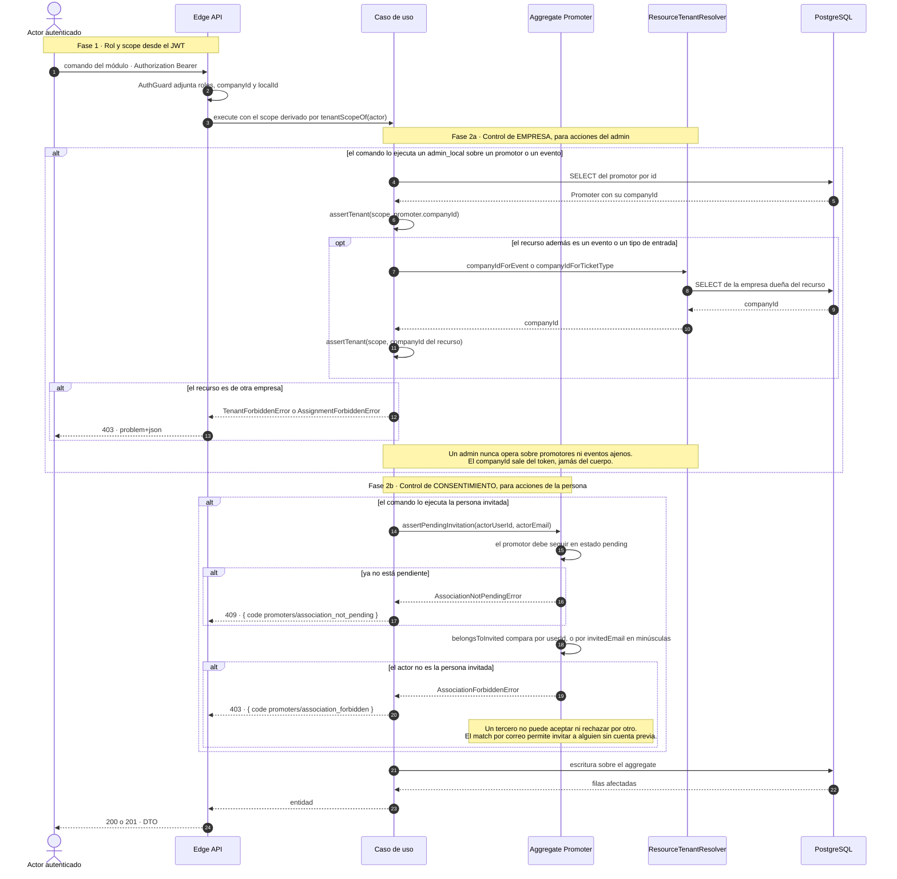

---

## 6. Bloque 1 · Alta del promotor

### SD-01 · Postulación pública y revisión

`POST /api/v1/promoter-applications` (público) y `POST /{id}/review` (`@Roles('admin_local')`)

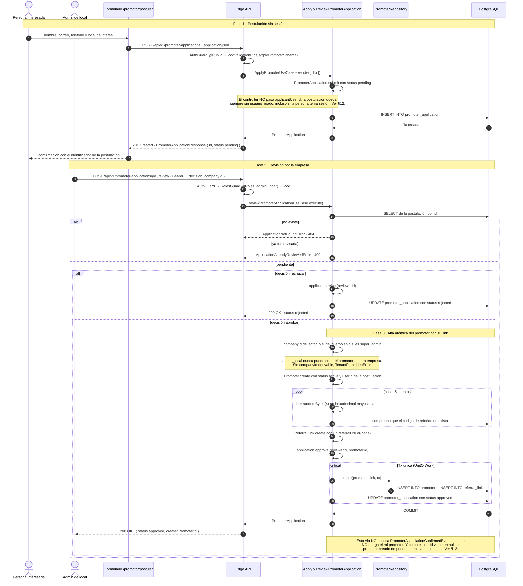

### SD-02 · Invitar a un promotor

`POST /api/v1/promoters` · `@Roles('admin_local')` · `CreatePromoterUseCase`

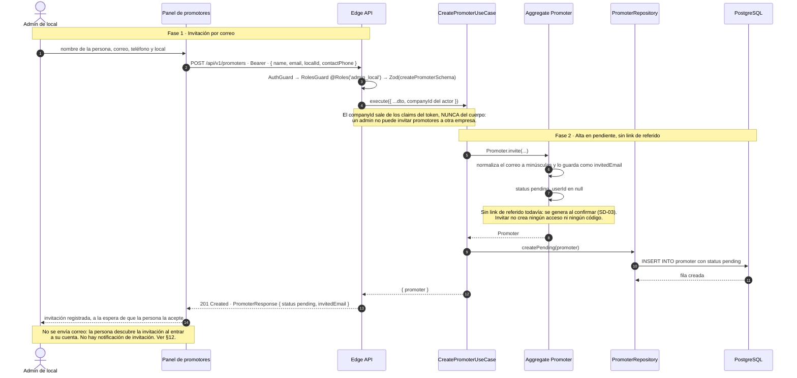

### SD-03 · Aceptar o rechazar el vínculo

`POST /api/v1/promoters/{id}/confirm` y `/reject` · autenticado. Amplía SD-12 de *Identidad y acceso*.

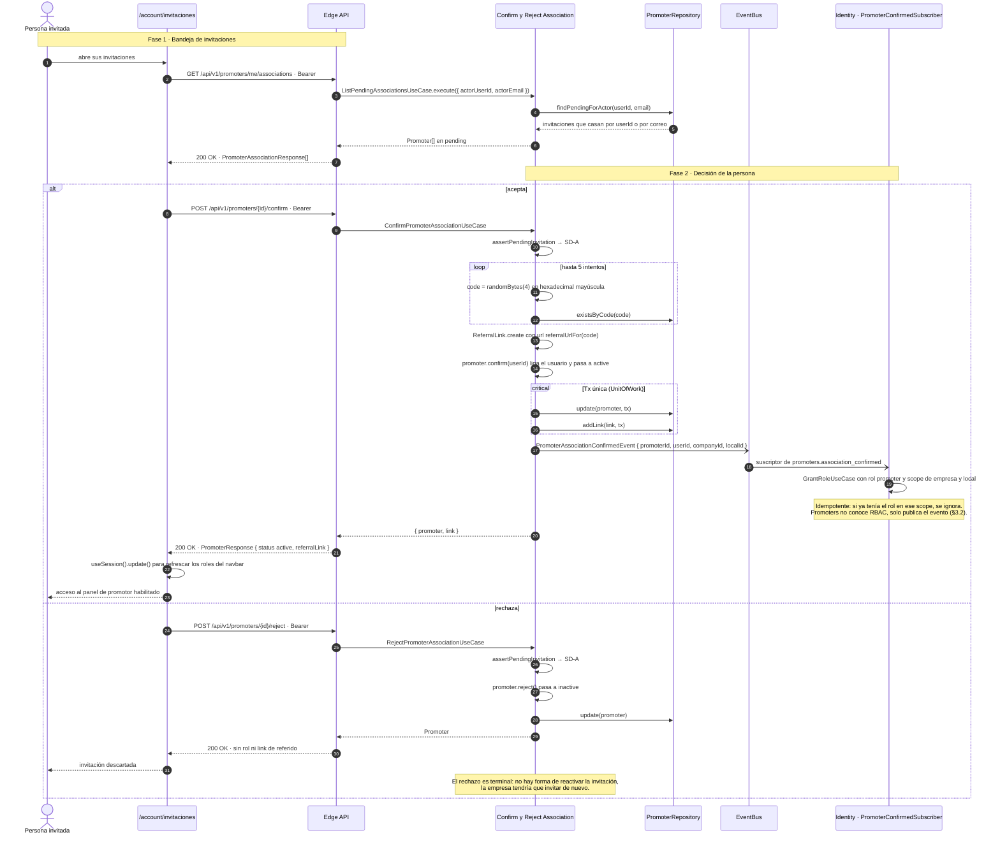

---

## 7. Bloque 2 · Asignación de eventos y cuotas

### SD-04 · Asignar evento y cuotas

`POST /api/v1/promoters/{id}/assignments` · `@Roles('admin_local')` · `AssignEventToPromoterUseCase`

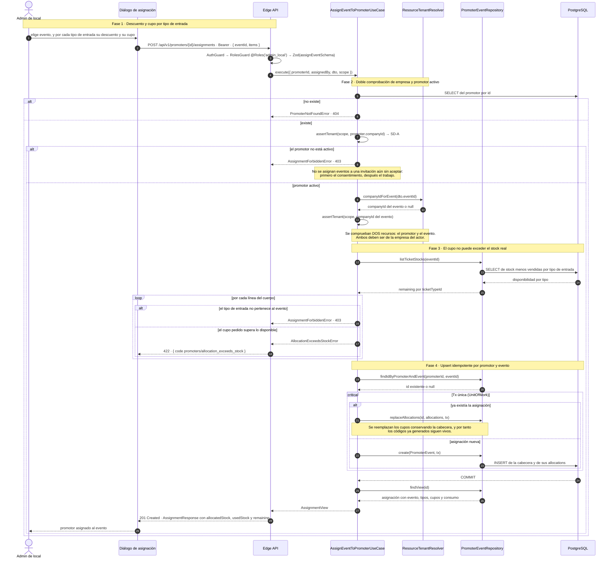

### SD-05 · Desasignar un evento

`DELETE /api/v1/promoters/{id}/assignments/{promoterEventId}` · `@Roles('admin_local')`

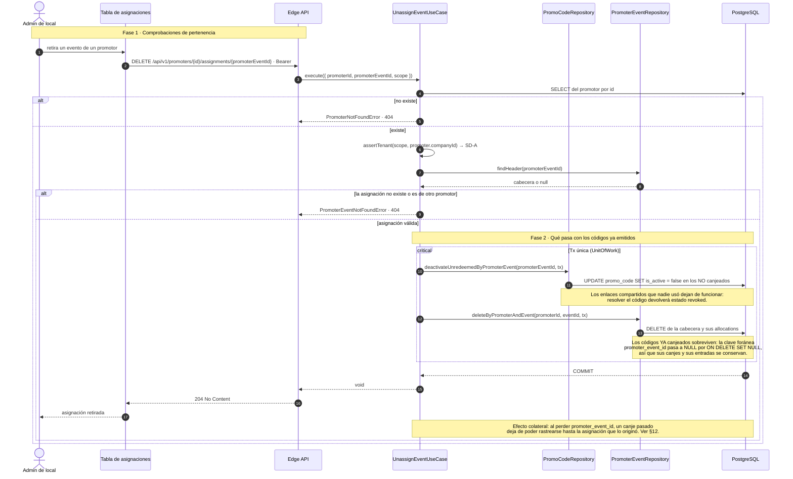

---

## 8. Bloque 3 · Códigos del promotor

### SD-06 · Generar un código desde el cupo

`POST /api/v1/promoters/me/redemption-codes` · `@Roles('promoter')` · `GenerateRedemptionCodeUseCase`

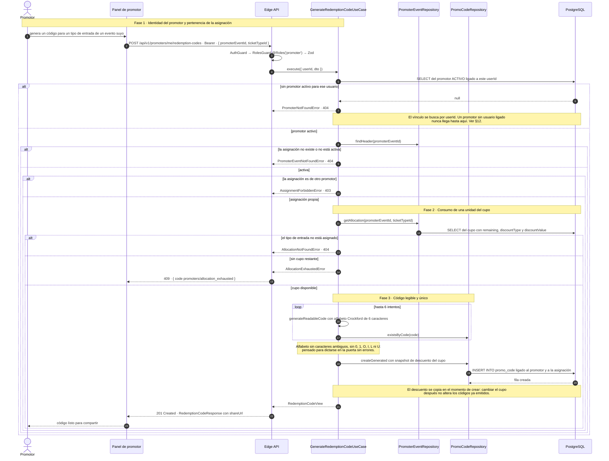

### SD-07 · Compartir y resolver el enlace corto

`GET /p/{code}` en la web y resolución pública del código. Contraparte de SD-05 de *Entradas*.

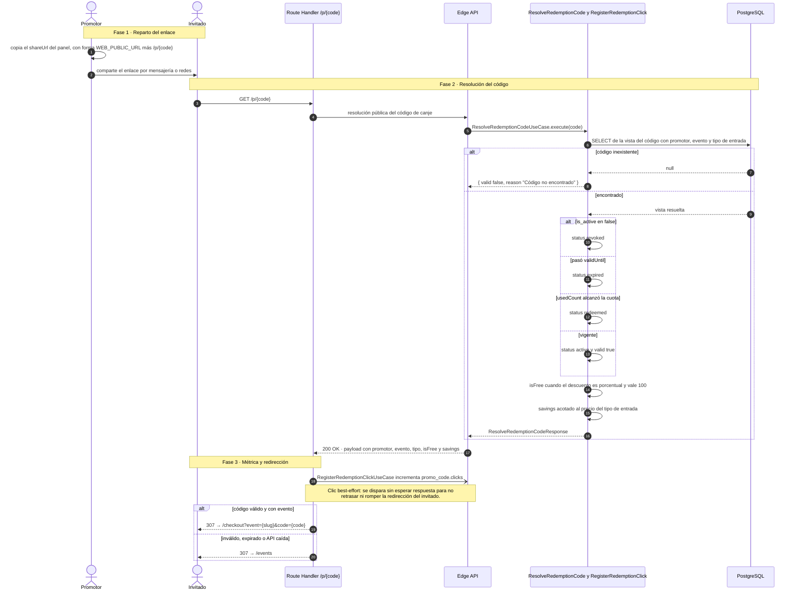

### SD-08 · Canje y consumo del cupo

Vista del canje desde el cupo del promotor. El detalle del descuento está en SD-06 de *Entradas*.

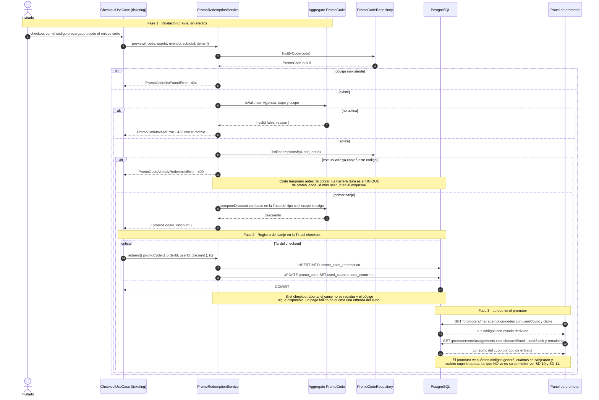

---

## 9. Bloque 4 · Clics, atribución y liquidación

### SD-09 · Clics: dos contadores, dos caminos

Existen dos mecanismos de conteo independientes que nunca se cruzan.

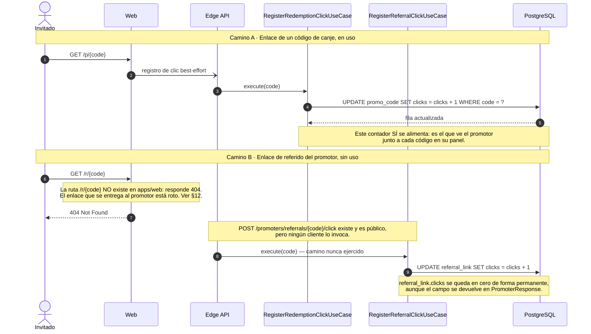

### SD-10 · Atribución de ventas

`AttributeSaleUseCase`, gatillado por `OrderPaid`. Implementado y **hoy inerte**.

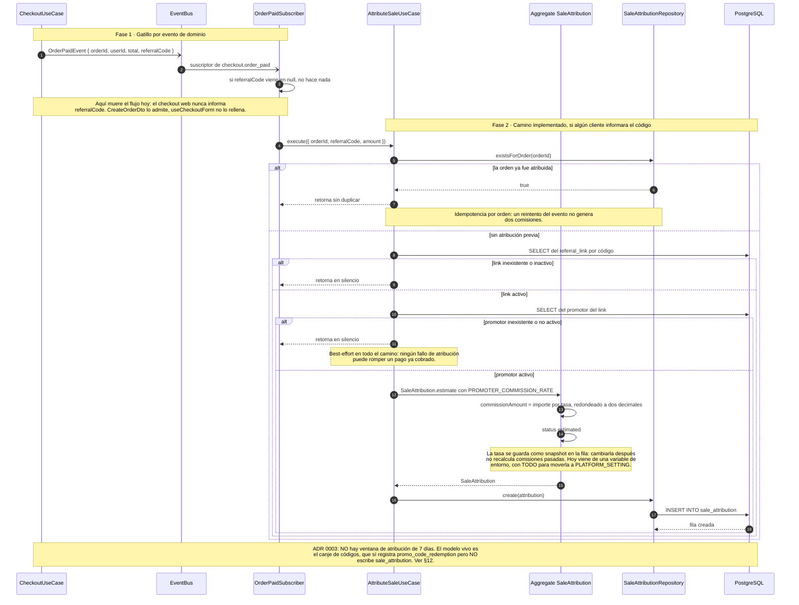

### SD-11 · Liquidación de comisiones

#### SD-11a · Estado actual (AS-IS)

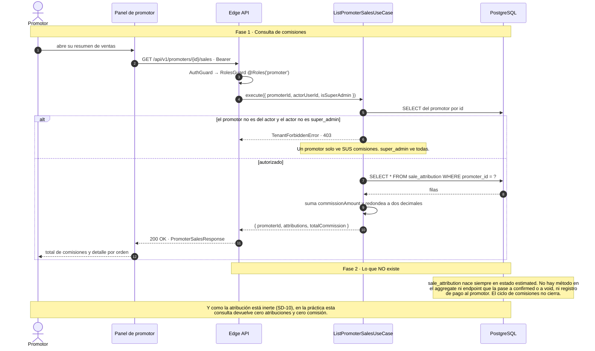

#### SD-11b · Diseño propuesto (TO-BE)

Cierre del ciclo apoyado en piezas que ya existen: el canje de códigos como fuente de verdad, la tasa
de comisión centralizada y los estados ya declarados en `SaleStatus`.

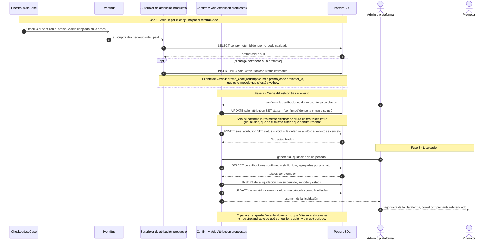

---

## 10. Bloque 5 · Estados

### ED-1 · Máquina de estados del promotor

Complemento a los diagramas de secuencia. Incluye el estado declarado en `PromoterStatus` que nada
asigna.

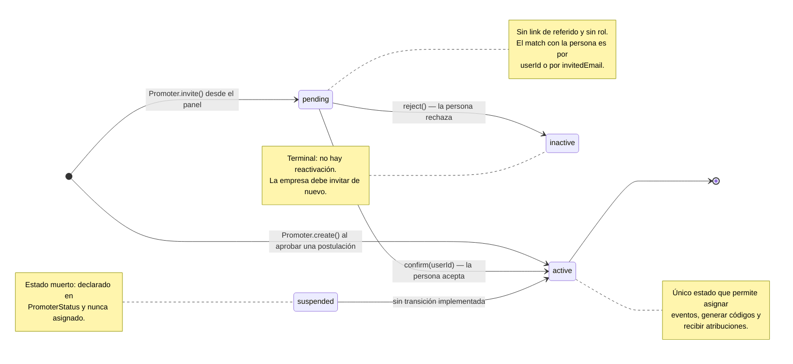

---

## 11. Trazabilidad: proceso → endpoint → código → estado

| Proceso | Endpoint(s) | Caso de uso / componente | Estado |
|---|---|---|---|
| Postulación pública | `POST /promoter-applications` | `ApplyPromoterUseCase` | ⚠️ Nunca liga el usuario postulante |
| Revisión de postulación | `POST /promoter-applications/{id}/review` | `ReviewPromoterApplicationUseCase` | ⚠️ Crea promotor y link, pero no otorga el rol |
| Invitar promotor | `POST /promoters` | `CreatePromoterUseCase` | ✅ Implementado, sin notificación |
| Aceptar o rechazar vínculo | `POST /promoters/{id}/confirm` y `/reject` | `ConfirmPromoterAssociationUseCase`, `PromoterConfirmedSubscriber` | ✅ Implementado, otorga el rol por evento |
| Asignar evento y cuotas | `POST /promoters/{id}/assignments` | `AssignEventToPromoterUseCase` | ✅ Implementado, upsert idempotente |
| Desasignar | `DELETE /promoters/{id}/assignments/{id}` | `UnassignEventUseCase` | ⚠️ Los canjes pasados pierden su asignación |
| Generar código | `POST /promoters/me/redemption-codes` | `GenerateRedemptionCodeUseCase` | ✅ Implementado, consume cupo |
| Compartir código | `GET /p/{code}` en la web | `ResolveRedemptionCodeUseCase` | ✅ Implementado |
| Enlace de referido | `referralUrlFor` genera `/r/{code}` | — | ❌ La ruta no existe en la web |
| Clic de código | `RegisterRedemptionClickUseCase` | `promo_code.clicks` | ✅ En uso |
| Clic de referido | `POST /promoters/referrals/{code}/click` | `RegisterReferralClickUseCase` | ❌ Nadie lo invoca |
| Atribución de ventas | — (suscriptor de `OrderPaid`) | `AttributeSaleUseCase` | ❌ Inerte: nadie envía `referralCode` |
| Consulta de comisiones | `GET /promoters/{id}/sales` | `ListPromoterSalesUseCase` | ⚠️ Implementado, devuelve cero en la práctica |
| Liquidación | — | — | ❌ No existe (ver SD-11b) |

---

## 12. Brechas y riesgos detectados al levantar los flujos

Hallazgos de la lectura del código, ordenados por impacto. No forman parte del pedido, pero
condicionan la fidelidad de los diagramas.

1. **La atribución de ventas está inerte, así que no hay comisiones.** `AttributeSaleUseCase` solo
   actúa si `OrderPaidEvent` trae `referralCode`, y el checkout web nunca lo envía: `CreateOrderDto`
   lo admite pero `useCheckoutForm` no lo rellena. Consecuencia directa: `sale_attribution` no se
   escribe jamás y `GET /promoters/{id}/sales` devuelve siempre cero atribuciones y cero comisión. El
   modelo que sí está vivo, el canje de códigos, no genera atribución alguna. El propio ADR 0003
   documenta el re-cableado pendiente.
2. **No hay liquidación.** `SaleAttribution` nace `estimated` y no existe ningún método en el
   aggregate ni endpoint que la pase a `confirmed` o `void`, ni registro de pago al promotor. Aunque
   se arreglara el punto 1, el ciclo seguiría sin cerrar.
3. **El enlace de referido apunta a una ruta que no existe.** `referralUrlFor` construye
   `{WEB_PUBLIC_URL}/r/{code}` y `apps/web/app/r` no existe: responde 404. Ese es el enlace que se
   entrega al promotor al aprobar su postulación y al confirmar su asociación, y se devuelve en
   `PromoterResponse.referralLink.url`.
4. **La postulación pública nunca liga al usuario.** `PromoterApplicationsController` llama a
   `apply.execute({ dto })` sin `applicantUserId`, así que la postulación guarda `null` incluso si la
   persona tenía sesión. Al aprobarla, el `Promoter` se crea con `userId` en `null` y
   `findActiveByUserId` no lo encontrará nunca: ese promotor no puede generar códigos ni consultar sus
   ventas.
5. **Aprobar una postulación no otorga el rol `promoter`.** Solo la confirmación de una *invitación*
   publica `PromoterAssociationConfirmedEvent`, que es lo que dispara `GrantRoleUseCase`. Quien entra
   por la vía de postulación queda como promotor activo sin acceso al panel.
6. **`referral_link.clicks` se queda en cero para siempre.** El endpoint público
   `POST /promoters/referrals/{code}/click` existe y ningún cliente lo llama. El campo se sigue
   devolviendo en la respuesta como si midiera algo.
7. **No hay listado de postulaciones.** Igual que en afiliaciones y verificaciones de local: existen
   el alta y la revisión por id, pero no un `GET`. El admin necesita el UUID por un canal externo.
8. **Desasignar rompe la trazabilidad de los canjes pasados.** El borrado de la asignación deja
   `promo_code.promoter_event_id` en `NULL` por `ON DELETE SET NULL`: el canje sobrevive, pero ya no
   puede rastrearse hasta el cupo y el evento que lo originaron.
9. **La tasa de comisión no es configurable por plataforma.** `PROMOTER_COMMISSION_RATE` sale de una
   variable de entorno, con un TODO explícito para moverla a `PLATFORM_SETTING`. Guardarla como
   snapshot en cada atribución sí es correcto y no debe cambiarse.
10. **Invitar no notifica.** La persona invitada solo descubre la invitación si entra a su cuenta y
    abre `/account/invitaciones`. No se encola ningún correo, teniendo la cadena de outbox disponible.
11. **`suspended` es un estado muerto** en `PromoterStatus`: no hay forma de suspender temporalmente a
    un promotor sin dejarlo `inactive`, que es terminal.

---

## 13. Mantenimiento

- **Fuente de verdad funcional:** `../der_class/PROJECT_SPECS.md` (§N) y `docs/adr/0003-modelo-atribucion-promo-codes.md`
  para el modelo de atribución. Toda desviación se registra como ADR en `docs/adr/`.
- Al cambiar un caso de uso de `apps/api/src/modules/promoters/`, el `PromoRedemptionPort` que consume
  Ticketing o el suscriptor de Identity, actualizar el diagrama correspondiente **en el mismo PR** y
  revisar la tabla del §11.
- Antes de mergear, ejecutar el comando de validación de §3.6: los 14 diagramas deben renderizar.
- Los diagramas nombran casos de uso, endpoints y columnas reales a propósito: un `grep` del nombre en
  el repo debe encontrar el código. Si no lo encuentra, el diagrama está desactualizado.
