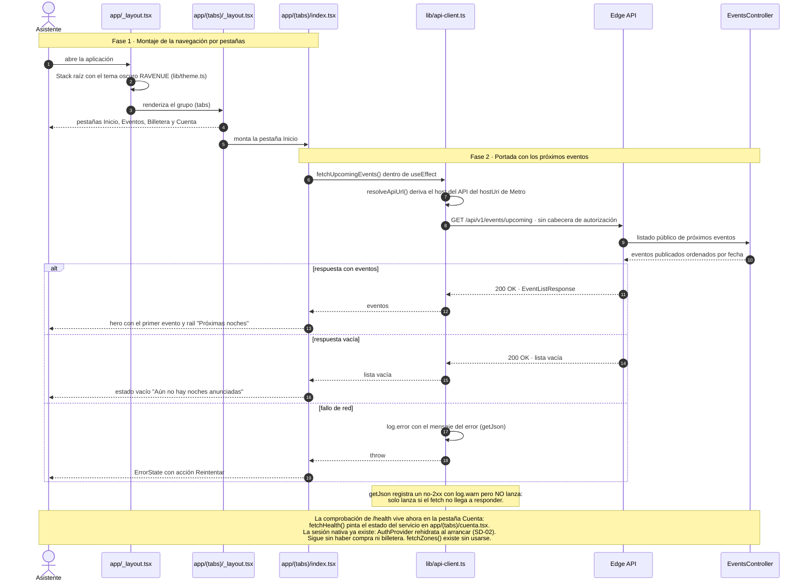
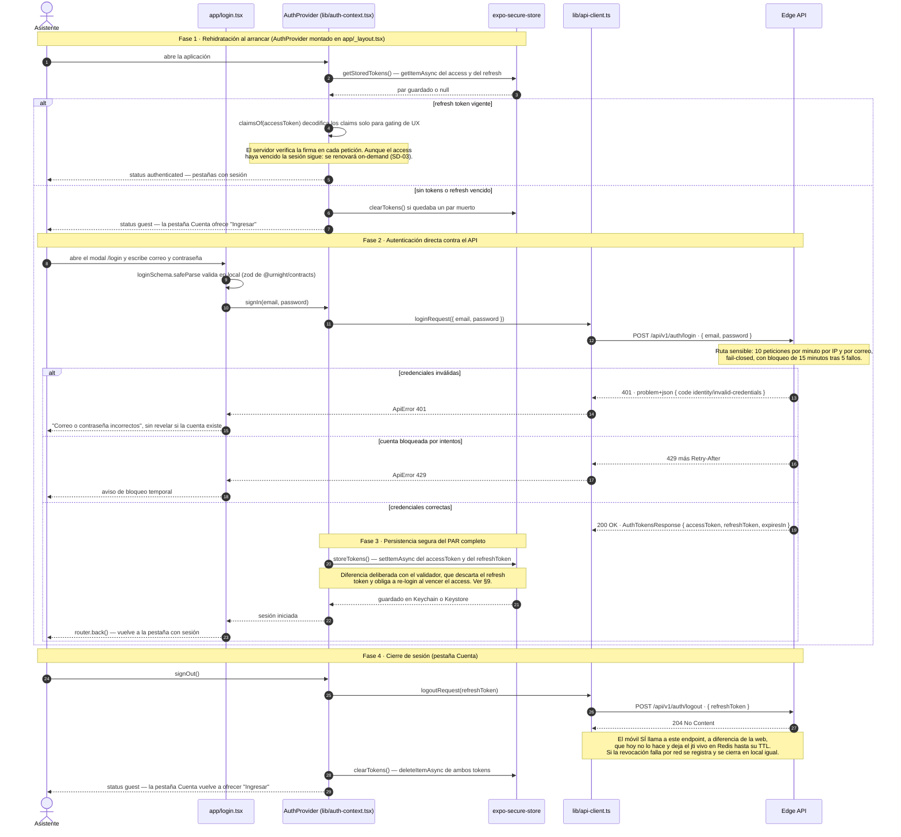
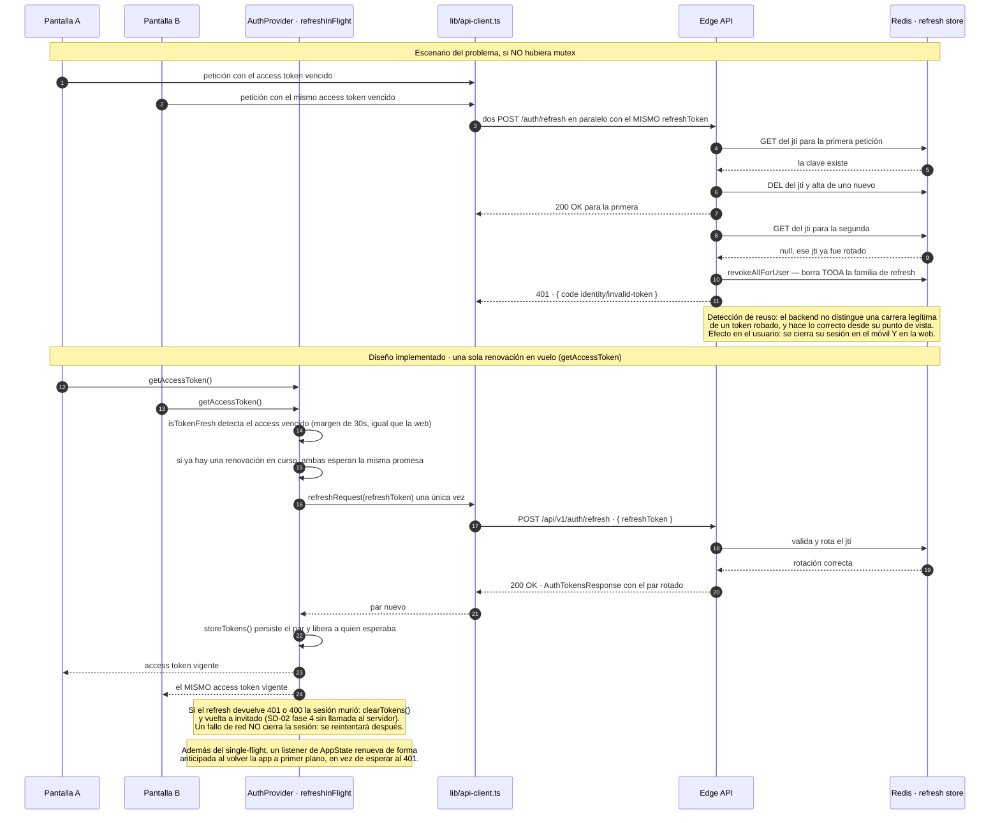
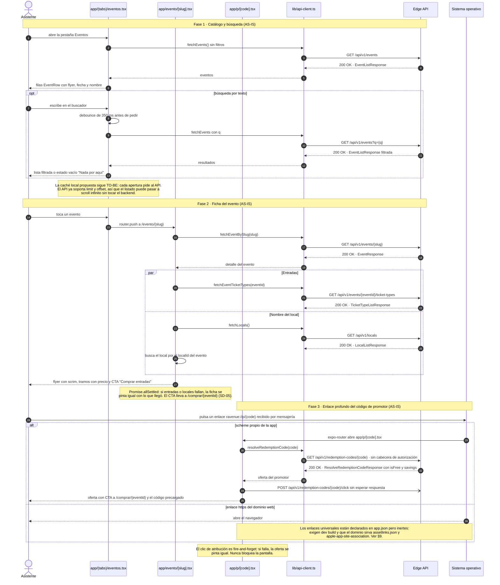
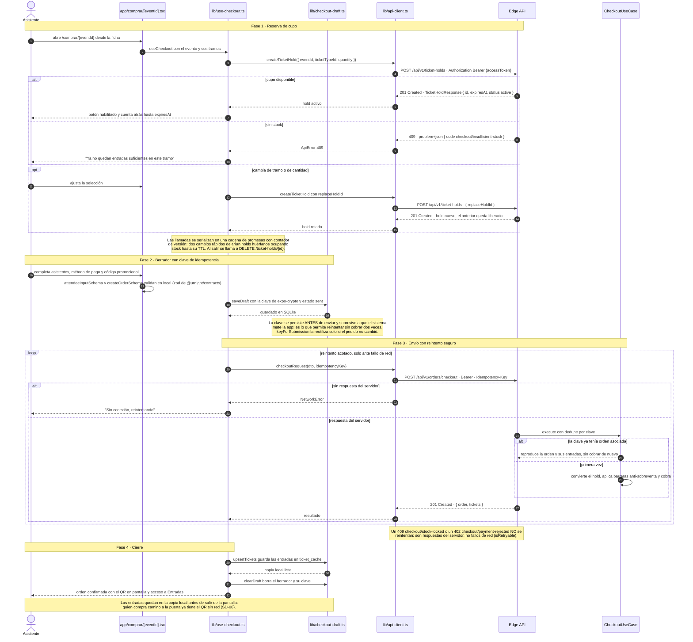
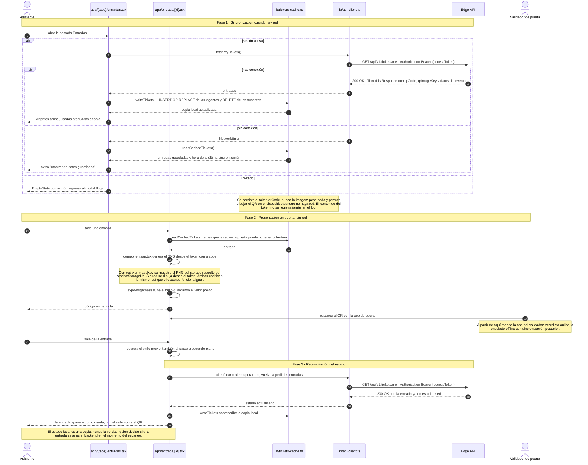
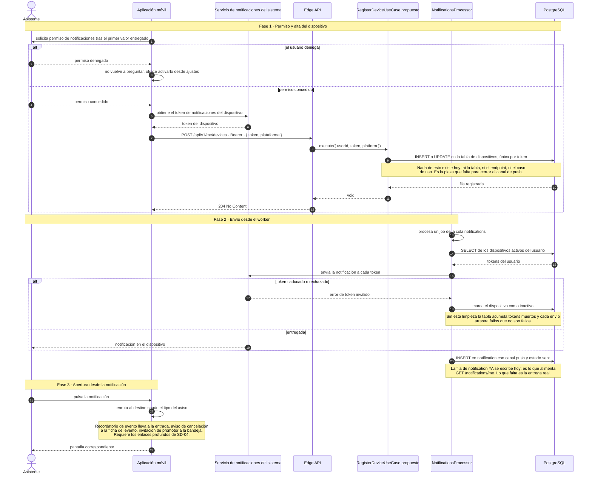

# Canales móviles — Aplicación del asistente

**Serie:** [Diagramas de secuencia](./README.md) · **Transversal** — canal *App Móvil* (§7 mapa C4 ↔ implementación de `PROJECT_SPECS.md`)

> **Alcance.** El canal móvil del asistente (`apps/mobile`), representado con **7 diagramas Mermaid**
> en formato *protocol data flow*, mismo estándar que el resto de la serie.
>
> **Advertencia de estado.** El levantamiento nació TO-BE sobre un andamiaje; hoy `apps/mobile`
> implementa pestañas, catálogo público, **sesión nativa con par de tokens**, **compra con reserva
> de cupo e idempotencia**, **entradas con QR sin red** y el **enlace profundo del código de
> promotor**: **SD-01 a SD-06 son AS-IS**. Solo SD-07 (registro de dispositivos y push) sigue siendo
> diseño propuesto, y depende de trabajo de backend que no existe todavía.
>
> Fecha de levantamiento: 2026-07-28 · Última sincronización: 2026-08-01 · Rama `feat/rebrand-ravenue`.

---

## 1. Índice

| # | Diagrama | Estado |
|---|---|---|
| SD-01 | [Arranque de la aplicación](#sd-01--arranque-de-la-aplicación) | **AS-IS** — código existente |
| SD-02 | [Sesión nativa: login y almacenamiento](#sd-02--sesión-nativa-login-y-almacenamiento) | **AS-IS** — código existente |
| SD-03 | [Renovación del token y la carrera de rotación](#sd-03--renovación-del-token-y-la-carrera-de-rotación) | **AS-IS** — código existente |
| SD-04 | [Catálogo, ficha y enlace profundo](#sd-04--catálogo-ficha-y-enlace-profundo) | **AS-IS** — código existente |
| SD-05 | [Compra desde el móvil](#sd-05--compra-desde-el-móvil) | **AS-IS** — código existente |
| SD-06 | [Entradas con QR sin red](#sd-06--entradas-con-qr-sin-red) | **AS-IS** — código existente |
| SD-07 | [Registro de dispositivo y notificaciones](#sd-07--registro-de-dispositivo-y-notificaciones) | TO-BE |

---

## 2. Punto de partida real

### 2.1 Qué hay hoy en `apps/mobile`

| Archivo | Líneas | Contenido |
|---|---|---|
| `app/_layout.tsx` | 32 | `AuthProvider` + `Stack` raíz: `evento/[slug]`, `entrada/[id]`, `comprar/[eventId]`, `p/[code]` y el modal `login`. |
| `app/(tabs)/_layout.tsx` | 56 | Tab bar: Inicio, Eventos, Entradas y Cuenta (Ionicons, tinte carmín). |
| `app/(tabs)/index.tsx` | 158 | Inicio: hero del próximo evento + rail "Próximas noches" (`fetchUpcomingEvents`). |
| `app/(tabs)/eventos.tsx` | 123 | Lista con búsqueda con debounce (`fetchEvents`), pull-to-refresh y estados. |
| `app/(tabs)/entradas.tsx` | 209 | Entradas (SD-06): `GET /tickets/me`, copia local y aviso de datos guardados sin red. |
| `app/(tabs)/cuenta.tsx` | 209 | Sesión real (SD-02): perfil vía `GET /auth/me`, login/logout y estado del servicio. |
| `app/evento/[slug].tsx` | 262 | Ficha: flyer con scrim, tramos de entrada y CTA que lleva al checkout. |
| `app/comprar/[eventId].tsx` | 335 | Checkout (SD-05): tramo, asistentes, método de pago y estado de éxito con QR. |
| `app/entrada/[id].tsx` | 154 | Entrada a pantalla completa (SD-06): QR grande, brillo al máximo y sello de estado. |
| `app/p/[code].tsx` | 110 | Aterrizaje del código de promotor (SD-04 fase 3) con CTA al checkout precargado. |
| `app/login.tsx` | 183 | Login nativo (SD-02): `loginSchema` en local, `signIn` y mapeo de errores problem+json. |
| `components/` | 522 | `ui.tsx` (primitivos del DS + `Field`), `event-card.tsx`, `flyer.tsx` y `qr.tsx`. |
| `lib/api-client.ts` | 259 | Cliente tipado: catálogo, auth, holds, checkout, entradas y códigos de canje. |
| `lib/errors.ts` | 32 | `ApiError` (problem+json) y `NetworkError`: distinción que gobierna el reintento. |
| `lib/auth.ts` | 96 | Par de tokens en `expo-secure-store`, claims (`claimsOf`) y frescura (`isTokenFresh`). |
| `lib/auth-context.tsx` | 151 | `AuthProvider`: rehidratación, *single-flight* de refresh y logout con revocación. |
| `lib/use-checkout.ts` | 229 | Máquina del checkout: ciclo de vida del hold, validación y envío con reintento. |
| `lib/checkout-draft.ts` + `-rules.ts` | 105 | Borrador con clave de idempotencia y decisión de reutilizarla o estrenarla. |
| `lib/checkout-errors.ts` | 41 | `code` de `CHECKOUT_ERROR_CODES` a copy de UX, e `isRetryable`. |
| `lib/local-db.ts` | 33 | `expo-sqlite`: apertura y migración de `ticket_cache` y `checkout_draft`. |
| `lib/tickets-cache.ts` + `-reconcile.ts` | 96 | Copia local de entradas: escritura, lectura y reconciliación con el backend. |
| `lib/storage.ts` + `lib/storage-url.ts` | 32 | Key de S3 a URL renderizable (espejo de `storage-context.tsx` de la web). |
| `lib/net.ts` | 21 | Estado de conexión con `NetInfo` y hook `useIsOnline`. |
| `lib/theme.ts` + `lib/format.ts` | 117 | Tokens RAVENUE copiados de `globals.css` + formato es-PE de fecha y precio. |
| `lib/logger.ts` | 55 | Logger compartido con el resto de apps nativas. |
| `lib/*.spec.ts` | 189 | Vitest sobre los módulos puros: errores, reintento, borrador y reconciliación. |

El canal ya compra, guarda las entradas y las muestra sin red. `fetchZones()` sigue definido y **no se
invoca desde ningún sitio**. Lo que falta es el registro de dispositivos y el push (SD-07).

### 2.2 Qué declara la configuración

`app.json` y `package.json` describen una intención bastante más amplia que el código:

| Declarado | Uso actual |
|---|---|
| `scheme: "ravenue"` | En uso: `ravenue://p/{code}` lo resuelve expo-router (SD-04 fase 3) |
| `expo-router` con `typedRoutes` | Once rutas: cuatro pestañas, `evento/[slug]`, `entrada/[id]`, `comprar/[eventId]`, `p/[code]`, `login` y los layouts |
| `expo-linear-gradient` y `@expo/vector-icons` | En uso: scrims del hero/ficha, placeholder de flyer y tab bar |
| `expo-secure-store` | En uso: par de tokens de sesión en Keychain o Keystore (SD-02) |
| `expo-sqlite` | En uso: `ticket_cache` y `checkout_draft` (`lib/local-db.ts`) |
| `expo-linking` | En uso: enlaces `ravenue://p/{code}` resueltos por expo-router |
| `expo-brightness` | En uso: brillo al máximo mientras el QR está visible (SD-06 fase 2) |
| `expo-crypto` | En uso: `randomUUID()` de la clave de idempotencia (SD-05) |
| `react-native-svg` y `qrcode` | En uso: `components/qr.tsx`, misma librería generadora que la web |
| `@react-native-community/netinfo` | En uso: `lib/net.ts`, misma versión que `apps/validator` |
| `expo-notifications` | Sin uso |
| `react-native-maps` | Sin uso |
| `ios.associatedDomains` y `android.intentFilters` | Declarados e **inertes**: exigen dev build y `assetlinks.json` / AASA en el dominio |
| `@urnight/contracts` | Tipos de events, ticket-types, locals, auth, checkout (`createOrderSchema`, holds, tickets) y códigos de canje |

### 2.3 Qué ya está resuelto en la app hermana

`apps/validator` no es un andamiaje: implementa el patrón nativo completo contra el mismo API. El
canal del asistente partió de ese patrón **duplicándolo** (ver §9-3): extraerlo a un paquete
compartido sigue pendiente.

| Pieza | `apps/validator` | `apps/mobile` |
|---|---|---|
| Cliente HTTP con `NetworkError` frente a `ApiError` | ✅ `lib/api-client.ts` | ✅ `request()` con `ApiError` problem+json |
| Token en almacenamiento seguro | ✅ `expo-secure-store` (Keychain o Keystore) | ✅ par completo access + refresh (`lib/auth.ts`) |
| Contexto de sesión con rehidratación al arrancar | ✅ `AuthProvider` | ✅ `AuthProvider` (`lib/auth-context.tsx`) |
| Decodificación local de claims para gating de UX | ✅ `isValidatorToken` | ✅ `claimsOf` + `isTokenFresh` |
| Detección de reconexión | ✅ `NetInfo` | ✅ `lib/net.ts`, misma versión |
| Persistencia local en SQLite | ✅ `offline-cache.ts` — cola de escrituras pendientes | ✅ `lib/local-db.ts` — copia de entradas y borrador de compra |
| Renovación del token | ✅ *single-flight* con rotación y `AppState` (`lib/session-rules.ts`) | ✅ *single-flight* con rotación (SD-03) |

---

## 3. Convenciones de notación

Estándar de la serie. La fuente canónica es `.claude/skills/sincronizar-diagramas-secuencia/references/notacion.md`.

### 3.1 Estructura

1. **`autonumber` siempre.** Permite referenciar un paso concreto en revisiones ("falla en el paso 7").
2. **Un diagrama = un caso de uso.** Si un flujo supera ~40 mensajes o los 8 participantes, se parte y
   se referencia con una nota (`note over X: ver SD-A`).
3. **Máximo 8 participantes.** Por encima, el diagrama deja de leerse en pantalla.
4. **Declaración explícita de participantes al inicio**, en orden de aparición izquierda → derecha
   (usuario → cliente → borde → aplicación → dominio → infraestructura). Nunca declarar por primera
   vez a mitad del diagrama: el orden visual se desordena.
5. **`actor` para personas, `participant` para sistemas.** Alias corto en mayúsculas (`UC`, `DB`),
   etiqueta legible con `as`.

### 3.2 Flujo de protocolo

Regla central de este documento: **el diagrama debe poder contrastarse contra el tráfico real.**

6. **Toda petición lleva su respuesta.** Ninguna flecha `->>` de red se queda sin su `-->>` con código
   de estado y forma del payload. Si no hay respuesta, es un `-)` (asíncrono) y se dice por qué.
7. **Anotación de protocolo en la ida:** `MÉTODO /ruta · cabecera o cuerpo relevante`.
   Ejemplo: `GET /api/v1/{recurso}/{id} · Authorization Bearer {accessToken}`.
8. **Anotación de resultado en la vuelta:** `código · payload`.
   Ejemplo: `409 · problem+json { code: {contexto}/{error} }`.
9. **Infraestructura con su comando real**, no con una paráfrasis: `SELECT * FROM {tabla} WHERE {columna} = ?`,
   `SET {clave} EX {ttl}`, `SMEMBERS`, `INCR`. Hace el diagrama auditable
   contra los adapters Drizzle y Redis.
10. **Placeholders entre llaves**, nunca entre `<` `>` (Mermaid los interpreta como HTML): `{recursoId}`.

### 3.3 Fases

11. **Banners de fase** con `note over A, B: Fase N · Nombre (componente real)`, abarcando los
    participantes implicados en ese tramo. Convierten un muro de flechas en un flujo legible por
    etapas y hacen explícito qué componente gobierna cada una.
12. **Notas de invariante** (`note over X:`) reservadas para reglas de seguridad, decisiones de diseño
    y brechas conocidas. Nunca para narrar lo que la flecha ya dice.
13. Saltos de línea en notas con `<br/>` para no ensanchar el diagrama.

### 3.4 Arrows y bloques de control

| Notación | Significado |
|---|---|
| `->>` | Llamada síncrona: el emisor espera respuesta |
| `-->>` | Respuesta o retorno, con código de estado |
| `-)` | Asíncrono fire-and-forget: publicación de evento, encolado |
| `X->>X` | Cómputo interno que cambia estado o toma una decisión (hash, firma, validación) |

| Bloque | Uso |
|---|---|
| `alt` / `else` | Caminos mutuamente excluyentes (éxito vs. error de negocio) |
| `opt` | Tramo que puede no ejecutarse y no tiene alternativa |
| `critical` | Transacción atómica (`UnitOfWork`): si algo falla, nada se persiste |
| `par` / `and` | Señales concurrentes e independientes |
| `loop` | Repetición acotada (reintentos, generación de código único) |

### 3.5 Cierre

14. **Cada diagrama termina en el efecto observable**: lo que ve el usuario, la cookie fijada o el
    documento devuelto. Un diagrama que acaba en una llamada interna está incompleto.

### 3.6 Higiene sintáctica

15. **Nada de `;` dentro de un mensaje o una nota.** Mermaid corta la sentencia ahí y el diagrama deja
    de compilar. Usar coma o punto.
16. Nada de `<` `>` sin escapar, incluidas las flechas de función de JavaScript (ver regla 10).
17. Los nombres de casos de uso, guards, endpoints y claves de Redis se copian **tal cual del código**:
    un `grep` del nombre debe encontrar el fuente.
18. **Los diagramas TO-BE nombran componentes que no existen todavía** y lo señalan en el propio participante o en una nota. Los AS-IS nombran archivos reales.

### 3.7 Validación

```bash
npx -y @mermaid-js/mermaid-cli@11 \
  -i docs/diagramas-secuencia/90-canales-moviles.md \
  -o /tmp/90-canales-moviles.md
```

También sirven mermaid.live y la extensión *Markdown Preview Mermaid Support* de VS Code. GitHub
renderiza estos bloques de forma nativa.

---

## 4. Bloque 0 · Estado actual

### SD-01 · Arranque de la aplicación

**AS-IS.** Arranque real: navegación por pestañas y portada del catálogo.



---

## 5. Bloque 1 · Sesión nativa (AS-IS)

### SD-02 · Sesión nativa: login y almacenamiento

**AS-IS.** El móvil **no** reutiliza el flujo de la web: Auth.js con handoff de `Credentials` es
servidor a servidor. Habla directo con el API, como el validador, pero guardando el **par completo**
de tokens. Código: `app/login.tsx`, `lib/auth-context.tsx`, `lib/auth.ts`, `lib/api-client.ts`.



### SD-03 · Renovación del token y la carrera de rotación

**AS-IS.** El backend rota el refresh en un solo uso y, ante un `jti` ya consumido, **revoca toda la
familia de sesiones del usuario**. El móvil lo mitiga con un *single-flight* (`refreshInFlight` en
`lib/auth-context.tsx`) y renovación anticipada al volver del segundo plano.



---

## 6. Bloque 2 · Descubrimiento y compra (TO-BE)

### SD-04 · Catálogo, ficha y enlace profundo

**AS-IS.** Las tres fases están implementadas: lista con búsqueda, ficha con tramos y aterrizaje del
código de promotor. El móvil consume los mismos endpoints públicos que el consumidor web, con los
mismos tipos de `@urnight/contracts`. La caché local del catálogo sigue sin existir —cada apertura
pide al API— y los enlaces universales quedan declarados pero inertes (ver §9).



### SD-05 · Compra desde el móvil

**AS-IS.** El checkout real gira sobre **reserva de cupo con TTL**, igual que el consumidor web: el
`holdId` viaja dentro de `items[]`. El móvil suma lo que la web todavía no manda, la cabecera
`Idempotency-Key`, y la persiste: en móvil la red se cae a mitad de una compra con normalidad.
Código: `app/comprar/[eventId].tsx`, `lib/use-checkout.ts`, `lib/checkout-draft.ts`,
`lib/checkout-errors.ts`.



---

## 7. Bloque 3 · Entradas (AS-IS)

### SD-06 · Entradas con QR sin red

**AS-IS.** El caso de uso decisivo del canal: en la puerta de una discoteca puede no haber cobertura.
El token del QR es la fuente de verdad y cabe en el dispositivo. Código: `app/(tabs)/entradas.tsx`,
`app/entrada/[id].tsx`, `lib/tickets-cache.ts`, `components/qr.tsx`.



---

## 8. Bloque 4 · Notificaciones (TO-BE)

### SD-07 · Registro de dispositivo y notificaciones

**TO-BE.** El worker ya tiene un `PushPort`, pero **no existe ninguna tabla ni endpoint de tokens de
dispositivo** en todo el repositorio: hoy `LogPushAdapter` escribe en el log y ahí muere.



**Preferencias que ya existen y hay que respetar.** `user_preference.accepts_reminders` y
`accepts_marketing` se persisten desde el onboarding y desde la cuenta. El envío push debe filtrar por
ellas, y las transaccionales (entradas emitidas) deben distinguirse de las promocionales.

---

## 9. Brechas y riesgos

Hallazgos de la lectura del código. Los cinco primeros condicionan cualquier plan sobre este canal.

1. **El canal ya compra y muestra entradas sin red.** Navegación por pestañas, portada, lista con
   búsqueda, ficha, sesión nativa, checkout con reserva de cupo e idempotencia, entradas con QR
   offline y aterrizaje del código de promotor (SD-01 a SD-06). Lo que queda abierto es SD-07 y
   `fetchZones()`, que sigue definido y **no se invoca desde ningún sitio**.
2. **Los enlaces universales siguen sin activar.** El scheme propio `ravenue://p/{code}` ya funciona
   y lo resuelve expo-router. Pero `ios.associatedDomains` y `android.intentFilters` están declarados
   e **inertes**: exigen un dev build (`eas.json`, que no existe) y que el dominio web sirva
   `assetlinks.json` y `apple-app-site-association`. Un enlace `https` compartido por un promotor
   sigue abriendo el navegador. De las dependencias declaradas sin usar quedan `expo-notifications`
   (bloqueada por SD-07) y `react-native-maps`.
3. **El patrón nativo ya resuelto no está extraído — y la duplicación creció.** `apps/validator`
   implementa cliente HTTP con distinción entre fallo de red y respuesta de error, almacenamiento
   seguro del token, contexto de sesión con rehidratación y decodificación local de claims.
   `apps/mobile` reimplementó ese patrón por su cuenta (SD-02): dos copias de `decodeSegment`,
   dos `AuthProvider`, dos clientes HTTP y ahora también dos aperturas de SQLite y dos detecciones
   de red. Extraerlo a un paquete compartido sigue pendiente.
4. ~~**El validador descarta el refresh token.**~~ **Cerrada.** `apps/validator` guarda el par completo
   y renueva con *single-flight*, y un fallo de red al renovar ya no expulsa: la puerta sigue
   escaneando y encolando mientras el refresh siga vigente.
5. **La rotación de un solo uso es peligrosa en móvil.** El backend revoca **toda** la familia de
   refresh del usuario cuando recibe un `jti` ya consumido, sin poder distinguir una carrera legítima
   de un robo. Varias pantallas despertando a la vez con el access token vencido disparan renovaciones
   paralelas: la segunda cierra la sesión del usuario en el móvil **y en la web**. El móvil del
   asistente ya implementa la mitigación completa (single-flight `refreshInFlight` + renovación
   anticipada con `AppState`, SD-03), y el validador implementa ahora la misma.
6. **No existe registro de dispositivos.** Cero coincidencias de token de dispositivo en todo el
   repositorio: no hay tabla, ni endpoint, ni caso de uso. `PushPort` está cableado a `LogPushAdapter`
   y escribe en el log. El canal de notificaciones está abierto por el lado del worker y cerrado por
   el lado del dispositivo.
7. **El móvil no puede reutilizar la sesión de la web.** Auth.js con handoff de `Credentials` es
   servidor a servidor por diseño. El móvil habla directo con `/auth/login`, `/auth/refresh` y
   `/auth/logout`. Así está implementado en `apps/mobile` (SD-02), igual que en el validador.
8. **El móvil ya llama a `POST /auth/logout`** y borra el par local aunque la revocación falle por
   red (SD-02 fase 4). La web sigue sin hacerlo y deja el `jti` vivo en Redis hasta su TTL: la
   brecha queda solo del lado web.
9. **Varias brechas de otros dominios pegan aquí de lleno.** Sin entrega real de correo y push
   (`LogEmailAdapter` y `LogPushAdapter`), sin notificación de cancelación de evento y sin listados de
   trámites, el valor de una app nativa se reduce a comprar y mostrar el QR. Conviene priorizar esas
   piezas antes que la propia app, o al menos en paralelo.

---

## 10. Orden de construcción sugerido

Derivado de lo anterior, no de una preferencia. Cada paso desbloquea al siguiente.

| Paso | Qué | Por qué antes que lo demás |
|---|---|---|
| 1 | Extraer el patrón nativo del validador a un paquete compartido | Evita duplicar sesión, cliente HTTP y cola offline en dos apps |
| 2 | ~~Sesión con par de tokens, *single-flight* de renovación y logout real (SD-02, SD-03)~~ **Hecho** | Sin sesión no hay billetera ni compra, y la carrera de rotación rompe también la web |
| 3 | ~~Catálogo y ficha (SD-04)~~ **Hecho** | Solo consume endpoints públicos que ya existen: es el tramo de menor riesgo |
| 4 | ~~Entradas con copia local del token del QR (SD-06)~~ **Hecho** | Es el valor diferencial del canal frente a la web móvil |
| 5 | ~~Compra con reserva de cupo y clave de idempotencia persistida (SD-05)~~ **Hecho** | Necesita sesión y ficha, y el backend ya las soporta |
| 6 | Registro de dispositivos y push (SD-07) | Requiere trabajo de backend nuevo, no solo de la app |
| 7 | ~~Enlace profundo por scheme propio (SD-04, fase 3)~~ **Hecho** · enlaces universales pendientes | Cierra el circuito con los códigos de promotor. Los universales exigen dev build y dominio |

---

## 11. Mantenimiento

- **Fuente de verdad funcional:** `../der_class/PROJECT_SPECS.md` (§5 cubre los canales nativos). Toda
  desviación se registra como ADR en `docs/adr/`.
- Solo SD-07 sigue siendo TO-BE: **cuando se implemente debe reescribirse como AS-IS en el mismo
  PR**, con los nombres reales de archivos y casos de uso, y moverse su fila de la tabla del §1.
- Antes de mergear, ejecutar el comando de validación de §3: los 7 diagramas deben renderizar.
- El inventario del §2.1 se recuenta con
  `git ls-files 'apps/mobile/app' 'apps/mobile/lib' 'apps/mobile/components'`: si un fichero cambia
  de tamaño de forma apreciable, la tabla deja de describir el código.
