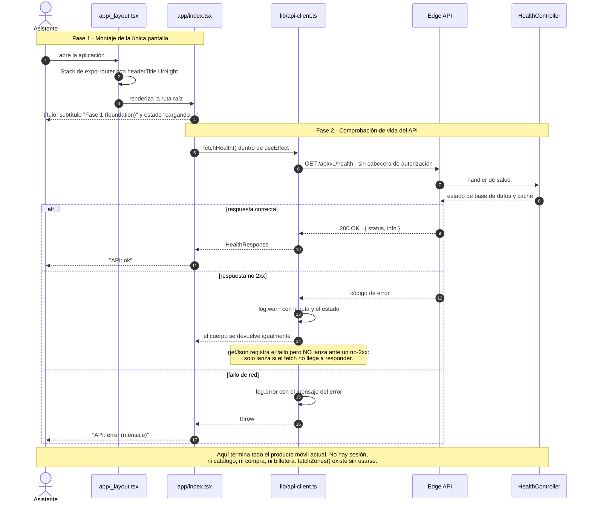
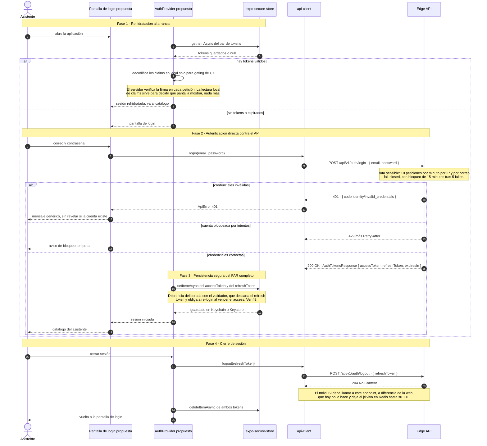
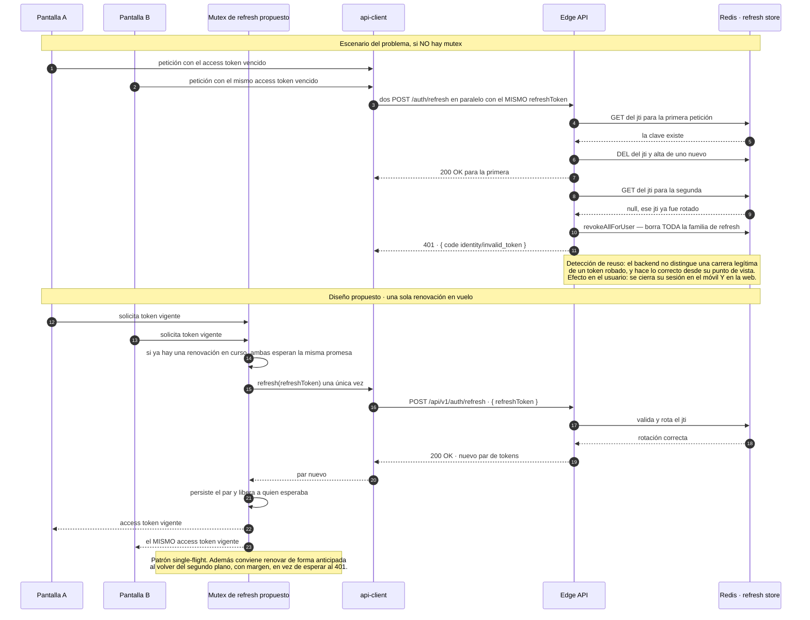
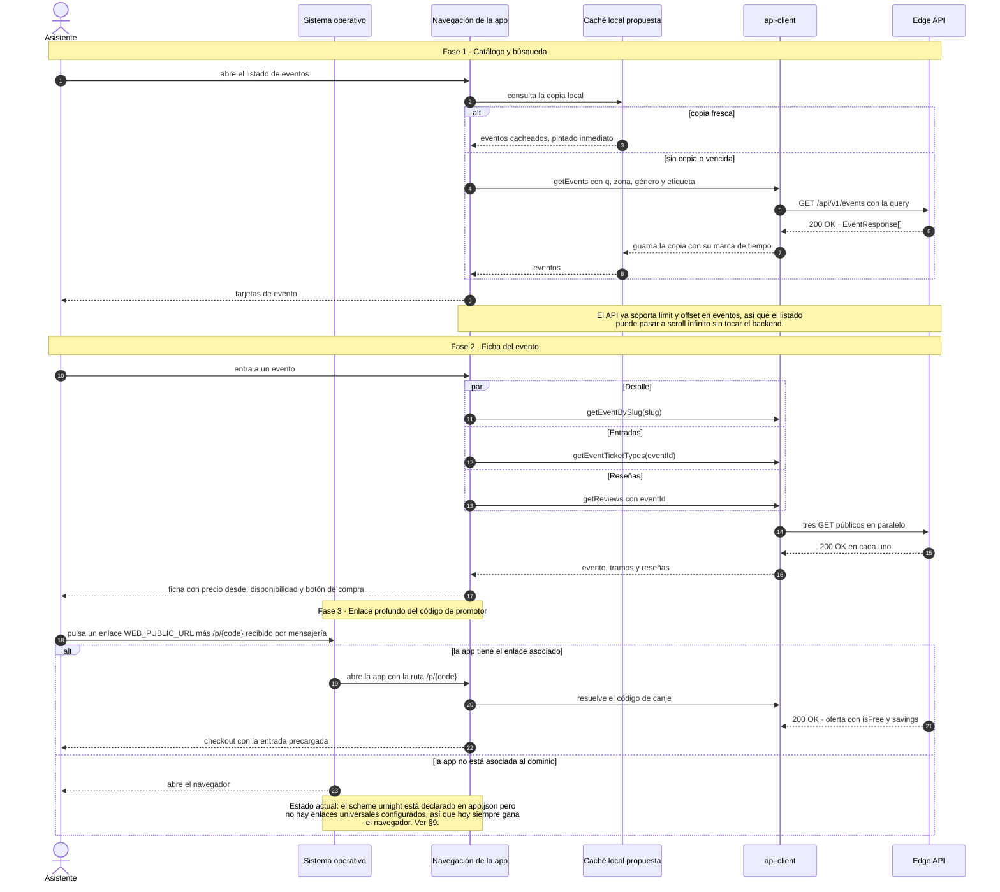
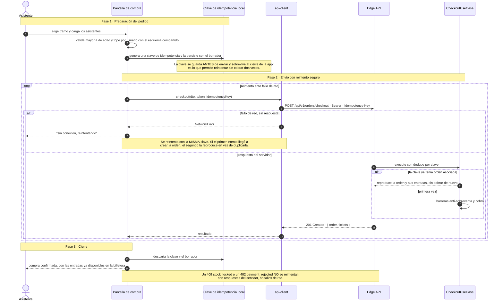
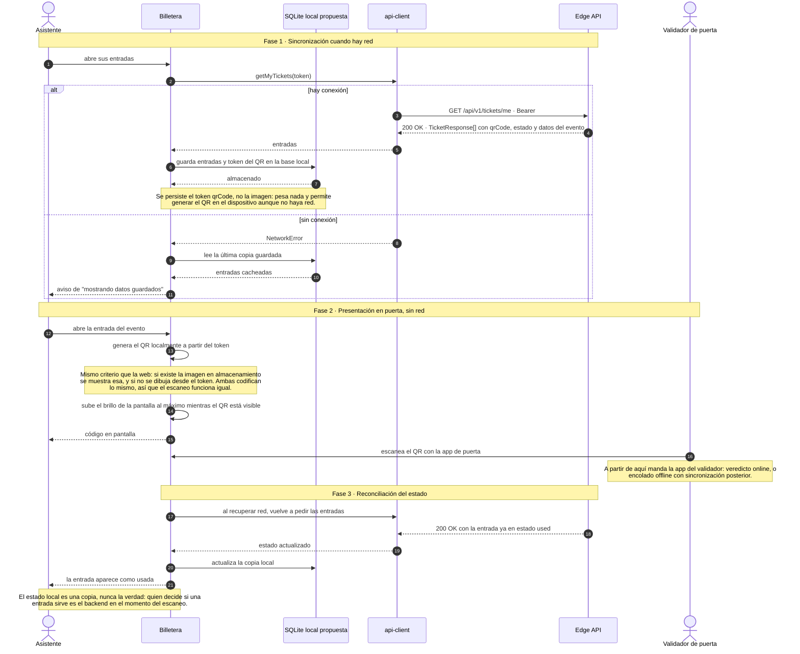
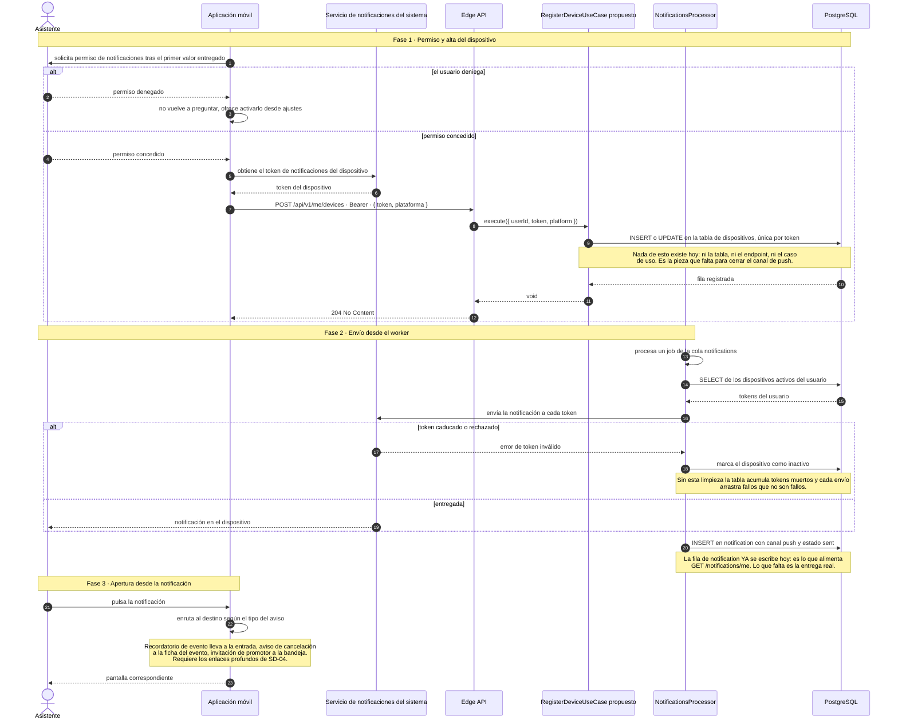

# Canales móviles — Aplicación del asistente

**Serie:** [Diagramas de secuencia](./README.md) · **Transversal** — canal *App Móvil* (§7 mapa C4 ↔ implementación de `PROJECT_SPECS.md`)

> **Alcance.** El canal móvil del asistente (`apps/mobile`), representado con **7 diagramas Mermaid**
> en formato *protocol data flow*, mismo estándar que el resto de la serie.
>
> **Advertencia de estado.** A diferencia de los otros documentos de la serie, aquí **casi todo es
> TO-BE**. `apps/mobile` es hoy un andamiaje: tres archivos de producto y una pantalla que hace ping a
> `/health`. Solo SD-01 documenta código existente. Los seis diagramas restantes son diseño propuesto,
> marcados como tales, y están calcados de dos fuentes que ya funcionan en este repo: la app de puerta
> (`apps/validator`, que resuelve sesión nativa, almacenamiento seguro y cola offline) y el consumidor
> web (`apps/web`, que resuelve catálogo, checkout y billetera).
>
> Fecha de levantamiento: 2026-07-28 · Rama `feat/rebrand-ravenue`.

---

## 1. Índice

| # | Diagrama | Estado |
|---|---|---|
| SD-01 | [Arranque de la aplicación](#sd-01--arranque-de-la-aplicación) | **AS-IS** — código existente |
| SD-02 | [Sesión nativa: login y almacenamiento](#sd-02--sesión-nativa-login-y-almacenamiento) | TO-BE |
| SD-03 | [Renovación del token y la carrera de rotación](#sd-03--renovación-del-token-y-la-carrera-de-rotación) | TO-BE |
| SD-04 | [Catálogo, ficha y enlace profundo](#sd-04--catálogo-ficha-y-enlace-profundo) | TO-BE |
| SD-05 | [Compra desde el móvil](#sd-05--compra-desde-el-móvil) | TO-BE |
| SD-06 | [Billetera con QR sin red](#sd-06--billetera-con-qr-sin-red) | TO-BE |
| SD-07 | [Registro de dispositivo y notificaciones](#sd-07--registro-de-dispositivo-y-notificaciones) | TO-BE |

---

## 2. Punto de partida real

### 2.1 Qué hay hoy en `apps/mobile`

| Archivo | Líneas | Contenido |
|---|---|---|
| `app/_layout.tsx` | 11 | `Stack` de expo-router con `StatusBar`. Idéntico al del validador. |
| `app/index.tsx` | 31 | Una pantalla: título, subtítulo *"Fase 1 (foundation)"* y el estado de `/health`. |
| `lib/api-client.ts` | 33 | `getJson` tipado con log de red, más `fetchHealth()` y `fetchZones()`. |
| `lib/logger.ts` | 65 | Logger compartido con el resto de apps nativas. |

No hay autenticación, ni navegación más allá de la pantalla raíz, ni consumo de catálogo:
`fetchZones()` está definido y **no se invoca desde ningún sitio**.

### 2.2 Qué declara la configuración

`app.json` y `package.json` describen una intención bastante más amplia que el código:

| Declarado | Uso actual |
|---|---|
| `scheme: "urnight"` | Sin enlaces profundos configurados |
| `expo-router` con `typedRoutes` | Una sola ruta |
| `expo-notifications` | Sin uso |
| `expo-sqlite` | Sin uso |
| `react-native-maps` | Sin uso |
| `expo-linking` | Sin uso |
| `@urnight/contracts` | Solo para el tipo `ZoneResponse` del fetcher no usado |

### 2.3 Qué ya está resuelto en la app hermana

`apps/validator` no es un andamiaje: implementa el patrón nativo completo contra el mismo API. El
canal del asistente debería partir de ahí en vez de reinventarlo.

| Pieza | `apps/validator` | `apps/mobile` |
|---|---|---|
| Cliente HTTP con `NetworkError` frente a `ApiError` | ✅ `lib/api-client.ts` | ⚠️ Solo distingue el fallo de red en el log |
| Token en almacenamiento seguro | ✅ `expo-secure-store` (Keychain o Keystore) | ❌ |
| Contexto de sesión con rehidratación al arrancar | ✅ `AuthProvider` | ❌ |
| Decodificación local de claims para gating de UX | ✅ `isValidatorToken` | ❌ |
| Detección de reconexión | ✅ `NetInfo` | ❌ |
| Cola local en SQLite | ✅ `offline-cache.ts` | ❌ (dependencia instalada) |
| Renovación del token | ❌ **tampoco lo hace el validador** — ver §9 | ❌ |

---

## 3. Convenciones de notación

Estándar de la serie. La fuente canónica es `.claude/skills/sincronizar-diagramas-secuencia/references/notacion.md`.

### 3.1 Estructura

1. **`autonumber` siempre.** Permite referenciar un paso concreto en revisiones ("falla en el paso 7").
2. **Un diagrama = un caso de uso.** Si un flujo supera ~40 mensajes o los 8 participantes, se parte y
   se referencia con una nota (`note over X: ver SD-A`).
3. **Máximo 8 participantes.** Por encima, el diagrama deja de leerse en pantalla.
4. **Declaración explícita de participantes al inicio**, en orden de aparición izquierda → derecha
   (usuario → cliente → borde → aplicación → dominio → infraestructura). Nunca declarar por primera
   vez a mitad del diagrama: el orden visual se desordena.
5. **`actor` para personas, `participant` para sistemas.** Alias corto en mayúsculas (`UC`, `DB`),
   etiqueta legible con `as`.

### 3.2 Flujo de protocolo

Regla central de este documento: **el diagrama debe poder contrastarse contra el tráfico real.**

6. **Toda petición lleva su respuesta.** Ninguna flecha `->>` de red se queda sin su `-->>` con código
   de estado y forma del payload. Si no hay respuesta, es un `-)` (asíncrono) y se dice por qué.
7. **Anotación de protocolo en la ida:** `MÉTODO /ruta · cabecera o cuerpo relevante`.
   Ejemplo: `GET /api/v1/{recurso}/{id} · Authorization Bearer {accessToken}`.
8. **Anotación de resultado en la vuelta:** `código · payload`.
   Ejemplo: `409 · problem+json { code: {contexto}/{error} }`.
9. **Infraestructura con su comando real**, no con una paráfrasis: `SELECT * FROM {tabla} WHERE {columna} = ?`,
   `SET {clave} EX {ttl}`, `SMEMBERS`, `INCR`. Hace el diagrama auditable
   contra los adapters Drizzle y Redis.
10. **Placeholders entre llaves**, nunca entre `<` `>` (Mermaid los interpreta como HTML): `{recursoId}`.

### 3.3 Fases

11. **Banners de fase** con `note over A, B: Fase N · Nombre (componente real)`, abarcando los
    participantes implicados en ese tramo. Convierten un muro de flechas en un flujo legible por
    etapas y hacen explícito qué componente gobierna cada una.
12. **Notas de invariante** (`note over X:`) reservadas para reglas de seguridad, decisiones de diseño
    y brechas conocidas. Nunca para narrar lo que la flecha ya dice.
13. Saltos de línea en notas con `<br/>` para no ensanchar el diagrama.

### 3.4 Arrows y bloques de control

| Notación | Significado |
|---|---|
| `->>` | Llamada síncrona: el emisor espera respuesta |
| `-->>` | Respuesta o retorno, con código de estado |
| `-)` | Asíncrono fire-and-forget: publicación de evento, encolado |
| `X->>X` | Cómputo interno que cambia estado o toma una decisión (hash, firma, validación) |

| Bloque | Uso |
|---|---|
| `alt` / `else` | Caminos mutuamente excluyentes (éxito vs. error de negocio) |
| `opt` | Tramo que puede no ejecutarse y no tiene alternativa |
| `critical` | Transacción atómica (`UnitOfWork`): si algo falla, nada se persiste |
| `par` / `and` | Señales concurrentes e independientes |
| `loop` | Repetición acotada (reintentos, generación de código único) |

### 3.5 Cierre

14. **Cada diagrama termina en el efecto observable**: lo que ve el usuario, la cookie fijada o el
    documento devuelto. Un diagrama que acaba en una llamada interna está incompleto.

### 3.6 Higiene sintáctica

15. **Nada de `;` dentro de un mensaje o una nota.** Mermaid corta la sentencia ahí y el diagrama deja
    de compilar. Usar coma o punto.
16. Nada de `<` `>` sin escapar, incluidas las flechas de función de JavaScript (ver regla 10).
17. Los nombres de casos de uso, guards, endpoints y claves de Redis se copian **tal cual del código**:
    un `grep` del nombre debe encontrar el fuente.
18. **Los diagramas TO-BE nombran componentes que no existen todavía** y lo señalan en el propio participante o en una nota. Los AS-IS nombran archivos reales.

### 3.7 Validación

```bash
npx -y @mermaid-js/mermaid-cli@11 \
  -i docs/diagramas-secuencia/90-canales-moviles.md \
  -o /tmp/90-canales-moviles.md
```

También sirven mermaid.live y la extensión *Markdown Preview Mermaid Support* de VS Code. GitHub
renderiza estos bloques de forma nativa.

---

## 4. Bloque 0 · Estado actual

### SD-01 · Arranque de la aplicación

**AS-IS.** El único flujo que existe hoy, de punta a punta.



---

## 5. Bloque 1 · Sesión nativa (TO-BE)

### SD-02 · Sesión nativa: login y almacenamiento

**TO-BE.** El móvil **no puede** reutilizar el flujo de la web: Auth.js con handoff de `Credentials`
es servidor a servidor. Tiene que hablar directo con el API, como ya hace el validador.



### SD-03 · Renovación del token y la carrera de rotación

**TO-BE.** El backend rota el refresh en un solo uso y, ante un `jti` ya consumido, **revoca toda la
familia de sesiones del usuario**. En móvil eso es un riesgo concreto: varias pantallas despiertan a
la vez.



---

## 6. Bloque 2 · Descubrimiento y compra (TO-BE)

### SD-04 · Catálogo, ficha y enlace profundo

**TO-BE.** Todas las lecturas son públicas y ya existen: el móvil consume los mismos endpoints que el
consumidor web, con los mismos tipos de `@urnight/contracts`.



### SD-05 · Compra desde el móvil

**TO-BE.** El checkout ya es idempotente por cabecera. En móvil eso deja de ser un lujo: la red se
cae a mitad de una compra con normalidad.



---

## 7. Bloque 3 · Billetera (TO-BE)

### SD-06 · Billetera con QR sin red

**TO-BE.** El caso de uso decisivo del canal: en la puerta de una discoteca puede no haber cobertura.
El token del QR es la fuente de verdad y cabe en el dispositivo.



---

## 8. Bloque 4 · Notificaciones (TO-BE)

### SD-07 · Registro de dispositivo y notificaciones

**TO-BE.** El worker ya tiene un `PushPort`, pero **no existe ninguna tabla ni endpoint de tokens de
dispositivo** en todo el repositorio: hoy `LogPushAdapter` escribe en el log y ahí muere.



**Preferencias que ya existen y hay que respetar.** `user_preference.accepts_reminders` y
`accepts_marketing` se persisten desde el onboarding y desde la cuenta. El envío push debe filtrar por
ellas, y las transaccionales (entradas emitidas) deben distinguirse de las promocionales.

---

## 9. Brechas y riesgos

Hallazgos de la lectura del código. Los cinco primeros condicionan cualquier plan sobre este canal.

1. **La aplicación del asistente es un andamiaje.** Tres archivos de producto, unas 75 líneas: una
   pantalla que hace ping a `/health`. No hay sesión, catálogo, compra ni billetera. `fetchZones()`
   está definido y no se invoca desde ningún sitio.
2. **Las dependencias declaran una intención que el código no respalda.** `expo-notifications`,
   `expo-sqlite`, `react-native-maps` y `expo-linking` están instaladas y sin usar, y el `scheme`
   `urnight` está declarado sin enlaces profundos configurados. Un enlace `/p/{code}` compartido por
   un promotor abre hoy el navegador, no la app.
3. **El patrón nativo ya resuelto no está extraído.** `apps/validator` implementa cliente HTTP con
   distinción entre fallo de red y respuesta de error, almacenamiento seguro del token, contexto de
   sesión con rehidratación, decodificación local de claims y detección de reconexión. Nada de eso
   vive en un paquete compartido, así que el móvil del asistente lo duplicará salvo que se extraiga
   antes.
4. **El validador descarta el refresh token.** `AuthProvider` guarda solo `tokens.accessToken` en
   `SecureStore` y, ante un 401, cierra sesión y manda a login. En una noche de puerta eso significa
   re-loguear a mitad de turno. **El canal del asistente no debe copiar ese patrón**: debe guardar el
   par completo y renovar.
5. **La rotación de un solo uso es peligrosa en móvil.** El backend revoca **toda** la familia de
   refresh del usuario cuando recibe un `jti` ya consumido, sin poder distinguir una carrera legítima
   de un robo. Varias pantallas despertando a la vez con el access token vencido disparan renovaciones
   paralelas: la segunda cierra la sesión del usuario en el móvil **y en la web**. Requiere un
   *single-flight* en el cliente y, preferiblemente, renovación anticipada al volver del segundo
   plano.
6. **No existe registro de dispositivos.** Cero coincidencias de token de dispositivo en todo el
   repositorio: no hay tabla, ni endpoint, ni caso de uso. `PushPort` está cableado a `LogPushAdapter`
   y escribe en el log. El canal de notificaciones está abierto por el lado del worker y cerrado por
   el lado del dispositivo.
7. **El móvil no puede reutilizar la sesión de la web.** Auth.js con handoff de `Credentials` es
   servidor a servidor por diseño. El móvil habla directo con `/auth/login`, `/auth/refresh` y
   `/auth/logout`, igual que el validador. Conviene documentarlo para que no se intente lo contrario.
8. **El móvil sí debería llamar a `POST /auth/logout`.** La web hoy no lo hace y deja el `jti` vivo en
   Redis hasta su TTL. Es una oportunidad de no arrastrar la misma brecha al canal nuevo.
9. **Varias brechas de otros dominios pegan aquí de lleno.** Sin entrega real de correo y push
   (`LogEmailAdapter` y `LogPushAdapter`), sin notificación de cancelación de evento y sin listados de
   trámites, el valor de una app nativa se reduce a comprar y mostrar el QR. Conviene priorizar esas
   piezas antes que la propia app, o al menos en paralelo.

---

## 10. Orden de construcción sugerido

Derivado de lo anterior, no de una preferencia. Cada paso desbloquea al siguiente.

| Paso | Qué | Por qué antes que lo demás |
|---|---|---|
| 1 | Extraer el patrón nativo del validador a un paquete compartido | Evita duplicar sesión, cliente HTTP y cola offline en dos apps |
| 2 | Sesión con par de tokens, *single-flight* de renovación y logout real (SD-02, SD-03) | Sin sesión no hay billetera ni compra, y la carrera de rotación rompe también la web |
| 3 | Catálogo y ficha (SD-04) | Solo consume endpoints públicos que ya existen: es el tramo de menor riesgo |
| 4 | Billetera con copia local del token del QR (SD-06) | Es el valor diferencial del canal frente a la web móvil |
| 5 | Compra con clave de idempotencia persistida (SD-05) | Necesita sesión y ficha, y el backend ya la soporta |
| 6 | Registro de dispositivos y push (SD-07) | Requiere trabajo de backend nuevo, no solo de la app |
| 7 | Enlaces profundos y universales (SD-04, fase 3) | Cierra el circuito con los códigos de promotor |

---

## 11. Mantenimiento

- **Fuente de verdad funcional:** `../der_class/PROJECT_SPECS.md` (§5 cubre los canales nativos). Toda
  desviación se registra como ADR en `docs/adr/`.
- Este documento es mayoritariamente TO-BE: **cada diagrama que se implemente debe reescribirse como
  AS-IS en el mismo PR**, con los nombres reales de archivos y casos de uso, y moverse su fila de la
  tabla del §1.
- Antes de mergear, ejecutar el comando de validación de §3: los 7 diagramas deben renderizar.
- Cuando `apps/mobile` deje de ser un andamiaje, actualizar también la tabla del §2, que es lo que hoy
  justifica el enfoque del documento.
