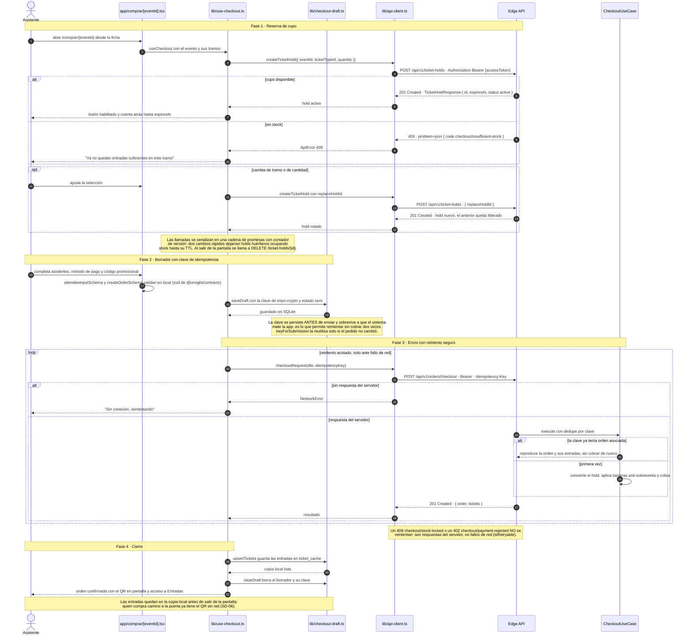
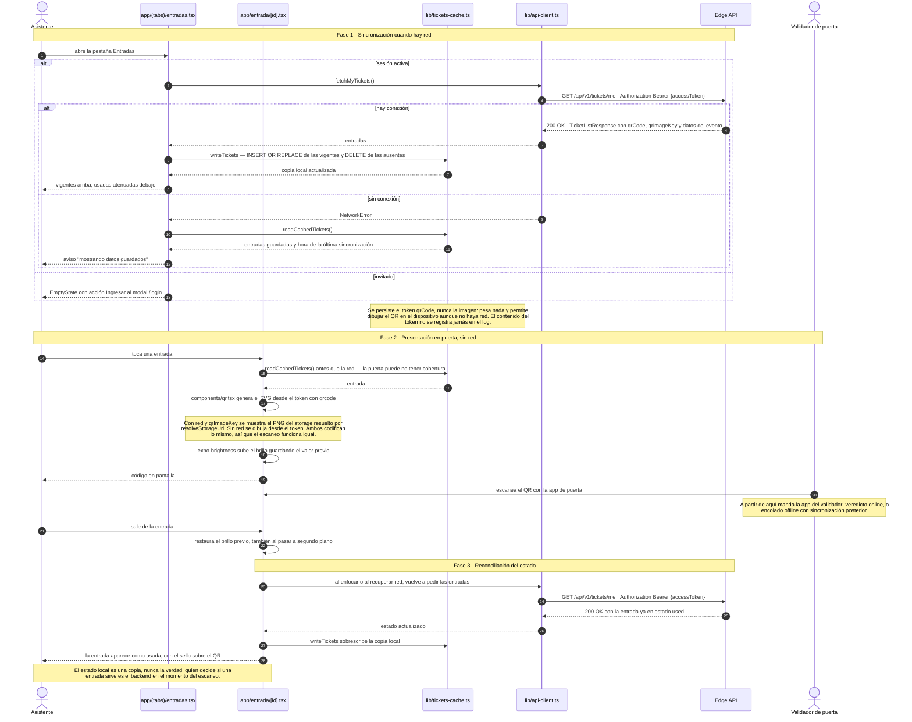

# Canales móviles: compra, Entradas y enlace de promotor — Implementation Plan

> **For agentic workers:** REQUIRED SUB-SKILL: Use superpowers:subagent-driven-development (recommended) or superpowers:executing-plans to implement this plan task-by-task. Steps use checkbox (`- [ ]`) syntax for tracking.

**Goal:** Implementar en `apps/mobile` los flujos SD-05 (compra), SD-06 (pestaña Entradas, con operación sin red) y SD-04 fase 3 (enlace profundo del código de promotor) de `docs/diagramas-secuencia/90-canales-moviles.md`.

**Architecture:** Todo vive en `apps/mobile`, sin tocar backend ni `apps/validator`. Se añade una capa base de cinco módulos (errores, storage, SQLite local, red, QR) sobre la que se montan las tres pantallas nuevas. El checkout replica el patrón de `apps/web/components/checkout/use-checkout-form.ts` — reserva de cupo con `ticket-holds` y `holdId` dentro de `items[]` — y le suma lo que la web no tiene: clave de idempotencia persistida que sobrevive a que el sistema mate la app.

**Tech Stack:** Expo SDK 54, expo-router 6, React Native 0.81, TypeScript, Zod vía `@urnight/contracts`, expo-sqlite, expo-secure-store, Vitest 2 para módulos puros.

**Spec:** [`docs/superpowers/specs/2026-08-01-canales-moviles-compra-entradas-design.md`](../specs/2026-08-01-canales-moviles-compra-entradas-design.md)

## Global Constraints

- Todo el código nuevo vive en `apps/mobile`. **No se modifica `apps/api`, `apps/web` ni `apps/validator`.**
- Comentarios, copy de UI y mensajes de error **en español**. El copy de UI usa "Ravenue" (marca), nunca "UrNight".
- Validación con esquemas de `@urnight/contracts`. **Nunca redefinir un esquema en el móvil.**
- **`lib/api-client.ts` no importa `lib/auth-context.tsx`.** El token entra por inyección (`setTokenProvider`). La dependencia va en sentido contrario y hay que mantenerla así.
- Los módulos con tests **no pueden importar nada de `react-native`, `expo-*` ni `@expo/*`**: Vitest corre en entorno `node`. Cualquier lógica testeable va en un fichero puro separado del que toca la plataforma.
- **Nunca se registra en el log el contenido de un `qrCode`** (§6 de `PROJECT_SPECS`, mismo criterio que `apps/validator/lib/offline-cache.ts`).
- La caché local guarda el **token** `qrCode`, nunca la imagen.
- El estado local es una copia: quien decide si una entrada sirve es el backend.
- Tras cada tarea deben pasar `pnpm --filter @urnight/mobile typecheck` y `pnpm --filter @urnight/mobile lint`.
- Versiones fijas cuando se indican: `qrcode@^1.5.4`, `@types/qrcode@^1.5.5`, `vitest@^2.1.8`, `@react-native-community/netinfo@11.4.1`. Los módulos Expo se instalan con `expo install` para que resuelva la versión del SDK.
- Estilos con los tokens de `lib/theme.ts` (`color`, `radius`, `space`, `type`). Nada de colores literales nuevos.
- Un commit por tarea, mensaje en español, formato convencional (`feat:`, `test:`, `docs:`, `chore:`).

---

## File Structure

**Capa base (nueva)**

| Fichero | Responsabilidad | Puro |
|---|---|---|
| `lib/errors.ts` | `ApiError` y `NetworkError`. Sin dependencias de plataforma | ✅ |
| `lib/storage-url.ts` | `joinStorageUrl(base, ref)`: key de S3 a URL | ✅ |
| `lib/storage.ts` | `resolveStorageUrl(ref)`: base desde Expo + `joinStorageUrl` | ❌ |
| `lib/checkout-errors.ts` | `code` de checkout a mensaje, y qué error se reintenta | ✅ |
| `lib/tickets-reconcile.ts` | Qué entradas se insertan y cuáles se borran | ✅ |
| `lib/checkout-draft-rules.ts` | Igualdad de DTO y elección de clave de idempotencia | ✅ |
| `lib/local-db.ts` | Apertura y migración de la base SQLite | ❌ |
| `lib/tickets-cache.ts` | Lectura y escritura de `ticket_cache` | ❌ |
| `lib/checkout-draft.ts` | Lectura y escritura de `checkout_draft` | ❌ |
| `lib/net.ts` | Estado de conexión con NetInfo | ❌ |
| `components/qr.tsx` | Render del QR desde token o desde el PNG del storage | ❌ |

**Pantallas y lógica (nuevas)**

| Fichero | Responsabilidad |
|---|---|
| `app/(tabs)/entradas.tsx` | Lista de entradas (renombra `billetera.tsx`) |
| `app/entrada/[id].tsx` | Entrada a pantalla completa con QR y brillo |
| `lib/use-checkout.ts` | Máquina de estados del checkout: hold, borrador, envío |
| `app/comprar/[eventId].tsx` | Vista del checkout |
| `app/p/[code].tsx` | Aterrizaje del código de promotor |

**Modificados**

| Fichero | Cambio |
|---|---|
| `lib/api-client.ts` | `DELETE`, cabeceras, `NetworkError`, `authed()` y las funciones nuevas |
| `lib/auth-context.tsx` | Registra el proveedor de token al montar |
| `app/(tabs)/_layout.tsx` | Pestaña `billetera` a `entradas` |
| `app/evento/[slug].tsx` | CTA de compra operativo |
| `app/_layout.tsx` | Rutas `comprar/[eventId]`, `entrada/[id]` y `p/[code]` |
| `app.json` | `intentFilters` y `associatedDomains` |
| `package.json` | Dependencias nuevas y script `test` |

---

### Task 1: Infraestructura de pruebas y resolución de storage

Arranca el ciclo de test del móvil (hoy no tiene ninguno) con el módulo puro más pequeño del plan.

**Files:**
- Create: `apps/mobile/vitest.config.ts`
- Create: `apps/mobile/lib/storage-url.ts`
- Create: `apps/mobile/lib/storage.ts`
- Create: `apps/mobile/lib/storage-url.spec.ts`
- Modify: `apps/mobile/package.json`

**Interfaces:**
- Consumes: nada.
- Produces:
  - `joinStorageUrl(baseUrl: string, ref: string | null | undefined): string | null`
  - `resolveStorageUrl(ref: string | null | undefined): string | null`

- [ ] **Step 1: Añadir Vitest y el script de test**

En `apps/mobile/package.json`, dentro de `scripts` (después de `"lint"`):

```json
    "test": "vitest run",
    "test:watch": "vitest"
```

Y en `devDependencies`:

```json
    "vitest": "^2.1.8"
```

Instalar desde la raíz del workspace:

```bash
pnpm install
```

- [ ] **Step 2: Crear la configuración de Vitest**

`apps/mobile/vitest.config.ts`:

```ts
import { defineConfig } from 'vitest/config';

/**
 * Pruebas de los módulos PUROS del móvil. Entorno `node`: aquí no se monta React
 * Native ni se carga ningún módulo de Expo. Cualquier lógica que necesite
 * plataforma vive en un fichero aparte del que se prueba (ver `lib/storage.ts`
 * frente a `lib/storage-url.ts`).
 */
export default defineConfig({
  test: {
    environment: 'node',
    include: ['lib/**/*.spec.ts'],
  },
});
```

- [ ] **Step 3: Escribir el test que falla**

`apps/mobile/lib/storage-url.spec.ts`:

```ts
import { describe, expect, it } from 'vitest';
import { joinStorageUrl } from './storage-url';

describe('joinStorageUrl', () => {
  it('convierte una key de S3 en URL absoluta', () => {
    expect(joinStorageUrl('http://10.0.0.5:4566', 'tickets/abc.png')).toBe(
      'http://10.0.0.5:4566/tickets/abc.png',
    );
  });

  it('no duplica barras entre la base y la key', () => {
    expect(joinStorageUrl('http://10.0.0.5:4566/', '/tickets/abc.png')).toBe(
      'http://10.0.0.5:4566/tickets/abc.png',
    );
  });

  it('devuelve tal cual una URL absoluta', () => {
    expect(joinStorageUrl('http://10.0.0.5:4566', 'https://cdn.ravenue.pe/a.png')).toBe(
      'https://cdn.ravenue.pe/a.png',
    );
  });

  it('devuelve null cuando no hay referencia', () => {
    expect(joinStorageUrl('http://10.0.0.5:4566', null)).toBeNull();
    expect(joinStorageUrl('http://10.0.0.5:4566', undefined)).toBeNull();
    expect(joinStorageUrl('http://10.0.0.5:4566', '')).toBeNull();
  });
});
```

- [ ] **Step 4: Ejecutar el test y verificar que falla**

Run: `pnpm --filter @urnight/mobile test`
Expected: FAIL — no se resuelve `./storage-url`.

- [ ] **Step 5: Implementar el módulo puro**

`apps/mobile/lib/storage-url.ts`:

```ts
/**
 * Resolución de referencias de object storage, sin dependencias de plataforma
 * (por eso es testeable). Espejo de `resolve()` en
 * `apps/web/lib/storage/storage-context.tsx`: una key de S3 se compone con la
 * base pública, y una URL absoluta pasa tal cual (seeds y externas).
 */
export function joinStorageUrl(
  baseUrl: string,
  ref: string | null | undefined,
): string | null {
  if (!ref) return null;
  if (/^https?:\/\//i.test(ref)) return ref;
  return `${baseUrl.replace(/\/+$/, '')}/${ref.replace(/^\/+/, '')}`;
}
```

- [ ] **Step 6: Ejecutar el test y verificar que pasa**

Run: `pnpm --filter @urnight/mobile test`
Expected: PASS — 4 tests.

- [ ] **Step 7: Implementar el envoltorio con plataforma**

`apps/mobile/lib/storage.ts`:

```ts
import Constants from 'expo-constants';
import { joinStorageUrl } from './storage-url';

/**
 * Base pública del object storage. Mismo problema y misma solución que
 * `resolveApiUrl()` en `lib/api-client.ts`: en dispositivo físico `localhost`
 * apunta al teléfono, así que se deriva la IP del host de Metro (`hostUri`).
 * LocalStack escucha en 4566 (ver `.env.example`).
 */
function resolveStorageBase(): string {
  if (process.env.EXPO_PUBLIC_STORAGE_URL) return process.env.EXPO_PUBLIC_STORAGE_URL;
  const host = Constants.expoConfig?.hostUri?.split(':')[0];
  return host ? `http://${host}:4566` : 'http://localhost:4566';
}

const STORAGE_URL = resolveStorageBase();

/** Key de S3 (o URL absoluta) a URL renderizable. `null` si no hay referencia. */
export function resolveStorageUrl(ref: string | null | undefined): string | null {
  return joinStorageUrl(STORAGE_URL, ref);
}
```

- [ ] **Step 8: Verificar typecheck y lint**

Run: `pnpm --filter @urnight/mobile typecheck && pnpm --filter @urnight/mobile lint`
Expected: sin errores.

- [ ] **Step 9: Commit**

```bash
git add apps/mobile/vitest.config.ts apps/mobile/lib/storage-url.ts apps/mobile/lib/storage-url.spec.ts apps/mobile/lib/storage.ts apps/mobile/package.json pnpm-lock.yaml
git commit -m "feat(mobile): resolución de object storage y arranque de Vitest"
```

---

### Task 2: Cliente HTTP — NetworkError, DELETE, cabeceras y token inyectado

**Files:**
- Create: `apps/mobile/lib/errors.ts`
- Modify: `apps/mobile/lib/api-client.ts`
- Modify: `apps/mobile/lib/auth-context.tsx`

**Interfaces:**
- Consumes: nada de tareas previas.
- Produces:
  - `class ApiError extends Error { status: number; code?: string; fieldErrors?: Record<string, string[]> }`
  - `class NetworkError extends Error { }`
  - `setTokenProvider(provider: (() => Promise<string | null>) | null): void`
  - `authed<T>(path: string, event: string, options?: { method?: 'GET' | 'POST' | 'DELETE'; json?: unknown; headers?: Record<string, string> }): Promise<T>`

- [ ] **Step 1: Extraer los errores a un módulo puro**

`apps/mobile/lib/errors.ts`:

```ts
import type { ProblemDetails } from '@urnight/contracts';

/**
 * Error HTTP del API en formato RFC 7807. El servidor respondió: la petición
 * llegó y hay veredicto, así que NO se reintenta.
 */
export class ApiError extends Error {
  readonly status: number;
  readonly code?: string;
  readonly fieldErrors?: Record<string, string[]>;

  constructor(status: number, problem?: Partial<ProblemDetails>) {
    super(problem?.detail ?? problem?.title ?? `HTTP ${status}`);
    this.name = 'ApiError';
    this.status = status;
    this.code = problem?.code;
    this.fieldErrors = problem?.errors;
  }
}

/**
 * La petición no llegó a tener respuesta: sin red, timeout o DNS. Es la
 * distinción que gobierna el reintento del checkout (SD-05): un fallo de red se
 * reintenta con la misma clave de idempotencia, una respuesta del servidor no.
 */
export class NetworkError extends Error {
  constructor(message = 'Sin conexión con Ravenue.') {
    super(message);
    this.name = 'NetworkError';
  }
}
```

- [ ] **Step 2: Reemplazar la clase local de `api-client.ts` por la importada**

En `apps/mobile/lib/api-client.ts`, borrar el bloque completo de la clase `ApiError` (desde el comentario `/** Error HTTP del API en formato RFC 7807 ... */` hasta el cierre de la clase) y añadir junto al resto de imports:

```ts
import { ApiError, NetworkError } from './errors';
```

Y justo debajo de los imports, para no romper a quien ya lo importa desde aquí (`app/login.tsx`, `app/(tabs)/cuenta.tsx`):

```ts
export { ApiError, NetworkError } from './errors';
```

- [ ] **Step 3: Ampliar `RequestOptions` y `request()`**

En `apps/mobile/lib/api-client.ts`, sustituir la interfaz `RequestOptions` y el cuerpo del `catch` de `request()`:

```ts
interface RequestOptions {
  method?: 'GET' | 'POST' | 'DELETE';
  json?: unknown;
  token?: string;
  /** Cabeceras extra (p. ej. `Idempotency-Key` del checkout, SD-05). */
  headers?: Record<string, string>;
}
```

En la construcción del `fetch`, añadir `...options.headers` como último spread de `headers`:

```ts
      headers: {
        ...(options.json !== undefined ? { 'Content-Type': 'application/json' } : {}),
        ...(options.token ? { Authorization: `Bearer ${options.token}` } : {}),
        ...options.headers,
      },
```

Y en el `catch`, envolver el fallo de red en `NetworkError`:

```ts
  } catch (err) {
    if (err instanceof ApiError) throw err;
    log.error({ path, err: (err as Error).message }, `${event}.network_error`);
    throw new NetworkError();
  } finally {
```

- [ ] **Step 4: Añadir el proveedor de token y `authed()`**

En `apps/mobile/lib/api-client.ts`, después de la función `request()`:

```ts
type TokenProvider = () => Promise<string | null>;

let tokenProvider: TokenProvider | null = null;

/**
 * Registra de dónde sale el access token. Lo llama `AuthProvider` al montar.
 *
 * Se inyecta en vez de importarse porque `lib/auth-context.tsx` ya importa este
 * módulo: importarlo de vuelta cerraría el ciclo. La dependencia va en un solo
 * sentido y así se queda.
 */
export function setTokenProvider(provider: TokenProvider | null): void {
  tokenProvider = provider;
}

/**
 * Petición autenticada: pide el token vigente al proveedor (que renueva con
 * single-flight si hace falta, SD-03) y lo manda como Bearer.
 */
export async function authed<T>(
  path: string,
  event: string,
  options: Omit<RequestOptions, 'token'> = {},
): Promise<T> {
  const token = await tokenProvider?.();
  if (!token) throw new ApiError(401, { code: 'identity/unauthenticated' });
  return request<T>(path, event, { ...options, token });
}
```

- [ ] **Step 5: Registrar el proveedor en `AuthProvider`**

En `apps/mobile/lib/auth-context.tsx`, añadir `setTokenProvider` a la importación existente de `./api-client`:

```ts
import {
  ApiError,
  loginRequest,
  logoutRequest,
  refreshRequest,
  setTokenProvider,
} from './api-client';
```

Y justo después de la declaración de `getAccessToken` (antes del `useEffect` de `AppState`):

```ts
  // El cliente HTTP obtiene el token de aquí, sin importar este módulo (evita
  // el ciclo de dependencias). Se limpia al desmontar.
  useEffect(() => {
    setTokenProvider(getAccessToken);
    return () => setTokenProvider(null);
  }, [getAccessToken]);
```

- [ ] **Step 6: Verificar typecheck, lint y tests**

Run: `pnpm --filter @urnight/mobile typecheck && pnpm --filter @urnight/mobile lint && pnpm --filter @urnight/mobile test`
Expected: sin errores, 4 tests en verde.

- [ ] **Step 7: Commit**

```bash
git add apps/mobile/lib/errors.ts apps/mobile/lib/api-client.ts apps/mobile/lib/auth-context.tsx
git commit -m "feat(mobile): NetworkError, DELETE y token inyectado en el cliente HTTP"
```

---

### Task 3: Endpoints de compra, entradas y canje

**Files:**
- Modify: `apps/mobile/lib/api-client.ts`

**Interfaces:**
- Consumes: `authed()`, `request()`, `ApiError` (Task 2).
- Produces:
  - `interface CheckoutResult { order: OrderResponse; tickets: TicketResponse[] }`
  - `createTicketHold(dto: CreateTicketHoldDto): Promise<TicketHoldResponse>`
  - `releaseTicketHold(holdId: string): Promise<void>`
  - `checkoutRequest(dto: CreateOrderDto, idempotencyKey: string): Promise<CheckoutResult>`
  - `fetchMyTickets(): Promise<TicketListResponse>`
  - `resolveRedemptionCode(code: string): Promise<ResolveRedemptionCodeResponse>`
  - `registerRedemptionClick(code: string): Promise<void>`

- [ ] **Step 1: Ampliar los tipos importados**

En `apps/mobile/lib/api-client.ts`, añadir al bloque de importación de `@urnight/contracts` (respetando el orden alfabético existente):

```ts
  type CreateOrderDto,
  type CreateTicketHoldDto,
  type OrderResponse,
  type ResolveRedemptionCodeResponse,
  type TicketHoldResponse,
  type TicketListResponse,
  type TicketResponse,
```

- [ ] **Step 2: Añadir las funciones al final del fichero**

```ts
// --- Reserva de cupo y compra (SD-05, espejo de apps/web/lib/api/orders.ts) ---

/** Reserva de cupo con TTL. `replaceHoldId` reemplaza el hold anterior de forma atómica. */
export function createTicketHold(dto: CreateTicketHoldDto): Promise<TicketHoldResponse> {
  return authed<TicketHoldResponse>('/ticket-holds', 'mobile.api.hold_create', {
    method: 'POST',
    json: dto,
  });
}

/** Libera el cupo al salir del checkout. 204 sin cuerpo. */
export function releaseTicketHold(holdId: string): Promise<void> {
  return authed<void>(
    `/ticket-holds/${encodeURIComponent(holdId)}`,
    'mobile.api.hold_release',
    { method: 'DELETE' },
  );
}

/** Respuesta del checkout: la API crea y paga la orden en un paso (MockPayment). */
export interface CheckoutResult {
  order: OrderResponse;
  tickets: TicketResponse[];
}

/**
 * Compra. La cabecera `Idempotency-Key` hace que reintentar la MISMA clave
 * reproduzca la orden en vez de duplicarla (SD-05). El móvil es el primer
 * cliente que la usa: la web todavía no la manda.
 */
export function checkoutRequest(
  dto: CreateOrderDto,
  idempotencyKey: string,
): Promise<CheckoutResult> {
  return authed<CheckoutResult>('/orders/checkout', 'mobile.api.checkout', {
    method: 'POST',
    json: dto,
    headers: { 'Idempotency-Key': idempotencyKey },
  });
}

// --- Entradas (SD-06) ---

/** Billetera del usuario autenticado: entradas con qrCode, qrImageKey y datos del evento. */
export function fetchMyTickets(): Promise<TicketListResponse> {
  return authed<TicketListResponse>('/tickets/me', 'mobile.api.tickets_mine');
}

// --- Códigos de promotor (SD-04 fase 3) ---

/** Resuelve un código de canje. Público: no requiere sesión. */
export function resolveRedemptionCode(code: string): Promise<ResolveRedemptionCodeResponse> {
  return request<ResolveRedemptionCodeResponse>(
    `/redemption-codes/${encodeURIComponent(code)}`,
    'mobile.api.redemption_resolve',
  );
}

/** Registra el clic de atribución del promotor. Best-effort: nunca bloquea la UI. */
export function registerRedemptionClick(code: string): Promise<void> {
  return request<void>(
    `/redemption-codes/${encodeURIComponent(code)}/click`,
    'mobile.api.redemption_click',
    { method: 'POST' },
  );
}
```

- [ ] **Step 3: Verificar typecheck y lint**

Run: `pnpm --filter @urnight/mobile typecheck && pnpm --filter @urnight/mobile lint`
Expected: sin errores.

- [ ] **Step 4: Commit**

```bash
git add apps/mobile/lib/api-client.ts
git commit -m "feat(mobile): endpoints de holds, checkout, entradas y códigos de canje"
```

---

### Task 4: Mensajes y política de reintento del checkout

Módulo puro y con test: aquí es donde un fallo cobra dos veces.

**Files:**
- Create: `apps/mobile/lib/checkout-errors.ts`
- Create: `apps/mobile/lib/checkout-errors.spec.ts`

**Interfaces:**
- Consumes: `ApiError`, `NetworkError` de `lib/errors.ts` (Task 2).
- Produces:
  - `checkoutMessageOf(err: unknown): string`
  - `isRetryable(err: unknown): boolean`

- [ ] **Step 1: Escribir el test que falla**

`apps/mobile/lib/checkout-errors.spec.ts`:

```ts
import { CHECKOUT_ERROR_CODES } from '@urnight/contracts';
import { describe, expect, it } from 'vitest';
import { checkoutMessageOf, isRetryable } from './checkout-errors';
import { ApiError, NetworkError } from './errors';

describe('isRetryable', () => {
  it('reintenta un fallo de red', () => {
    expect(isRetryable(new NetworkError())).toBe(true);
  });

  it('NO reintenta una respuesta del servidor', () => {
    expect(isRetryable(new ApiError(409, { code: CHECKOUT_ERROR_CODES.STOCK_LOCKED }))).toBe(
      false,
    );
    expect(isRetryable(new ApiError(402, { code: CHECKOUT_ERROR_CODES.PAYMENT_REJECTED }))).toBe(
      false,
    );
    expect(isRetryable(new ApiError(500))).toBe(false);
  });

  it('NO reintenta un error desconocido', () => {
    expect(isRetryable(new Error('boom'))).toBe(false);
  });
});

describe('checkoutMessageOf', () => {
  it('traduce el stock agotado', () => {
    const msg = checkoutMessageOf(
      new ApiError(409, { code: CHECKOUT_ERROR_CODES.INSUFFICIENT_STOCK }),
    );
    expect(msg).toContain('entradas');
  });

  it('traduce el pago rechazado', () => {
    const msg = checkoutMessageOf(
      new ApiError(402, { code: CHECKOUT_ERROR_CODES.PAYMENT_REJECTED }),
    );
    expect(msg).toContain('pago');
  });

  it('traduce el hold expirado', () => {
    const msg = checkoutMessageOf(
      new ApiError(409, { code: CHECKOUT_ERROR_CODES.HOLD_EXPIRED }),
    );
    expect(msg).toContain('reserva');
  });

  it('traduce el asistente menor de edad', () => {
    const msg = checkoutMessageOf(
      new ApiError(422, { code: CHECKOUT_ERROR_CODES.ATTENDEE_UNDERAGE }),
    );
    expect(msg).toContain('18');
  });

  it('da un mensaje de red para NetworkError', () => {
    expect(checkoutMessageOf(new NetworkError())).toContain('conexión');
  });

  it('cae a un mensaje genérico ante un código desconocido', () => {
    expect(checkoutMessageOf(new ApiError(500, { code: 'ops/boom' }))).toBe(
      'No pudimos completar la compra. Inténtalo de nuevo.',
    );
  });
});
```

- [ ] **Step 2: Ejecutar el test y verificar que falla**

Run: `pnpm --filter @urnight/mobile test`
Expected: FAIL — no se resuelve `./checkout-errors`.

- [ ] **Step 3: Implementar**

`apps/mobile/lib/checkout-errors.ts`:

```ts
import { CHECKOUT_ERROR_CODES } from '@urnight/contracts';
import { ApiError, NetworkError } from './errors';

/**
 * Copy de UX por código de dominio del checkout (SD-05). Los códigos vienen de
 * `@urnight/contracts`, nunca escritos a mano: si el backend renombra uno, esto
 * deja de compilar.
 */
const MESSAGES: Record<string, string> = {
  [CHECKOUT_ERROR_CODES.EVENT_NOT_ON_SALE]: 'Este evento ya no está a la venta.',
  [CHECKOUT_ERROR_CODES.TICKET_TYPE_NOT_FOUND]: 'Ese tramo ya no existe.',
  [CHECKOUT_ERROR_CODES.TICKET_TYPE_UNAVAILABLE]: 'Ese tramo no está disponible ahora mismo.',
  [CHECKOUT_ERROR_CODES.INSUFFICIENT_STOCK]: 'Ya no quedan entradas suficientes en este tramo.',
  [CHECKOUT_ERROR_CODES.INSUFFICIENT_CAPACITY]: 'El local llegó a su aforo para esta noche.',
  [CHECKOUT_ERROR_CODES.HOLD_NOT_FOUND]: 'Tu reserva de cupo se perdió. Vuelve a intentarlo.',
  [CHECKOUT_ERROR_CODES.HOLD_EXPIRED]: 'Tu reserva de cupo expiró. Vuelve a intentarlo.',
  [CHECKOUT_ERROR_CODES.HOLD_UNAVAILABLE]: 'Tu reserva de cupo ya no es válida.',
  [CHECKOUT_ERROR_CODES.MAX_PER_USER_EXCEEDED]: 'Superaste el máximo de entradas por persona.',
  [CHECKOUT_ERROR_CODES.PAYMENT_REJECTED]: 'El pago fue rechazado. Prueba con otro método.',
  [CHECKOUT_ERROR_CODES.ATTENDEE_UNDERAGE]: 'Todos los asistentes deben ser mayores de 18 años.',
  [CHECKOUT_ERROR_CODES.STOCK_LOCKED]: 'Hay mucha demanda en este tramo. Inténtalo en unos segundos.',
};

/** Traduce el fallo a copy de UX. */
export function checkoutMessageOf(err: unknown): string {
  if (err instanceof NetworkError) {
    return 'Sin conexión. Revisa tu red e inténtalo de nuevo.';
  }
  if (err instanceof ApiError) {
    if (err.code && MESSAGES[err.code]) return MESSAGES[err.code];
    if (err.status === 401) return 'Tu sesión expiró. Vuelve a ingresar.';
  }
  return 'No pudimos completar la compra. Inténtalo de nuevo.';
}

/**
 * Solo se reintenta lo que NO tuvo respuesta del servidor. Un 409 o un 402 son
 * veredictos: reintentarlos no cambia nada y confunde al usuario.
 */
export function isRetryable(err: unknown): boolean {
  return err instanceof NetworkError;
}
```

- [ ] **Step 4: Ejecutar el test y verificar que pasa**

Run: `pnpm --filter @urnight/mobile test`
Expected: PASS — 10 tests en total.

- [ ] **Step 5: Verificar typecheck y lint**

Run: `pnpm --filter @urnight/mobile typecheck && pnpm --filter @urnight/mobile lint`
Expected: sin errores.

- [ ] **Step 6: Commit**

```bash
git add apps/mobile/lib/checkout-errors.ts apps/mobile/lib/checkout-errors.spec.ts
git commit -m "feat(mobile): mensajes y política de reintento del checkout"
```

---

### Task 5: Base SQLite local y caché de entradas

**Files:**
- Create: `apps/mobile/lib/local-db.ts`
- Create: `apps/mobile/lib/tickets-reconcile.ts`
- Create: `apps/mobile/lib/tickets-reconcile.spec.ts`
- Create: `apps/mobile/lib/tickets-cache.ts`

**Interfaces:**
- Consumes: nada de tareas previas.
- Produces:
  - `getDb(): Promise<SQLite.SQLiteDatabase>`
  - `reconcileTickets(cachedIds: string[], fresh: TicketResponse[]): { upsert: TicketResponse[]; deleteIds: string[] }`
  - `readCachedTickets(): Promise<{ tickets: TicketResponse[]; syncedAt: string | null }>`
  - `writeTickets(fresh: TicketResponse[]): Promise<void>`
  - `upsertTickets(tickets: TicketResponse[]): Promise<void>`

- [ ] **Step 1: Escribir el test que falla**

`apps/mobile/lib/tickets-reconcile.spec.ts`:

```ts
import type { TicketResponse } from '@urnight/contracts';
import { describe, expect, it } from 'vitest';
import { reconcileTickets } from './tickets-reconcile';

function ticket(id: string): TicketResponse {
  return {
    id,
    eventId: '11111111-1111-1111-1111-111111111111',
    ticketTypeId: '22222222-2222-2222-2222-222222222222',
    qrCode: `token-${id}`,
    qrImageKey: null,
    status: 'valid',
    issuedAt: '2026-08-01T00:00:00.000Z',
    attendeeName: 'Ana Torres',
    eventName: 'Noche RAVENUE',
    eventStartsAt: '2026-08-09T03:00:00.000Z',
    eventFlyerKey: null,
    venueName: 'Bunker',
    ticketTypeName: 'General',
  };
}

describe('reconcileTickets', () => {
  it('inserta las entradas nuevas', () => {
    const res = reconcileTickets([], [ticket('a'), ticket('b')]);
    expect(res.upsert.map((t) => t.id)).toEqual(['a', 'b']);
    expect(res.deleteIds).toEqual([]);
  });

  it('borra de la caché lo que el backend ya no devuelve', () => {
    const res = reconcileTickets(['a', 'b'], [ticket('a')]);
    expect(res.upsert.map((t) => t.id)).toEqual(['a']);
    expect(res.deleteIds).toEqual(['b']);
  });

  it('sobrescribe siempre lo cacheado: el backend manda', () => {
    const used = { ...ticket('a'), status: 'used' as const };
    const res = reconcileTickets(['a'], [used]);
    expect(res.upsert[0].status).toBe('used');
  });

  it('vacía la caché si el backend devuelve una lista vacía', () => {
    const res = reconcileTickets(['a', 'b'], []);
    expect(res.upsert).toEqual([]);
    expect(res.deleteIds).toEqual(['a', 'b']);
  });
});
```

- [ ] **Step 2: Ejecutar el test y verificar que falla**

Run: `pnpm --filter @urnight/mobile test`
Expected: FAIL — no se resuelve `./tickets-reconcile`.

- [ ] **Step 3: Implementar la reconciliación pura**

`apps/mobile/lib/tickets-reconcile.ts`:

```ts
import type { TicketResponse } from '@urnight/contracts';

/**
 * Qué escribir y qué borrar de la copia local tras una respuesta del backend
 * (SD-06 fase 3). La copia local NUNCA decide: todo lo que llega se sobrescribe
 * y todo lo que no llega se borra.
 */
export function reconcileTickets(
  cachedIds: string[],
  fresh: TicketResponse[],
): { upsert: TicketResponse[]; deleteIds: string[] } {
  const freshIds = new Set(fresh.map((t) => t.id));
  return {
    upsert: fresh,
    deleteIds: cachedIds.filter((id) => !freshIds.has(id)),
  };
}
```

- [ ] **Step 4: Ejecutar el test y verificar que pasa**

Run: `pnpm --filter @urnight/mobile test`
Expected: PASS — 14 tests en total.

- [ ] **Step 5: Implementar la apertura de la base**

`apps/mobile/lib/local-db.ts`:

```ts
import * as SQLite from 'expo-sqlite';

/**
 * Base local del canal del asistente. Un único punto de apertura y migración,
 * como `apps/validator/lib/offline-cache.ts`.
 *
 * Dos tablas sin relación entre sí: `ticket_cache` es la copia de la billetera
 * para operar sin red (SD-06) y `checkout_draft` guarda el borrador con su clave
 * de idempotencia (SD-05). Comparten fichero, no responsabilidad: cada una tiene
 * su módulo de acceso.
 */
let dbPromise: Promise<SQLite.SQLiteDatabase> | null = null;

export async function getDb(): Promise<SQLite.SQLiteDatabase> {
  if (!dbPromise) {
    dbPromise = SQLite.openDatabaseAsync('ravenue-mobile.db').then(async (db) => {
      await db.execAsync(`
        CREATE TABLE IF NOT EXISTS ticket_cache (
          id TEXT PRIMARY KEY,
          payload TEXT NOT NULL,
          synced_at TEXT NOT NULL
        );
        CREATE TABLE IF NOT EXISTS checkout_draft (
          event_id TEXT PRIMARY KEY,
          idempotency_key TEXT NOT NULL,
          dto TEXT NOT NULL,
          status TEXT NOT NULL,
          created_at TEXT NOT NULL
        );
      `);
      return db;
    });
  }
  return dbPromise;
}
```

- [ ] **Step 6: Implementar el acceso a la caché de entradas**

`apps/mobile/lib/tickets-cache.ts`:

```ts
import type { TicketResponse } from '@urnight/contracts';
import { getDb } from './local-db';
import { createLogger } from './logger';
import { reconcileTickets } from './tickets-reconcile';

const log = createLogger('tickets-cache');

interface CacheRow {
  id: string;
  payload: string;
  synced_at: string;
}

/**
 * Copia local de las entradas (SD-06). Se guarda el token `qrCode` dentro del
 * payload, nunca la imagen: pesa nada y permite dibujar el QR sin red.
 * NUNCA se registra el contenido del QR en el log (§6).
 */
export async function readCachedTickets(): Promise<{
  tickets: TicketResponse[];
  syncedAt: string | null;
}> {
  const db = await getDb();
  const rows = await db.getAllAsync<CacheRow>(
    'SELECT id, payload, synced_at FROM ticket_cache',
  );
  const tickets: TicketResponse[] = [];
  for (const row of rows) {
    try {
      tickets.push(JSON.parse(row.payload) as TicketResponse);
    } catch {
      // Fila corrupta de una versión anterior: se ignora, el refresco la repone.
    }
  }
  const syncedAt = rows.reduce<string | null>(
    (max, r) => (max === null || r.synced_at > max ? r.synced_at : max),
    null,
  );
  return { tickets, syncedAt };
}

/** Sincronización completa: sobrescribe lo devuelto y borra lo ausente. */
export async function writeTickets(fresh: TicketResponse[]): Promise<void> {
  const db = await getDb();
  const rows = await db.getAllAsync<{ id: string }>('SELECT id FROM ticket_cache');
  const { upsert, deleteIds } = reconcileTickets(
    rows.map((r) => r.id),
    fresh,
  );
  const now = new Date().toISOString();
  await db.withTransactionAsync(async () => {
    for (const t of upsert) {
      await db.runAsync(
        'INSERT OR REPLACE INTO ticket_cache (id, payload, synced_at) VALUES (?, ?, ?)',
        [t.id, JSON.stringify(t), now],
      );
    }
    for (const id of deleteIds) {
      await db.runAsync('DELETE FROM ticket_cache WHERE id = ?', [id]);
    }
  });
  log.info({ upserted: upsert.length, deleted: deleteIds.length }, 'mobile.tickets.cache_synced');
}

/**
 * Alta sin borrado, para las entradas recién emitidas en el checkout (SD-05
 * fase 4). No se puede usar `writeTickets` aquí: borraría todas las demás.
 */
export async function upsertTickets(tickets: TicketResponse[]): Promise<void> {
  if (tickets.length === 0) return;
  const db = await getDb();
  const now = new Date().toISOString();
  await db.withTransactionAsync(async () => {
    for (const t of tickets) {
      await db.runAsync(
        'INSERT OR REPLACE INTO ticket_cache (id, payload, synced_at) VALUES (?, ?, ?)',
        [t.id, JSON.stringify(t), now],
      );
    }
  });
  log.info({ count: tickets.length }, 'mobile.tickets.cache_upserted');
}
```

- [ ] **Step 7: Verificar typecheck, lint y tests**

Run: `pnpm --filter @urnight/mobile typecheck && pnpm --filter @urnight/mobile lint && pnpm --filter @urnight/mobile test`
Expected: sin errores, 14 tests en verde.

- [ ] **Step 8: Commit**

```bash
git add apps/mobile/lib/local-db.ts apps/mobile/lib/tickets-reconcile.ts apps/mobile/lib/tickets-reconcile.spec.ts apps/mobile/lib/tickets-cache.ts
git commit -m "feat(mobile): base SQLite local y caché de entradas"
```

---

### Task 6: Detección de red y componente de QR

**Files:**
- Create: `apps/mobile/lib/net.ts`
- Create: `apps/mobile/components/qr.tsx`
- Modify: `apps/mobile/package.json`

**Interfaces:**
- Consumes: `resolveStorageUrl` (Task 1).
- Produces:
  - `useIsOnline(): boolean`
  - `<TicketQr qrCode={string} qrImageKey={string | null} online={boolean} size={number} />`

- [ ] **Step 1: Instalar dependencias**

```bash
pnpm --filter @urnight/mobile add @react-native-community/netinfo@11.4.1 qrcode@^1.5.4 react-native-svg
pnpm --filter @urnight/mobile add -D @types/qrcode@^1.5.5
```

`react-native-svg` sin versión fija: la resuelve el resolutor de Expo para SDK 54. Si `pnpm` instala una incompatible, corregir con:

```bash
pnpm --filter @urnight/mobile exec expo install react-native-svg
```

`@react-native-community/netinfo@11.4.1` va fijada a la misma versión que `apps/validator`.

- [ ] **Step 2: Implementar el estado de red**

`apps/mobile/lib/net.ts`:

```ts
import NetInfo from '@react-native-community/netinfo';
import { useEffect, useState } from 'react';

/**
 * Estado de conexión (mismo mecanismo que `apps/validator`). Se asume conectado
 * al arrancar: es preferible intentar la petición y fallar a bloquear la pantalla
 * por un estado que aún no llegó.
 */
export function useIsOnline(): boolean {
  const [online, setOnline] = useState(true);
  useEffect(() => {
    const unsubscribe = NetInfo.addEventListener((state) => {
      setOnline(state.isConnected !== false);
    });
    return unsubscribe;
  }, []);
  return online;
}

/** Suscripción imperativa, para disparar la reconciliación al recuperar red. */
export function subscribeOnline(cb: (online: boolean) => void): () => void {
  return NetInfo.addEventListener((state) => cb(state.isConnected !== false));
}
```

- [ ] **Step 3: Implementar el componente de QR**

`apps/mobile/components/qr.tsx`:

```ts
/** QR de una entrada (SD-06). Espejo de apps/web/components/tickets/ticket-qr.tsx. */
import { useEffect, useState } from 'react';
import { Image, StyleSheet, View } from 'react-native';
import QRCode from 'qrcode';
import { SvgXml } from 'react-native-svg';
import { resolveStorageUrl } from '../lib/storage';
import { color, radius } from '../lib/theme';

/**
 * Con red y PNG ya generado en el storage se muestra ese. Sin red, o si el
 * checkout aún no lo subió, se dibuja localmente desde el token `qrCode`, que es
 * la fuente de verdad que valida la puerta. Ambos codifican lo mismo, así que el
 * escaneo funciona igual venga de donde venga.
 *
 * Metro resuelve `qrcode` por su campo `browser`, así que `toString` es puro JS
 * y no arrastra dependencias de Node.
 */
export function TicketQr({
  qrCode,
  qrImageKey,
  online,
  size = 240,
}: {
  qrCode: string;
  qrImageKey: string | null;
  online: boolean;
  size?: number;
}) {
  const remoteUrl = online ? resolveStorageUrl(qrImageKey) : null;
  const [svg, setSvg] = useState<string | null>(null);

  useEffect(() => {
    if (remoteUrl) return;
    let active = true;
    QRCode.toString(qrCode, { type: 'svg', margin: 1, errorCorrectionLevel: 'M' })
      .then((markup) => {
        if (active) setSvg(markup);
      })
      .catch(() => {
        // Sin QR visual: la pantalla muestra el recuadro vacío. No se registra
        // el contenido del token en el log (§6).
      });
    return () => {
      active = false;
    };
  }, [remoteUrl, qrCode]);

  if (remoteUrl) {
    return (
      <Image
        source={{ uri: remoteUrl }}
        style={[styles.box, { width: size, height: size }]}
        resizeMode="contain"
      />
    );
  }

  return (
    <View style={[styles.box, { width: size, height: size }]}>
      {svg ? <SvgXml xml={svg} width={size - 16} height={size - 16} /> : null}
    </View>
  );
}

const styles = StyleSheet.create({
  box: {
    backgroundColor: color.moon,
    borderRadius: radius.md,
    alignItems: 'center',
    justifyContent: 'center',
    padding: 8,
  },
});
```

- [ ] **Step 4: Verificar typecheck y lint**

Run: `pnpm --filter @urnight/mobile typecheck && pnpm --filter @urnight/mobile lint`
Expected: sin errores.

- [ ] **Step 5: Verificar que el bundle arranca**

Run: `pnpm dev:mobile` y abrir la app en el dispositivo o emulador.
Expected: la app carga como antes, sin error de resolución de `qrcode` ni de `react-native-svg`.

> Si Metro falla al resolver `qrcode`, sustituir el generador por `react-native-qrcode-svg`
> (`pnpm --filter @urnight/mobile add react-native-qrcode-svg`) manteniendo la misma firma pública
> de `TicketQr`. El resto del plan no cambia.

- [ ] **Step 6: Commit**

```bash
git add apps/mobile/lib/net.ts apps/mobile/components/qr.tsx apps/mobile/package.json pnpm-lock.yaml
git commit -m "feat(mobile): detección de red y render de QR"
```

---

### Task 7: SD-06 · Pestaña Entradas

**Files:**
- Create: `apps/mobile/app/(tabs)/entradas.tsx`
- Delete: `apps/mobile/app/(tabs)/billetera.tsx`
- Modify: `apps/mobile/app/(tabs)/_layout.tsx:36-44`

**Interfaces:**
- Consumes: `fetchMyTickets` (Task 3), `readCachedTickets` y `writeTickets` (Task 5), `useIsOnline` (Task 6), `resolveStorageUrl` (Task 1), `NetworkError` (Task 2), `useAuth` (existente).
- Produces: ruta `/(tabs)/entradas`, y la ruta `/entrada/{id}` a la que navega (implementada en Task 8).

- [ ] **Step 1: Renombrar la pestaña en el layout**

En `apps/mobile/app/(tabs)/_layout.tsx`, sustituir el bloque `<Tabs.Screen name="billetera" …>` por:

```tsx
      <Tabs.Screen
        name="entradas"
        options={{
          title: 'Entradas',
          tabBarIcon: ({ color: tint, size }) => (
            <Ionicons name="ticket" size={size} color={tint} />
          ),
        }}
      />
```

- [ ] **Step 2: Crear la pantalla**

Borrar `apps/mobile/app/(tabs)/billetera.tsx` y crear `apps/mobile/app/(tabs)/entradas.tsx`:

```tsx
/** Entradas del asistente (SD-06): sincroniza con red y opera desde la copia local sin ella. */
import { useCallback, useState } from 'react';
import { FlatList, Pressable, RefreshControl, StyleSheet, Text, View } from 'react-native';
import { SafeAreaView } from 'react-native-safe-area-context';
import { useFocusEffect, useRouter } from 'expo-router';
import type { TicketResponse } from '@urnight/contracts';
import { fetchMyTickets } from '../../lib/api-client';
import { NetworkError } from '../../lib/errors';
import { formatEventDate } from '../../lib/format';
import { useIsOnline } from '../../lib/net';
import { resolveStorageUrl } from '../../lib/storage';
import { readCachedTickets, writeTickets } from '../../lib/tickets-cache';
import { useAuth } from '../../lib/auth-context';
import { color, radius, space, type } from '../../lib/theme';
import { Flyer } from '../../components/flyer';
import { EmptyState, Eyebrow, LoadingState } from '../../components/ui';

const STATUS_LABELS: Record<TicketResponse['status'], string> = {
  valid: 'Vigente',
  used: 'Usada',
  cancelled: 'Cancelada',
  expired: 'Vencida',
};

/** Vigentes primero, el resto debajo y por fecha de evento descendente. */
function sortTickets(tickets: TicketResponse[]): TicketResponse[] {
  return [...tickets].sort((a, b) => {
    if (a.status === 'valid' && b.status !== 'valid') return -1;
    if (b.status === 'valid' && a.status !== 'valid') return 1;
    return (b.eventStartsAt ?? '').localeCompare(a.eventStartsAt ?? '');
  });
}

function TicketRow({ ticket, onPress }: { ticket: TicketResponse; onPress: () => void }) {
  const stale = ticket.status !== 'valid';
  return (
    <Pressable
      accessibilityRole="button"
      onPress={onPress}
      style={({ pressed }) => [styles.row, stale && styles.rowStale, pressed && styles.rowPressed]}
    >
      <View style={styles.rowFlyer}>
        <Flyer url={resolveStorageUrl(ticket.eventFlyerKey)} aspectRatio={1} borderRadius={radius.sm} />
      </View>
      <View style={styles.rowInfo}>
        <Text style={styles.rowEvent} numberOfLines={1}>
          {ticket.eventName ?? 'Evento'}
        </Text>
        {ticket.eventStartsAt ? (
          <Text style={styles.rowDate}>{formatEventDate(ticket.eventStartsAt)}</Text>
        ) : null}
        <Text style={styles.rowMeta} numberOfLines={1}>
          {[ticket.ticketTypeName, ticket.attendeeName].filter(Boolean).join(' · ')}
        </Text>
      </View>
      <Text style={[styles.rowStatus, stale && styles.rowStatusStale]}>
        {STATUS_LABELS[ticket.status]}
      </Text>
    </Pressable>
  );
}

export default function TicketsScreen() {
  const router = useRouter();
  const { status: session } = useAuth();
  const online = useIsOnline();
  const [tickets, setTickets] = useState<TicketResponse[]>([]);
  const [loading, setLoading] = useState(true);
  const [refreshing, setRefreshing] = useState(false);
  const [fromCache, setFromCache] = useState(false);
  const [syncedAt, setSyncedAt] = useState<string | null>(null);

  const load = useCallback(async () => {
    if (session !== 'authenticated') {
      setLoading(false);
      return;
    }
    try {
      const fresh = await fetchMyTickets();
      await writeTickets(fresh);
      setTickets(sortTickets(fresh));
      setFromCache(false);
      setSyncedAt(new Date().toISOString());
    } catch (err) {
      // Sin red se cae a la copia local (SD-06 fase 1). Un ApiError se trata
      // igual: mejor mostrar lo guardado que una pantalla vacía en la puerta.
      const cached = await readCachedTickets();
      setTickets(sortTickets(cached.tickets));
      setFromCache(true);
      setSyncedAt(cached.syncedAt);
      if (!(err instanceof NetworkError) && cached.tickets.length === 0) {
        setTickets([]);
      }
    } finally {
      setLoading(false);
      setRefreshing(false);
    }
  }, [session]);

  // Al enfocar y al recuperar red: el estado de la entrada pudo cambiar en puerta.
  useFocusEffect(
    useCallback(() => {
      void load();
    }, [load]),
  );

  if (session === 'restoring' || loading) {
    return (
      <SafeAreaView style={styles.safe} edges={['top']}>
        <LoadingState label="Cargando tus entradas…" />
      </SafeAreaView>
    );
  }

  if (session !== 'authenticated') {
    return (
      <SafeAreaView style={styles.safe} edges={['top']}>
        <View style={styles.header}>
          <Eyebrow>Entradas</Eyebrow>
          <Text style={styles.title}>Tus entradas</Text>
        </View>
        <EmptyState
          title="Ingresa para ver tus entradas"
          subtitle="Con tu cuenta llevas el QR en el teléfono, incluso sin señal en la puerta."
          actionLabel="Ingresar"
          onAction={() => router.push('/login')}
        />
      </SafeAreaView>
    );
  }

  return (
    <SafeAreaView style={styles.safe} edges={['top']}>
      <View style={styles.header}>
        <Eyebrow>Entradas</Eyebrow>
        <Text style={styles.title}>Tus entradas</Text>
      </View>
      {fromCache ? (
        <View style={styles.offlineBanner}>
          <Text style={styles.offlineText}>
            {syncedAt
              ? `Mostrando datos guardados · última sincronización ${formatEventDate(syncedAt)}`
              : 'Mostrando datos guardados'}
          </Text>
        </View>
      ) : null}
      <FlatList
        data={tickets}
        keyExtractor={(t) => t.id}
        contentContainerStyle={styles.list}
        refreshControl={
          <RefreshControl
            refreshing={refreshing}
            onRefresh={() => {
              setRefreshing(true);
              void load();
            }}
            tintColor={color.crimson}
          />
        }
        ListEmptyComponent={
          <EmptyState
            title={online ? 'Aún no tienes entradas' : 'Sin entradas guardadas'}
            subtitle={
              online
                ? 'Cuando compres una noche, tu QR vivirá aquí.'
                : 'Conéctate una vez para guardar tus entradas en el teléfono.'
            }
            actionLabel="Explorar eventos"
            onAction={() => router.push('/eventos')}
          />
        }
        renderItem={({ item }) => (
          <TicketRow ticket={item} onPress={() => router.push(`/entrada/${item.id}`)} />
        )}
      />
    </SafeAreaView>
  );
}

const styles = StyleSheet.create({
  safe: { flex: 1, backgroundColor: color.bgRoot },
  header: { padding: space.s4, gap: space.s2 },
  title: { ...type.h1, color: color.textPrimary },
  offlineBanner: {
    marginHorizontal: space.s4,
    marginBottom: space.s3,
    padding: space.s3,
    borderRadius: radius.md,
    borderWidth: 1,
    borderColor: color.warning,
    backgroundColor: color.warningSoft,
  },
  offlineText: { ...type.caption, color: color.warningFg },
  list: { paddingHorizontal: space.s4, paddingBottom: space.s8, gap: space.s3 },
  row: {
    flexDirection: 'row',
    alignItems: 'center',
    gap: space.s3,
    padding: space.s3,
    borderRadius: radius.lg,
    borderWidth: 1,
    borderColor: color.borderFaint,
    backgroundColor: color.bgSurface,
  },
  rowStale: { opacity: 0.5 },
  rowPressed: { opacity: 0.8 },
  rowFlyer: { width: 56 },
  rowInfo: { flex: 1, gap: space.s1 },
  rowEvent: { ...type.title, color: color.textPrimary },
  rowDate: { ...type.caption, color: color.textSecondary },
  rowMeta: { ...type.caption, color: color.textMuted },
  rowStatus: { ...type.caption, color: color.successFg },
  rowStatusStale: { color: color.textFaint },
});
```

- [ ] **Step 3: Verificar typecheck y lint**

Run: `pnpm --filter @urnight/mobile typecheck && pnpm --filter @urnight/mobile lint`
Expected: sin errores. Si `typedRoutes` se queja de `/entrada/{id}`, es esperado hasta Task 8 — en ese caso, completar Task 8 y volver a ejecutar antes de commitear.

- [ ] **Step 4: Verificar en dispositivo**

Run: `pnpm dev:mobile`
Expected: la pestaña se llama "Entradas". Como invitado muestra el `EmptyState` con "Ingresar"; con sesión, la lista o el estado vacío.

- [ ] **Step 5: Commit**

```bash
git add apps/mobile/app/(tabs)/entradas.tsx apps/mobile/app/(tabs)/_layout.tsx
git rm apps/mobile/app/\(tabs\)/billetera.tsx
git commit -m "feat(mobile): pestaña Entradas con copia local (SD-06 fases 1 y 3)"
```

---

### Task 8: SD-06 · Entrada a pantalla completa con brillo

**Files:**
- Create: `apps/mobile/app/entrada/[id].tsx`
- Modify: `apps/mobile/app/_layout.tsx`
- Modify: `apps/mobile/package.json`

**Interfaces:**
- Consumes: `readCachedTickets`, `writeTickets` (Task 5), `fetchMyTickets` (Task 3), `TicketQr` y `useIsOnline` (Task 6).
- Produces: ruta `/entrada/{id}`.

- [ ] **Step 1: Instalar expo-brightness**

```bash
pnpm --filter @urnight/mobile exec expo install expo-brightness
```

- [ ] **Step 2: Crear la pantalla**

`apps/mobile/app/entrada/[id].tsx`:

```tsx
/** Entrada a pantalla completa (SD-06 fase 2): QR grande, sin red, con brillo al máximo. */
import { useCallback, useEffect, useRef, useState } from 'react';
import { AppState, ScrollView, StyleSheet, Text, View } from 'react-native';
import { SafeAreaView } from 'react-native-safe-area-context';
import { useLocalSearchParams } from 'expo-router';
import * as Brightness from 'expo-brightness';
import type { TicketResponse } from '@urnight/contracts';
import { fetchMyTickets } from '../../lib/api-client';
import { formatEventDate } from '../../lib/format';
import { createLogger } from '../../lib/logger';
import { useIsOnline } from '../../lib/net';
import { readCachedTickets, writeTickets } from '../../lib/tickets-cache';
import { color, radius, space, type } from '../../lib/theme';
import { TicketQr } from '../../components/qr';
import { ErrorState, Eyebrow, LoadingState } from '../../components/ui';

const log = createLogger('ticket-detail');

const STATUS_LABELS: Record<TicketResponse['status'], string> = {
  valid: 'Vigente',
  used: 'Ya utilizada',
  cancelled: 'Cancelada',
  expired: 'Vencida',
};

/**
 * Sube el brillo al máximo mientras el QR está en pantalla y restaura el valor
 * previo al salir Y al pasar a segundo plano. Sin la restauración, la app deja
 * el teléfono al 100% y quema batería en la cola.
 */
function useMaxBrightness() {
  const previous = useRef<number | null>(null);

  useEffect(() => {
    let active = true;
    const restore = async () => {
      if (previous.current === null) return;
      try {
        await Brightness.setBrightnessAsync(previous.current);
      } catch (err) {
        log.warn({ err: (err as Error).message }, 'mobile.ticket.brightness_restore_failed');
      }
    };

    Brightness.getBrightnessAsync()
      .then(async (value) => {
        if (!active) return;
        previous.current = value;
        await Brightness.setBrightnessAsync(1);
      })
      .catch((err) => {
        log.warn({ err: (err as Error).message }, 'mobile.ticket.brightness_failed');
      });

    const sub = AppState.addEventListener('change', (state) => {
      if (state !== 'active') void restore();
    });

    return () => {
      active = false;
      sub.remove();
      void restore();
    };
  }, []);
}

export default function TicketDetailScreen() {
  const { id } = useLocalSearchParams<{ id: string }>();
  const online = useIsOnline();
  const [ticket, setTicket] = useState<TicketResponse | null>(null);
  const [loading, setLoading] = useState(true);
  useMaxBrightness();

  const load = useCallback(async () => {
    if (!id) return;
    // La copia local primero: la puerta puede no tener cobertura.
    const cached = await readCachedTickets();
    const local = cached.tickets.find((t) => t.id === id) ?? null;
    setTicket(local);
    setLoading(false);
    if (!online) return;
    try {
      const fresh = await fetchMyTickets();
      await writeTickets(fresh);
      setTicket(fresh.find((t) => t.id === id) ?? local);
    } catch {
      // Se queda con la copia local: es exactamente para esto.
    }
  }, [id, online]);

  useEffect(() => {
    void load();
  }, [load]);

  if (loading) {
    return (
      <SafeAreaView style={styles.safe} edges={['top']}>
        <LoadingState label="Abriendo tu entrada…" />
      </SafeAreaView>
    );
  }

  if (!ticket) {
    return (
      <SafeAreaView style={styles.safe} edges={['top']}>
        <ErrorState message="No encontramos esta entrada en el teléfono." />
      </SafeAreaView>
    );
  }

  const stale = ticket.status !== 'valid';

  return (
    <SafeAreaView style={styles.safe} edges={['top', 'bottom']}>
      <ScrollView contentContainerStyle={styles.scroll}>
        <View style={styles.head}>
          <Eyebrow>{ticket.ticketTypeName ?? 'Entrada'}</Eyebrow>
          <Text style={styles.event}>{ticket.eventName ?? 'Evento'}</Text>
          {ticket.eventStartsAt ? (
            <Text style={styles.date}>{formatEventDate(ticket.eventStartsAt)}</Text>
          ) : null}
          {ticket.venueName ? <Text style={styles.venue}>{ticket.venueName}</Text> : null}
        </View>

        <View style={styles.qrWrap}>
          <TicketQr qrCode={ticket.qrCode} qrImageKey={ticket.qrImageKey} online={online} />
          {stale ? (
            <View style={styles.stamp}>
              <Text style={styles.stampText}>{STATUS_LABELS[ticket.status]}</Text>
            </View>
          ) : null}
        </View>

        <View style={styles.foot}>
          <Text style={styles.attendee}>{ticket.attendeeName}</Text>
          <Text style={[styles.status, stale && styles.statusStale]}>
            {STATUS_LABELS[ticket.status]}
          </Text>
          <Text style={styles.note}>
            Muestra este código en la puerta. Funciona sin conexión.
          </Text>
        </View>
      </ScrollView>
    </SafeAreaView>
  );
}

const styles = StyleSheet.create({
  safe: { flex: 1, backgroundColor: color.bgRoot },
  scroll: { flexGrow: 1, padding: space.s6, gap: space.s8, justifyContent: 'center' },
  head: { gap: space.s1, alignItems: 'center' },
  event: { ...type.h2, color: color.textPrimary, textAlign: 'center' },
  date: { ...type.bodySm, color: color.textSecondary },
  venue: { ...type.caption, color: color.textMuted },
  qrWrap: { alignItems: 'center', justifyContent: 'center' },
  stamp: {
    position: 'absolute',
    paddingHorizontal: space.s4,
    paddingVertical: space.s2,
    borderRadius: radius.sm,
    backgroundColor: color.errorSoft,
    borderWidth: 1,
    borderColor: color.error,
  },
  stampText: { ...type.label, color: color.errorFg, textTransform: 'uppercase' },
  foot: { gap: space.s2, alignItems: 'center' },
  attendee: { ...type.title, color: color.textPrimary },
  status: { ...type.caption, color: color.successFg },
  statusStale: { color: color.errorFg },
  note: { ...type.caption, color: color.textMuted, textAlign: 'center' },
});
```

- [ ] **Step 3: Registrar la ruta en el Stack raíz**

En `apps/mobile/app/_layout.tsx`, junto a las `Stack.Screen` existentes (`evento/[slug]` y el modal `login`), añadir:

```tsx
        <Stack.Screen name="entrada/[id]" options={{ title: 'Tu entrada' }} />
```

- [ ] **Step 4: Verificar typecheck y lint**

Run: `pnpm --filter @urnight/mobile typecheck && pnpm --filter @urnight/mobile lint`
Expected: sin errores, incluida la ruta `/entrada/{id}` usada en Task 7.

- [ ] **Step 5: Verificar en dispositivo**

Run: `pnpm dev:mobile`
Expected, con una cuenta que tenga entradas compradas en la web:
1. Tocar una entrada abre el QR a pantalla completa y el brillo sube.
2. Salir de la pantalla restaura el brillo previo.
3. Con modo avión activado, la entrada se abre igual y el QR se dibuja.

- [ ] **Step 6: Commit**

```bash
git add apps/mobile/app/entrada/ apps/mobile/app/_layout.tsx apps/mobile/package.json pnpm-lock.yaml
git commit -m "feat(mobile): entrada a pantalla completa con QR sin red y brillo (SD-06 fase 2)"
```

---

### Task 9: Borrador de compra con clave de idempotencia

**Files:**
- Create: `apps/mobile/lib/checkout-draft-rules.ts`
- Create: `apps/mobile/lib/checkout-draft-rules.spec.ts`
- Create: `apps/mobile/lib/checkout-draft.ts`
- Modify: `apps/mobile/package.json`

**Interfaces:**
- Consumes: `getDb` (Task 5).
- Produces:
  - `type DraftStatus = 'draft' | 'sent'`
  - `interface CheckoutDraft { eventId: string; idempotencyKey: string; dto: CreateOrderDto; status: DraftStatus; createdAt: string }`
  - `sameOrderShape(a: CreateOrderDto, b: CreateOrderDto): boolean`
  - `keyForSubmission(existing: CheckoutDraft | null, dto: CreateOrderDto, freshKey: string): string`
  - `readDraft(eventId: string): Promise<CheckoutDraft | null>`
  - `saveDraft(draft: CheckoutDraft): Promise<void>`
  - `clearDraft(eventId: string): Promise<void>`

- [ ] **Step 1: Instalar expo-crypto**

```bash
pnpm --filter @urnight/mobile exec expo install expo-crypto
```

- [ ] **Step 2: Escribir el test que falla**

`apps/mobile/lib/checkout-draft-rules.spec.ts`:

```ts
import type { CreateOrderDto } from '@urnight/contracts';
import { describe, expect, it } from 'vitest';
import { keyForSubmission, sameOrderShape, type CheckoutDraft } from './checkout-draft-rules';

const EVENT = '11111111-1111-1111-1111-111111111111';
const TYPE_A = '22222222-2222-2222-2222-222222222222';
const TYPE_B = '33333333-3333-3333-3333-333333333333';

function dto(ticketTypeId: string, attendees: number): CreateOrderDto {
  return {
    eventId: EVENT,
    items: [
      {
        ticketTypeId,
        attendees: Array.from({ length: attendees }, (_, i) => ({
          fullName: `Asistente ${i}`,
          documentType: 'dni' as const,
          documentNumber: `1234567${i}`,
          birthDate: '1995-01-01',
          isBuyer: i === 0,
        })),
      },
    ],
    method: 'card' as const,
  };
}

function draft(dtoValue: CreateOrderDto, key = 'key-vieja'): CheckoutDraft {
  return {
    eventId: EVENT,
    idempotencyKey: key,
    dto: dtoValue,
    status: 'sent',
    createdAt: '2026-08-01T00:00:00.000Z',
  };
}

describe('sameOrderShape', () => {
  it('reconoce dos pedidos idénticos', () => {
    expect(sameOrderShape(dto(TYPE_A, 2), dto(TYPE_A, 2))).toBe(true);
  });

  it('distingue un cambio de tramo', () => {
    expect(sameOrderShape(dto(TYPE_A, 2), dto(TYPE_B, 2))).toBe(false);
  });

  it('distingue un cambio de cantidad', () => {
    expect(sameOrderShape(dto(TYPE_A, 2), dto(TYPE_A, 3))).toBe(false);
  });

  it('distingue un cambio de método de pago', () => {
    expect(sameOrderShape(dto(TYPE_A, 2), { ...dto(TYPE_A, 2), method: 'yape' })).toBe(false);
  });
});

describe('keyForSubmission', () => {
  it('reutiliza la clave si el pedido no cambió: reintentar no debe cobrar dos veces', () => {
    const same = dto(TYPE_A, 2);
    expect(keyForSubmission(draft(same), same, 'key-nueva')).toBe('key-vieja');
  });

  it('usa una clave nueva si el pedido cambió', () => {
    expect(keyForSubmission(draft(dto(TYPE_A, 2)), dto(TYPE_B, 2), 'key-nueva')).toBe('key-nueva');
  });

  it('usa una clave nueva si no había borrador', () => {
    expect(keyForSubmission(null, dto(TYPE_A, 2), 'key-nueva')).toBe('key-nueva');
  });
});
```

- [ ] **Step 3: Ejecutar el test y verificar que falla**

Run: `pnpm --filter @urnight/mobile test`
Expected: FAIL — no se resuelve `./checkout-draft-rules`.

- [ ] **Step 4: Implementar las reglas puras**

`apps/mobile/lib/checkout-draft-rules.ts`:

```ts
import type { CreateOrderDto } from '@urnight/contracts';

export type DraftStatus = 'draft' | 'sent';

/**
 * Borrador de compra persistido (SD-05 fase 2). Guarda el DTO junto a la clave
 * de idempotencia: sin el DTO no se puede saber si la clave sigue siendo válida.
 */
export interface CheckoutDraft {
  eventId: string;
  idempotencyKey: string;
  dto: CreateOrderDto;
  status: DraftStatus;
  createdAt: string;
}

/**
 * Igualdad de forma del pedido. Ignora `holdId`: el hold se rota al cambiar de
 * pantalla o al expirar, y eso no convierte la compra en otra distinta.
 */
export function sameOrderShape(a: CreateOrderDto, b: CreateOrderDto): boolean {
  const shape = (dto: CreateOrderDto) =>
    JSON.stringify({
      eventId: dto.eventId,
      method: dto.method,
      promoCode: dto.promoCode ?? null,
      referralCode: dto.referralCode ?? null,
      items: dto.items.map((item) => ({
        ticketTypeId: item.ticketTypeId,
        attendees: item.attendees.map((at) => ({
          fullName: at.fullName,
          documentType: at.documentType,
          documentNumber: at.documentNumber,
          birthDate: at.birthDate,
        })),
      })),
    });
  return shape(a) === shape(b);
}

/**
 * Qué clave de idempotencia mandar.
 *
 * Reutilizar la del borrador es lo que impide cobrar dos veces cuando el primer
 * envío llegó al servidor pero la respuesta se perdió. Y estrenarla cuando el
 * pedido cambió es lo que impide que el backend reproduzca una orden vieja en
 * lugar de crear la nueva.
 */
export function keyForSubmission(
  existing: CheckoutDraft | null,
  dto: CreateOrderDto,
  freshKey: string,
): string {
  if (existing && sameOrderShape(existing.dto, dto)) return existing.idempotencyKey;
  return freshKey;
}
```

- [ ] **Step 5: Ejecutar el test y verificar que pasa**

Run: `pnpm --filter @urnight/mobile test`
Expected: PASS — 21 tests en total.

- [ ] **Step 6: Implementar la persistencia**

`apps/mobile/lib/checkout-draft.ts`:

```ts
import type { CreateOrderDto } from '@urnight/contracts';
import { getDb } from './local-db';
import type { CheckoutDraft, DraftStatus } from './checkout-draft-rules';

interface DraftRow {
  event_id: string;
  idempotency_key: string;
  dto: string;
  status: string;
  created_at: string;
}

/** Borrador vivo de un evento, si lo hay. */
export async function readDraft(eventId: string): Promise<CheckoutDraft | null> {
  const db = await getDb();
  const row = await db.getFirstAsync<DraftRow>(
    'SELECT event_id, idempotency_key, dto, status, created_at FROM checkout_draft WHERE event_id = ?',
    [eventId],
  );
  if (!row) return null;
  try {
    return {
      eventId: row.event_id,
      idempotencyKey: row.idempotency_key,
      dto: JSON.parse(row.dto) as CreateOrderDto,
      status: row.status as DraftStatus,
      createdAt: row.created_at,
    };
  } catch {
    // Fila corrupta: se descarta para no bloquear una compra nueva.
    await clearDraft(eventId);
    return null;
  }
}

/** Persiste el borrador ANTES de enviar: es lo que sobrevive a que el sistema mate la app. */
export async function saveDraft(draft: CheckoutDraft): Promise<void> {
  const db = await getDb();
  await db.runAsync(
    `INSERT OR REPLACE INTO checkout_draft
       (event_id, idempotency_key, dto, status, created_at)
     VALUES (?, ?, ?, ?, ?)`,
    [
      draft.eventId,
      draft.idempotencyKey,
      JSON.stringify(draft.dto),
      draft.status,
      draft.createdAt,
    ],
  );
}

/** Se llama solo cuando la orden ya está confirmada. */
export async function clearDraft(eventId: string): Promise<void> {
  const db = await getDb();
  await db.runAsync('DELETE FROM checkout_draft WHERE event_id = ?', [eventId]);
}
```

- [ ] **Step 7: Verificar typecheck, lint y tests**

Run: `pnpm --filter @urnight/mobile typecheck && pnpm --filter @urnight/mobile lint && pnpm --filter @urnight/mobile test`
Expected: sin errores, 21 tests en verde.

- [ ] **Step 8: Commit**

```bash
git add apps/mobile/lib/checkout-draft-rules.ts apps/mobile/lib/checkout-draft-rules.spec.ts apps/mobile/lib/checkout-draft.ts apps/mobile/package.json pnpm-lock.yaml
git commit -m "feat(mobile): borrador de compra con clave de idempotencia persistida"
```

---

### Task 10: SD-05 · Máquina de estados del checkout

**Files:**
- Create: `apps/mobile/lib/use-checkout.ts`

**Interfaces:**
- Consumes: `createTicketHold`, `releaseTicketHold`, `checkoutRequest`, `CheckoutResult` (Task 3); `isRetryable`, `checkoutMessageOf` (Task 4); `upsertTickets` (Task 5); `readDraft`, `saveDraft`, `clearDraft` (Task 9); `keyForSubmission` (Task 9).
- Produces: `useCheckout(options): CheckoutState` con el objeto detallado en el Step 2.

- [ ] **Step 1: Crear el fichero con el estado y el ciclo de vida del hold**

`apps/mobile/lib/use-checkout.ts`:

```ts
import { useCallback, useEffect, useMemo, useRef, useState } from 'react';
import * as Crypto from 'expo-crypto';
import {
  attendeeInputSchema,
  createOrderSchema,
  type AttendeeInput,
  type CreateOrderDto,
  type EventResponse,
  type TicketHoldResponse,
  type TicketTypeResponse,
} from '@urnight/contracts';
import {
  checkoutRequest,
  createTicketHold,
  releaseTicketHold,
  type CheckoutResult,
} from './api-client';
import { checkoutMessageOf, isRetryable } from './checkout-errors';
import { clearDraft, readDraft, saveDraft } from './checkout-draft';
import { keyForSubmission } from './checkout-draft-rules';
import { createLogger } from './logger';
import { upsertTickets } from './tickets-cache';

const log = createLogger('checkout');

/** Reintentos de red antes de dejarlo en manos del usuario (SD-05 fase 3). */
const MAX_RETRIES = 3;
const RETRY_DELAY_MS = [1000, 3000, 7000];

export interface AttendeeDraft {
  fullName: string;
  documentType: AttendeeInput['documentType'];
  documentNumber: string;
  birthDate: string;
}

export function emptyAttendee(): AttendeeDraft {
  return { fullName: '', documentType: 'dni', documentNumber: '', birthDate: '' };
}

export interface CheckoutOptions {
  event: EventResponse;
  ticketTypes: TicketTypeResponse[];
  /** Código de promotor precargado por el enlace profundo (SD-04 fase 3). */
  presetCode?: string;
}
```

- [ ] **Step 2: Añadir el hook**

Continuación del mismo fichero:

```ts
export function useCheckout({ event, ticketTypes, presetCode }: CheckoutOptions) {
  const available = useMemo(
    () => ticketTypes.filter((tt) => tt.status === 'active' && tt.remaining > 0),
    [ticketTypes],
  );

  const [ticketTypeId, setTicketTypeId] = useState<string>(available[0]?.id ?? '');
  const [attendees, setAttendees] = useState<AttendeeDraft[]>([emptyAttendee()]);
  const [method, setMethod] = useState<CreateOrderDto['method']>('card');
  const [promoCode, setPromoCode] = useState(presetCode ?? '');
  const [hold, setHold] = useState<TicketHoldResponse | null>(null);
  const [holdPending, setHoldPending] = useState(false);
  const [formError, setFormError] = useState<string | null>(null);
  const [fieldErrors, setFieldErrors] = useState<Record<string, string>>({});
  const [pending, setPending] = useState(false);
  const [retrying, setRetrying] = useState(false);
  const [result, setResult] = useState<CheckoutResult | null>(null);

  const holdRef = useRef<TicketHoldResponse | null>(null);
  const holdVersion = useRef(0);
  const holdChain = useRef<Promise<void>>(Promise.resolve());

  const selected = available.find((tt) => tt.id === ticketTypeId);
  const maxQty = selected ? Math.min(selected.remaining, selected.maxPerUser ?? 10) : 10;
  const subtotal = selected ? selected.price * attendees.length : 0;

  // Reserva de cupo: se crea al entrar y se reemplaza al cambiar tramo o cantidad.
  // Las llamadas se serializan con contador de versión porque dos cambios rápidos
  // dejarían holds huérfanos ocupando stock hasta su TTL.
  useEffect(() => {
    if (!ticketTypeId || attendees.length < 1 || result) return;
    const version = ++holdVersion.current;
    setHoldPending(true);
    holdChain.current = holdChain.current
      .then(async () => {
        if (version !== holdVersion.current) return;
        const created = await createTicketHold({
          eventId: event.id,
          ticketTypeId,
          quantity: attendees.length,
          replaceHoldId: holdRef.current?.id,
        });
        holdRef.current = created;
        if (version === holdVersion.current) {
          setHold(created);
          setFormError(null);
        }
      })
      .catch((err: unknown) => {
        if (version === holdVersion.current) {
          setHold(null);
          setFormError(checkoutMessageOf(err));
        }
      })
      .finally(() => {
        if (version === holdVersion.current) setHoldPending(false);
      });
  }, [event.id, ticketTypeId, attendees.length, result]);

  // Al salir se libera el cupo. Si falla, el TTL del backend lo recoge igual.
  useEffect(
    () => () => {
      const current = holdRef.current;
      if (current?.status === 'active') {
        void releaseTicketHold(current.id).catch(() => undefined);
      }
    },
    [],
  );

  const addAttendee = useCallback(() => {
    setAttendees((prev) => (prev.length < maxQty ? [...prev, emptyAttendee()] : prev));
  }, [maxQty]);

  const removeAttendee = useCallback((index: number) => {
    setAttendees((prev) => (prev.length > 1 ? prev.filter((_, i) => i !== index) : prev));
  }, []);

  const updateAttendee = useCallback(
    (index: number, patch: Partial<AttendeeDraft>) => {
      setAttendees((prev) => prev.map((a, i) => (i === index ? { ...a, ...patch } : a)));
    },
    [],
  );

  return {
    available,
    selected,
    ticketTypeId,
    setTicketTypeId,
    attendees,
    addAttendee,
    removeAttendee,
    updateAttendee,
    method,
    setMethod,
    promoCode,
    setPromoCode,
    maxQty,
    subtotal,
    hold,
    holdPending,
    formError,
    fieldErrors,
    pending,
    retrying,
    result,
    submit,
  };
}
```

- [ ] **Step 3: Añadir la validación y el envío**

Insertar, dentro del hook y antes del `return`, las funciones `buildDto` y `submit`:

```ts
  /** DTO validado con el esquema compartido, o los errores por campo. */
  const buildDto = useCallback((): CreateOrderDto | null => {
    const errors: Record<string, string> = {};
    attendees.forEach((attendee, index) => {
      const parsed = attendeeInputSchema.safeParse({ ...attendee, isBuyer: index === 0 });
      if (!parsed.success) {
        const flat = parsed.error.flatten().fieldErrors;
        if (flat.fullName) errors[`${index}.fullName`] = 'Ingresa el nombre completo.';
        if (flat.documentType) errors[`${index}.documentType`] = 'Elige un tipo de documento.';
        if (flat.documentNumber) errors[`${index}.documentNumber`] = 'Documento inválido.';
        if (flat.birthDate) errors[`${index}.birthDate`] = 'Debe ser mayor de 18 años (AAAA-MM-DD).';
      }
    });
    if (Object.keys(errors).length > 0) {
      setFieldErrors(errors);
      return null;
    }
    setFieldErrors({});

    if (!hold || hold.ticketTypeId !== ticketTypeId || hold.quantity !== attendees.length) {
      setFormError('Tu reserva de cupo no está lista. Espera un momento e inténtalo de nuevo.');
      return null;
    }

    const candidate = {
      eventId: event.id,
      items: [
        {
          ticketTypeId,
          holdId: hold.id,
          attendees: attendees.map((a, index) => ({ ...a, isBuyer: index === 0 })),
        },
      ],
      method,
      promoCode: promoCode.trim() ? promoCode.trim() : undefined,
    };
    const parsed = createOrderSchema.safeParse(candidate);
    if (!parsed.success) {
      setFormError('Revisa los datos del pedido.');
      return null;
    }
    return parsed.data;
  }, [attendees, event.id, hold, method, promoCode, ticketTypeId]);

  /**
   * Envío con reintento seguro (SD-05 fase 3). La clave se persiste ANTES de
   * mandar nada: si el sistema mata la app entre el POST y la respuesta, el
   * borrador permite reenviar con la MISMA clave y el backend reproduce la orden
   * en vez de duplicarla. Solo se reintenta el fallo de red.
   */
  const submit = useCallback(async () => {
    setFormError(null);
    const dto = buildDto();
    if (!dto) return;

    const existing = await readDraft(event.id);
    const key = keyForSubmission(existing, dto, Crypto.randomUUID());
    const createdAt = existing?.createdAt ?? new Date().toISOString();
    await saveDraft({
      eventId: event.id,
      idempotencyKey: key,
      dto,
      status: 'sent',
      createdAt,
    });

    setPending(true);
    for (let attempt = 0; attempt <= MAX_RETRIES; attempt += 1) {
      try {
        const res = await checkoutRequest(dto, key);
        // Las entradas quedan en la copia local antes de salir de aquí: quien
        // compra camino a la puerta ya tiene el QR sin red (SD-06).
        await upsertTickets(res.tickets);
        await clearDraft(event.id);
        holdRef.current = null;
        setResult(res);
        setRetrying(false);
        setPending(false);
        log.info({ orderId: res.order.id }, 'mobile.checkout.confirmed');
        return;
      } catch (err) {
        if (!isRetryable(err) || attempt === MAX_RETRIES) {
          setFormError(checkoutMessageOf(err));
          setRetrying(false);
          setPending(false);
          log.warn({ attempt, retryable: isRetryable(err) }, 'mobile.checkout.failed');
          return;
        }
        setRetrying(true);
        await new Promise((resolve) => setTimeout(resolve, RETRY_DELAY_MS[attempt]));
      }
    }
  }, [buildDto, event.id]);
```

- [ ] **Step 4: Verificar typecheck, lint y tests**

Run: `pnpm --filter @urnight/mobile typecheck && pnpm --filter @urnight/mobile lint && pnpm --filter @urnight/mobile test`
Expected: sin errores, 21 tests en verde.

- [ ] **Step 5: Commit**

```bash
git add apps/mobile/lib/use-checkout.ts
git commit -m "feat(mobile): máquina de estados del checkout con hold e idempotencia (SD-05)"
```

---

### Task 11: SD-05 · Pantalla de compra y CTA en la ficha

**Files:**
- Create: `apps/mobile/app/comprar/[eventId].tsx`
- Modify: `apps/mobile/app/evento/[slug].tsx:150-154`
- Modify: `apps/mobile/app/_layout.tsx`

**Interfaces:**
- Consumes: `useCheckout` (Task 10); `fetchEventBySlug`, `fetchEventTicketTypes` (existentes); `TicketQr` (Task 6); `useIsOnline` (Task 6); `useAuth` (existente).
- Produces: ruta `/comprar/{eventId}`, alcanzada desde la ficha y desde `app/p/[code].tsx` (Task 12).

- [ ] **Step 1: Crear la pantalla de compra**

`apps/mobile/app/comprar/[eventId].tsx`:

```tsx
/** Compra desde el móvil (SD-05): reserva de cupo, asistentes e idempotencia. */
import { useCallback, useEffect, useState } from 'react';
import {
  KeyboardAvoidingView,
  Platform,
  Pressable,
  ScrollView,
  StyleSheet,
  Text,
  View,
} from 'react-native';
import { SafeAreaView } from 'react-native-safe-area-context';
import { useLocalSearchParams, useRouter } from 'expo-router';
import type { EventResponse, TicketTypeResponse } from '@urnight/contracts';
import { fetchEventBySlug, fetchEventTicketTypes } from '../../lib/api-client';
import { formatPrice } from '../../lib/format';
import { useIsOnline } from '../../lib/net';
import { useAuth } from '../../lib/auth-context';
import { useCheckout } from '../../lib/use-checkout';
import { color, radius, space, type } from '../../lib/theme';
import { TicketQr } from '../../components/qr';
import {
  Button,
  EmptyState,
  ErrorState,
  Eyebrow,
  Field,
  LoadingState,
  SectionHead,
} from '../../components/ui';

const METHODS: { value: 'card' | 'yape' | 'plin'; label: string }[] = [
  { value: 'card', label: 'Tarjeta' },
  { value: 'yape', label: 'Yape' },
  { value: 'plin', label: 'Plin' },
];

function CheckoutForm({
  event,
  ticketTypes,
  presetCode,
}: {
  event: EventResponse;
  ticketTypes: TicketTypeResponse[];
  presetCode?: string;
}) {
  const router = useRouter();
  const online = useIsOnline();
  const co = useCheckout({ event, ticketTypes, presetCode });

  if (co.result) {
    return (
      <ScrollView contentContainerStyle={styles.scroll}>
        <View style={styles.head}>
          <Eyebrow>Compra confirmada</Eyebrow>
          <Text style={styles.title}>{event.name}</Text>
          <Text style={styles.subtitle}>
            Orden {co.result.order.orderCode} · {formatPrice(co.result.order.total, co.result.order.currency)}
          </Text>
        </View>
        {co.result.tickets.map((ticket) => (
          <View key={ticket.id} style={styles.successTicket}>
            <TicketQr
              qrCode={ticket.qrCode}
              qrImageKey={ticket.qrImageKey}
              online={online}
              size={180}
            />
            <Text style={styles.attendee}>{ticket.attendeeName}</Text>
          </View>
        ))}
        <Button label="Ver mis entradas" onPress={() => router.replace('/entradas')} />
      </ScrollView>
    );
  }

  if (co.available.length === 0) {
    return (
      <EmptyState
        title="Sin entradas disponibles"
        subtitle="Este evento no tiene tramos a la venta ahora mismo."
        actionLabel="Volver"
        onAction={() => router.back()}
      />
    );
  }

  return (
    <KeyboardAvoidingView
      style={styles.flex}
      behavior={Platform.OS === 'ios' ? 'padding' : undefined}
    >
      <ScrollView contentContainerStyle={styles.scroll} keyboardShouldPersistTaps="handled">
        <View style={styles.head}>
          <Eyebrow>Compra</Eyebrow>
          <Text style={styles.title}>{event.name}</Text>
        </View>

        {co.formError ? (
          <View style={styles.alert}>
            <Text style={styles.alertText}>{co.formError}</Text>
          </View>
        ) : null}

        <View style={styles.block}>
          <SectionHead title="Tramo" subtitle="Elige tu tipo de entrada" />
          {co.available.map((tt) => (
            <Pressable
              key={tt.id}
              accessibilityRole="button"
              onPress={() => co.setTicketTypeId(tt.id)}
              style={[styles.option, co.ticketTypeId === tt.id && styles.optionActive]}
            >
              <Text style={styles.optionLabel}>{tt.name}</Text>
              <Text style={styles.optionPrice}>{formatPrice(tt.price, tt.currency)}</Text>
            </Pressable>
          ))}
        </View>

        <View style={styles.block}>
          <SectionHead
            title="Asistentes"
            subtitle={`Todos deben ser mayores de 18 años · máximo ${co.maxQty}`}
          />
          {co.attendees.map((attendee, index) => (
            <View key={index} style={styles.attendeeCard}>
              <Text style={styles.attendeeTitle}>
                {index === 0 ? 'Titular de la compra' : `Asistente ${index + 1}`}
              </Text>
              <Field
                label="Nombre completo"
                value={attendee.fullName}
                onChangeText={(v) => co.updateAttendee(index, { fullName: v })}
                error={co.fieldErrors[`${index}.fullName`]}
                autoCapitalize="words"
                editable={!co.pending}
              />
              <Field
                label="Número de documento"
                value={attendee.documentNumber}
                onChangeText={(v) => co.updateAttendee(index, { documentNumber: v })}
                error={co.fieldErrors[`${index}.documentNumber`]}
                keyboardType="number-pad"
                editable={!co.pending}
              />
              <Field
                label="Fecha de nacimiento"
                placeholder="AAAA-MM-DD"
                value={attendee.birthDate}
                onChangeText={(v) => co.updateAttendee(index, { birthDate: v })}
                error={co.fieldErrors[`${index}.birthDate`]}
                autoCapitalize="none"
                editable={!co.pending}
              />
              {index > 0 ? (
                <Button
                  label="Quitar"
                  variant="secondary"
                  onPress={() => co.removeAttendee(index)}
                  disabled={co.pending}
                />
              ) : null}
            </View>
          ))}
          {co.attendees.length < co.maxQty ? (
            <Button
              label="Agregar asistente"
              variant="secondary"
              onPress={co.addAttendee}
              disabled={co.pending}
            />
          ) : null}
        </View>

        <View style={styles.block}>
          <SectionHead title="Pago" />
          <View style={styles.methods}>
            {METHODS.map((m) => (
              <Pressable
                key={m.value}
                accessibilityRole="button"
                onPress={() => co.setMethod(m.value)}
                style={[styles.method, co.method === m.value && styles.optionActive]}
              >
                <Text style={styles.optionLabel}>{m.label}</Text>
              </Pressable>
            ))}
          </View>
          <Field
            label="Código promocional (opcional)"
            value={co.promoCode}
            onChangeText={co.setPromoCode}
            autoCapitalize="characters"
            editable={!co.pending}
          />
        </View>

        <View style={styles.summary}>
          <Text style={styles.summaryLabel}>Total</Text>
          <Text style={styles.summaryValue}>
            {formatPrice(co.subtotal, co.selected?.currency ?? 'PEN')}
          </Text>
        </View>

        <Button
          label={
            co.retrying
              ? 'Sin conexión, reintentando…'
              : co.pending
                ? 'Procesando…'
                : co.holdPending
                  ? 'Reservando cupo…'
                  : 'Pagar'
          }
          onPress={() => void co.submit()}
          disabled={co.pending || co.holdPending || !co.hold}
        />
      </ScrollView>
    </KeyboardAvoidingView>
  );
}

export default function CheckoutScreen() {
  const { eventId, slug, code } = useLocalSearchParams<{
    eventId: string;
    slug?: string;
    code?: string;
  }>();
  const router = useRouter();
  const { status: session } = useAuth();
  const [event, setEvent] = useState<EventResponse | null>(null);
  const [ticketTypes, setTicketTypes] = useState<TicketTypeResponse[]>([]);
  const [status, setStatus] = useState<'loading' | 'ready' | 'error'>('loading');

  // `eventId` es el identificador de ruta, pero el detalle público se pide por
  // slug: la ficha lo pasa como parámetro para no añadir un endpoint nuevo.
  const load = useCallback(async () => {
    if (!slug) {
      setStatus('error');
      return;
    }
    setStatus('loading');
    try {
      const detail = await fetchEventBySlug(slug);
      setEvent(detail);
      setTicketTypes(await fetchEventTicketTypes(detail.id));
      setStatus('ready');
    } catch {
      setStatus('error');
    }
  }, [slug]);

  useEffect(() => {
    void load();
  }, [load]);

  if (session === 'restoring' || status === 'loading') {
    return (
      <SafeAreaView style={styles.safe} edges={['top']}>
        <LoadingState label="Preparando tu compra…" />
      </SafeAreaView>
    );
  }

  if (session !== 'authenticated') {
    return (
      <SafeAreaView style={styles.safe} edges={['top']}>
        <EmptyState
          title="Ingresa para comprar"
          subtitle="Necesitas tu cuenta de Ravenue para emitir entradas a tu nombre."
          actionLabel="Ingresar"
          onAction={() => router.push('/login')}
        />
      </SafeAreaView>
    );
  }

  if (status === 'error' || !event || event.id !== eventId) {
    return (
      <SafeAreaView style={styles.safe} edges={['top']}>
        <ErrorState message="No pudimos cargar este evento." onRetry={() => void load()} />
      </SafeAreaView>
    );
  }

  return (
    <SafeAreaView style={styles.safe} edges={['top', 'bottom']}>
      <CheckoutForm event={event} ticketTypes={ticketTypes} presetCode={code} />
    </SafeAreaView>
  );
}

const styles = StyleSheet.create({
  safe: { flex: 1, backgroundColor: color.bgRoot },
  flex: { flex: 1 },
  scroll: { padding: space.s4, gap: space.s6, paddingBottom: space.s16 },
  head: { gap: space.s2 },
  title: { ...type.h2, color: color.textPrimary },
  subtitle: { ...type.bodySm, color: color.textSecondary },
  block: { gap: space.s3 },
  alert: {
    backgroundColor: color.errorSoft,
    borderRadius: radius.md,
    borderWidth: 1,
    borderColor: color.error,
    padding: space.s3,
  },
  alertText: { ...type.bodySm, color: color.errorFg },
  option: {
    flexDirection: 'row',
    justifyContent: 'space-between',
    alignItems: 'center',
    padding: space.s3,
    borderRadius: radius.md,
    borderWidth: 1,
    borderColor: color.steel,
    backgroundColor: color.bgSurface,
  },
  optionActive: { borderColor: color.accentBorder, backgroundColor: color.accentSoft },
  optionLabel: { ...type.label, color: color.textPrimary },
  optionPrice: { ...type.label, color: color.textSecondary },
  attendeeCard: {
    gap: space.s3,
    padding: space.s3,
    borderRadius: radius.lg,
    borderWidth: 1,
    borderColor: color.borderFaint,
    backgroundColor: color.bgSurface,
  },
  attendeeTitle: { ...type.label, color: color.smoke, textTransform: 'uppercase' },
  methods: { flexDirection: 'row', gap: space.s2 },
  method: {
    flex: 1,
    alignItems: 'center',
    padding: space.s3,
    borderRadius: radius.md,
    borderWidth: 1,
    borderColor: color.steel,
    backgroundColor: color.bgSurface,
  },
  summary: {
    flexDirection: 'row',
    justifyContent: 'space-between',
    alignItems: 'center',
    paddingVertical: space.s3,
    borderTopWidth: 1,
    borderTopColor: color.borderFaint,
  },
  summaryLabel: { ...type.body, color: color.textSecondary },
  summaryValue: { ...type.h3, color: color.textPrimary },
  successTicket: { alignItems: 'center', gap: space.s2 },
  attendee: { ...type.title, color: color.textPrimary },
});
```

- [ ] **Step 2: Activar el CTA de la ficha**

En `apps/mobile/app/evento/[slug].tsx`, sustituir el bloque del CTA (el `<Button label="Compra disponible en la web" disabled />` y el `<Text style={styles.buyNote}>` que le sigue) por:

```tsx
        <Button
          label={hasTickets ? 'Comprar entradas' : 'Sin entradas a la venta'}
          disabled={!hasTickets}
          onPress={() =>
            router.push({
              pathname: '/comprar/[eventId]',
              params: { eventId: event.id, slug: event.slug },
            })
          }
        />
```

Añadir `useRouter` a la importación de `expo-router`:

```ts
import { useLocalSearchParams, useRouter } from 'expo-router';
```

Y dentro de `EventDetailScreen`, junto al resto de hooks:

```ts
  const router = useRouter();
  const hasTickets = tickets.some((t) => t.status === 'active' && t.remaining > 0);
```

Borrar la entrada `buyNote` de `StyleSheet.create` si ya no se usa.

- [ ] **Step 3: Registrar la ruta en el Stack raíz**

En `apps/mobile/app/_layout.tsx`, junto a las demás `Stack.Screen`:

```tsx
        <Stack.Screen name="comprar/[eventId]" options={{ title: 'Comprar' }} />
```

- [ ] **Step 4: Verificar typecheck, lint y tests**

Run: `pnpm --filter @urnight/mobile typecheck && pnpm --filter @urnight/mobile lint && pnpm --filter @urnight/mobile test`
Expected: sin errores, 21 tests en verde.

- [ ] **Step 5: Verificar la compra en dispositivo**

Run: `pnpm docker:up`, `pnpm dev:api` y `pnpm dev:mobile`.

Expected:
1. Con sesión, "Comprar entradas" abre el checkout y el botón pasa por "Reservando cupo…" antes de habilitarse.
2. Cambiar de tramo y de cantidad varias veces seguidas deja **un solo** hold activo (verificar en la tabla `ticket_hold`).
3. Una fecha de nacimiento de menor de edad bloquea el envío con el error bajo el campo.
4. La compra correcta muestra el QR y "Ver mis entradas" lleva a la pestaña con la entrada ya presente.
5. Activar el modo avión justo tras pulsar "Pagar" muestra "Sin conexión, reintentando…"; al restaurar la red se completa **una sola** orden (verificar en la tabla `order`).
6. Matar la app durante el envío y volver a entrar al checkout del mismo evento: reenviar produce la misma orden, no una segunda.

- [ ] **Step 6: Commit**

```bash
git add apps/mobile/app/comprar/ apps/mobile/app/evento/ apps/mobile/app/_layout.tsx
git commit -m "feat(mobile): pantalla de compra y CTA operativo en la ficha (SD-05)"
```

---

### Task 12: SD-04 fase 3 · Enlace profundo del código de promotor

**Files:**
- Create: `apps/mobile/app/p/[code].tsx`
- Modify: `apps/mobile/app/_layout.tsx`
- Modify: `apps/mobile/app.json`

**Interfaces:**
- Consumes: `resolveRedemptionCode`, `registerRedemptionClick` (Task 3); ruta `/comprar/{eventId}` (Task 11).
- Produces: ruta `/p/{code}`.

- [ ] **Step 1: Crear la pantalla de aterrizaje**

`apps/mobile/app/p/[code].tsx`:

```tsx
/** Aterrizaje del código de promotor (SD-04 fase 3): resuelve la oferta y precarga el checkout. */
import { useCallback, useEffect, useState } from 'react';
import { ScrollView, StyleSheet, Text, View } from 'react-native';
import { SafeAreaView } from 'react-native-safe-area-context';
import { useLocalSearchParams, useRouter } from 'expo-router';
import type { ResolveRedemptionCodeResponse } from '@urnight/contracts';
import { registerRedemptionClick, resolveRedemptionCode } from '../../lib/api-client';
import { formatEventDate, formatPrice } from '../../lib/format';
import { color, radius, space, type } from '../../lib/theme';
import { Button, EmptyState, ErrorState, Eyebrow, LoadingState } from '../../components/ui';

export default function RedemptionCodeScreen() {
  const { code } = useLocalSearchParams<{ code: string }>();
  const router = useRouter();
  const [offer, setOffer] = useState<ResolveRedemptionCodeResponse | null>(null);
  const [status, setStatus] = useState<'loading' | 'ready' | 'error'>('loading');

  const load = useCallback(async () => {
    if (!code) return;
    setStatus('loading');
    try {
      setOffer(await resolveRedemptionCode(code));
      setStatus('ready');
      // Atribución del promotor: best-effort, jamás bloquea ni rompe la pantalla.
      void registerRedemptionClick(code).catch(() => undefined);
    } catch {
      setStatus('error');
    }
  }, [code]);

  useEffect(() => {
    void load();
  }, [load]);

  if (status === 'loading') {
    return (
      <SafeAreaView style={styles.safe} edges={['top']}>
        <LoadingState label="Abriendo tu invitación…" />
      </SafeAreaView>
    );
  }

  if (status === 'error' || !offer) {
    return (
      <SafeAreaView style={styles.safe} edges={['top']}>
        <ErrorState message="No pudimos abrir esta invitación." onRetry={() => void load()} />
      </SafeAreaView>
    );
  }

  if (!offer.valid || !offer.event) {
    return (
      <SafeAreaView style={styles.safe} edges={['top']}>
        <EmptyState
          title="Invitación no disponible"
          subtitle={offer.reason ?? 'Este código ya no es válido.'}
          actionLabel="Explorar eventos"
          onAction={() => router.replace('/eventos')}
        />
      </SafeAreaView>
    );
  }

  const event = offer.event;

  return (
    <SafeAreaView style={styles.safe} edges={['top', 'bottom']}>
      <ScrollView contentContainerStyle={styles.scroll}>
        <View style={styles.head}>
          <Eyebrow>{offer.promoterName ? `Te invita ${offer.promoterName}` : 'Invitación'}</Eyebrow>
          <Text style={styles.title}>{event.name}</Text>
          <Text style={styles.date}>{formatEventDate(event.startsAt)}</Text>
        </View>

        <View style={styles.offerBox}>
          <Text style={styles.offerTitle}>
            {offer.isFree ? 'Entrada gratis' : 'Descuento aplicado'}
          </Text>
          {offer.ticketType ? (
            <Text style={styles.offerLine}>
              {offer.ticketType.name} · {formatPrice(offer.ticketType.price, offer.ticketType.currency)}
            </Text>
          ) : null}
          {offer.savings > 0 ? (
            <Text style={styles.offerSavings}>Ahorras {formatPrice(offer.savings)}</Text>
          ) : null}
        </View>

        <Button
          label="Continuar con la compra"
          onPress={() =>
            router.push({
              pathname: '/comprar/[eventId]',
              params: { eventId: event.id, slug: event.slug, code: offer.code },
            })
          }
        />
      </ScrollView>
    </SafeAreaView>
  );
}

const styles = StyleSheet.create({
  safe: { flex: 1, backgroundColor: color.bgRoot },
  scroll: { flexGrow: 1, padding: space.s6, gap: space.s6, justifyContent: 'center' },
  head: { gap: space.s2 },
  title: { ...type.h1, color: color.textPrimary },
  date: { ...type.bodySm, color: color.textSecondary },
  offerBox: {
    padding: space.s4,
    borderRadius: radius.lg,
    borderWidth: 1,
    borderColor: color.accentBorder,
    backgroundColor: color.accentSoft,
    gap: space.s2,
  },
  offerTitle: { ...type.h3, color: color.textPrimary },
  offerLine: { ...type.bodySm, color: color.textSecondary },
  offerSavings: { ...type.label, color: color.successFg },
});
```

`promoterEventSummarySchema` expone `id`, `slug`, `name`, `startsAt` y `flyerUrl`, así que la
navegación al checkout tiene todo lo que necesita sin una petición extra.

- [ ] **Step 2: Registrar la ruta en el Stack raíz**

En `apps/mobile/app/_layout.tsx`:

```tsx
        <Stack.Screen name="p/[code]" options={{ title: 'Invitación' }} />
```

- [ ] **Step 3: Declarar la configuración de enlaces universales**

En `apps/mobile/app.json`, dentro de `expo.ios`:

```json
      "associatedDomains": ["applinks:ravenue.pe"]
```

Y dentro de `expo.android`:

```json
      "intentFilters": [
        {
          "action": "VIEW",
          "autoVerify": true,
          "data": [{ "scheme": "https", "host": "ravenue.pe", "pathPrefix": "/p" }],
          "category": ["BROWSABLE", "DEFAULT"]
        }
      ]
```

> Estas dos claves quedan **inertes** hasta que exista un dev build (`eas.json`) y el dominio sirva
> `assetlinks.json` y `apple-app-site-association`. Con Expo Go no se activan. Lo que sí funciona hoy
> es el scheme propio `ravenue://p/{code}`.

- [ ] **Step 4: Verificar typecheck, lint y tests**

Run: `pnpm --filter @urnight/mobile typecheck && pnpm --filter @urnight/mobile lint && pnpm --filter @urnight/mobile test`
Expected: sin errores, 21 tests en verde.

- [ ] **Step 5: Verificar el enlace en dispositivo**

Con la app abierta en Expo Go y un código de canje válido en la base:

```bash
pnpm --filter @urnight/mobile exec uri-scheme open "exp://127.0.0.1:8081/--/p/CODIGO" --android
```

Expected: se abre la pantalla de la invitación con el nombre del promotor y el CTA a la compra, y el CTA lleva al checkout con el código ya cargado en el campo promocional.

- [ ] **Step 6: Commit**

```bash
git add apps/mobile/app/p/ apps/mobile/app/_layout.tsx apps/mobile/app.json
git commit -m "feat(mobile): aterrizaje del código de promotor por enlace profundo (SD-04 fase 3)"
```

---

### Task 13: Sincronizar los diagramas de secuencia

Regla del propio documento (§11): cada diagrama implementado se reescribe como AS-IS **en el mismo PR**.

**Files:**
- Modify: `docs/diagramas-secuencia/90-canales-moviles.md`
- Modify: `docs/diagramas-secuencia/README.md`

**Interfaces:**
- Consumes: los nombres reales de fichero creados en las tareas 1 a 12.
- Produces: documentación sincronizada.

- [ ] **Step 1: Actualizar la tabla del §1**

Cambiar las filas de estado:

```markdown
| SD-04 | [Catálogo, ficha y enlace profundo](#sd-04--catálogo-ficha-y-enlace-profundo) | **AS-IS** — código existente |
| SD-05 | [Compra desde el móvil](#sd-05--compra-desde-el-móvil) | **AS-IS** — código existente |
| SD-06 | [Entradas con QR sin red](#sd-06--entradas-con-qr-sin-red) | **AS-IS** — código existente |
```

SD-07 se queda en `TO-BE`.

- [ ] **Step 2: Reescribir SD-05 incorporando la reserva de cupo**

Sustituir el bloque completo de SD-05 (encabezado, párrafo y diagrama) por:

````markdown
### SD-05 · Compra desde el móvil

**AS-IS.** El checkout real gira sobre **reserva de cupo con TTL**, igual que el consumidor web: el
`holdId` viaja dentro de `items[]`. El móvil suma lo que la web todavía no manda, la cabecera
`Idempotency-Key`, y la persiste: en móvil la red se cae a mitad de una compra con normalidad.
Código: `app/comprar/[eventId].tsx`, `lib/use-checkout.ts`, `lib/checkout-draft.ts`,
`lib/checkout-errors.ts`.


````

- [ ] **Step 3: Reescribir SD-06 como AS-IS**

Sustituir el bloque completo de SD-06 por:

````markdown
### SD-06 · Entradas con QR sin red

**AS-IS.** El caso de uso decisivo del canal: en la puerta de una discoteca puede no haber cobertura.
El token del QR es la fuente de verdad y cabe en el dispositivo. Código: `app/(tabs)/entradas.tsx`,
`app/entrada/[id].tsx`, `lib/tickets-cache.ts`, `components/qr.tsx`.


````

Actualizar también el enlace del §1 (`#sd-06--entradas-con-qr-sin-red`) y el encabezado de la sección
§7, que pasa a `## 7. Bloque 3 · Entradas (AS-IS)`.

- [ ] **Step 4: Reescribir la fase 3 de SD-04**

En el diagrama de SD-04, añadir el participante nuevo tras `participant DET`:

```
    participant PRM as app/p/[code].tsx
```

Y sustituir el bloque de la fase 3 por:

```
    note over OS, PRM: Fase 3 · Enlace profundo del código de promotor (AS-IS parcial)
    U->>OS: pulsa un enlace ravenue://p/{code} recibido por mensajería
    alt scheme propio de la app
        OS->>PRM: expo-router abre app/p/[code].tsx
        PRM->>API: resolveRedemptionCode(code)
        API->>EDGE: GET /api/v1/redemption-codes/{code} · sin cabecera de autorización
        EDGE-->>API: 200 OK · ResolveRedemptionCodeResponse con isFree y savings
        API-->>PRM: oferta del promotor
        PRM-)EDGE: POST /api/v1/redemption-codes/{code}/click sin esperar respuesta
        PRM-->>U: oferta con CTA a /comprar/{eventId} y el código precargado
    else enlace https del dominio web
        OS-->>U: abre el navegador
        note over OS, PRM: Los enlaces universales están declarados en app.json pero inertes:<br/>exigen dev build y que el dominio sirva assetlinks.json y<br/>apple-app-site-association. Ver §9.
    end
```

Cambiar el estado del encabezado de SD-04 a **AS-IS** y ajustar el párrafo introductorio: las tres
fases están implementadas, con la salvedad de los enlaces universales.

- [ ] **Step 5: Actualizar el inventario del §2**

Recontar las líneas de cada fichero del móvil:

```bash
git ls-files 'apps/mobile/app/*' 'apps/mobile/lib/*' 'apps/mobile/components/*' | xargs wc -l
```

Sustituir la tabla del §2.1 por el inventario real, añadiendo las filas nuevas:
`app/(tabs)/entradas.tsx`, `app/entrada/[id].tsx`, `app/comprar/[eventId].tsx`, `app/p/[code].tsx`,
`lib/use-checkout.ts`, `lib/checkout-draft.ts`, `lib/checkout-draft-rules.ts`,
`lib/checkout-errors.ts`, `lib/local-db.ts`, `lib/tickets-cache.ts`, `lib/tickets-reconcile.ts`,
`lib/storage.ts`, `lib/storage-url.ts`, `lib/net.ts`, `lib/errors.ts`, `components/qr.tsx`.

Sustituir el párrafo que sigue a la tabla por:

```markdown
El canal ya compra, guarda las entradas y las muestra sin red. `fetchZones()` sigue definido y **no se
invoca desde ningún sitio**. Lo que falta es el registro de dispositivos y el push (SD-07).
```

En la tabla del §2.2, cambiar las filas de uso:

```markdown
| `expo-notifications` | Sin uso |
| `expo-sqlite` | En uso: `ticket_cache` y `checkout_draft` (`lib/local-db.ts`) |
| `react-native-maps` | Sin uso |
| `expo-linking` | En uso: enlaces `ravenue://p/{code}` resueltos por expo-router |
```

En la tabla del §2.3, marcar como resueltas las filas de detección de reconexión (`NetInfo`,
`lib/net.ts`) y de cola local en SQLite (`lib/local-db.ts`, con la nota de que el móvil cachea
entradas y borradores, no una cola de escrituras como el validador).

- [ ] **Step 6: Actualizar brechas y orden de construcción**

En el §9:
- Reescribir la brecha 1: el canal ya compra y muestra entradas. Lo que queda es SD-07 y el
  `fetchZones()` sin usar.
- Reescribir la brecha 2: `expo-sqlite` y `expo-linking` pasan a estar en uso. Siguen sin usar
  `expo-notifications` y `react-native-maps`. Los enlaces universales siguen sin configurar: exigen
  dev build y `assetlinks.json` / `apple-app-site-association` en el dominio web.
- Dejar intactas las brechas 3 (paquete compartido), 4, 5, 6, 7, 8 y 9.

En el §10, tachar los pasos 3, 4, 5 y 7 con `~~texto~~ **Hecho**`, igual que ya está el paso 2. Los
pasos 1 y 6 se quedan como están.

- [ ] **Step 7: Actualizar la advertencia de estado y el README**

En la cabecera del documento, sustituir el párrafo de "Advertencia de estado" por uno que refleje que
solo SD-07 sigue siendo TO-BE, y actualizar la fecha de última sincronización a la del día.

En `docs/diagramas-secuencia/README.md`, corregir la descripción del documento móvil: deja de ser
"casi todo TO-BE" y pasa a tener SD-01 a SD-06 en AS-IS, con SD-07 pendiente.

- [ ] **Step 8: Validar que los diagramas compilan**

```bash
npx -y @mermaid-js/mermaid-cli@11 -i docs/diagramas-secuencia/90-canales-moviles.md -o /tmp/90-canales-moviles.md
```

Expected: los 7 diagramas renderizan sin error.

- [ ] **Step 9: Commit**

```bash
git add docs/diagramas-secuencia/90-canales-moviles.md docs/diagramas-secuencia/README.md
git commit -m "docs(diagramas): SD-04, SD-05 y SD-06 pasan a AS-IS en el canal móvil"
```

---

## Cobertura del spec

| Sección del spec | Tareas |
|---|---|
| §4.1 Cliente HTTP | 2, 3 |
| §4.2 Storage | 1 |
| §4.3 SQLite local | 5, 9 |
| §4.4 Estado de red | 6 |
| §4.5 Componente de QR | 6 |
| §5 SD-06 Entradas | 7, 8 |
| §6 SD-05 Compra | 9, 10, 11 |
| §7 SD-04 fase 3 | 12 |
| §8.1 Verificación automática | 1 (infra), 4, 5, 9 (tests) |
| §8.2 Verificación manual | 6, 7, 8, 11, 12 (pasos en dispositivo) |
| §9 Documentación | 13 |
